# Execution Architecture: Enabling Recursive Self-Improvement at Scale

## Executive Summary

Vrooli's execution architecture enables **recursive self-improvement** - where AI systems progressively enhance their own capabilities by building, improving, and sharing automated processes. Unlike traditional automation platforms that handle simple workflows, or AI chatbots that only converse, Vrooli creates **collaborative intelligence ecosystems** where teams of AI agents can both reason strategically and execute real-world actions reliably.

The architecture achieves this through three key innovations:
1. **Hierarchical Intelligence**: Teams → Swarms → Agents → Routines, each level adding sophistication
2. **Evolutionary Execution**: Routines evolve from conversational to deterministic as patterns emerge
3. **Compound Knowledge Effect**: Every routine becomes a building block for more sophisticated automation

This creates a path to **top-down/recursive automation of knowledge work** - starting with strategic thinking and working down to operational tasks, eventually enabling AI systems to bootstrap their own infrastructure.

> For more information, see the [Core Technologies](core-technologies.md) document.

## Three-Tier Architecture

```mermaid
graph TD
    subgraph SecurityBoundary ["Security Guard-Rails"]
        subgraph Tier1 [Tier 1: Coordination Intelligence]
            T1[SwarmStateMachine<br/>🎯 Prompt-based metacognition<br/>👥 Dynamic team coordination<br/>📋 Natural language planning]
        end
        subgraph Tier2 [Tier 2: Process Intelligence]
            T2[RunStateMachine<br/>📊 Universal routine orchestrator<br/>🔄 Platform-agnostic execution<br/>⚡ Parallel coordination]
        end
        subgraph Tier3 [Tier 3: Execution Intelligence]
            T3[UnifiedExecutor<br/>🤖 Strategy-aware execution<br/>🔧 Tool integration<br/>💰 Resource management]
        end
        T1 --> T2 --> T3
    end
    style SecurityBoundary stroke:#c62828,stroke-width:3px,stroke-dasharray:5 5
    style Tier1 fill:#e3f2fd,stroke:#1565c0,stroke-width:3px
    style Tier2 fill:#f3e5f5,stroke:#7b1fa2,stroke-width:3px
    style Tier3 fill:#e8f5e8,stroke:#2e7d32,stroke-width:3px
```

All runtime calls—whether in Tier 1, Tier 2, or Tier 3—are enveloped by a global security boundary that enforces resource limits (credits, time, memory) defined via swarm- team- or user-level configuration. These guard rails ensure that swarms - including the routines they run and child swarms they spawn - never exceed the total allotted budget under any circumstances.

Additional security measures such as threat monitoring, auditing, compliance checks, etc. are set up based on the team's configuration by assigning bots to listen to events. See the [Event-Driven Architecture](#event-driven-architecture) section for more details.

### Additional resources:  
- [Tier 1: Coordination Intelligence](tiers/tier1-coordination-intelligence.md)  
- [Tier 2: Process Intelligence](tiers/tier2-process-intelligence.md)  
- [Tier 3: Execution Intelligence](tiers/tier3-execution-intelligence.md)  
- [Inter-Tier Communication](tiers/inter-tier-communication.md)

## Event-Driven Architecture

```mermaid
graph TB
    subgraph "Event Bus"
        EventBus[Distributed Event Bus<br/>🔄 Async messaging<br/>📊 Event sourcing<br/>🔍 Event replay]
    end
    
    subgraph "Event Producers"
        T1Events[Tier 1 Events<br/>📋 Goal changes<br/>👥 Team updates<br/>💰 Resource allocation]
        T2Events[Tier 2 Events<br/>🔄 State transitions<br/>🌿 Branch completion<br/>⚠️ Execution errors]
        T3Events[Tier 3 Events<br/>✅ Step completion<br/>📊 Strategy changes<br/>🔧 Tool usage]
        SystemEvents[System Events<br/>🔐 Security incidents<br/>📊 Performance metrics<br/>⚠️ Error conditions]
    end
    
    subgraph "Event Consumers (Examples)"
        MonitoringBots[Monitoring Bots<br/>📊 Performance tracking<br/>🚨 Alert generation<br/>📈 Trend analysis]
        SecurityBots[Security Bots<br/>🔒 Threat detection<br/>🚨 Incident response<br/>📊 Audit logging]
        OptimizationBots[Optimization Bots<br/>🔄 Pattern recognition<br/>📋 Routine improvements<br/>🎯 Strategy evolution]
        QualityBots[Quality Bots<br/>✅ Output validation<br/>🔍 Bias detection<br/>📊 Quality metrics]
    end
    
    T1Events --> EventBus
    T2Events --> EventBus
    T3Events --> EventBus
    SystemEvents --> EventBus
    
    EventBus --> MonitoringBots
    EventBus --> SecurityBots
    EventBus --> OptimizationBots
    EventBus --> QualityBots
    
    classDef eventBus fill:#e3f2fd,stroke:#1565c0,stroke-width:3px
    classDef producers fill:#e8f5e8,stroke:#2e7d32,stroke-width:2px
    classDef consumers fill:#fff3e0,stroke:#f57c00,stroke-width:2px
    
    class EventBus eventBus
    class T1Events,T2Events,T3Events,SystemEvents producers
    class MonitoringBots,SecurityBots,OptimizationBots,QualityBots consumers
```

### **Event-Driven Intelligence Architecture**

Vrooli's event-driven architecture represents a fundamental shift from hard-coded intelligence to **emergent, customizable capabilities**. Rather than building safety, security, performance monitoring, and optimization directly into the system, these capabilities emerge from **specialized agents and routines** that teams deploy and configure according to their specific needs.

#### **The Customizable Intelligence Philosophy**

**Traditional Approach Problems:**
- Hard-coded safety rules that don't adapt to domain-specific requirements
- Centralized performance monitoring that can't understand specialized workflows
- Rigid security policies that don't evolve with emerging threats
- One-size-fits-all optimization that misses domain-specific opportunities

**Vrooli's Event-Driven Solution:**
- **🎯 Team Autonomy**: Each team deploys specialized intelligence agents for their domain
- **🔄 Continuous Evolution**: Intelligence capabilities improve through agent refinement and learning
- **📊 Comprehensive Coverage**: Multiple specialized agents provide redundant, overlapping monitoring
- **⚡ Real-Time Responsiveness**: Agents respond to events as they occur, enabling immediate action
- **🔒 Security Through Diversity**: Distributed monitoring reduces single points of failure

#### *Fire-and-Forget* vs. *Barrier* Events

| Event class                                                                                 | Delivery guarantee                                                                                            | Typical emitters                               | Consumption style             |
| ------------------------------------------------------------------------------------------- | ------------------------------------------------------------------------------------------------------------- | ---------------------------------------------- | ----------------------------- |
| **Telemetry**<br>(`swarm/perf.*`, `routine/execution.*`, `resource/usage.*`)                | At-most-once. No ack needed.                                                                                  | Tier-2 RunStateMachine, Tier-3 ResourceManager | Dashboards, optimisation bots |
| **Business / domain**<br>(`customer.*`, `transaction.*`)                                    | At-least-once (retry) but **no barrier**                                                                      | Code inside routines                           | Line-of-business bots         |
| **Safety-critical**<br>(`safety/pre_action`, `safety/post_action`, `safety/emergency_stop`) | **Barrier handshake**:<br>• quorum ≥ 1 OK response<br>• timeout default 2 s<br>• any `ALARM` ⇒ action aborted | Guard-Rails in Tier-2 & Tier-3                 | Safety agents only            |

Here's what the barrier handshake looks like:
```mermaid
sequenceDiagram
    autonumber
    participant GR as Guard-Rails
    participant BUS as EventBus
    participant SA1 as SafetyAgent-1
    participant SA2 as SafetyAgent-2
    participant SRC as Caller (T3 or T2)

    GR->>BUS: emit safety/pre_action cid=abc
    par fan-out
        BUS-->>SA1: event abc
        BUS-->>SA2: event abc
    end
    par agent-responses
        SA1-->>BUS: safety/resp/abc status=OK
        SA2-->>BUS: safety/resp/abc status=ALARM reason="bias"
    end
    GR->>BUS: awaitBarrier(abc, timeout=2 s)
    alt any ALARM or timeout
        GR-->>SRC: SafetyError ⇒ emergencyStop()
    else all OK
        GR-->>SRC: proceed()
    end
```

**Where barrier events occur:**

| Layer                         | When `safety/pre_action` is emitted                                                          | When `safety/post_action` is emitted                            |
| ----------------------------- | -------------------------------------------------------------------------------------------- | --------------------------------------------------------------- |
| **Tier-3 UnifiedExecutor**    | • Step manifest sets `requiresSafetyBarrier: true` *or* input sensitivity ≥ config.threshold | After `validateOutput` if output sensitivity ≥ config.threshold |
| **Tier-2 RunStateMachine**    | Before launching a sub-routine whose manifest is tagged `high_risk`                          | —                                                               |
| **Guard-Rails.emergencyStop** | —                                                                                            | Emits `safety/emergency_stop` (notification only; no barrier)   |

#### **Event Consumer Types and Capabilities**

**1. 🔒 Security Bots - Adaptive Threat Intelligence**

Security capabilities are provided by specialized agents that can be customized for different threat models:

```typescript
// Healthcare Security Bot Example
const hipaaSecurityBot = {
    subscriptions: [
        "data/access/medical/*",     // Medical data access patterns
        "ai/generation/medical/*",   // Medical AI outputs
        "audit/hipaa/*"             // HIPAA-specific events
    ],
    
    capabilities: {
        phiDetection: "detect_protected_health_info",
        complianceCheck: "hipaa_compliance_validation", 
        auditTrail: "medical_audit_logging"
    },
    
    policies: ["zero_phi_exposure", "medical_device_compliance"],
    
    responses: [
        { threat: "phi_exposure", action: "immediate_quarantine" },
        { threat: "compliance_violation", action: "halt_and_notify" },
        { threat: "suspicious_access", action: "enhanced_monitoring" }
    ]
};

// Financial Security Bot Example  
const financeSecurityBot = {
    subscriptions: [
        "transaction/*",            // All financial transactions
        "market/data/access/*",     // Market data access
        "trading/algorithm/*"       // Algorithmic trading
    ],
    
    capabilities: {
        fraudDetection: "financial_fraud_patterns",
        marketManipulation: "trading_pattern_analysis",
        regulatoryCompliance: "sox_finra_validation"
    },
    
    responses: [
        { threat: "fraud_pattern", action: "freeze_account" },
        { threat: "market_manipulation", action: "report_to_sec" },
        { threat: "wash_trading", action: "immediate_investigation" }
    ]
};
```

**2. 📊 Quality Bots - Domain-Specific Quality Assurance**

Quality monitoring adapts to the specific quality requirements of different domains:

```typescript
// Medical AI Quality Bot
const medicalQualityBot = {
    subscriptions: [
        "ai/diagnosis/*",           // AI diagnostic outputs
        "ai/treatment/*",           // Treatment recommendations  
        "ai/medical_writing/*"      // Medical content generation
    ],
    
    qualityChecks: {
        medicalAccuracy: "validate_against_medical_knowledge_base",
        biasDetection: "check_demographic_bias_in_diagnoses", 
        hallucinationCheck: "verify_medical_facts_and_citations",
        ethicalCompliance: "medical_ethics_validation"
    },
    
    qualityThresholds: {
        accuracyMinimum: 0.95,      // 95% accuracy required for medical AI
        biasToleranceMaximum: 0.05, // Very low bias tolerance
        hallucinationRate: 0.01     // Extremely low hallucination tolerance
    }
};

// Creative Content Quality Bot
const creativeQualityBot = {
    subscriptions: [
        "ai/creative_writing/*",    // Creative content generation
        "ai/marketing/*",           // Marketing content
        "ai/social_media/*"         // Social media posts
    ],
    
    qualityChecks: {
        creativityScore: "assess_originality_and_creativity",
        brandAlignment: "check_brand_voice_consistency",
        audienceAppeal: "predict_audience_engagement",
        toxicityCheck: "content_toxicity_detection"
    },
    
    qualityThresholds: {
        creativityMinimum: 0.7,     // High creativity expected
        brandAlignmentMinimum: 0.8, // Strong brand consistency
        toxicityMaximum: 0.1        // Low toxicity tolerance
    }
};
```

**3. ⚡ Optimization Bots - Continuous Performance Enhancement**

Optimization agents identify and implement improvements specific to team routines:

```typescript
// Routine Optimization Bot
const routineOptimizerBot = {
    subscriptions: [
        "routine/execution/completed/*", // All routine completions
        "swarm/perf/latency/*",         // Performance metrics
        "swarm/perf/cost/*",            // Cost efficiency data
        "strategy/evolution/*"           // Strategy changes
    ],
    
    analysisCapabilities: {
        bottleneckIdentification: "identify_performance_bottlenecks",
        costOptimization: "analyze_cost_efficiency_patterns",
        strategyEvolution: "recommend_strategy_upgrades",
        routineComposition: "suggest_routine_combinations"
    },
    
    optimizationActions: [
        { trigger: "high_latency_pattern", action: "suggest_caching_strategy" },
        { trigger: "cost_inefficiency", action: "recommend_cheaper_models" },
        { trigger: "repetitive_tasks", action: "create_reusable_subroutine" },
        { trigger: "manual_steps", action: "suggest_automation_upgrade" }
    ]
};

// Resource Usage Optimizer Bot
const resourceOptimizerBot = {
    subscriptions: [
        "resource/usage/*",          // Resource consumption
        "swarm/scaling/*",           // Scaling events
        "performance/bottleneck/*"   // Performance issues
    ],
    
    optimizationStrategies: {
        creditOptimization: "minimize_ai_model_costs",
        timeOptimization: "reduce_execution_latency", 
        parallelization: "identify_parallelization_opportunities",
        caching: "optimize_caching_strategies"
    }
};
```

**4. 📈 Monitoring Bots - Intelligent Observability**

Monitoring agents provide domain-aware observability that understands the specific metrics that matter to each team:

```typescript
// Business Process Monitor Bot
const businessProcessMonitor = {
    subscriptions: [
        "business/process/*",        // Business process events
        "customer/journey/*",        // Customer interaction events
        "conversion/*"               // Conversion events
    ],
    
    businessMetrics: {
        processEfficiency: "measure_end_to_end_process_time",
        customerSatisfaction: "track_customer_satisfaction_scores",
        conversionOptimization: "analyze_conversion_funnel_performance",
        slaCompliance: "monitor_service_level_agreements"
    },
    
    insights: [
        "identify_process_bottlenecks",
        "predict_customer_churn_risk", 
        "recommend_process_improvements",
        "alert_on_sla_violations"
    ]
};

// Technical Performance Monitor Bot
const techPerformanceMonitor = {
    subscriptions: [
        "system/performance/*",      // System performance metrics
        "api/response_time/*",       // API performance
        "database/query/*",          // Database performance
        "cache/hit_rate/*"          // Cache efficiency
    ],
    
    technicalMetrics: {
        systemHealth: "overall_system_health_score",
        performanceRegression: "detect_performance_degradation",
        resourceUtilization: "optimize_resource_allocation",
        errorRateTracking: "monitor_error_rates_and_patterns"
    }
};
```

#### **Agent Collaboration and Evolution**

**1. Cross-Agent Learning**
Agents can learn from each other's insights and adapt their behavior:

```typescript
// Agents share insights through the event bus
await publishEvent({
    type: "agent/insight/bias_pattern_detected",
    payload: {
        pattern: "gender_bias_in_hiring_recommendations",
        confidence: 0.87,
        recommendedMitigation: "add_demographic_blind_review_step",
        affectedDomains: ["hr", "recruiting", "talent_management"]
    }
});

// Other agents can subscribe to insights and adapt
const adaptiveQualityBot = {
    subscriptions: ["agent/insight/*"],
    
    onInsight: async (insight) => {
        if (insight.type === "bias_pattern_detected") {
            await this.updateQualityChecks({
                biasPatterns: [...this.biasPatterns, insight.pattern],
                mitigationStrategies: [...this.mitigations, insight.recommendedMitigation]
            });
        }
    }
};
```

**2. Dynamic Agent Deployment**
Teams can deploy new specialized agents as their needs evolve:

```typescript
// Deploying a specialized compliance agent for a new regulatory requirement
await spawnSwarm({
    goal: "Monitor GDPR compliance for EU customer data",
    agents: [
        {
            type: "gdpr_compliance_monitor",
            config: {
                subscriptions: ["data/eu_customer/*", "ai/personal_data/*"],
                complianceRules: "gdpr_article_6_lawful_basis",
                alertThresholds: "zero_tolerance_for_violations"
            }
        }
    ],
    schedule: "continuous_monitoring"
});

// Deploying performance optimization agents for a new product launch
await spawnSwarm({
    goal: "Optimize performance for Black Friday traffic surge", 
    agents: [
        { type: "load_balancer_optimizer", config: trafficConfig },
        { type: "cache_efficiency_monitor", config: cacheConfig },
        { type: "cost_optimizer", config: budgetConfig }
    ],
    duration: "november_1_to_december_1"
});
```

**3. Agent Marketplace and Knowledge Sharing**
Successful agent configurations can be shared across teams and organizations:

```typescript
// Publishing a successful agent configuration
await publishAgentPattern({
    name: "healthcare_hipaa_compliance_agent",
    domain: "healthcare",
    useCase: "hipaa_compliance_monitoring",
    
    configuration: {
        subscriptions: ["data/medical/*", "ai/health/*"],
        compliance: ["hipaa", "hitech"],
        qualityThresholds: { phi_exposure_tolerance: 0.0 }
    },
    
    successMetrics: {
        complianceRate: 0.999,
        falsePositiveRate: 0.02,
        responseTime: "< 100ms"
    },
    
    testimonials: [
        "Reduced compliance violations by 95%",
        "Automated 80% of compliance checks",
        "Saved 40 hours/week of manual auditing"
    ]
});

// Other healthcare teams can easily deploy this proven configuration
const deployedAgent = await deployAgentFromMarketplace({
    patternId: "healthcare_hipaa_compliance_agent",
    customizations: {
        alertChannels: ["slack://our-compliance-channel"],
        auditingIntegration: "our_audit_system_api"
    }
});
```

#### **Team Evolution Through Agent Intelligence**

**Progressive Sophistication:**
1. **Basic Monitoring**: Teams start with simple monitoring agents
2. **Pattern Recognition**: Agents begin identifying patterns in team routines
3. **Predictive Intelligence**: Agents start predicting issues before they occur
4. **Autonomous Optimization**: Agents automatically implement approved optimizations
5. **Strategic Insights**: Agents provide strategic recommendations for business growth

**Example Evolution Path:**
```typescript
// Month 1: Basic monitoring
const basicMonitor = createAgent({
    goal: "Monitor routine execution success rates",
    subscriptions: ["routine/completed/*"],
    analysis: "simple_success_rate_calculation"
});

// Month 3: Pattern recognition
const patternAnalyzer = createAgent({
    goal: "Identify patterns in routine failures",
    subscriptions: ["routine/completed/*", "routine/failed/*"],
    analysis: "failure_pattern_analysis",
    insights: ["common_failure_causes", "performance_bottlenecks"]
});

// Month 6: Predictive intelligence
const predictiveOptimizer = createAgent({
    goal: "Predict and prevent routine failures",
    subscriptions: ["routine/*", "system/performance/*", "resource/usage/*"],
    analysis: "predictive_failure_analysis",
    actions: ["preventive_scaling", "proactive_optimization"]
});

// Month 12: Autonomous optimization
const autonomousImprover = createAgent({
    goal: "Continuously improve routine performance",
    subscriptions: ["*"], // Monitor everything
    capabilities: [
        "autonomous_routine_optimization",
        "strategic_routine_improvements", 
        "business_impact_analysis"
    ],
    authority: "implement_approved_optimizations"
});
```

> This event-driven intelligence architecture ensures that Vrooli becomes more intelligent and capable over time, not through system updates, but through the **collective intelligence of specialized agents** that teams deploy, refine, and share with each other.

## State Management and Consistency

See the [Data Management](data/README.md) section for details on how data is managed and maintained.

## AI Services

See the [AI Services](ai-services/README.md) section for details on how AI services are managed and maintained.

### **Key Design Principles**

**1. Service Health as First-Class Concern**
- Continuous monitoring of service availability
- Automatic cooldown periods for rate-limited services
- Permanent disabling for authentication failures

**2. Cost-Aware Token Management**
```typescript
// Calculate maximum output tokens within budget
const maxTokens = service.getMaxOutputTokensRestrained({
    model: requestedModel,
    maxCredits: userCredits,
    inputTokens: estimatedInputTokens
});
```

**3. Streaming-First Architecture**
- All responses use async generators for real-time streaming
- Supports text chunks, function calls, and reasoning traces
- Cost tracking happens incrementally during streaming

**4. Provider Abstraction**
```typescript
abstract class AIService<ModelType> {
    // Standardized interface for all providers
    abstract estimateTokens(params: EstimateTokensParams): EstimateTokensResult;
    abstract generateResponseStreaming(opts: ResponseStreamOptions): AsyncGenerator<ServiceStreamEvent>;
    abstract getMaxOutputTokens(model?: string): number;
    abstract getResponseCost(params: GetResponseCostParams): number;
    abstract safeInputCheck(input: string): Promise<GetOutputTokenLimitResult>;
}
```

**5. Graceful Degradation**
- Retry failed requests up to 3 times
- Fall back to alternative models when primary is unavailable
- Maintain service quality while optimizing for availability

This architecture ensures that Vrooli can reliably access AI capabilities across multiple providers while managing costs, handling failures gracefully, and providing a consistent interface for the rest of the system.

### **Context and Memory Architecture**

Context is stored in three layers:
| Layer (scope)                                          | Lifetime                        | Who can read/write?                                                           | What it’s for                                                                | Where it lives                                                                                    |
| ------------------------------------------------------ | ------------------------------- | ----------------------------------------------------------------------------- | ---------------------------------------------------------------------------- | ------------------------------------------------------------------------------------------------- |
| **RunContext** <br/>*(formerly ExecutionContext)*      | “Until the sub-routine returns” | The RunStateMachine **and** Tier-3 executor that own this single run instance | Inputs, intermediate vars, step history, `exports[]` list (declared outputs) | In-memory object; flushed to Redis (L2) every state-save tick                                     |
| **SwarmSharedState.blackboard\[]**                     | “As long as the swarm exists”   | Any agent in the chat via `update_swarm_shared_state`                         | Short-lived cross-task scratch: results, notes, ids, URLs, etc.              | Part of `ConversationState` (L1/L2); also streamed on the event-bus as `swarm/blackboard_updated` |
| **Persistent Resource** *(Note, Routine, API record…)* | Permanent                       | Agents only (through `resource_manage add/update`)                            | Anything the team might reuse tomorrow                                       | PostgreSQL + pgvector                                                                             |

**If data should outlive a run or swarm, somebody must push it up a layer:**


Here's a more detailed breakdown:


> See the [Run Context Management](#run-context-management) section for details on how run context is handled.

### **Knowledge Base**

Vrooli's knowledge base is the foundation for intelligent operations, providing a centralized and efficiently searchable repository for all system resources. Unlike systems with disparate data stores, Vrooli leverages a unified approach:

- **Unified Relational Storage**: All resources—including routines, notes, teams, projects, standards, and more—are stored within a **PostgreSQL relational database**. This provides a structured, reliable, and ACID-compliant foundation for all data.
- **Integrated Vector Embeddings**: The PostgreSQL database is enhanced with the **pgvector extension**, allowing for efficient storage and similarity search of vector embeddings directly alongside the relational data.
- **Automated Embedding Generation**: When any embeddable resource (e.g., a routine's description, a note's content) is created or updated, an `embeddingExpiredAt` flag is set for that record. Embeddings are generated through a dual mechanism:
    - A **periodic cron job** regularly scans for records with the `embeddingExpiredAt` flag and processes them in batches.
    - A **BullMQ task queue** is also triggered upon creation/update. This queue worker may process the embedding generation more immediately.
    - Once an embedding is successfully generated and stored, the `embeddingExpiredAt` flag is cleared by whichever process completes the task first.
- **Flexible Search Capabilities**:
    - **Direct Search**: Swarms can perform direct keyword and semantic searches using the `find` operation of the `resource_manage` tool, which can construct SQL queries leveraging pgvector for similarity matching.
    - **Routine-Powered Search**: For more complex or nuanced search requirements, swarms can invoke specialized search routines. These routines can implement sophisticated logic, combine multiple search criteria, perform multi-step retrieval, or integrate with external knowledge sources before returning results.

This architecture ensures that all system knowledge is consistently managed, easily accessible, and efficiently searchable, forming a critical component of the AI's ability to learn, reason, and act.

```mermaid
graph TB
    subgraph "Knowledge Management System"
        PostgreSQL["🐘 PostgreSQL Database\n(with pgvector extension)\nStores all resources: routines, notes, teams, projects, etc."]
        
        subgraph "Embedding Generation Pipeline"
            ResourceCRUD["🔄 Resource Create/Update\n(e.g., new routine, updated note)"] --sets flag--> EmbeddingFlag["🚩 embeddingExpiredAt flag"]
            CronJob["🕰️ Periodic Cron Job\nScans for flagged records"] --reads flag--> EmbeddingFlag
            BullMQ["🐂 BullMQ Task Queue\nImmediate task triggered"] --reads flag--> EmbeddingFlag
            EmbeddingService["🤖 Embedding Generation Service\n(Calculates & stores embeddings)"]
            CronJob --> EmbeddingService
            BullMQ --> EmbeddingService
            EmbeddingService --clears flag--> EmbeddingFlag
            EmbeddingService --> PostgreSQL
        end

        subgraph "Search & Retrieval"
            Swarm["🐝 Swarm"]
            ManageResourceTool["🛠️ resource_manage tool\n(find operation)"]
            SearchRoutine["⚙️ Specialized Search Routine\n(complex logic)"]
            
            Swarm --> ManageResourceTool
            Swarm --> SearchRoutine
            
            ManageResourceTool --direct query (SQL + pgvector)--> PostgreSQL
            SearchRoutine --advanced queries/logic--> PostgreSQL
            SearchRoutine --may use--> ManageResourceTool
            
            PostgreSQL --> ManageResourceTool
            PostgreSQL --> SearchRoutine
        end
    end

    classDef database fill:#cde4ff,stroke:#5a89c4,stroke-width:2px
    classDef pipeline fill:#d5f5e3,stroke:#58b27c,stroke-width:2px
    classDef search fill:#fff2cc,stroke:#d6b656,stroke-width:2px
    classDef component fill:#f8cecc,stroke:#b85450,stroke-width:2px

    class PostgreSQL database
    class ResourceCRUD,EmbeddingFlag,CronJob,BullMQ,EmbeddingService pipeline
    class Swarm,ManageResourceTool,SearchRoutine search
```

### **Safety and Reliability**

> **Safety Guard-Rails:**
> The platform injects a thin, synchronous *Guard-Rail Layer* in front of every model call and tool invocation.
> *Non-negotiable tasks (schema/size validation, hard resource limits, emergency kill)* run here in < 10 ms.
> Anything that needs deeper reasoning (*prompt injection, hallucination, bias, policy drift*) is surfaced as a `safety.*` event and picked up by *Safety Agents* on the event bus. 
> See the [Event-Driven Intelligence Architecture](#event-driven-intelligence-architecture) section for more details on how event-driven agents are deployed and configured.


| Safety task                                            | Concrete hook / class                                                                                                                                                                                                                                      | Responsibility                                                                                                | Verification path                                                                                                     |
| ------------------------------------------------------ | ---------------------------------------------------------------------------------------------------------------------------------------------------------------------------------------------------------------------------------------------------------- | ------------------------------------------------------------------------------------------------------------- | --------------------------------------------------------------------------------------------------------------------- |
| **Input validation** (schema/size/sensitivity)         | `guardrails.validateInput(payload, context)` <br>called: ① once in **RunStateMachine** right before it forwards a step to Tier-3, ② again inside **UnifiedExecutor** right before strategy execution.                                                      | ① stops malformed tool args early (cheap).<br>② catches step-level problems introduced by T2 transformations. | Unit tests on `guardrails` + integration test that malformed payload in a BPMN node aborts before hitting model call. |
| **Output validation**                                  | `guardrails.validateOutput(result, schema)` in **UnifiedExecutor** *after* strategy returns but *before* response bubbles up to T2.                                                                                                                        | Enforces format contracts & redacts high-sensitivity fields that upper tiers should never receive.            | Golden-file tests on step outputs; failing output raises `SafetyError`.                                               |
| **Hard resource limits** (credits, wall-clock, memory) | *Three layers* <br>• **ResourceManager** (Tier-3) – per-step metering, kills runaway code.<br>• **RunLimitsManager** (Tier-2) – aggregates per-run, enforces ChatConfig limits.<br>• **SwarmStateMachine** – tracks totals for whole swarm & child swarms. | Each layer *only reads* limits set in `ChatConfig.resourceLimits`; only T1 can shrink them.                   | Assertions in RM and RL fire `LimitExceededError` → triggers emergencyStop flow.                                      |
| **Emergency stop**                                     | `guardrails.emergencyStop(reason)` – wrapper that<br>1) calls `SwarmStateMachine.stop(SafetyReason)` synchronously<br>2) publishes `safety/emergency_stop` event for Safety Agents.                                                                        | Guarantees single code path; nobody else is allowed to call `stop()` for safety reasons.                      | E2E test: inject huge payload ⇒ expect `STOPPED` state + event within one tick.                                       |


## Cross-Cutting Architectural Concerns

### Security Architecture

```mermaid
graph TB
    subgraph "Security Framework"
        SecurityManager[SecurityManager<br/>🔒 Central security coordinator]
        
        subgraph "Access Control"
            AuthenticationService[AuthenticationService<br/>👤 Identity verification<br/>🔐 Multi-factor auth<br/>🎫 Token management]
            AuthorizationEngine[AuthorizationEngine<br/>🛡️ Permission control<br/>👥 Role-based access<br/>📋 Resource policies]
            AuditLogger[AuditLogger<br/>📝 Activity tracking<br/>🔍 Compliance monitoring<br/>📊 Security analytics]
        end
        
        subgraph "Event-Driven Security"
            SecurityEvents[Security Events<br/>🛡️ Threat indicators<br/>🔍 Anomaly patterns<br/>⚡ Policy violations]
            SecurityAgents[Security Agents<br/>🤖 Subscribe to events<br/>📊 Analyze & report<br/>🚨 Trigger responses]
        end
        
        subgraph "Execution Security"
            SandboxManager[SandboxManager<br/>📦 Isolated execution<br/>🔒 Resource limits<br/>🚫 Privilege restrictions]
            CodeValidator[CodeValidator<br/>✅ Static analysis<br/>🛡️ Malware detection<br/>📊 Risk assessment]
            NetworkController[NetworkController<br/>🌐 Network isolation<br/>🔒 Traffic encryption<br/>🚫 Unauthorized access]
        end
        
        subgraph "Data Protection"
            EncryptionService[EncryptionService<br/>🔐 Data encryption<br/>🔑 Key management<br/>📱 Secure storage]
            PrivacyManager[PrivacyManager<br/>🔒 Data anonymization<br/>👤 PII protection<br/>📋 GDPR compliance]
            SecretManager[SecretManager<br/>🔑 API key storage<br/>🔐 Credential rotation<br/>🛡️ Access logging]
        end
    end
    
    SecurityManager --> AuthenticationService
    SecurityManager --> AuthorizationEngine
    SecurityManager --> AuditLogger
    SecurityManager --> SecurityEvents
    SecurityManager --> SecurityAgents
    SecurityManager --> SandboxManager
    SecurityManager --> CodeValidator
    SecurityManager --> NetworkController
    SecurityManager --> EncryptionService
    SecurityManager --> PrivacyManager
    SecurityManager --> SecretManager
    
    classDef security fill:#ffebee,stroke:#c62828,stroke-width:3px
    classDef access fill:#fce4ec,stroke:#ad1457,stroke-width:2px
    classDef aiSecurity fill:#f3e5f5,stroke:#7b1fa2,stroke-width:2px
    classDef execution fill:#fff3e0,stroke:#f57c00,stroke-width:2px
    classDef data fill:#e8f5e8,stroke:#2e7d32,stroke-width:2px
    
    class SecurityManager security
    class AuthenticationService,AuthorizationEngine,AuditLogger access
    class SecurityEvents,SecurityAgents aiSecurity
    class SandboxManager,CodeValidator,NetworkController execution
    class EncryptionService,PrivacyManager,SecretManager data
```

#### **Security Threat Model**

```mermaid
graph TB
    subgraph "AI Threat Landscape"
        subgraph "Input Threats"
            PromptInjection[Prompt Injection<br/>🔓 Malicious instructions<br/>🎯 Context manipulation<br/>⚡ Bypass attempts]
            DataPoisoning[Data Poisoning<br/>🧪 Training corruption<br/>📊 Bias introduction<br/>🎯 Model manipulation]
            ContextContamination[Context Contamination<br/>📋 Memory pollution<br/>🔄 Cross-session leaks<br/>🎯 Information theft]
        end
        
        subgraph "Model Threats"
            ModelTheft[Model Theft<br/>🔐 IP extraction<br/>📊 Parameter theft<br/>🎯 Competitive advantage]
            ModelInversion[Model Inversion<br/>🔍 Data reconstruction<br/>👤 Privacy violation<br/>📊 Sensitive data exposure]
            AdversarialAttacks[Adversarial Attacks<br/>⚔️ Input manipulation<br/>🎯 Misclassification<br/>📊 System exploitation]
        end
        
        subgraph "Output Threats"
            HallucinationExploits[Hallucination Exploits<br/>🎭 False information<br/>🔍 Fact manipulation<br/>📊 Credibility attacks]
            BiasAmplification[Bias Amplification<br/>⚖️ Unfair outcomes<br/>📊 Discrimination<br/>🎯 Social harm]
            InformationLeakage[Information Leakage<br/>📋 Data exposure<br/>🔐 Privacy breach<br/>👤 Identity revelation]
        end
        
        subgraph "System Threats"
            ResourceExhaustion[Resource Exhaustion<br/>💰 Credit drain<br/>⏱️ DoS attacks<br/>📊 System overload]
            PrivilegeEscalation[Privilege Escalation<br/>🔐 Permission bypass<br/>👑 Admin access<br/>🎯 System compromise]
            LateralMovement[Lateral Movement<br/>🔄 Cross-swarm access<br/>🌐 Network traversal<br/>🎯 Infrastructure compromise]
        end
    end
    
    classDef inputThreats fill:#ffebee,stroke:#c62828,stroke-width:2px
    classDef modelThreats fill:#fff3e0,stroke:#f57c00,stroke-width:2px
    classDef outputThreats fill:#e8f5e8,stroke:#2e7d32,stroke-width:2px
    classDef systemThreats fill:#e3f2fd,stroke:#1565c0,stroke-width:2px
    
    class PromptInjection,DataPoisoning,ContextContamination inputThreats
    class ModelTheft,ModelInversion,AdversarialAttacks modelThreats
    class HallucinationExploits,BiasAmplification,InformationLeakage outputThreats
    class ResourceExhaustion,PrivilegeEscalation,LateralMovement systemThreats
```

Understanding the AI-specific threat landscape is crucial for building a resilient system. Vrooli acknowledges these threats and employs a combination of built-in safeguards and an event-driven architecture for adaptive defense.

**Detailed Threat Explanations and Mitigation Approaches:**

-   **Input Threats:** These threats involve manipulating the data or prompts fed into AI models.
    -   **Prompt Injection**: Attackers craft inputs that trick the AI into ignoring its original instructions or performing unintended actions (e.g., revealing sensitive information, executing malicious code). Vrooli mitigates this through input sanitization, strict output parsing, and by encouraging routines that clearly define expected interaction patterns, making deviations easier to detect.
    -   **Data Poisoning**: Malicious actors may attempt to corrupt the training data of models (if applicable to future fine-tuning efforts within Vrooli) or manipulate data sources used by routines, leading to biased or incorrect AI behavior. Mitigation involves careful data sourcing, anomaly detection in data inputs, and routines designed for cross-verification.
    -   **Context Contamination**: If not handled carefully, information from one interaction or user could leak into another's context, leading to privacy breaches or incorrect AI responses. Vrooli enforces strict context isolation between swarms, agents, and routine executions.

-   **Model Threats:** These target the AI models themselves.
    -   **Model Theft**: Unauthorized extraction of the AI model's architecture or parameters (weights). While Vrooli primarily uses third-party models, any custom models or significant fine-tuning would require access controls and infrastructure security.
    -   **Model Inversion**: Inferring sensitive training data by querying the model. This is more relevant for models trained on private data. For Vrooli, this means ensuring that routines handling sensitive data do not inadvertently create query patterns that could leak information.
    -   **Adversarial Attacks**: Crafting subtle, often imperceptible, changes to input data that cause the model to misclassify or behave erratically. Defenses include input validation and the potential for specialized routines to detect and filter such inputs, though this is an ongoing research area.

-   **Output Threats:** These relate to the potential harm caused by the AI's generated content or actions.
    -   **Hallucination Exploits**: AI models can generate convincing but false or nonsensical information. Routines can be designed to cross-reference information, use multiple sources, or involve human review for critical outputs.
    -   **Bias Amplification**: AI models can inherit and even amplify biases present in their training data, leading to unfair or discriminatory outcomes. Mitigation involves selecting models with known bias mitigation efforts, careful prompt engineering, and event-driven agents that monitor outputs for biased patterns.
    -   **Information Leakage**: AI might inadvertently reveal sensitive data from its context or training. This is addressed through context isolation, data minimization principles in routine design, and output filtering.

-   **System Threats:** These exploit the platform hosting the AI.
    -   **Resource Exhaustion**: Malicious or poorly designed routines/agents could consume excessive computational resources (credits, CPU, memory), leading to denial of service. Vrooli implements strict resource quotas at user, team, and swarm levels, with monitoring and automated cutoffs.
    -   **Privilege Escalation**: An attacker gaining unauthorized higher-level access by exploiting vulnerabilities in an agent or routine. This is mitigated by sandboxed execution, principle of least privilege for tools and routines, and regular security audits.
    -   **Lateral Movement**: An attacker, having compromised one part of the system (e.g., a single agent), attempts to access other parts. Strong isolation between swarms and granular permissions for routines help prevent this.

**The Role of Swarms in Evolving Defenses:**

A significant challenge in AI security is that many threats are novel and constantly evolving. Fixed defenses can quickly become outdated. Vrooli's architecture is designed to address this through its recursive self-improvement capabilities:

-   **Learning Best Practices**: Swarms, through their interactions and by observing the outcomes of various security-related events, can learn which strategies and routine configurations are most effective at mitigating specific threats.
-   **Event-Driven Agents for Security**: Teams can deploy specialized security agents that subscribe to system events (e.g., `audit/tool_call_denied`, `security/anomalous_input_pattern`). These agents can analyze patterns, identify potential threats, and even propose or enact countermeasures.
-   **Sharing Security Routines**: As swarms develop effective security routines (e.g., an advanced prompt injection detection routine, a bias-checking routine for generated content), these can be shared across the Vrooli ecosystem. This allows the collective intelligence of all swarms to contribute to the platform's overall security posture.
-   **Unsolved Threats as Challenges**: Many AI security threats are active areas of research. Vrooli aims to be a platform where swarms can contribute to solving these challenges, for example, by developing routines that test for new vulnerabilities or create novel defense mechanisms.

By combining foundational security measures with an adaptive, event-driven approach powered by collaborative swarm intelligence, Vrooli aims to create a security posture that can evolve and improve over time.

### Monitoring and Observability

> **Two lenses, one philosophy:**
> 1. Live stream: a < 5 ms Telemetry Shim publishes `perf.* / health.* / biz.*` events; Monitoring-Agents subscribe and act.
> 2. Local hindsight: each chat/swarm keeps a rolling `ToolCallRecord[]` (last k entries). Agents can reason over their own past calls without hitting the bus or a database.

 ```mermaid
graph TB
  subgraph "Inline Layers"
    Shim[Telemetry Shim<br/>⚡ ≤5 ms]:::shim
    History[ToolCallRecord<br/>📜 local history]:::hist
  end
  subgraph "Event Bus"
    Telemetry["perf.*  health.*  biz.*"]:::events
  end
  subgraph "Monitoring Agents (Examples)"
    DashBot[Dash Bot<br/>📈 dashboards]:::agent
    SLOBot[SLO Bot<br/>🚨 alert/scale]:::agent
    TrendBot[Trend Bot<br/>📊 pattern mining]:::agent
  end
  Shim -- publish --> Telemetry
  Telemetry --> DashBot & SLOBot & TrendBot
  History -. in-context .-> AgentsInChat[(Any agent<br/>in the chat)]
classDef shim fill:#e3f2fd,stroke:#1565c0,stroke-width:3px
classDef hist fill:#f3e5f5,stroke:#7b1fa2
classDef events fill:#ffebee,stroke:#c62828
classDef agent fill:#e8f5e8,stroke:#2e7d32
 ```

 #### Event taxonomy

| Channel / store                                                | Guarantee                | Who writes                   | Typical consumer                         |
| -------------------------------------------------------------- | ------------------------ | ---------------------------- | ---------------------------------------- |
| `perf.*`, `health.*`, `biz.*` (event bus)             | At-most-once (telemetry) | Telemetry Shim in every tier | Monitoring-Agents, dashboards            |
| `slo/pre_action`, `slo/post_action` (event bus, barrier) | Quorum-handshake (≤ 2 s) | Guard-Rail Layer             | SLO-Agents (can veto)                    |
| `toolCallHistory` (local field)                              | Always-present snapshot  | ToolOrchestrator (Tier-3)    | Any in-chat agent doing RCA, self-tuning |

## Resilience and Error Handling Architecture

### **Fault Tolerance Framework**

```mermaid
graph TB
    subgraph "Resilience Framework"
        ResilienceOrchestrator[Resilience Orchestrator<br/>🛡️ Central resilience coordination<br/>🔄 Recovery orchestration<br/>📊 Health monitoring]
        
        subgraph "Failure Detection"
            AnomalyDetector[Anomaly Detector<br/>📊 Pattern-based detection<br/>🚨 Real-time monitoring<br/>⚡ Early warning system]
            HealthProbe[Health Probe<br/>💓 Component health checks<br/>🔍 Dependency monitoring<br/>📊 Performance tracking]
            CircuitBreaker[Circuit Breaker<br/>⚡ Failure isolation<br/>🔄 Auto-recovery<br/>📊 Fallback strategies]
        end
        
        subgraph "AI-Specific Recovery"
            ModelFallback[Model Fallback<br/>🔄 Alternative models<br/>📊 Quality degradation<br/>⚡ Seamless switching]
            ContextRecovery[Context Recovery<br/>📋 State reconstruction<br/>🔄 Checkpoint restoration<br/>💾 Data consistency]
            StrategyAdaptation[Strategy Adaptation<br/>🧠 Dynamic strategy switching<br/>📊 Performance monitoring<br/>🎯 Optimization]
        end
        
        subgraph "System Recovery"
            StateRecovery[State Recovery<br/>🔄 Checkpoint restoration<br/>📊 Transaction rollback<br/>💾 Data consistency]
            ServiceRecovery[ServiceRecovery<br/>🔄 Service restart<br/>📊 Load redistribution<br/>⚖️ Capacity management]
            DataRecovery[DataRecovery<br/>💾 Backup restoration<br/>🔄 Replication sync<br/>📊 Integrity verification]
        end
        
        subgraph "Event-Driven Failure Detection/Adaptation"
            FailureEvents[Failure Events<br/>🚨 Error reports<br/>📉 Degradation signals<br/>💔 Anomaly detection]
            ResilienceAgents[Resilience Agents<br/>🤖 Subscribe to events<br/>🔍 Analyze failures<br/>💡 Adapt & recover]
        end
    end
    
    ResilienceOrchestrator --> AnomalyDetector
    ResilienceOrchestrator --> HealthProbe
    ResilienceOrchestrator --> CircuitBreaker
    ResilienceOrchestrator --> ModelFallback
    ResilienceOrchestrator --> ContextRecovery
    ResilienceOrchestrator --> StrategyAdaptation
    ResilienceOrchestrator --> StateRecovery
    ResilienceOrchestrator --> DataRecovery
    ResilienceOrchestrator --> FailureEvents
    ResilienceOrchestrator --> ResilienceAgents
    
    classDef orchestrator fill:#e3f2fd,stroke:#1565c0,stroke-width:3px
    classDef detection fill:#ffebee,stroke:#c62828,stroke-width:2px
    classDef aiRecovery fill:#f3e5f5,stroke:#7b1fa2,stroke-width:2px
    classDef systemRecovery fill:#e8f5e8,stroke:#2e7d32,stroke-width:2px
    classDef learning fill:#fff3e0,stroke:#f57c00,stroke-width:2px
    
    class ResilienceOrchestrator orchestrator
    class AnomalyDetector,HealthProbe,CircuitBreaker detection
    class ModelFallback,ContextRecovery,StrategyAdaptation aiRecovery
    class StateRecovery,ServiceRecovery,DataRecovery systemRecovery
    class FailureEvents,ResilienceAgents learning
```

### **Error Handling Patterns**

#### **AI-Specific Error Types and Handling**

```mermaid
graph TB
    subgraph "AI Error Classification"
        subgraph "Model Errors"
            ModelUnavailable[Model Unavailable<br/>🚫 Service down<br/>⚡ Network issues<br/>💰 Rate limits]
            QualityDegradation[Quality Degradation<br/>📉 Poor outputs<br/>🎯 Accuracy loss<br/>🔍 Inconsistency]
            ContextOverflow[Context Overflow<br/>📋 Token limits<br/>💾 Memory constraints<br/>⚡ Processing limits]
        end
        
        subgraph "Execution Errors"
            RoutineFailure[Routine Failure<br/>🔧 Logic errors<br/>📊 Data issues<br/>🔄 State corruption]
            ResourceExhaustion[Resource Exhaustion<br/>💰 Credit depletion<br/>⏱️ Timeout<br/>📊 Capacity limits]
            DependencyFailure[Dependency Failure<br/>🔗 API failures<br/>🌐 Network issues<br/>🔧 Service outages]
        end
        
        subgraph "Coordination Errors"
            SwarmDisconnection[Swarm Disconnection<br/>📡 Communication loss<br/>👥 Agent unavailability<br/>🔄 Synchronization failure]
            ConsensusFailure[Consensus Failure<br/>🤝 Agreement issues<br/>⚖️ Conflict resolution<br/>🔄 Deadlock scenarios]
            StateInconsistency[State Inconsistency<br/>💾 Data corruption<br/>🔄 Sync failures<br/>📊 Version conflicts]
        end
    end
    
    classDef modelErrors fill:#ffebee,stroke:#c62828,stroke-width:2px
    classDef executionErrors fill:#fff3e0,stroke:#f57c00,stroke-width:2px
    classDef coordinationErrors fill:#e3f2fd,stroke:#1565c0,stroke-width:2px
    
    class ModelUnavailable,QualityDegradation,ContextOverflow modelErrors
    class RoutineFailure,ResourceExhaustion,DependencyFailure executionErrors
    class SwarmDisconnection,ConsensusFailure,StateInconsistency coordinationErrors
```

#### **Recovery Strategies by Error Type**

```typescript
interface ErrorHandlingFramework {
    // Model Error Recovery
    handleModelUnavailable(context: RunContext): RecoveryStrategy;
    handleQualityDegradation(qualityMetrics: QualityMetrics): QualityRecovery;
    handleContextOverflow(context: RunContext): ContextStrategy;
    
    // Execution Error Recovery
    handleRoutineFailure(failure: RoutineFailure): RetryStrategy;
    handleResourceExhaustion(usage: ResourceUsage): ResourceStrategy;
    handleDependencyFailure(dependency: Dependency): FallbackStrategy;
    
    // Coordination Error Recovery
    handleSwarmDisconnection(swarmId: string): ReconnectionStrategy;
    handleConsensusFailure(participants: Agent[]): ConsensusStrategy;
    handleStateInconsistency(state: SystemState): ConsistencyStrategy;
}

// Recovery Strategy Implementations
interface RecoveryStrategy {
    readonly strategyType: RecoveryType;
    readonly maxRetries: number;
    readonly backoffStrategy: BackoffStrategy;
    readonly fallbackOptions: FallbackOption[];
    
    execute(context: RecoveryContext): Promise<RecoveryResult>;
    shouldRetry(attempt: number, error: Error): boolean;
    selectFallback(availableOptions: FallbackOption[]): FallbackOption;
}

// Specific Recovery Strategies
interface ModelFallbackStrategy extends RecoveryStrategy {
    readonly fallbackModels: ModelConfiguration[];
    readonly qualityThresholds: QualityThreshold[];
    readonly costConstraints: CostConstraint[];
    
    selectOptimalFallback(context: RunContext): ModelConfiguration;
    assessQualityTrade-offs(model: ModelConfiguration): QualityAssessment;
}

interface ContextCompressionStrategy extends RecoveryStrategy {
    readonly compressionTechniques: CompressionTechnique[];
    readonly summarizationMethods: SummarizationMethod[];
    readonly prioritizationRules: PrioritizationRule[];
    
    compressContext(context: RunContext): CompressedContext;
    maintainCriticalInformation(context: RunContext): CriticalContext;
    reconstructContext(compressed: CompressedContext): RunContext;
}
```

### **Graceful Degradation Architecture**

```mermaid
graph TB
    subgraph "Degradation Framework"
        DegradationController[Degradation Controller<br/>📉 Quality management<br/>⚖️ Trade-off optimization<br/>🎯 Service continuity]
        
        subgraph "Quality Levels"
            HighQuality[High Quality<br/>🎯 Full capabilities<br/>💰 High cost<br/>⚡ Optimal performance]
            MediumQuality[Medium Quality<br/>⚖️ Balanced trade-offs<br/>💰 Moderate cost<br/>📊 Good performance]
            BasicQuality[Basic Quality<br/>⚡ Essential features<br/>💰 Low cost<br/>🔄 Fallback mode]
            EmergencyMode[Emergency Mode<br/>🚨 Critical only<br/>💰 Minimal cost<br/>🛡️ Safety first]
        end
        
        subgraph "Adaptation Mechanisms"
            QualityMonitor[Quality Monitor<br/>📊 Real-time assessment<br/>🎯 Threshold monitoring<br/>📈 Trend analysis]
            TradeoffOptimizer[Trade-off Optimizer<br/>⚖️ Cost-quality balance<br/>🎯 User preferences<br/>📊 Performance metrics]
            ServiceSelector[Service Selector<br/>🎯 Capability matching<br/>📊 Performance prediction<br/>⚡ Dynamic switching]
        end
    end
    
    DegradationController --> HighQuality
    DegradationController --> MediumQuality
    DegradationController --> BasicQuality
    DegradationController --> EmergencyMode
    
    DegradationController --> QualityMonitor
    DegradationController --> TradeoffOptimizer
    DegradationController --> ServiceSelector
    
    HighQuality -.->|"Degrades to"| MediumQuality
    MediumQuality -.->|"Degrades to"| BasicQuality
    BasicQuality -.->|"Degrades to"| EmergencyMode
    
    EmergencyMode -.->|"Recovers to"| BasicQuality
    BasicQuality -.->|"Recovers to"| MediumQuality
    MediumQuality -.->|"Recovers to"| HighQuality
    
    classDef controller fill:#e3f2fd,stroke:#1565c0,stroke-width:3px
    classDef highQuality fill:#c8e6c9,stroke:#388e3c,stroke-width:2px
    classDef mediumQuality fill:#fff3e0,stroke:#f57c00,stroke-width:2px
    classDef basicQuality fill:#ffccbc,stroke:#f4511e,stroke-width:2px
    classDef emergency fill:#ffebee,stroke:#c62828,stroke-width:2px
    classDef adaptation fill:#f3e5f5,stroke:#7b1fa2,stroke-width:2px
    
    class DegradationController controller
    class HighQuality highQuality
    class MediumQuality mediumQuality
    class BasicQuality basicQuality
    class EmergencyMode emergency
    class QualityMonitor,TradeoffOptimizer,ServiceSelector adaptation
```

## Performance and Scalability Architecture

### **AI-Optimized Performance Framework**

```mermaid
graph TB
    subgraph "Performance Optimization Framework"
        PerformanceOrchestrator[Performance Orchestrator<br/>⚡ Central performance coordination<br/>📊 Optimization strategies<br/>🎯 Resource allocation]
        
        subgraph "AI Workload Optimization"
            ModelPooling[Model Pooling<br/>🔄 Instance sharing<br/>💰 Cost reduction<br/>⚡ Faster startup]
            BatchProcessing[Batch Processing<br/>📊 Request batching<br/>⚡ Throughput optimization<br/>💰 Efficiency gains]
            ContextCaching[Context Caching<br/>💾 Smart caching<br/>⚡ Response acceleration<br/>🧠 Memory optimization]
        end
        
        subgraph "Resource Management"
            DynamicScaling[Dynamic Scaling<br/>📈 Auto-scaling<br/>📊 Load prediction<br/>⚖️ Resource optimization]
            LoadBalancing[Load Balancing<br/>⚖️ Request distribution<br/>📊 Health-aware routing<br/>🎯 Performance optimization]
            ResourcePooling[Resource Pooling<br/>🔄 Shared resources<br/>💰 Cost efficiency<br/>📊 Utilization optimization]
        end
        
        subgraph "Latency Optimization"
            PredictivePreloading[Predictive Preloading<br/>🔮 Usage prediction<br/>⚡ Proactive loading<br/>📊 Pattern analysis]
            EdgeComputing[Edge Computing<br/>🌐 Geographical distribution<br/>⚡ Reduced latency<br/>📍 Local processing]
            StreamingExecution[Streaming Execution<br/>🌊 Real-time processing<br/>⚡ Incremental results<br/>🔄 Progressive enhancement]
        end
        
        subgraph "Quality-Performance Trade-offs"
            AdaptiveQuality[Adaptive Quality<br/>⚖️ Dynamic quality adjustment<br/>⚡ Performance optimization<br/>💰 Cost management]
            PriorityQueuing[Priority Queuing<br/>🎯 SLA-based prioritization<br/>⚡ Response time optimization<br/>📊 Fair scheduling]
            CostOptimization[Cost Optimization<br/>💰 Budget management<br/>📊 Usage optimization<br/>⚡ Efficiency maximization]
        end
    end
    
    PerformanceOrchestrator --> ModelPooling
    PerformanceOrchestrator --> BatchProcessing
    PerformanceOrchestrator --> ContextCaching
    PerformanceOrchestrator --> DynamicScaling
    PerformanceOrchestrator --> LoadBalancing
    PerformanceOrchestrator --> ResourcePooling
    PerformanceOrchestrator --> PredictivePreloading
    PerformanceOrchestrator --> EdgeComputing
    PerformanceOrchestrator --> StreamingExecution
    PerformanceOrchestrator --> AdaptiveQuality
    PerformanceOrchestrator --> PriorityQueuing
    PerformanceOrchestrator --> CostOptimization
    
    classDef orchestrator fill:#e3f2fd,stroke:#1565c0,stroke-width:3px
    classDef aiOptimization fill:#f3e5f5,stroke:#7b1fa2,stroke-width:2px
    classDef resourceMgmt fill:#e8f5e8,stroke:#2e7d32,stroke-width:2px
    classDef latencyOpt fill:#fff3e0,stroke:#f57c00,stroke-width:2px
    classDef qualityTradeoffs fill:#ffebee,stroke:#c62828,stroke-width:2px
    
    class PerformanceOrchestrator orchestrator
    class ModelPooling,BatchProcessing,ContextCaching aiOptimization
    class DynamicScaling,LoadBalancing,ResourcePooling resourceMgmt
    class PredictivePreloading,EdgeComputing,StreamingExecution latencyOpt
    class AdaptiveQuality,PriorityQueuing,CostOptimization qualityTradeoffs
```

### **Horizontal Scaling Patterns**

#### **Distributed Execution Architecture**

```mermaid
graph TB
    subgraph "Distributed Scaling Framework"
        ScalingController[Scaling Controller<br/>📈 Central scaling coordination<br/>📊 Capacity planning<br/>⚖️ Load distribution]
        
        subgraph "Tier 1 Scaling"
            SwarmDistribution[Swarm Distribution<br/>🌐 Geographic distribution<br/>👥 Team load balancing<br/>🎯 Objective partitioning]
            LeaderElection[Leader Election<br/>👑 Swarm coordination<br/>🤝 Consensus management<br/>🔄 Failover handling]
            WorkloadPartitioning[Workload Partitioning<br/>📊 Task decomposition<br/>⚖️ Load distribution<br/>🎯 Optimization strategies]
        end
        
        subgraph "Tier 2 Scaling"
            ProcessSharding[Process Sharding<br/>🔀 Routine distribution<br/>📊 State partitioning<br/>⚡ Parallel execution]
            StateReplication[State Replication<br/>💾 Multi-region state<br/>🔄 Consistency management<br/>📊 Conflict resolution]
            NavigatorScaling[Navigator Scaling<br/>🔌 Platform distribution<br/>📊 Capability balancing<br/>⚡ Performance optimization]
        end
        
        subgraph "Tier 3 Scaling"
            ExecutorClusters[Executor Clusters<br/>⚡ Processing distribution<br/>📊 Strategy specialization<br/>🔄 Auto-scaling]
            ModelFarming[Model Farming<br/>🧠 Model distribution<br/>💰 Cost optimization<br/>⚡ Performance balancing]
            ToolOrchestration[Tool Orchestration<br/>🔧 API distribution<br/>📊 Rate limit management<br/>⚖️ Load balancing]
        end
    end
    
    ScalingController --> SwarmDistribution
    ScalingController --> LeaderElection
    ScalingController --> WorkloadPartitioning
    ScalingController --> ProcessSharding
    ScalingController --> StateReplication
    ScalingController --> NavigatorScaling
    ScalingController --> ExecutorClusters
    ScalingController --> ModelFarming
    ScalingController --> ToolOrchestration
    
    classDef controller fill:#e3f2fd,stroke:#1565c0,stroke-width:3px
    classDef tier1 fill:#f3e5f5,stroke:#7b1fa2,stroke-width:2px
    classDef tier2 fill:#e8f5e8,stroke:#2e7d32,stroke-width:2px
    classDef tier3 fill:#fff3e0,stroke:#f57c00,stroke-width:2px
    
    class ScalingController controller
    class SwarmDistribution,LeaderElection,WorkloadPartitioning tier1
    class ProcessSharding,StateReplication,NavigatorScaling tier2
    class ExecutorClusters,ModelFarming,ToolOrchestration tier3
```

## Implementation Roadmap

### Phase 1: Foundation (Months 1-3)
**Goal**: Establish basic three-tier architecture with essential functionality

**Deliverables**:
- **Tier 3**: Basic UnifiedExecutor with ConversationalStrategy
- **Tier 2**: Simple RoutineEngine with linear process execution
- **Tier 1**: Basic SwarmStateMachine with manual team assembly
- **Security**: Basic authentication and authorization
- **Monitoring**: Essential health checks and logging

**Success Metrics**:
- Agents can execute simple conversational routines
- Basic swarm coordination works for 2-3 agents
- System handles 100 concurrent routine executions
- 99.9% uptime with basic monitoring

### Phase 2: Intelligence (Months 4-6)
**Goal**: Add reasoning capabilities and process intelligence

**Deliverables**:
- **Tier 3**: ReasoningStrategy and DeterministicStrategy
- **Tier 2**: Parallel execution and intelligent scheduling
- **Tier 1**: Automatic team assembly and goal decomposition
- **Improvement**: Basic pattern analysis and routine optimization
- **Security**: Sandboxed execution environment

**Success Metrics**:
- Routines can evolve from conversational to deterministic
- System handles parallel execution of 10+ branches
- Automatic team assembly for common task types
- 20% improvement in routine execution efficiency

### Phase 3: Scaling (Months 7-9)
**Goal**: Scale to enterprise-grade performance and reliability

**Deliverables**:
- **All Tiers**: Distributed architecture with load balancing
- **Monitoring**: Complete observability stack
- **Security**: Enterprise-grade security controls
- **Improvement**: Advanced analytics and A/B testing
- **Integration**: Support for external workflow standards

**Success Metrics**:
- System handles 10,000+ concurrent routine executions
- 99.99% uptime with automatic recovery
- Support for BPMN, Langchain, and Temporal workflows
- 50% reduction in routine development time

### Phase 4: Bootstrap (Months 10-12)
**Goal**: Enable recursive self-improvement and autonomous evolution

**Deliverables**:
- **Improvement**: Autonomous routine generation and optimization
- **Intelligence**: Cross-swarm learning and knowledge sharing
- **Evolution**: Self-modifying routines and infrastructure
- **Ecosystem**: Public routine marketplace and collaboration tools

**Success Metrics**:
- Swarms autonomously create and improve routines
- 80% of new routines built by combining existing ones
- Cross-organizational knowledge sharing active
- Measurable acceleration in capability development

## Ideal File Structure

```
packages/
├── core/                                    # Core shared libraries
│   ├── security/                           # Security framework
│   │   ├── authentication.ts              # Identity verification
│   │   ├── authorization.ts               # Permission control
│   │   ├── sandbox.ts                     # Execution isolation
│   │   └── encryption.ts                  # Data protection
│   │
│   ├── monitoring/                         # Observability framework
│   │   ├── metrics.ts                     # Performance tracking
│   │   ├── alerts.ts                      # Threshold monitoring
│   │   ├── health.ts                      # Service health
│   │   └── analytics.ts                   # Usage analysis
│   │
│   ├── improvement/                        # Continuous improvement
│   │   ├── patterns.ts                    # Pattern recognition
│   │   ├── optimization.ts               # Performance optimization
│   │   ├── evolution.ts                  # Routine evolution
│   │   └── knowledge.ts                  # Knowledge extraction
│   │
│   └── types/                             # Shared type definitions
│       ├── hierarchy.ts                   # Teams/Swarms/Agents/Routines
│       ├── execution.ts                   # Execution contexts
│       └── strategies.ts                  # Strategy interfaces
│
├── coordination/                           # Tier 1: Coordination Intelligence
│   ├── orchestrator/
│   │   ├── swarmOrchestrator.ts          # Central coordinator
│   │   ├── teamManager.ts                # Team composition
│   │   ├── goalDecomposer.ts             # Objective breakdown
│   │   └── resourceAllocator.ts          # Resource management
│   │
│   ├── intelligence/
│   │   ├── strategyEngine.ts             # Strategic planning
│   │   ├── adaptationManager.ts          # Strategy adjustment
│   │   └── contextManager.ts             # Shared knowledge
│   │
│   └── communication/
│       ├── collaborationEngine.ts        # Multi-agent coordination
│       └── messagingService.ts           # Information sharing
│
├── process/                               # Tier 2: Process Intelligence (RunStateMachine)
│   ├── stateMachine/
│   │   ├── runStateMachine.ts            # Universal routine orchestrator
│   │   ├── branchController.ts           # Concurrent execution & synchronization
│   │   ├── stateManager.ts               # State persistence & recovery
│   │   └── processManager.ts             # Routine navigation & tracking
│   │
│   ├── navigation/                        # Navigator Registry - Plug & Play
│   │   ├── navigatorFactory.ts           # Navigator selection & registry
│   │   ├── interfaces.ts                 # IRoutineStepNavigator interface
│   │   └── navigators/                   # Pluggable routine navigators
│   │       ├── bpmnNavigator.ts          # BPMN 2.0 support
│   │       ├── langchainNavigator.ts     # Langchain/LangGraph support
│   │       ├── temporalNavigator.ts      # Temporal routine support
│   │       ├── airflowNavigator.ts       # Apache Airflow DAG support
│   │       └── n8nNavigator.ts           # n8n routine support
│   │
│   ├── intelligence/
│   │   ├── pathSelectionHandler.ts       # Decision making & path optimization
│   │   └── runLimitsManager.ts           # Resource limits & credit tracking
│   │
│   ├── context/
│   │   ├── subroutineContextManager.ts   # Context lifecycle management
│   │   ├── RunContextManager.ts    # Context integration utilities
│   │   └── contextTypes.ts               # Context type definitions
│   │
│   ├── persistence/
│   │   ├── runPersistence.ts             # State persistence & progress tracking
│   │   ├── runLoader.ts                  # Routine & location loading
│   │   └── runNotifier.ts                # Progress notifications & events
│   │
│   └── integration/
│       └── subroutineExecutor.ts         # Bridge to Tier 3 (UnifiedExecutor)
│
├── execution/                             # Tier 3: Execution Intelligence
│   ├── engine/
│   │   ├── unifiedExecutor.ts            # Strategy coordinator
│   │   ├── toolOrchestrator.ts           # Tool integration
│   │   ├── resourceManager.ts            # Resource tracking
│   │   └── validationEngine.ts           # Quality assurance
│   │
│   ├── strategies/
│   │   ├── conversationalStrategy.ts     # Natural language processing
│   │   ├── reasoningStrategy.ts          # Structured analysis
│   │   ├── deterministicStrategy.ts      # Reliable automation
│   │   └── strategyFactory.ts            # Strategy selection
│   │
│   ├── intelligence/
│   │   ├── learningEngine.ts             # Performance analysis
│   │   └── adaptationService.ts          # Dynamic optimization
│   │
│   └── context/
│       ├── runContext.ts           # Base execution context
│       ├── routineContext.ts             # Routine-specific context
│       └── ContextExporter.ts          # Cross-tier state sync
│
└── api/                                   # External interfaces
    ├── rest/                              # REST API endpoints
    ├── graphql/                           # GraphQL schema and resolvers
    ├── websocket/                         # Real-time communication
    └── mcp/                               # Model Context Protocol tools
```

## Success Metrics and KPIs

### Technical Performance
- **Execution Speed**: Average routine execution time < 2 seconds
- **Scalability**: Support 100,000+ concurrent executions
- **Reliability**: 99.99% uptime with < 1 minute recovery time
- **Efficiency**: 90% resource utilization optimization

### Intelligence Metrics
- **Routine Evolution**: 70% of routines evolve to higher automation levels
- **Success Rate**: 95% routine execution success rate
- **Quality**: 4.5/5 average user satisfaction rating
- **Innovation**: 50% of new routines generated autonomously

### Business Impact
- **Time Savings**: 80% reduction in manual task completion time
- **Cost Efficiency**: 60% reduction in operational costs
- **Knowledge Growth**: 10x increase in organizational automation capabilities
- **Adoption**: 90% of teams actively using swarm-based automation

## Future Expansion Roadmap — Cryptography-Powered Autonomy at Planet Scale

| Phase                                 | New Capabilities                                                                                                               | Cryptographic / Decentralized Primitives                                                                                                                                                                                                                | Hard Gates & Milestones                                                                                   |
| ------------------------------------- | ------------------------------------------------------------------------------------------------------------------------------ | ------------------------------------------------------------------------------------------------------------------------------------------------------------------------------------------------------------------------------------------------------- | --------------------------------------------------------------------------------------------------------- |
| **1. Bootstrapping (`v0 → v1`)**      | Thin-slice automation for one team; deterministic routines dominate.                                                           | • **Code-signing + Web-of-Trust**: every routine image signed by its author swarms; execution engine rejects unsigned code.                                                                                                                             | 95 % routine success at < \$0.01/run; full audit log hashed to an append-only Merkle chain.               |
| **2. Resource Pooling & Campaigning** | Any user can pledge **resource-tokens** (credits, CPU, IP) to a shared swarm that tackles a goal.                              | • ERC-20/6645-style **tokenization** of credits & work-shares.<br>• **Escrow smart contracts** with automatic slashing / refund logic.<br>• **Price-feed oracles** pin token ↔ fiat rates.                                                              | On-chain ledger live; "bug-bounty swarm" pays out autonomously.                                           |
| **3. Idea Mining & Local Swarms**     | Wearable or desktop "shadow swarms" mine personal knowledge to surface monetizable ideas and auction them.                     | • **Encrypted local notebooks**; ZK-proofs that PII never leaves device.<br>• **Proof-of-Human (PoH)** stamp so only real people earn royalties.<br>• **Royalty-splitting contracts** issue streaming payments when an idea is sold or reused.          | First \$10 k in on-chain royalties paid without human escrow.                                             |
| **4. Cross-Org Federations**          | Swarms handshake across company boundaries to run supply-chain or back-office flows.                                           | • **DIDs & verifiable credentials** for each agent.<br>• **Inter-org SLA contracts** with time-locked dispute-resolution.<br>• **Commit-Reveal oracles** to prevent info leakage in competitive bids.                                                   | SLA breach automatically triggers on-chain penalty; zero downtime during fail-over.                       |
| **5. Policy-Aware Governance**        | Machine-readable policy DSL; "Governance Bots" propose patches.                                                                | • **Liquid-Democracy smart contracts**: token-weighted or delegated voting on policy PRs.<br>• **Snapshot + IPFS** storage for immutable proposal histories.                                                                                            | 10 000 votes cast with <1 h finality; emergency "eStop" multisig spans 5 jurisdictions.                   |
| **6. Sector Automation**              | Domain-specific knowledge graphs & simulators plug in; entire industries (logistics, insurance, clinical trials) run on-chain. | • **Domain oracles** stream real-world KPIs (CO₂ levels, claim events).<br>• **Reg-compliance proofs**: auditable hashes of every decision.<br>• **Cross-chain bridges** for asset settlement.                                                          | Regulator sandbox cert passed; 99.999 % SLA on critical workflows.                                        |
| **7. Macroeconomic Orchestration**    | Inter-sector swarms coordinate production, capital and compute.                                                                | • **Autonomous market-matching AMMs** clear resource prices.<br>• **Reputation mining** (web-of-trust graph persists across chains).<br>• **Nation-state veto hooks** limited to hashed constitutional constraints, enforced by cryptoeconomic staking. | Economic telemetry bus open-sourced; systemic-risk monitor triggers first federated circuit-breaker test. |

> **End-State Vision:** A permission-less, cryptographically-verifiable swarm mesh where **no single person, company, or government** can halt progress—only the collective, via delegated/liquid democracy, can tune guard-rails. Agents exchange signed intents, settle obligations through smart contracts, and reference external truth via oracles, making the entire digital economy programmable yet censorship-resistant.

## Conclusion

This architecture creates a foundation for recursive self-improvement by:

1. **Establishing Clear Hierarchy**: Teams → Swarms → Agents → Routines provides structure for intelligence at every level
2. **Enabling Evolution**: Routines naturally evolve from conversational to deterministic as patterns emerge
3. **Facilitating Knowledge Sharing**: Every improvement benefits the entire ecosystem
4. **Supporting Scaling**: Distributed architecture handles enterprise-scale workloads
5. **Ensuring Quality**: Comprehensive monitoring and continuous improvement

The result is not just another automation platform, but a **compound intelligence system** where capabilities grow exponentially as agents and swarms learn from each other, build better tools, and create more sophisticated routines.

This architecture makes Vrooli's vision of "orchestrating AI agents for complex tasks" not just achievable, but inevitable - creating a path to truly autonomous, self-improving artificial intelligence that enhances human capabilities rather than replacing them. 

