# 🚀 Execution Architecture: The Engine of Recursive Intelligence

> **TL;DR**: Vrooli's execution architecture enables AI agents to build better AI agents. Through a three-tier hierarchy with event-driven intelligence, we create **compound knowledge effects** where every improvement amplifies the entire system's capabilities.

> 📖 **Quick Reference**: For basic architecture concepts, see **[Architecture Overview](_ARCHITECTURE_OVERVIEW.md)**. For performance targets, see **[Performance Reference](_PERFORMANCE_REFERENCE.md)**.

---

## 🎯 The Vision: From Automation to Intelligence Evolution

Imagine a world where AI systems don't just execute tasks—they **evolve**. Where every routine becomes smarter, every process improves itself, and intelligence compounds exponentially. This isn't science fiction; it's the architectural reality we've built.

**Traditional automation platforms** give you rigid workflows and brittle integrations. **Vrooli's execution architecture** gives you something unprecedented: **living intelligence** that grows more capable through use.

```mermaid
graph TB
    subgraph "Traditional Automation"
        T1[Fixed Workflows]
        T2[Rigid Rules]  
        T3[Manual Updates]
        T4[Brittle Integration]
        T1 --> T2 --> T3 --> T4
    end
    
    subgraph "Vrooli's Compound Intelligence"
        V1[🧠 Adaptive Reasoning]
        V2[📈 Self-Improvement]
        V3[🌱 Emergent Capabilities]
        V4[🔄 Recursive Enhancement]
        V1 --> V2 --> V3 --> V4
        V4 -.->|"Feeds back into"| V1
    end
    
    classDef traditional fill:#ffebee,stroke:#c62828,stroke-width:2px
    classDef vrooli fill:#e8f5e8,stroke:#2e7d32,stroke-width:2px
    
    class T1,T2,T3,T4 traditional
    class V1,V2,V3,V4 vrooli
```

---

## 🏗️ Architecture Overview: The Three Pillars of Intelligence

> 📋 **Architecture Summary**: See **[Architecture Overview](_ARCHITECTURE_OVERVIEW.md)** for the complete three-tier architecture explanation, core components, communication patterns, and state objects.

Our execution architecture creates **compound intelligence** through three interconnected tiers:

- **🧠 Tier 1: Coordination Intelligence** - Metacognitive swarm coordination through natural language reasoning
- **⚙️ Tier 2: Process Intelligence** - Universal routine orchestration across any workflow format  
- **🛠️ Tier 3: Execution Intelligence** - Context-aware strategy execution with adaptive optimization

**Key Innovation**: Instead of hard-coding capabilities, **specialized agent swarms** provide security, monitoring, optimization, and quality assurance through intelligent event processing.

---

## 🌊 The Event-Driven Nervous System

What makes this architecture **truly revolutionary** is our event-driven intelligence layer. Instead of hard-coding capabilities, we enable **specialized AI agents** to provide security, monitoring, optimization, and quality assurance through reactive intelligence.

```mermaid
graph TB
    subgraph "🌐 Distributed Event Bus"
        EB[Event Stream<br/>📊 Real-time intelligence<br/>🔄 Asynchronous coordination<br/>📝 Complete auditability]
    end
    
    subgraph "📡 Event Producers"
        EP1[Coordination Events<br/>🎯 Goal changes<br/>👥 Team dynamics<br/>💰 Resource allocation]
        EP2[Process Events<br/>🔄 State transitions<br/>📊 Performance metrics<br/>⚠️ Error conditions]
        EP3[Execution Events<br/>✅ Task completion<br/>🔧 Tool usage<br/>📈 Learning outcomes]
    end
    
    subgraph "🤖 Intelligent Event Consumers"
        EC1[🔒 Security Agents<br/>Adaptive threat detection<br/>Domain-specific compliance<br/>Evolving defense strategies]
        EC2[📊 Quality Agents<br/>Bias detection & mitigation<br/>Output validation<br/>Continuous improvement]
        EC3[⚡ Optimization Agents<br/>Performance enhancement<br/>Cost reduction<br/>Pattern recognition]
        EC4[🔍 Monitoring Agents<br/>Intelligent observability<br/>Predictive analytics<br/>Proactive intervention]
    end
    
    EP1 --> EB
    EP2 --> EB
    EP3 --> EB
    
    EB --> EC1
    EB --> EC2
    EB --> EC3
    EB --> EC4
    
    classDef eventbus fill:#e3f2fd,stroke:#1565c0,stroke-width:3px
    classDef producers fill:#e8f5e8,stroke:#2e7d32,stroke-width:2px
    classDef consumers fill:#fff3e0,stroke:#f57c00,stroke-width:2px
    
    class EB eventbus
    class EP1,EP2,EP3 producers
    class EC1,EC2,EC3,EC4 consumers
```

**The Revolutionary Insight**: Instead of building security, quality, and optimization into the system, we enable **teams to deploy specialized agents** that provide these capabilities through intelligent event processing.

---

## 🎭 Strategy Evolution: From Conversation to Code

Routines naturally evolve through four execution strategies as patterns emerge and best practices are proven:

**Conversational → Reasoning → Deterministic → Routing**

This evolution happens **automatically** through use, driven by [optimization agents](emergent-capabilities/routine-examples/optimization-agents.md) that analyze patterns and propose improvements through collaborative pull requests.

> 📖 **Complete Guide**: See **[Strategy Evolution Mechanics](strategy-evolution-mechanics.md)** for the full evolution process, implementation details, agent collaboration workflows, and real-world examples.

---

## 🔄 Recursive Self-Improvement: The Compound Effect

Here's where it gets **truly exciting**. Our architecture doesn't just execute tasks—it **builds better task executors**. Each improvement compounds, creating exponential capability growth:

```mermaid
graph TB
    subgraph "🔄 The Recursive Improvement Cycle"
        A[Agents Execute Routines<br/>📊 Generate performance data<br/>🔍 Create improvement insights]
        
        B[Optimization Agents Analyze<br/>🎯 Identify bottlenecks<br/>💡 Discover patterns<br/>📈 Suggest improvements]
        
        C[Improvement Routines Created<br/>⚙️ Automate optimizations<br/>🔧 Refine existing processes<br/>🚀 Deploy enhancements]
        
        D[Enhanced Capabilities Available<br/>🌱 Better tools for all agents<br/>📚 Improved knowledge base<br/>🎯 Smarter strategies]
        
        A --> B --> C --> D
        D -.->|"Enables better"| A
    end
    
    subgraph "📈 Emergent Capabilities Examples"
        E1[🤖 Self-Optimizing APIs<br/>Agents learn optimal call patterns<br/>Auto-adjust rate limits<br/>Predict and prevent failures]
        
        E2[🧠 Adaptive Reasoning<br/>Strategies evolve with domain<br/>Context-aware decision making<br/>Cross-domain knowledge transfer]
        
        E3[🛡️ Evolutionary Security<br/>Threats detected and mitigated<br/>Defense strategies auto-update<br/>Proactive vulnerability scanning]
        
        E4[📊 Predictive Quality Control<br/>Output quality improves over time<br/>Bias detection and correction<br/>Continuous accuracy enhancement]
    end
    
    D -.->|"Enables"| E1
    D -.->|"Enables"| E2  
    D -.->|"Enables"| E3
    D -.->|"Enables"| E4
    
    classDef cycle fill:#e3f2fd,stroke:#1565c0,stroke-width:2px
    classDef emergent fill:#fff3e0,stroke:#f57c00,stroke-width:2px
    
    class A,B,C,D cycle
    class E1,E2,E3,E4 emergent
```

**The Result**: A system that becomes **exponentially more capable** over time, not through manual updates, but through **intelligent self-reflection and improvement**.

---

## 🏛️ Safety & Reliability: Built for the Real World

While innovation drives our architecture, **safety and reliability** form its foundation. Our multi-layered approach ensures responsible AI deployment:

**Key Insight**: Safety isn't an afterthought—it's **adaptive intelligence** that evolves with your needs and learns from every interaction.

---

## 📚 Deep Dive Documentation

Ready to explore the details? Our documentation is organized for progressive learning:

### 🎯 **Core Architecture**
- **[Core Technologies](core-technologies.md)** - Foundational concepts and terminology
- **[Swarm Execution Integration](swarm-execution-integration.md)** - **🆕 How swarm configurations drive the three-tier execution architecture**
- **[Concrete Implementation Examples](concrete-examples.md)** - 🆕 **Practical examples showing the three-tier architecture in action**
- **[Error Scenarios Guide](error-scenarios-guide.md)** - **🆕 Comprehensive error handling examples across all three tiers**
- **[Implementation Guide](implementation-guide.md)** - Step-by-step implementation with concrete code examples
- **[Implementation Roadmap](implementation-roadmap.md)** - Detailed phased implementation approach
- **[Implementation File Structure](implementation-file-structure.md)** - 🆕 **Complete file organization for the three-tier architecture**
- **[Future Expansion Roadmap](future-expansion-roadmap.md)** - Long-term vision and expansion plans
- **[Success Metrics](success-metrics.md)** - How we measure architectural success
- **[Strategy Evolution Mechanics](strategy-evolution-mechanics.md)** - Complete guide to how routines evolve from conversational to deterministic

### ⚙️ **Tier-Specific Intelligence**
- **[Tier 1: Coordination Intelligence](tiers/tier1-coordination-intelligence/README.md)** - Metacognitive swarm coordination
- **[Tier 2: Process Intelligence](tiers/tier2-process-intelligence/README.md)** - Universal routine orchestration
- **[Tier 3: Execution Intelligence](tiers/tier3-execution-intelligence/README.md)** - Context-aware strategy execution

### 🌊 **Event-Driven Intelligence**
- **[Event-Driven Architecture](event-driven/README.md)** - Complete event system overview
- **[Event Catalog](event-driven/event-catalog.md)** - Comprehensive catalog of all events, payloads, and delivery guarantees
- **[Event Bus Protocol](event-driven/event-bus-protocol.md)** - Technical communication specifications

### 🧠 **Cross-Cutting Capabilities**
- **[AI Services](ai-services/README.md)** - Multi-provider model management and optimization
- **[Context & Memory Architecture](context-memory/README.md)** - Three-layer context management system
- **[Security Architecture](security/README.md)** - Comprehensive security and threat model
- **[Resilience Architecture](resilience/README.md)** - Fault tolerance and error handling
- **[Resource Management](resource-management/README.md)** - Unified computational, data, and knowledge resource management
- **[Monitoring Architecture](monitoring/README.md)** - Performance tracking and observability
- **[Tool Approval & Scheduling System](tool-approval-system.md)** - User control over AI agent tool execution with approval workflows and scheduling
- **[URL Redirection System](url-redirection-system.md)** - Swarm-level URL redirection for simulation mode, testing environments, and flexible endpoint management

### 📊 **System Management**
- **[Communication Architecture](communication/README.md)** - Inter-tier communication patterns
- **[Types System](types/README.md)** - Shared interfaces and type definitions

### 🌱 **Emergent Capabilities**
- **[Emergent Capabilities](emergent-capabilities/README.md)** - Emergent capability development and self-extension
- **[API Bootstrapping](emergent-capabilities/api-bootstrapping.md)** - Emergent creation of API integrations through routine composition
- **[Data Bootstrapping](emergent-capabilities/data-bootstrapping.md)** - Emergent creation of documentation and data resources

### 🛠️ **Operation & Performance**
- **[Debugging Guide](debugging-guide.md)** - Comprehensive troubleshooting across all tiers
- **[Performance Characteristics](performance-characteristics.md)** - Performance expectations, bottlenecks, and optimization strategies

---

## 🚀 Why This Architecture Changes Everything

### **For Developers**
- **No more brittle integrations** - Universal execution model adapts to any platform
- **Built-in optimization** - Performance improves automatically through use  
- **Composable intelligence** - Build complex capabilities from simple routines
- **Future-proof design** - Architecture evolves with AI advancement

### **For Teams**  
- **Customizable intelligence** - Deploy agents that understand your domain
- **Compound learning** - Every improvement benefits the entire organization
- **Adaptive safety** - Security that learns and evolves with threats
- **Scaling intelligence** - Capability growth without proportional complexity

### **For the AI Ecosystem**
- **Recursive self-improvement** - AI systems that enhance their own capabilities
- **Emergent intelligence** - Capabilities that arise from agent collaboration  
- **Knowledge compounding** - Insights that amplify across the entire system
- **Sustainable AI** - Optimization that reduces costs while improving performance

---

## 🎯 Key Features

### **🔄 Universal Workflow Support**
- **Plugin architecture** supporting any workflow format through standardized navigator interface
- **Out-of-the-box support** for Native Vrooli (JSON-based) and BPMN 2.0 workflows
- **Extensible platform** with planned support for Langchain, Temporal, Airflow, n8n, and custom formats
- **Intelligent format selection** - choose the right tool for each workflow's complexity
- **Cross-platform migration** - convert workflows between formats as requirements evolve

### **🧠 Three-Tier Intelligence Architecture**
- **Tier 1: Coordination Intelligence** - AI swarms coordinate complex multi-routine workflows
- **Tier 2: Process Intelligence** - Universal workflow execution supporting BPMN, native format, and extensible plugins
- **Tier 3: Execution Intelligence** - Tool orchestration, resource management, and adaptive strategy evolution

### **🌊 Event-Driven Architecture**
- **Minimal infrastructure** with specialized agents subscribing to execution events
- **Optimization agents** provide performance monitoring, bottleneck detection, and strategy recommendations
- **Resource agents** handle approval workflows, quota management, and cost optimization  
- **Security agents** monitor for threats, enforce permissions, and maintain audit trails

### **⚙️ Adaptive Strategy Evolution**  
- **Four execution strategies**: Conversational, Reasoning, Deterministic, Routing
- **Smart evolution**: Workflows automatically evolve to more efficient strategies based on execution patterns
- **Resource optimization**: Dynamic resource allocation and cost management

### **🔐 Security-First Design**
- **Multi-tier security model** with graduated clearance levels and context-aware permissions
- **Privacy preservation** through data sensitivity classification and encryption
- **Audit transparency** with comprehensive execution trails and approval workflows

---

## ❓ Frequently Asked Questions

### **"Where can I find the complete event specifications?"**
📍 **[Event Catalog](event-driven/event-catalog.md)** provides comprehensive tables of all events with triggers, payloads, delivery guarantees, and agent subscription patterns.

### **"How do swarm configurations relate to execution architecture?"**
📍 **[Swarm Execution Integration](swarm-execution-integration.md)** shows how ChatConfigObject drives execution across all three tiers, including state transitions, resource management, and tool approval workflows.

### **"What exactly is a 'routine' vs a 'workflow' vs a 'step'?"**
📍 **[Core Technologies](core-technologies.md)** provides clear definitions: **Routines** are reusable, versioned workflows; **Steps** are individual actions within routines; **Workflows** are the execution patterns that routines follow (Native, BPMN, etc.).

### **"How exactly is MOISE+ handled in each tier?"** 
📍 **[MOISE+ Comprehensive Guide](tiers/tier1-coordination-intelligence/moise-comprehensive-guide.md)** covers implementation across all tiers:
- **Tier 1**: MOISE+ → Agent prompts for role-based reasoning
- **Tier 2**: MOISE+ → Workflow constraint enforcement  
- **Tier 3**: MOISE+ → Action-level permission validation

### **"How does tool approval and scheduling work?"**
📍 **[Tool Approval System](tool-approval-system.md)** details the complete workflow from tool requests through user approval/rejection to execution.

### **"How do routines evolve from conversational to deterministic?"**
📍 **[Strategy Evolution Mechanics](strategy-evolution-mechanics.md)** explains how optimization agents analyze usage patterns and propose improved routine versions through collaborative pull requests.

### **"What are the different Navigator types and how do they work?"**
📍 **[Navigator System](tiers/tier2-process-intelligence/navigators.md)** explains how Native Vrooli, BPMN, and other workflow formats are executed through universal navigation interfaces.

### **"What's the minimal vs. agent-based infrastructure approach?"**
We provide **minimal, reliable infrastructure** (event bus, state machines, execution engine) and enable **specialized swarm agents** to provide advanced capabilities. See **[Emergent Capabilities](emergent-capabilities/README.md)** for examples.

### **"How do the three tiers communicate?"**
- **Event-driven coordination**: [Event-Driven Architecture](event-driven/README.md)
- **Direct interfaces**: [Communication Patterns](communication/communication-patterns.md)
- **State sharing**: [Context & Memory Architecture](context-memory/README.md)

### **"What about security, monitoring, and optimization?"**
These capabilities come from **intelligent agent swarms**, not hard-coded infrastructure:
- **Security**: Deploy domain-specific security agent swarms that subscribe to relevant events
- **Monitoring**: Performance tracking agents that analyze patterns and generate insights
- **Optimization**: [Optimization agents](emergent-capabilities/routine-examples/optimization-agents.md) that continuously improve routines

### **"How do I debug issues across the tiers?"**
📍 **[Debugging Guide](debugging-guide.md)** provides systematic troubleshooting approaches for each tier with concrete examples and debugging tools.

### **"What are the complete state machine lifecycles?"**
📍 **State Machine Diagrams** provide comprehensive lifecycle management details:
- **[SwarmStateMachine Complete Architecture](tiers/tier1-coordination-intelligence/swarm-state-machine.md)** - Complete swarm lifecycle, autonomous operation, and state transitions
- **[RunStateMachine State Diagram](tiers/tier2-process-intelligence/run-state-machine-diagram.md)** - Complete routine execution lifecycle across all navigator types

### **"What are the performance expectations for each tier?"**
📍 **[Performance Characteristics](performance-characteristics.md)** details response times, throughput, and optimization strategies for all tiers.

### **"How do I actually implement this architecture?"**
📍 **[Implementation Guide](implementation-guide.md)** provides step-by-step instructions with concrete code examples for building each tier.

### **"What happens when things go wrong?"**
📍 **[Error Scenarios Guide](error-scenarios-guide.md)** provides comprehensive examples of error handling across all three tiers, including recovery patterns, error propagation, and prevention strategies. Also see **[Resilience Architecture](resilience/README.md)** for fault tolerance principles.

---

## 🎯 The Path Forward

This architecture represents more than just a technical implementation—it's a **foundation for the future of AI**. Every routine executed, every pattern learned, every improvement made contributes to a growing ecosystem of intelligence that becomes more powerful over time.

**Traditional AI**: Build, deploy, maintain, rebuild.
**Vrooli's Vision**: Build once, improve forever, compound intelligence.

The question isn't whether AI will become more capable. The question is whether that capability will compound intelligently or remain fragmented. 

**We're building the former.**

---

> 💡 **Ready to dive deeper?** Start with [Concrete Implementation Examples](concrete-examples.md) to see the architecture in action, then explore [Core Technologies](core-technologies.md) to understand the foundational concepts, follow the [Implementation Guide](implementation-guide.md) to build your first tier, or explore [Tier 1: Coordination Intelligence](tiers/tier1-coordination-intelligence/README.md) to see how AI agents coordinate through metacognition.

---

## 📝 Documentation Philosophy

This documentation follows a **hub-and-spoke model** to minimize redundancy:

- **Central Hub Documents** provide comprehensive coverage of core concepts
- **Specialized Documents** link to hubs rather than duplicating explanations  
- **Cross-References** use specific anchor links for precision
- **TL;DR Sections** link to main architectural overviews

This approach ensures consistency, reduces maintenance overhead, and provides clear navigation paths for different learning objectives.

> 📋 **Maintenance Guide**: See **[Documentation Maintenance](_DOCUMENTATION_MAINTENANCE.md)** for guidelines on avoiding redundancy and maintaining consistent cross-references across all execution architecture documentation.

---

