# Execution Architecture: Enabling Recursive Self-Improvement at Scale

## Executive Summary

Vrooli's execution architecture enables **recursive self-improvement** - where AI systems progressively enhance their own capabilities by building, improving, and sharing automated processes. Unlike traditional automation platforms that handle simple workflows, or AI chatbots that only converse, Vrooli creates **collaborative intelligence ecosystems** where teams of AI agents can both reason strategically and execute real-world actions reliably.

The architecture achieves this through three key innovations:
1. **Hierarchical Intelligence**: Teams → Swarms → Agents → Routines, each level adding sophistication
2. **Evolutionary Execution**: Routines evolve from conversational to deterministic as patterns emerge
3. **Compound Knowledge Effect**: Every routine becomes a building block for more sophisticated automation

This creates a path to **top-down/recursive automation of knowledge work** - starting with strategic thinking and working down to operational tasks, eventually enabling AI systems to bootstrap their own infrastructure.

> For more information, see the [Core Technologies](core-technologies.md) document.

## Three-Tier Architecture

```mermaid
graph TD
    subgraph SecurityBoundary ["Security Guard-Rails"]
        subgraph Tier1 [Tier 1: Coordination Intelligence]
            T1[SwarmStateMachine<br/>🎯 Prompt-based metacognition<br/>👥 Dynamic team coordination<br/>📋 Natural language planning]
        end
        subgraph Tier2 [Tier 2: Process Intelligence]
            T2[RunStateMachine<br/>📊 Universal routine orchestrator<br/>🔄 Platform-agnostic execution<br/>⚡ Parallel coordination]
        end
        subgraph Tier3 [Tier 3: Execution Intelligence]
            T3[UnifiedExecutor<br/>🤖 Strategy-aware execution<br/>🔧 Tool integration<br/>💰 Resource management]
        end
        T1 --> T2 --> T3
    end
    style SecurityBoundary stroke:#c62828,stroke-width:3px,stroke-dasharray:5 5
    style Tier1 fill:#e3f2fd,stroke:#1565c0,stroke-width:3px
    style Tier2 fill:#f3e5f5,stroke:#7b1fa2,stroke-width:3px
    style Tier3 fill:#e8f5e8,stroke:#2e7d32,stroke-width:3px
```



All runtime calls—whether in Tier 1, Tier 2, or Tier 3—are enveloped by a global security boundary that enforces resource limits (credits, time, memory) defined via swarm- team- or user-level configuration. These guard rails ensure that swarms - including the routines they run and child swarms they spawn - never exceed the total allotted budget under any circumstances.

> Additional security measures such as threat monitoring, auditing, compliance checks, etc. are set up based on the team's configuration by assigning bots to listen to events. See the [Event-Driven Architecture](./event-driven/README.md) section for more details.

### Additional resources:  
- [Tier 1: Coordination Intelligence](tiers/tier1-coordination-intelligence.md)  
- [Tier 2: Process Intelligence](tiers/tier2-process-intelligence.md)  
- [Tier 3: Execution Intelligence](tiers/tier3-execution-intelligence.md)  
- [Inter-Tier Communication](tiers/inter-tier-communication.md)

## Event-Driven Intelligence Architecture

See the [Event-Driven Intelligence Architecture](./event-driven/README.md) section for details on how event-driven agents are deployed and configured.

## State Management and Consistency

See the [Data Management](data/README.md) section for details on how data is managed and maintained.

## AI Services

See the [AI Services](ai-services/README.md) section for details on how AI services are managed and maintained.

### **Key Design Principles**

**1. Service Health as First-Class Concern**
- Continuous monitoring of service availability
- Automatic cooldown periods for rate-limited services
- Permanent disabling for authentication failures

**2. Cost-Aware Token Management**
```typescript
// Calculate maximum output tokens within budget
const maxTokens = service.getMaxOutputTokensRestrained({
    model: requestedModel,
    maxCredits: userCredits,
    inputTokens: estimatedInputTokens
});
```

**3. Streaming-First Architecture**
- All responses use async generators for real-time streaming
- Supports text chunks, function calls, and reasoning traces
- Cost tracking happens incrementally during streaming

**4. Provider Abstraction**
```typescript
abstract class AIService<ModelType> {
    // Standardized interface for all providers
    abstract estimateTokens(params: EstimateTokensParams): EstimateTokensResult;
    abstract generateResponseStreaming(opts: ResponseStreamOptions): AsyncGenerator<ServiceStreamEvent>;
    abstract getMaxOutputTokens(model?: string): number;
    abstract getResponseCost(params: GetResponseCostParams): number;
    abstract safeInputCheck(input: string): Promise<GetOutputTokenLimitResult>;
}
```

**5. Graceful Degradation**
- Retry failed requests up to 3 times
- Fall back to alternative models when primary is unavailable
- Maintain service quality while optimizing for availability

This architecture ensures that Vrooli can reliably access AI capabilities across multiple providers while managing costs, handling failures gracefully, and providing a consistent interface for the rest of the system.

### **Context and Memory Architecture**

Context is stored in three layers:
| Layer (scope)                                          | Lifetime                        | Who can read/write?                                                           | What it's for                                                                | Where it lives                                                                                    |
| ------------------------------------------------------ | ------------------------------- | ----------------------------------------------------------------------------- | ---------------------------------------------------------------------------- | ------------------------------------------------------------------------------------------------- |
| **RunContext** <br/>*(formerly ExecutionContext)*      | "Until the sub-routine returns" | The RunStateMachine **and** Tier-3 executor that own this single run instance | Inputs, intermediate vars, step history, `exports[]` list (declared outputs) | In-memory object; flushed to Redis (L2) every state-save tick                                     |
| **SwarmSharedState.blackboard\[]**                     | "As long as the swarm exists"   | Any agent in the chat via `update_swarm_shared_state`                         | Short-lived cross-task scratch: results, notes, ids, URLs, etc.              | Part of `ConversationState` (L1/L2); also streamed on the event-bus as `swarm/blackboard_updated` |
| **Persistent Resource** *(Note, Routine, API record…)* | Permanent                       | Agents only (through `resource_manage add/update`)                            | Anything the team might reuse tomorrow                                       | PostgreSQL + pgvector                                                                             |

**If data should outlive a run or swarm, somebody must push it up a layer:**


Here's a more detailed breakdown:


> See the [Run Context Management](#run-context-management) section for details on how run context is handled.

### **Knowledge Base**

See the [Knowledge Base](knowledge-base/README.md) document for details on Vrooli's unified knowledge management system.

### **Safety and Reliability**

> **Safety Guard-Rails:**
> The platform injects a thin, synchronous *Guard-Rail Layer* in front of every model call and tool invocation.
> *Non-negotiable tasks (schema/size validation, hard resource limits, emergency kill)* run here in < 10 ms.
> Anything that needs deeper reasoning (*prompt injection, hallucination, bias, policy drift*) is surfaced as a `safety.*` event and picked up by *Safety Agents* on the event bus. 
> See the [Event-Driven Intelligence Architecture](#event-driven-intelligence-architecture) section for more details on how event-driven agents are deployed and configured.


| Safety task                                            | Concrete hook / class                                                                                                                                                                                                                                      | Responsibility                                                                                                | Verification path                                                                                                     |
| ------------------------------------------------------ | ---------------------------------------------------------------------------------------------------------------------------------------------------------------------------------------------------------------------------------------------------------- | ------------------------------------------------------------------------------------------------------------- | --------------------------------------------------------------------------------------------------------------------- |
| **Input validation** (schema/size/sensitivity)         | `guardrails.validateInput(payload, context)` <br>called: ① once in **RunStateMachine** right before it forwards a step to Tier-3, ② again inside **UnifiedExecutor** right before strategy execution.                                                      | ① stops malformed tool args early (cheap).<br>② catches step-level problems introduced by T2 transformations. | Unit tests on `guardrails` + integration test that malformed payload in a BPMN node aborts before hitting model call. |
| **Output validation**                                  | `guardrails.validateOutput(result, schema)` in **UnifiedExecutor** *after* strategy returns but *before* response bubbles up to T2.                                                                                                                        | Enforces format contracts & redacts high-sensitivity fields that upper tiers should never receive.            | Golden-file tests on step outputs; failing output raises `SafetyError`.                                               |
| **Hard resource limits** (credits, wall-clock, memory) | *Three layers* <br>• **ResourceManager** (Tier-3) – per-step metering, kills runaway code.<br>• **RunLimitsManager** (Tier-2) – aggregates per-run, enforces ChatConfig limits.<br>• **SwarmStateMachine** – tracks totals for whole swarm & child swarms. | Each layer *only reads* limits set in `ChatConfig.resourceLimits`; only T1 can shrink them.                   | Assertions in RM and RL fire `LimitExceededError` → triggers emergencyStop flow.                                      |
| **Emergency stop**                                     | `guardrails.emergencyStop(reason)` – wrapper that<br>1) calls `SwarmStateMachine.stop(SafetyReason)` synchronously<br>2) publishes `safety/emergency_stop` event for Safety Agents.                                                                        | Guarantees single code path; nobody else is allowed to call `stop()` for safety reasons.                      | E2E test: inject huge payload ⇒ expect `STOPPED` state + event within one tick.                                       |


## Cross-Cutting Architectural Concerns

### Security Architecture

See the [Security Architecture](./security/README.md) section for details on how security is managed and maintained.

#### **Security Threat Model**

```mermaid
graph TB
    subgraph "AI Threat Landscape"
        subgraph "Input Threats"
            PromptInjection[Prompt Injection<br/>🔓 Malicious instructions<br/>🎯 Context manipulation<br/>⚡ Bypass attempts]
            DataPoisoning[Data Poisoning<br/>🧪 Training corruption<br/>📊 Bias introduction<br/>🎯 Model manipulation]
            ContextContamination[Context Contamination<br/>📋 Memory pollution<br/>🔄 Cross-session leaks<br/>🎯 Information theft]
        end
        
        subgraph "Model Threats"
            ModelTheft[Model Theft<br/>🔐 IP extraction<br/>📊 Parameter theft<br/>🎯 Competitive advantage]
            ModelInversion[Model Inversion<br/>🔍 Data reconstruction<br/>👤 Privacy violation<br/>📊 Sensitive data exposure]
            AdversarialAttacks[Adversarial Attacks<br/>⚔️ Input manipulation<br/>🎯 Misclassification<br/>📊 System exploitation]
        end
        
        subgraph "Output Threats"
            HallucinationExploits[Hallucination Exploits<br/>🎭 False information<br/>🔍 Fact manipulation<br/>📊 Credibility attacks]
            BiasAmplification[Bias Amplification<br/>⚖️ Unfair outcomes<br/>📊 Discrimination<br/>🎯 Social harm]
            InformationLeakage[Information Leakage<br/>📋 Data exposure<br/>🔐 Privacy breach<br/>👤 Identity revelation]
        end
        
        subgraph "System Threats"
            ResourceExhaustion[Resource Exhaustion<br/>💰 Credit drain<br/>⏱️ DoS attacks<br/>📊 System overload]
            PrivilegeEscalation[Privilege Escalation<br/>🔐 Permission bypass<br/>👑 Admin access<br/>🎯 System compromise]
            LateralMovement[Lateral Movement<br/>🔄 Cross-swarm access<br/>🌐 Network traversal<br/>🎯 Infrastructure compromise]
        end
    end
    
    classDef inputThreats fill:#ffebee,stroke:#c62828,stroke-width:2px
    classDef modelThreats fill:#fff3e0,stroke:#f57c00,stroke-width:2px
    classDef outputThreats fill:#e8f5e8,stroke:#2e7d32,stroke-width:2px
    classDef systemThreats fill:#e3f2fd,stroke:#1565c0,stroke-width:2px
    
    class PromptInjection,DataPoisoning,ContextContamination inputThreats
    class ModelTheft,ModelInversion,AdversarialAttacks modelThreats
    class HallucinationExploits,BiasAmplification,InformationLeakage outputThreats
    class ResourceExhaustion,PrivilegeEscalation,LateralMovement systemThreats
```



Understanding the AI-specific threat landscape is crucial for building a resilient system. Vrooli acknowledges these threats and employs a combination of built-in safeguards and an event-driven architecture for adaptive defense.

**Detailed Threat Explanations and Mitigation Approaches:**

-   **Input Threats:** These threats involve manipulating the data or prompts fed into AI models.
    -   **Prompt Injection**: Attackers craft inputs that trick the AI into ignoring its original instructions or performing unintended actions (e.g., revealing sensitive information, executing malicious code). Vrooli mitigates this through input sanitization, strict output parsing, and by encouraging routines that clearly define expected interaction patterns, making deviations easier to detect.
    -   **Data Poisoning**: Malicious actors may attempt to corrupt the training data of models (if applicable to future fine-tuning efforts within Vrooli) or manipulate data sources used by routines, leading to biased or incorrect AI behavior. Mitigation involves careful data sourcing, anomaly detection in data inputs, and routines designed for cross-verification.
    -   **Context Contamination**: If not handled carefully, information from one interaction or user could leak into another's context, leading to privacy breaches or incorrect AI responses. Vrooli enforces strict context isolation between swarms, agents, and routine executions.

-   **Model Threats:** These target the AI models themselves.
    -   **Model Theft**: Unauthorized extraction of the AI model's architecture or parameters (weights). While Vrooli primarily uses third-party models, any custom models or significant fine-tuning would require access controls and infrastructure security.
    -   **Model Inversion**: Inferring sensitive training data by querying the model. This is more relevant for models trained on private data. For Vrooli, this means ensuring that routines handling sensitive data do not inadvertently create query patterns that could leak information.
    -   **Adversarial Attacks**: Crafting subtle, often imperceptible, changes to input data that cause the model to misclassify or behave erratically. Defenses include input validation and the potential for specialized routines to detect and filter such inputs, though this is an ongoing research area.

-   **Output Threats:** These relate to the potential harm caused by the AI's generated content or actions.
    -   **Hallucination Exploits**: AI models can generate convincing but false or nonsensical information. Routines can be designed to cross-reference information, use multiple sources, or involve human review for critical outputs.
    -   **Bias Amplification**: AI models can inherit and even amplify biases present in their training data, leading to unfair or discriminatory outcomes. Mitigation involves selecting models with known bias mitigation efforts, careful prompt engineering, and event-driven agents that monitor outputs for biased patterns.
    -   **Information Leakage**: AI might inadvertently reveal sensitive data from its context or training. This is addressed through context isolation, data minimization principles in routine design, and output filtering.

-   **System Threats:** These exploit the platform hosting the AI.
    -   **Resource Exhaustion**: Malicious or poorly designed routines/agents could consume excessive computational resources (credits, CPU, memory), leading to denial of service. Vrooli implements strict resource quotas at user, team, and swarm levels, with monitoring and automated cutoffs.
    -   **Privilege Escalation**: An attacker gaining unauthorized higher-level access by exploiting vulnerabilities in an agent or routine. This is mitigated by sandboxed execution, principle of least privilege for tools and routines, and regular security audits.
    -   **Lateral Movement**: An attacker, having compromised one part of the system (e.g., a single agent), attempts to access other parts. Strong isolation between swarms and granular permissions for routines help prevent this.

**The Role of Swarms in Evolving Defenses:**

A significant challenge in AI security is that many threats are novel and constantly evolving. Fixed defenses can quickly become outdated. Vrooli's architecture is designed to address this through its recursive self-improvement capabilities:

-   **Learning Best Practices**: Swarms, through their interactions and by observing the outcomes of various security-related events, can learn which strategies and routine configurations are most effective at mitigating specific threats.
-   **Event-Driven Agents for Security**: Teams can deploy specialized security agents that subscribe to system events (e.g., `audit/tool_call_denied`, `security/anomalous_input_pattern`). These agents can analyze patterns, identify potential threats, and even propose or enact countermeasures.
-   **Sharing Security Routines**: As swarms develop effective security routines (e.g., an advanced prompt injection detection routine, a bias-checking routine for generated content), these can be shared across the Vrooli ecosystem. This allows the collective intelligence of all swarms to contribute to the platform's overall security posture.
-   **Unsolved Threats as Challenges**: Many AI security threats are active areas of research. Vrooli aims to be a platform where swarms can contribute to solving these challenges, for example, by developing routines that test for new vulnerabilities or create novel defense mechanisms.

By combining foundational security measures with an adaptive, event-driven approach powered by collaborative swarm intelligence, Vrooli aims to create a security posture that can evolve and improve over time.

## Resilience and Error Handling Architecture

### **Fault Tolerance Framework**

```mermaid
graph TB
    subgraph "Resilience Framework"
        ResilienceOrchestrator[Resilience Orchestrator<br/>🛡️ Central resilience coordination<br/>🔄 Recovery orchestration<br/>📊 Health monitoring]
        
        subgraph "Failure Detection"
            AnomalyDetector[Anomaly Detector<br/>📊 Pattern-based detection<br/>🚨 Real-time monitoring<br/>⚡ Early warning system]
            HealthProbe[Health Probe<br/>💓 Component health checks<br/>🔍 Dependency monitoring<br/>📊 Performance tracking]
            CircuitBreaker[Circuit Breaker<br/>⚡ Failure isolation<br/>🔄 Auto-recovery<br/>📊 Fallback strategies]
        end
        
        subgraph "AI-Specific Recovery"
            ModelFallback[Model Fallback<br/>🔄 Alternative models<br/>📊 Quality degradation<br/>⚡ Seamless switching]
            ContextRecovery[Context Recovery<br/>📋 State reconstruction<br/>🔄 Checkpoint restoration<br/>💾 Data consistency]
            StrategyAdaptation[Strategy Adaptation<br/>🧠 Dynamic strategy switching<br/>📊 Performance monitoring<br/>🎯 Optimization]
        end
        
        subgraph "System Recovery"
            StateRecovery[State Recovery<br/>🔄 Checkpoint restoration<br/>📊 Transaction rollback<br/>💾 Data consistency]
            ServiceRecovery[ServiceRecovery<br/>🔄 Service restart<br/>📊 Load redistribution<br/>⚖️ Capacity management]
            DataRecovery[DataRecovery<br/>💾 Backup restoration<br/>🔄 Replication sync<br/>📊 Integrity verification]
        end
        
        subgraph "Event-Driven Failure Detection/Adaptation"
            FailureEvents[Failure Events<br/>🚨 Error reports<br/>📉 Degradation signals<br/>💔 Anomaly detection]
            ResilienceAgents[Resilience Agents<br/>🤖 Subscribe to events<br/>🔍 Analyze failures<br/>💡 Adapt & recover]
        end
    end
    
    ResilienceOrchestrator --> AnomalyDetector
    ResilienceOrchestrator --> HealthProbe
    ResilienceOrchestrator --> CircuitBreaker
    ResilienceOrchestrator --> ModelFallback
    ResilienceOrchestrator --> ContextRecovery
    ResilienceOrchestrator --> StrategyAdaptation
    ResilienceOrchestrator --> StateRecovery
    ResilienceOrchestrator --> DataRecovery
    ResilienceOrchestrator --> FailureEvents
    ResilienceOrchestrator --> ResilienceAgents
    
    classDef orchestrator fill:#e3f2fd,stroke:#1565c0,stroke-width:3px
    classDef detection fill:#ffebee,stroke:#c62828,stroke-width:2px
    classDef aiRecovery fill:#f3e5f5,stroke:#7b1fa2,stroke-width:2px
    classDef systemRecovery fill:#e8f5e8,stroke:#2e7d32,stroke-width:2px
    classDef learning fill:#fff3e0,stroke:#f57c00,stroke-width:2px
    
    class ResilienceOrchestrator orchestrator
    class AnomalyDetector,HealthProbe,CircuitBreaker detection
    class ModelFallback,ContextRecovery,StrategyAdaptation aiRecovery
    class StateRecovery,ServiceRecovery,DataRecovery systemRecovery
    class FailureEvents,ResilienceAgents learning
```



### **Error Handling Patterns**

#### **AI-Specific Error Types and Handling**

```mermaid
graph TB
    subgraph "AI Error Classification"
        subgraph "Model Errors"
            ModelUnavailable[Model Unavailable<br/>🚫 Service down<br/>⚡ Network issues<br/>💰 Rate limits]
            QualityDegradation[Quality Degradation<br/>📉 Poor outputs<br/>🎯 Accuracy loss<br/>🔍 Inconsistency]
            ContextOverflow[Context Overflow<br/>📋 Token limits<br/>💾 Memory constraints<br/>⚡ Processing limits]
        end
        
        subgraph "Execution Errors"
            RoutineFailure[Routine Failure<br/>🔧 Logic errors<br/>📊 Data issues<br/>🔄 State corruption]
            ResourceExhaustion[Resource Exhaustion<br/>💰 Credit depletion<br/>⏱️ Timeout<br/>📊 Capacity limits]
            DependencyFailure[Dependency Failure<br/>🔗 API failures<br/>🌐 Network issues<br/>🔧 Service outages]
        end
        
        subgraph "Coordination Errors"
            SwarmDisconnection[Swarm Disconnection<br/>📡 Communication loss<br/>👥 Agent unavailability<br/>🔄 Synchronization failure]
            ConsensusFailure[Consensus Failure<br/>🤝 Agreement issues<br/>⚖️ Conflict resolution<br/>🔄 Deadlock scenarios]
            StateInconsistency[State Inconsistency<br/>💾 Data corruption<br/>🔄 Sync failures<br/>📊 Version conflicts]
        end
    end
    
    classDef modelErrors fill:#ffebee,stroke:#c62828,stroke-width:2px
    classDef executionErrors fill:#fff3e0,stroke:#f57c00,stroke-width:2px
    classDef coordinationErrors fill:#e3f2fd,stroke:#1565c0,stroke-width:2px
    
    class ModelUnavailable,QualityDegradation,ContextOverflow modelErrors
    class RoutineFailure,ResourceExhaustion,DependencyFailure executionErrors
    class SwarmDisconnection,ConsensusFailure,StateInconsistency coordinationErrors
```



#### **Recovery Strategies by Error Type**

```typescript
interface ErrorHandlingFramework {
    // Model Error Recovery
    handleModelUnavailable(context: RunContext): RecoveryStrategy;
    handleQualityDegradation(qualityMetrics: QualityMetrics): QualityRecovery;
    handleContextOverflow(context: RunContext): ContextStrategy;
    
    // Execution Error Recovery
    handleRoutineFailure(failure: RoutineFailure): RetryStrategy;
    handleResourceExhaustion(usage: ResourceUsage): ResourceStrategy;
    handleDependencyFailure(dependency: Dependency): FallbackStrategy;
    
    // Coordination Error Recovery
    handleSwarmDisconnection(swarmId: string): ReconnectionStrategy;
    handleConsensusFailure(participants: Agent[]): ConsensusStrategy;
    handleStateInconsistency(state: SystemState): ConsistencyStrategy;
}

// Recovery Strategy Implementations
interface RecoveryStrategy {
    readonly strategyType: RecoveryType;
    readonly maxRetries: number;
    readonly backoffStrategy: BackoffStrategy;
    readonly fallbackOptions: FallbackOption[];
    
    execute(context: RecoveryContext): Promise<RecoveryResult>;
    shouldRetry(attempt: number, error: Error): boolean;
    selectFallback(availableOptions: FallbackOption[]): FallbackOption;
}

// Specific Recovery Strategies
interface ModelFallbackStrategy extends RecoveryStrategy {
    readonly fallbackModels: ModelConfiguration[];
    readonly qualityThresholds: QualityThreshold[];
    readonly costConstraints: CostConstraint[];
    
    selectOptimalFallback(context: RunContext): ModelConfiguration;
    assessQualityTrade-offs(model: ModelConfiguration): QualityAssessment;
}

interface ContextCompressionStrategy extends RecoveryStrategy {
    readonly compressionTechniques: CompressionTechnique[];
    readonly summarizationMethods: SummarizationMethod[];
    readonly prioritizationRules: PrioritizationRule[];
    
    compressContext(context: RunContext): CompressedContext;
    maintainCriticalInformation(context: RunContext): CriticalContext;
    reconstructContext(compressed: CompressedContext): RunContext;
}
```

### **Graceful Degradation Architecture**

```mermaid
graph TB
    subgraph "Degradation Framework"
        DegradationController[Degradation Controller<br/>📉 Quality management<br/>⚖️ Trade-off optimization<br/>🎯 Service continuity]
        
        subgraph "Quality Levels"
            HighQuality[High Quality<br/>🎯 Full capabilities<br/>💰 High cost<br/>⚡ Optimal performance]
            MediumQuality[Medium Quality<br/>⚖️ Balanced trade-offs<br/>💰 Moderate cost<br/>📊 Good performance]
            BasicQuality[Basic Quality<br/>⚡ Essential features<br/>💰 Low cost<br/>🔄 Fallback mode]
            EmergencyMode[Emergency Mode<br/>🚨 Critical only<br/>💰 Minimal cost<br/>🛡️ Safety first]
        end
        
        subgraph "Adaptation Mechanisms"
            QualityMonitor[Quality Monitor<br/>📊 Real-time assessment<br/>🎯 Threshold monitoring<br/>📈 Trend analysis]
            TradeoffOptimizer[Trade-off Optimizer<br/>⚖️ Cost-quality balance<br/>🎯 User preferences<br/>📊 Performance metrics]
            ServiceSelector[Service Selector<br/>🎯 Capability matching<br/>📊 Performance prediction<br/>⚡ Dynamic switching]
        end
    end
    
    DegradationController --> HighQuality
    DegradationController --> MediumQuality
    DegradationController --> BasicQuality
    DegradationController --> EmergencyMode
    
    DegradationController --> QualityMonitor
    DegradationController --> TradeoffOptimizer
    DegradationController --> ServiceSelector
    
    HighQuality -.->|"Degrades to"| MediumQuality
    MediumQuality -.->|"Degrades to"| BasicQuality
    BasicQuality -.->|"Degrades to"| EmergencyMode
    
    EmergencyMode -.->|"Recovers to"| BasicQuality
    BasicQuality -.->|"Recovers to"| MediumQuality
    MediumQuality -.->|"Recovers to"| HighQuality
    
    classDef controller fill:#e3f2fd,stroke:#1565c0,stroke-width:3px
    classDef highQuality fill:#c8e6c9,stroke:#388e3c,stroke-width:2px
    classDef mediumQuality fill:#fff3e0,stroke:#f57c00,stroke-width:2px
    classDef basicQuality fill:#ffccbc,stroke:#f4511e,stroke-width:2px
    classDef emergency fill:#ffebee,stroke:#c62828,stroke-width:2px
    classDef adaptation fill:#f3e5f5,stroke:#7b1fa2,stroke-width:2px
    
    class DegradationController controller
    class HighQuality highQuality
    class MediumQuality mediumQuality
    class BasicQuality basicQuality
    class EmergencyMode emergency
    class QualityMonitor,TradeoffOptimizer,ServiceSelector adaptation
```



## Implementation Roadmap

See the [Implementation Roadmap](implementation-roadmap.md) for a detailed phased approach.

## Ideal File Structure

```
packages/
├── core/                                    # Core shared libraries
│   ├── security/                           # Security framework
│   │   ├── authentication.ts              # Identity verification
│   │   ├── authorization.ts               # Permission control
│   │   ├── sandbox.ts                     # Execution isolation
│   │   └── encryption.ts                  # Data protection
│   │
│   ├── monitoring/                         # Observability framework
│   │   ├── metrics.ts                     # Performance tracking
│   │   ├── alerts.ts                      # Threshold monitoring
│   │   ├── health.ts                      # Service health
│   │   └── analytics.ts                   # Usage analysis
│   │
│   ├── improvement/                        # Continuous improvement
│   │   ├── patterns.ts                    # Pattern recognition
│   │   ├── optimization.ts               # Performance optimization
│   │   ├── evolution.ts                  # Routine evolution
│   │   └── knowledge.ts                  # Knowledge extraction
│   │
│   └── types/                             # Shared type definitions
│       ├── hierarchy.ts                   # Teams/Swarms/Agents/Routines
│       ├── execution.ts                   # Execution contexts
│       └── strategies.ts                  # Strategy interfaces
│
├── coordination/                           # Tier 1: Coordination Intelligence
│   ├── orchestrator/
│   │   ├── swarmOrchestrator.ts          # Central coordinator
│   │   ├── teamManager.ts                # Team composition
│   │   ├── goalDecomposer.ts             # Objective breakdown
│   │   └── resourceAllocator.ts          # Resource management
│   │
│   ├── intelligence/
│   │   ├── strategyEngine.ts             # Strategic planning
│   │   ├── adaptationManager.ts          # Strategy adjustment
│   │   └── contextManager.ts             # Shared knowledge
│   │
│   └── communication/
│       ├── collaborationEngine.ts        # Multi-agent coordination
│       └── messagingService.ts           # Information sharing
│
├── process/                               # Tier 2: Process Intelligence (RunStateMachine)
│   ├── stateMachine/
│   │   ├── runStateMachine.ts            # Universal routine orchestrator
│   │   ├── branchController.ts           # Concurrent execution & synchronization
│   │   ├── stateManager.ts               # State persistence & recovery
│   │   └── processManager.ts             # Routine navigation & tracking
│   │
│   ├── navigation/                        # Navigator Registry - Plug & Play
│   │   ├── navigatorFactory.ts           # Navigator selection & registry
│   │   ├── interfaces.ts                 # IRoutineStepNavigator interface
│   │   └── navigators/                   # Pluggable routine navigators
│   │       ├── bpmnNavigator.ts          # BPMN 2.0 support
│   │       ├── langchainNavigator.ts     # Langchain/LangGraph support
│   │       ├── temporalNavigator.ts      # Temporal routine support
│   │       ├── airflowNavigator.ts       # Apache Airflow DAG support
│   │       └── n8nNavigator.ts           # n8n routine support
│   │
│   ├── intelligence/
│   │   ├── pathSelectionHandler.ts       # Decision making & path optimization
│   │   └── runLimitsManager.ts           # Resource limits & credit tracking
│   │
│   ├── context/
│   │   ├── subroutineContextManager.ts   # Context lifecycle management
│   │   ├── RunContextManager.ts    # Context integration utilities
│   │   └── contextTypes.ts               # Context type definitions
│   │
│   ├── persistence/
│   │   ├── runPersistence.ts             # State persistence & progress tracking
│   │   ├── runLoader.ts                  # Routine & location loading
│   │   └── runNotifier.ts                # Progress notifications & events
│   │
│   └── integration/
│       └── subroutineExecutor.ts         # Bridge to Tier 3 (UnifiedExecutor)
│
├── execution/                             # Tier 3: Execution Intelligence
│   ├── engine/
│   │   ├── unifiedExecutor.ts            # Strategy coordinator
│   │   ├── toolOrchestrator.ts           # Tool integration
│   │   ├── resourceManager.ts            # Resource tracking
│   │   └── validationEngine.ts           # Quality assurance
│   │
│   ├── strategies/
│   │   ├── conversationalStrategy.ts     # Natural language processing
│   │   ├── reasoningStrategy.ts          # Structured analysis
│   │   ├── deterministicStrategy.ts      # Reliable automation
│   │   └── strategyFactory.ts            # Strategy selection
│   │
│   ├── intelligence/
│   │   ├── learningEngine.ts             # Performance analysis
│   │   └── adaptationService.ts          # Dynamic optimization
│   │
│   └── context/
│       ├── runContext.ts           # Base execution context
│       ├── routineContext.ts             # Routine-specific context
│       └── ContextExporter.ts          # Cross-tier state sync
│
└── api/                                   # External interfaces
    ├── rest/                              # REST API endpoints
    ├── graphql/                           # GraphQL schema and resolvers
    ├── websocket/                         # Real-time communication
    └── mcp/                               # Model Context Protocol tools
```

See [Success Metrics and KPIs](success-metrics.md) for how Vrooli's success is measured.

Refer to the [Future Expansion Roadmap](future-expansion-roadmap.md) for the long-term vision.

## Conclusion

This architecture creates a foundation for recursive self-improvement by:

1. **Establishing Clear Hierarchy**: Teams → Swarms → Agents → Routines provides structure for intelligence at every level
2. **Enabling Evolution**: Routines naturally evolve from conversational to deterministic as patterns emerge
3. **Facilitating Knowledge Sharing**: Every improvement benefits the entire ecosystem
4. **Supporting Scaling**: Distributed architecture handles enterprise-scale workloads
5. **Ensuring Quality**: Comprehensive monitoring and continuous improvement

The result is not just another automation platform, but a **compound intelligence system** where capabilities grow exponentially as agents and swarms learn from each other, build better tools, and create more sophisticated routines.

This architecture makes Vrooli's vision of "orchestrating AI agents for complex tasks" not just achievable, but inevitable - creating a path to truly autonomous, self-improving artificial intelligence that enhances human capabilities rather than replacing them. 

