# 🏗️ Execution Architecture Overview: Quick Reference

> **Purpose**: This document serves as the **single source of truth** for basic three-tier architecture concepts. All other execution architecture documents reference this page to avoid redundant explanations.

---

## 🎯 Three-Tier Architecture Summary

Vrooli's execution architecture consists of three intelligence tiers that work together to provide **compound intelligence** capabilities:

```mermaid
graph TB
    subgraph "🧠 Tier 1: Coordination Intelligence"
        T1[SwarmStateMachine<br/>📋 Goal management<br/>👥 Team coordination<br/>🎯 Strategic reasoning]
    end
    
    subgraph "⚙️ Tier 2: Process Intelligence"
        T2[RunStateMachine<br/>🔄 Routine orchestration<br/>📊 State management<br/>⚡ Universal execution]
    end
    
    subgraph "🛠️ Tier 3: Execution Intelligence"
        T3[UnifiedExecutor<br/>🤖 Strategy-aware execution<br/>🔧 Tool integration<br/>💰 Resource enforcement]
    end
    
    T1 -.->|"Delegates to"| T2
    T2 -.->|"Executes via"| T3
    T3 -.->|"Reports back to"| T1
    
    classDef tier1 fill:#e3f2fd,stroke:#1565c0,stroke-width:3px
    classDef tier2 fill:#f3e5f5,stroke:#7b1fa2,stroke-width:3px
    classDef tier3 fill:#e8f5e8,stroke:#2e7d32,stroke-width:3px
    
    class T1 tier1
    class T2 tier2
    class T3 tier3
```

### **Core Components**
- **Tier 1 (SwarmStateMachine)**: AI agents coordinate through natural language reasoning and team formation
- **Tier 2 (RunStateMachine)**: Universal workflow execution supporting multiple formats (Native, BPMN, etc.)
- **Tier 3 (UnifiedExecutor)**: Context-aware step execution with safety enforcement

---

## 🔄 Four Communication Patterns

| Pattern | Purpose | Latency Target | Throughput Target |
|---------|---------|---------------|-------------------|
| **🎯 Tool Routing** | T1 → T2 coordination | ~1-2s P95 | 50 req/sec/agent |
| **📞 Direct Interface** | T2 → T3 execution | ~100-200ms P95 | 200 calls/sec |
| **📡 Event Bus** | Cross-tier coordination | ~200-500ms P95 | 5,000 events/sec |
| **💾 Shared State** | Context persistence | ~50-100ms P95 | 1,000 ops/sec |

---

## 🗂️ Core State Objects

### **ChatConfigObject**
The **living state** that drives execution across all three tiers:
- **Purpose**: 1:1 with swarm conversations, stores goals, subtasks, resources, limits
- **Usage**: All tiers read/write to maintain consistency
- **Authority**: Single source of truth for swarm state

### **RunContext**
Execution environment for routine processing:
- **Purpose**: Inherits from ChatConfigObject, manages workflow state
- **Scope**: Tier 2 and Tier 3 execution
- **Lifecycle**: Created per routine execution

---

## 🎭 Four Execution Strategies

Routines evolve through increasing sophistication:

1. **🗣️ Conversational**: Human-like reasoning for novel problems
2. **🧠 Reasoning**: Structured frameworks for common patterns
3. **⚙️ Deterministic**: Optimized automation for proven workflows
4. **🔄 Routing**: Multi-routine coordination for complex tasks

**Evolution Path**: `Conversational → Reasoning → Deterministic → Routing`

---

## 🤖 Event-Driven Intelligence

Instead of hard-coding capabilities, **specialized agent swarms** provide:
- **🔒 Security**: Domain-specific compliance and threat detection
- **📊 Quality**: Bias detection, output validation, continuous improvement
- **⚡ Optimization**: Performance enhancement, cost reduction, pattern recognition
- **🔍 Monitoring**: Intelligent observability and predictive analytics

---

## 📚 Detailed Documentation Links

### **Implementation Guides**
- **[Implementation Guide](implementation-guide.md)** - Step-by-step building instructions
- **[Implementation File Structure](implementation-file-structure.md)** - Code organization
- **[Concrete Examples](concrete-examples.md)** - Practical examples in action

### **Communication Architecture**
- **[Communication Overview](communication/README.md)** - Inter-tier communication hub
- **[Tier Communication Protocols](communication/tier-communication-protocols.md)** - Detailed protocols and data flows
- **[MCP Integration](communication/implementation/mcp-integration.md)** - Tool routing implementation

### **Tier-Specific Details**
- **[Tier 1: Coordination Intelligence](tiers/tier1-coordination-intelligence/README.md)**
- **[Tier 2: Process Intelligence](tiers/tier2-process-intelligence/README.md)**
- **[Tier 3: Execution Intelligence](tiers/tier3-execution-intelligence/README.md)**

### **Cross-Cutting Architecture**
- **[Event-Driven Architecture](event-driven/README.md)** - Event bus and agent coordination
- **[Strategy Evolution](emergent-capabilities/agent-examples/strategy-evolution-agents.md)** - How routines improve over time
- **[Swarm Integration](swarm-execution-integration.md)** - ChatConfigObject detailed usage
- **[Error Handling](resilience/error-scenarios-guide.md)** - Comprehensive error scenarios
- **[Resource Management](resource-management/README.md)** - Unified resource coordination

---

> 💡 **Usage**: Reference this document when you need basic three-tier architecture context. For specific implementation details, follow the links to detailed documentation. 