# AI Services Architecture

## **AI Model Management**

Vrooli's AI services architecture provides a comprehensive framework for managing multiple AI providers, handling service availability, and optimizing performance across different model types and capabilities.

## **Service Availability Architecture**

```mermaid
graph TB
    subgraph "AI Service Management Framework"
        ServiceRegistry[AIServiceRegistry<br/>🎯 Service state management<br/>📊 Availability tracking<br/>🔄 Fallback coordination]
        
        subgraph "Service Registry"
            ServiceStates[Service States<br/>✅ Active services<br/>⏸️ Cooldown tracking<br/>❌ Disabled services]
            ServiceInstances[Service Instances<br/>🤖 OpenAI Service<br/>🧠 Anthropic Service<br/>🌟 Mistral Service]
            FallbackChains[Fallback Chains<br/>🔄 Model alternatives<br/>📊 Cost equivalence<br/>⚡ Seamless switching]
        end
        
        subgraph "Request Routing"
            FallbackRouter[FallbackRouter<br/>🎯 Model selection<br/>🔄 Retry orchestration<br/>📊 Token budgeting]
            StreamProcessor[Stream Processor<br/>🌊 Event streaming<br/>💬 Message chunks<br/>🔧 Tool calls]
            CostCalculator[Cost Calculator<br/>💰 Credit management<br/>📊 Token estimation<br/>⚖️ Budget enforcement]
        end
        
        subgraph "Service Capabilities"
            ModelInfo[Model Information<br/>💰 Input/output costs<br/>📏 Context windows<br/>🎯 Feature support]
            TokenEstimator[Token Estimator<br/>📊 Tiktoken encoding<br/>🔢 Usage prediction<br/>💰 Cost projection]
            SafetyChecker[Safety Checker<br/>🛡️ Content moderation<br/>✅ Input validation<br/>🚫 Harmful content blocking]
        end
    end
    
    ServiceRegistry --> ServiceStates
    ServiceRegistry --> ServiceInstances
    ServiceRegistry --> FallbackChains
    
    FallbackRouter --> ServiceRegistry
    FallbackRouter --> StreamProcessor
    FallbackRouter --> CostCalculator
    
    ServiceInstances --> ModelInfo
    ServiceInstances --> TokenEstimator
    ServiceInstances --> SafetyChecker
    
    classDef registry fill:#e3f2fd,stroke:#1565c0,stroke-width:3px
    classDef routing fill:#f3e5f5,stroke:#7b1fa2,stroke-width:2px
    classDef capabilities fill:#e8f5e8,stroke:#2e7d32,stroke-width:2px
    
    class ServiceRegistry,ServiceStates,ServiceInstances,FallbackChains registry
    class FallbackRouter,StreamProcessor,CostCalculator routing
    class ModelInfo,TokenEstimator,SafetyChecker capabilities
```



## **Service Availability Management**

The AI model management system uses a **service availability pattern** that ensures reliable access to language models through health monitoring, automatic fallbacks, and intelligent routing:

### **Service State Management**

```typescript
enum AIServiceState {
    /** Service is healthy and accepting requests */
    Active = "Active",
    /** Service is temporarily unavailable (rate limited, etc.) */
    Cooldown = "Cooldown",
    /** Service is permanently disabled (auth failure, etc.) */
    Disabled = "Disabled"
}

// Service registry tracks health of each provider
class AIServiceRegistry {
    private serviceStates: Map<string, { 
        state: AIServiceState; 
        cooldownUntil?: Date 
    }>;
    
    // Get best available service for a model
    getBestService(model: string): LlmServiceId | null;
    
    // Update service state based on errors
    updateServiceState(serviceId: string, errorType: AIServiceErrorType): void;
}
```

### **Intelligent Fallback System**


The fallback system ensures continuous availability by:
- **Cost-Equivalent Alternatives**: Each model has pre-configured fallbacks with similar capabilities and costs
- **Automatic Switching**: When a service fails, requests automatically route to the next available option
- **Performance Tracking**: Success rates inform future routing decisions

## **Model Cost and Capability Management**

```typescript
interface ModelInfo {
    /** Display name for users */
    name: TranslationKeyService;
    /** Cost in cents per 1M tokens */
    inputCost: number;
    outputCost: number;
    /** Model constraints */
    contextWindow: number;
    maxOutputTokens: number;
    /** Supported features */
    features: {
        [ModelFeature.FunctionCalling]?: ModelFeatureInfo;
        [ModelFeature.Vision]?: ModelFeatureInfo;
        [ModelFeature.CodeInterpreter]?: ModelFeatureInfo;
    };
    /** Advanced capabilities */
    supportsReasoning?: boolean;
}

// Example: OpenAI GPT-4o configuration
[OpenAIModel.Gpt4o]: {
    enabled: true,
    name: "GPT_4o_Name",
    inputCost: 250,        // $2.50 per 1M tokens
    outputCost: 1000,      // $10.00 per 1M tokens
    contextWindow: 128000, // 128K tokens
    maxOutputTokens: 4096, // 4K tokens
    features: {
        [ModelFeature.FunctionCalling]: { type: "generic" },
        [ModelFeature.Vision]: { type: "vision" },
    }
}
```

## **Request Routing and Token Budgeting**

The `FallbackRouter` orchestrates the entire request lifecycle:


### **Key Design Principles**

**1. Service Health as First-Class Concern**
- Continuous monitoring of service availability
- Automatic cooldown periods for rate-limited services
- Permanent disabling for authentication failures

**2. Cost-Aware Token Management**
```typescript
// Calculate maximum output tokens within budget
const maxTokens = service.getMaxOutputTokensRestrained({
    model: requestedModel,
    maxCredits: userCredits,
    inputTokens: estimatedInputTokens
});
```

**3. Streaming-First Architecture**
- All responses use async generators for real-time streaming
- Supports text chunks, function calls, and reasoning traces
- Cost tracking happens incrementally during streaming

**4. Provider Abstraction**
```typescript
abstract class AIService<ModelType> {
    // Standardized interface for all providers
    abstract estimateTokens(params: EstimateTokensParams): EstimateTokensResult;
    abstract generateResponseStreaming(opts: ResponseStreamOptions): AsyncGenerator<ServiceStreamEvent>;
    abstract getMaxOutputTokens(model?: string): number;
    abstract getResponseCost(params: GetResponseCostParams): number;
    abstract safeInputCheck(input: string): Promise<GetOutputTokenLimitResult>;
}
```

**5. Graceful Degradation**
- Retry failed requests up to 3 times
- Fall back to alternative models when primary is unavailable
- Maintain service quality while optimizing for availability

This architecture ensures that Vrooli can reliably access AI capabilities across multiple providers while managing costs, handling failures gracefully, and providing a consistent interface for the rest of the system.

## Related Documentation

- **[Main Execution Architecture](../README.md)** - Complete three-tier execution architecture overview
- **[Communication Patterns](../communication/communication-patterns.md)** - AI service integration with communication patterns
- **[Error Scenarios & Patterns](../resilience/error-scenarios-guide.md)** - AI service error handling and recovery
- **[Performance Characteristics Reference](../_PERFORMANCE_REFERENCE.md)** - AI service performance optimization
- **[Resource Management](../resource-management/README.md)** - AI service resource allocation
- **[Security Boundaries](../security/README.md)** - AI service security and access control
