# Bootstrapping Patterns: Enabling Recursive Self-Improvement

This directory contains documentation for Vrooli's **bootstrapping patterns** - systematic approaches that enable swarms to autonomously create new capabilities, tools, and integrations without requiring infrastructure changes or application restarts. These patterns are fundamental to achieving true recursive self-improvement in AI systems.

## Overview

Vrooli's three-tier execution architecture creates unique opportunities for **emergent capability bootstrapping** where swarms can discover, create, and deploy new functionality through routine composition rather than traditional software development cycles. This approach enables exponential capability growth by allowing AI systems to build upon existing patterns and create increasingly sophisticated automation.

> ℹ️ All patterns in this directory are examples meant to illustrate the potential of swarms and what we expect them to be able to do. In reality, swarms will choose themselves what to do and how to do it.

### Core Bootstrapping Principles

#### **1. Routine-Based Composition**
All bootstrapping patterns leverage Vrooli's routine system where:
- **Existing routines** serve as building blocks for new capabilities
- **Recursive composition** allows unlimited nesting and complexity
- **Strategy evolution** enables routines to mature from conversational to deterministic
- **Knowledge inheritance** ensures new capabilities benefit from existing wisdom

#### **2. Dynamic Resource Integration**
Bootstrapping patterns integrate seamlessly with Vrooli's resource management:
- **API keys and OAuth connections** provide authentication for new services
- **Credit and resource allocation** ensures sustainable operation
- **Security boundaries** maintain isolation while enabling collaboration
- **Event-driven coordination** provides real-time monitoring and optimization

#### **3. Emergent Intelligence**
The bootstrapping system exhibits emergent properties:
- **Cross-swarm learning** accelerates capability development
- **Pattern recognition** identifies successful approaches for replication
- **Autonomous optimization** improves performance without human intervention
- **Compound knowledge effects** create exponential capability growth

## Architecture Enablers

### **Three-Tier Execution Foundation**

```mermaid
graph TB
    subgraph "Tier 1: Coordination Intelligence"
        T1[SwarmStateMachine<br/>🎯 Goal decomposition<br/>👥 Team assembly<br/>🧠 Strategic planning]
    end
    
    subgraph "Tier 2: Process Intelligence"  
        T2[RunStateMachine<br/>🔄 Routine orchestration<br/>⚡ Strategy evolution<br/>📊 Context management]
    end
    
    subgraph "Tier 3: Execution Intelligence"
        T3[UnifiedExecutor<br/>🤖 Tool integration<br/>🔧 Strategy execution<br/>💰 Resource tracking]
    end
    
    subgraph "Bootstrapping Enablers"
        KB[Knowledge Base<br/>📚 Routine repository<br/>🔍 Semantic search<br/>🔄 Version control]
        
        ExtInt[External Integrations<br/>🔐 API key management<br/>🤝 OAuth connections<br/>🌐 Service adapters]
        
        EventBus[Event-Driven Architecture<br/>📡 Real-time coordination<br/>🤖 Specialized agents<br/>📊 Performance monitoring]
        
        Security[Security Framework<br/>🛡️ Guard rails<br/>⚖️ Resource limits<br/>🔒 Isolation boundaries]
    end
    
    T1 --> T2 --> T3
    
    T1 -.-> KB
    T2 -.-> KB
    T3 -.-> ExtInt
    
    KB -.-> EventBus
    ExtInt -.-> EventBus
    EventBus -.-> Security
    
    classDef tier fill:#e3f2fd,stroke:#1565c0,stroke-width:2px
    classDef enabler fill:#e8f5e8,stroke:#2e7d32,stroke-width:2px
    
    class T1,T2,T3 tier
    class KB,ExtInt,EventBus,Security enabler
```

### **Bootstrapping Flow Pattern**

All bootstrapping patterns follow a similar flow:

1. **Discovery Phase**: Swarms analyze requirements and search for existing solutions
2. **Creation Phase**: When no solution exists, swarms generate new capabilities through routine composition
3. **Integration Phase**: New capabilities are stored in the knowledge base and made available to other swarms
4. **Evolution Phase**: Usage patterns drive optimization and specialization of new capabilities

## Bootstrapping Pattern Categories

### **🔌 Infrastructure Integration**

#### **[API Bootstrapping](./api.md)**
The foundational bootstrapping pattern for integrating new external services and data sources.

- **Dynamic Service Integration**: Add support for new APIs without code changes
- **Schema Discovery**: Automatically analyze and document API capabilities
- **Authentication Integration**: Seamless integration with External Integrations layer
- **Testing & Validation**: Automated generation of test suites and documentation

### **🧠 Intelligence Enhancement**

#### **Routine Creation** *(Coming Soon)*
Autonomous generation of new routines based on successful patterns and emerging needs.

- **Pattern Recognition**: Identify successful automation patterns for replication
- **Template Generation**: Create reusable routine templates from proven workflows
- **Parameterization**: Make routines configurable for different contexts and requirements
- **Quality Assurance**: Automated testing and validation of generated routines

#### **Strategy Evolution** *(Coming Soon)*
Bootstrap new execution strategies optimized for specific domains and use cases.

- **Performance Analysis**: Identify optimization opportunities in execution strategies
- **Strategy Synthesis**: Combine successful strategy elements into new approaches
- **Context Adaptation**: Create strategies optimized for specific domains or constraints
- **A/B Testing**: Systematically evaluate new strategies against existing approaches

#### **Search Routines** *(Coming Soon)*
Create specialized search and discovery routines for enhanced knowledge retrieval.

- **Domain-Specific Search**: Create search routines optimized for specific industries or contexts
- **Multi-Source Aggregation**: Combine results from multiple knowledge sources intelligently
- **Semantic Enhancement**: Develop improved semantic search algorithms and ranking
- **Real-Time Integration**: Create search routines that incorporate live data sources

### **🤖 Agent Specialization**

#### **Event-Driven Agents** *(Coming Soon)*
Bootstrap specialized agents for monitoring, optimization, and system management.

- **Security Agents**: Create agents specialized in threat detection and response
- **Performance Agents**: Develop agents focused on system optimization and monitoring
- **Compliance Agents**: Bootstrap agents for regulatory compliance and audit requirements
- **Business Logic Agents**: Create domain-specific agents for industry automation

#### **Cross-Swarm Coordination** *(Coming Soon)*
Enable advanced coordination patterns between swarms and organizations.

- **Communication Protocols**: Develop new inter-swarm communication patterns
- **Resource Sharing**: Create mechanisms for resource pooling and sharing
- **Knowledge Transfer**: Bootstrap knowledge sharing protocols between organizations
- **Collaborative Planning**: Enable joint planning and execution across swarm boundaries

### **📊 Knowledge & Learning**

#### **Knowledge Base Expansion** *(Coming Soon)*
Dynamically expand knowledge base capabilities and integration patterns.

- **Source Integration**: Add support for new knowledge sources and data formats
- **Indexing Strategies**: Create optimized indexing approaches for different content types
- **Retrieval Enhancement**: Develop improved retrieval algorithms and ranking methods
- **Quality Control**: Bootstrap quality assessment and validation routines

#### **Learning Acceleration** *(Coming Soon)*
Create learning and adaptation mechanisms for faster capability development.

- **Feedback Loops**: Establish systematic feedback collection and integration
- **Pattern Mining**: Extract successful patterns from execution history
- **Adaptation Strategies**: Create mechanisms for automatic system adaptation
- **Performance Prediction**: Develop predictive models for execution optimization

### **🔒 Security & Governance**

#### **Security Automation** *(Coming Soon)*
Bootstrap comprehensive security monitoring and response capabilities.

- **Threat Detection**: Create specialized threat detection and analysis routines
- **Incident Response**: Develop automated incident response and containment procedures
- **Compliance Monitoring**: Bootstrap regulatory compliance and audit automation
- **Risk Assessment**: Create dynamic risk assessment and mitigation strategies

#### **Governance Mechanisms** *(Coming Soon)*
Enable democratic governance and policy automation for large-scale operations.

- **Policy Creation**: Bootstrap policy definition and enforcement mechanisms
- **Voting Systems**: Create democratic decision-making processes for swarm coordination
- **Compliance Automation**: Develop automated compliance checking and reporting
- **Audit Trails**: Establish comprehensive audit and accountability systems

## Implementation Guidelines

### **Creating New Bootstrapping Patterns**

When developing new bootstrapping patterns, follow these principles:

1. **Leverage Existing Infrastructure**: Build upon Vrooli's three-tier architecture and existing capabilities
2. **Ensure Composability**: Make new patterns combinable with existing routines and strategies
3. **Maintain Security**: Integrate with security frameworks and maintain isolation boundaries
4. **Enable Evolution**: Design patterns that can improve and adapt over time
5. **Document Thoroughly**: Provide clear documentation and examples for community adoption

### **Integration Requirements**

All bootstrapping patterns must integrate with:

- **[Knowledge Base](../knowledge-base/README.md)** for routine storage and discovery
- **[External Integrations](../../external-integrations/README.md)** for authentication and service access
- **[Event-Driven Architecture](../event-driven/README.md)** for coordination and monitoring
- **[Security Boundaries](../security/security-boundaries.md)** for safe execution
- **[Resource Management](../resource-management/resource-coordination.md)** for sustainable operation

### **Quality Standards**

Bootstrapping patterns must meet these quality standards:

- **Performance**: Minimal impact on system performance with efficient resource usage
- **Reliability**: Robust error handling and graceful degradation
- **Security**: Comprehensive security validation and threat mitigation
- **Documentation**: Clear documentation with examples and integration guides
- **Testing**: Comprehensive test suites and validation procedures

## Future Vision

The bootstrapping patterns documented here represent the foundation for Vrooli's evolution toward true recursive self-improvement. As these patterns mature and new ones emerge, we anticipate:

- **Exponential Capability Growth**: Compound effects from pattern combination and evolution
- **Autonomous Infrastructure**: Self-managing and self-improving system infrastructure
- **Cross-Organizational Learning**: Knowledge sharing and collaboration at planetary scale
- **Democratic Governance**: Community-driven evolution and decision-making processes

This bootstrapping framework ensures that Vrooli can continuously evolve and adapt to new challenges while maintaining the security, performance, and reliability standards required for enterprise deployment.

## Related Documentation

- **[Main Execution Architecture](../README.md)** - Three-tier architecture foundation
- **[Knowledge Base Architecture](../knowledge-base/README.md)** - Routine storage and management
- **[External Integrations](../../external-integrations/README.md)** - Service integration capabilities
- **[Event-Driven Architecture](../event-driven/README.md)** - Real-time coordination and monitoring
- **[Future Expansion Roadmap](../future-expansion-roadmap.md)** - Long-term vision for recursive self-improvement
- **[Implementation Roadmap](../implementation-roadmap.md)** - Near-term development phases 