## **Emergent API Bootstrapping Through Routine Composition**

One of the most powerful emergent capabilities of Vrooli's knowledge base is **swarm bootstrapping** - where swarms autonomously discover, create, and deploy new API integrations through routine composition rather than requiring specialized infrastructure. This approach leverages the existing `resource_manage` tool and recursive routine composition to achieve unprecedented flexibility.

### **The Emergent Bootstrapping Pattern**


### **Example API Discovery & Creation Routine**

The beauty of emergent bootstrapping is that the actual discovery and creation routines can vary greatly and evolve over time. Here's one possible example of what an API discovery and creation routine might look like internally:

```mermaid
graph TD
    subgraph "API Discovery Routine Example"
        Start["`Input: API requirement
        (e.g., 'payment processing')`"]
        
        InternalSearch["`resource_manage find
        search existing API routines
        🔍 Embedding search`"]
        
        FoundInternal{Internal API found?}
        
        WebResearch["`run_routine
        routineId: 'web-api-researcher'
        🌐 Search for public APIs`"]
        
        AnalyzeOptions["`run_routine
        routineId: 'api-option-analyzer'
        📊 Compare alternatives`"]
        
        CreateChoice{Best approach?}
        
        UseExternal["`run_routine
        routineId: 'external-api-integrator'
        🔗 Integrate external service`"]
        
        BuildCustom["`run_routine
        routineId: 'custom-api-builder'
        ⚙️ Build custom API`"]
        
        CreateResource["`resource_manage add
        resource_type: 'RoutineApi'
        📝 Store API definition`"]
        
        GenerateEndpoints["`Multiple resource_manage add
        Create routines for each endpoint
        🔧 GET, POST, PUT, DELETE operations`"]
        
        TestSuite["`run_routine
        routineId: 'api-test-generator'
        ✅ Create validation routines`"]
        
        Documentation["`run_routine
        routineId: 'api-documentation-generator'
        📚 Generate usage examples`"]
        
        Result["`Output: Ready-to-use
        API routines and documentation`"]
    end
    
    Start --> InternalSearch
    InternalSearch --> FoundInternal
    FoundInternal -->|Yes| Result
    FoundInternal -->|No| WebResearch
    WebResearch --> AnalyzeOptions
    AnalyzeOptions --> CreateChoice
    
    CreateChoice -->|Use External| UseExternal
    CreateChoice -->|Build Custom| BuildCustom
    
    UseExternal --> CreateResource
    BuildCustom --> CreateResource
    CreateResource --> GenerateEndpoints
    GenerateEndpoints --> TestSuite
    TestSuite --> Documentation
    Documentation --> Result
    
    classDef input fill:#f0f8ff,stroke:#4682b4,stroke-width:2px
    classDef search fill:#e3f2fd,stroke:#1565c0,stroke-width:2px
    classDef decision fill:#fff3e0,stroke:#f57c00,stroke-width:2px
    classDef creation fill:#e8f5e8,stroke:#2e7d32,stroke-width:2px
    classDef output fill:#f5f5dc,stroke:#8b4513,stroke-width:2px
    
    class Start,Result input
    class InternalSearch,WebResearch,AnalyzeOptions search
    class FoundInternal,CreateChoice decision
    class UseExternal,BuildCustom,CreateResource,GenerateEndpoints,TestSuite,Documentation creation
```



> **Note**: This is just one example of how an API discovery and creation routine might work internally. The actual routines used by swarms will likely be much more varied and sophisticated, evolving over time based on usage patterns, domain requirements, and emerging best practices. Some swarms might prefer fast prototyping approaches, while others might use enterprise-grade validation pipelines.

### **Core Mechanisms**

#### **1. Flexible API Discovery**
Instead of just searching existing resources, swarms use sophisticated discovery routines that can:

```typescript
// Example: Comprehensive API discovery routine
{
  "routineId": "comprehensive-api-finder",
  "inputs": {
    "requirement": "real-time stock market data",
    "budget": "enterprise",
    "latency_requirements": "< 100ms",
    "compliance": ["SOX", "FINRA"]
  }
}

// This routine might internally:
// 1. Search internal API routines using resource_manage
// 2. Research public APIs via web search  
// 3. Analyze API documentation and pricing
// 4. Test API performance and reliability
// 5. Check compliance requirements
// 6. Compare alternatives and recommend best option
```

#### **2. Emergent API Creation Strategies**
Different creation routines emerge based on use cases:

```typescript
// Fast prototyping approach
{
  "routineId": "rapid-api-prototyper",
  "optimizedFor": "speed_to_market"
}

// Enterprise-grade approach  
{
  "routineId": "enterprise-api-builder",
  "features": ["comprehensive_testing", "security_scanning", "compliance_validation"]
}

// Custom domain approach
{
  "routineId": "fintech-api-creator", 
  "specializations": ["PCI_compliance", "fraud_detection", "audit_trails"]
}
```

This emergent approach means that with a sufficiently advanced AI (GPT-5, Claude 5, etc.), swarms can bootstrap incredibly sophisticated infrastructure by building on patterns established by previous swarms, creating a truly self-improving system that minimizes the infrastructure burden while maximizing flexibility and innovation. 

## Related Documentation

- **[Main Execution Architecture](../README.md)** - Overview of the three-tier execution architecture where swarms and routines operate.
- **[Knowledge Base Architecture](../knowledge-base/README.md)** - Describes how routines, which are central to API bootstrapping, are managed.
- **[Resource Management](../resource-management/resource-coordination.md)** - Details on the `resource_manage` tool used in bootstrapping. 