# Inter-Tier Communication Architecture

This directory contains the core documentation for communication patterns and interfaces between Vrooli's three-tier execution architecture. This README serves as the navigation hub for understanding and implementing the communication system.

**Quick Start**: New to the architecture? Start with the [Visual Architecture Overview](#visual-architecture-overview) below, then follow the [Implementation Reading Order](#implementation-reading-order).

## Visual Architecture Overview

```mermaid
graph TB
    subgraph "Tier 1: Coordination Intelligence"
        T1[SwarmStateMachine<br/>🐝 Natural language reasoning<br/>👥 Team coordination<br/>🎯 Goal decomposition]
    end
    
    subgraph "Tier 2: Process Intelligence" 
        T2[RunStateMachine<br/>🔄 Routine orchestration<br/>📊 State management<br/>⚡ Parallel coordination]
    end
    
    subgraph "Tier 3: Execution Intelligence"
        T3[UnifiedExecutor<br/>🤖 Strategy-aware execution<br/>🔧 Tool integration<br/>💰 Resource management]
    end
    
    subgraph "Communication Framework"
        ToolRouting[Tool Routing Communication<br/>🎯 T1→T2 coordination<br/>🔧 CompositeToolRunner dispatch]
        
        Direct[Direct Service Interface<br/>⚡ T2→T3 execution<br/>📊 High-performance calls]
        
        Events[Event-Driven Messaging<br/>📡 Cross-tier coordination<br/>🔄 Asynchronous communication]
        
        State[State Synchronization<br/>💾 Context management<br/>🔄 Distributed consistency]
    end
    
    %% Primary communication flows
    T1 -->|Tool Routing| ToolRouting
    ToolRouting --> T2
    T2 -->|Direct Calls| Direct
    Direct --> T3
    
    %% Cross-tier coordination
    Events -.->|Monitor & Coordinate| T1
    Events -.->|Monitor & Coordinate| T2  
    Events -.->|Monitor & Coordinate| T3
    
    State -.->|Context Sharing| T1
    State -.->|Context Sharing| T2
    State -.->|Context Sharing| T3
    
    classDef tier fill:#e3f2fd,stroke:#1565c0,stroke-width:3px
    classDef pattern fill:#e8f5e8,stroke:#2e7d32,stroke-width:2px
    
    class T1,T2,T3 tier
    class ToolRouting,Direct,Events,State pattern
```

## Implementation Reading Order

**Prerequisites**: Read [Main Execution Architecture](../README.md) for complete architectural context.

### **Phase 1: Foundation (Must Read First)**
1. **[Centralized Type System](../types/core-types.ts)** - Single source of truth for all interfaces
2. **[Communication Patterns](communication-patterns.md)** - Detailed definitions, selection framework, and coordination examples for the four primary communication patterns: MCP Tool Communication, Direct Service Interface, Event-Driven Messaging, and State Synchronization.
3. **[Tier Interface Contracts](tier-interfaces.md)** - Interface contracts between tiers

### **Phase 2: Implementation Details**
4. **[MCP Tool Integration](implementation/mcp-integration.md)** - T1→T2 MCP tool bridge and `CompositeToolRunner` details.
5. **[Integration Map and Validation](integration-map.md)** - Complete end-to-end flows, validation framework, and troubleshooting.

### **Phase 3: Cross-Cutting Architecture**
For comprehensive understanding of the full execution architecture, continue with:
- **[Event-Driven Architecture](../event-driven/README.md)** - Event bus protocol and coordination
- **[State Synchronization](../context-memory/README.md)** - Context management and consistency
- **[Resource Management](../resource-management/README.md)** - Resource allocation and coordination
- **[Security Boundaries](../security/README.md)** - Security model and permissions
- **[Error Handling & Resilience](../resilience/README.md)** - Error propagation and recovery
- **[Performance & Monitoring](../monitoring/README.md)** - Performance optimization and observability

## Communication Architecture Principles

The communication architecture is built upon four primary patterns, detailed in [Communication Patterns](communication-patterns.md), and guided by key design principles:

1. **🎯 Automatic Tool Routing**: T1 uses tool routing that seamlessly handles OpenAI and MCP tools.
2. **⚖️ Hierarchical Resource Management**: Clear resource ownership and budget inheritance, detailed in [Resource Management](../resource-management/README.md).
3. **🔄 Event-Driven Intelligence**: Capabilities emerge from specialized agents, not hard-coded logic, as described in [Event-Driven Architecture](../event-driven/README.md).
4. **🛡️ Security by Design**: Trust boundaries enforced at every tier transition, outlined in [Security Boundaries](../security/README.md).
5. **📊 Graceful Degradation**: System continues operation through intelligent failure recovery, managed by the [Error Handling Framework](../resilience/README.md).
6. **🔍 Observable by Default**: Comprehensive monitoring and audit trails, specified in [Performance & Monitoring](../monitoring/README.md).

## Core Communication Components

### **Communication Patterns**
- **[Communication Patterns](communication-patterns.md)** - Master definition of the four communication patterns
- **[Tier Interfaces](tier-interfaces.md)** - Interface contracts between tiers
- **[Integration Map](integration-map.md)** - End-to-end validation and troubleshooting

### **Implementation Details**
- **[MCP Tool Integration](implementation/mcp-integration.md)** - Model Context Protocol implementation
- **[Centralized Type System](../types/core-types.ts)** - All interface definitions

## Usage Guidelines

### **For New Implementation**
1. **Start with Prerequisites**: Read [Main Execution Architecture](../README.md) for context.
2. **Follow Reading Order**: Use the systematic reading order above.
3. **Apply Communication Patterns**: Understand the [Communication Patterns](communication-patterns.md).
4. **Validate Implementation**: Use [Integration Map](integration-map.md) for comprehensive validation.

### **For Understanding Architecture**
1. **Core Patterns**: Understand the [Communication Patterns](communication-patterns.md).
2. **Interface Contracts**: Review [Tier Interfaces](tier-interfaces.md).
3. **Cross-Cutting Concerns**: Study the related architecture domains listed in Phase 3 above.

### **For Troubleshooting**
1. **Use Integration Map**: The [Integration Map](integration-map.md) provides the primary troubleshooting framework.
2. **Apply Decision Trees**: Use systematic algorithms in [Error Handling](../resilience/README.md).
3. **Review Failure Scenarios**: Consult [Failure Scenarios](../resilience/failure-scenarios/README.md) for specific issues.

## Related Documentation

- **[Main Execution Architecture](../README.md)** - Complete three-tier execution architecture overview
- **[Individual Tier Documents](../tiers/)** - Tier-specific implementation details
- **[Event-Driven Architecture](../event-driven/README.md)** - Event bus and coordination
- **[Context & Memory](../context-memory/README.md)** - State management and synchronization
- **[Resource Management](../resource-management/README.md)** - Resource allocation and conflicts
- **[Security Boundaries](../security/README.md)** - Security model and permissions
- **[Resilience & Error Handling](../resilience/README.md)** - Error propagation and recovery
- **[Performance & Monitoring](../monitoring/README.md)** - Performance optimization

This communication architecture ensures optimal operation across all tiers while providing comprehensive integration capabilities and robust coordination through systematic patterns and interfaces.