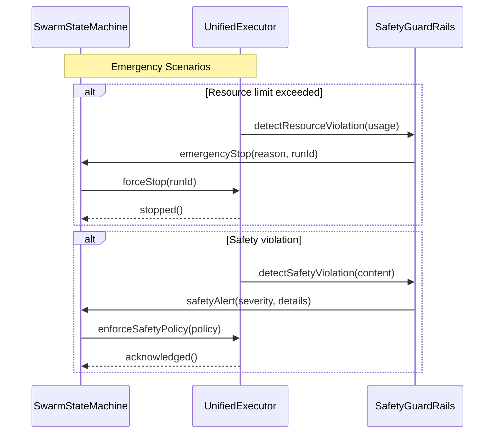

# Communication Patterns

This document is the authoritative source for defining the primary communication patterns used across Vrooli's three-tier execution architecture. It also provides the decision framework for pattern selection and examples of their coordination.

**Prerequisites**: 
- Read [README.md](README.md) for architectural context and navigation to other relevant documents.
- Review the [Centralized Type System](../types/core-types.ts) for all interface and type definitions used herein.

## Pattern Overview

Communication in Vrooli follows five primary patterns, each optimized for different coordination requirements. Performance characteristics and optimization strategies for these patterns are detailed in [Performance Characteristics Reference](../_PERFORMANCE_REFERENCE.md).

| Pattern                      | Use Case                             |
|------------------------------|--------------------------------------|
| **MCP Tool Communication**   | T1→T2 natural language coordination  |
| **Direct Service Interface** | T2→T3 high-performance execution     |
| **Event-Driven Messaging**   | Cross-tier async coordination        |
| **State Synchronization**    | Distributed state management         |
| **Emergency Control Channel** | T1↔T3 emergency control and overrides |


### 1. **MCP Tool Communication (Tier 1 → Tier 2)**
- **Purpose**: Natural language coordination with structured execution through tool routing.
- **Protocol**: Tool execution via `CompositeToolRunner` → `McpToolRunner` → `BuiltInTools`/`SwarmTools`.
- **Implementation**: Agent tool calls routed automatically based on tool type (OpenAI vs MCP). Details in [MCP Tool Integration](implementation/mcp-integration.md).
- **Key Tools**: `run_routine`, `send_message`, `resource_manage`, `spawn_swarm`, `update_swarm_shared_state`.
- **Error Handling**: Coordinated through the [Error Scenarios & Patterns](../resilience/error-scenarios-guide.md).

### 2. **Direct Service Interface (Tier 2 → Tier 3)**
- **Purpose**: High-performance step execution with immediate feedback.
- **Protocol**: Direct service method calls using [StepExecutionRequest/Result Interfaces](../types/core-types.ts) defined in the centralized type system and outlined in [Tier Interface Contracts](tier-interfaces.md).
- **Error Handling**: Managed via the [Error Scenarios & Patterns](../resilience/error-scenarios-guide.md), with errors typically resulting in immediate responses.

### 3. **Event-Driven Messaging (All Tiers)**
- **Purpose**: Asynchronous coordination and monitoring.
- **Protocol**: Distributed event bus with pub-sub messaging using [Event Types](../types/core-types.ts). Detailed in the [Event Bus Protocol](../event-driven/event-bus-protocol.md).
- **Error Handling**: Handled as per the [Event Bus Protocol](../event-driven/event-bus-protocol.md) and the overall [Error Scenarios & Patterns](../resilience/error-scenarios-guide.md).

### 4. **State Synchronization (All Tiers)**
- **Purpose**: Consistent state management across distributed components.
- **Protocol**: Multi-tier caching with eventual consistency using [RunContext and Context Management Interfaces](../types/core-types.ts). Detailed in [Context & Memory Management](../context-memory/README.md).
- **Error Handling**: Coordinated by the [Context & Memory Management](../context-memory/README.md) mechanisms and the [Error Scenarios & Patterns](../resilience/error-scenarios-guide.md).

### 5. **Emergency Control Channel (Tier 1 ↔ Tier 3)**
- **Purpose**: Direct emergency control and safety enforcement bypassing normal T1→T2→T3 flow.
- **Protocol**: Direct communication for emergency stop, resource limit enforcement, and safety policy application.
- **Use Cases**: Resource limit violations, safety violations, emergency stops, system overload conditions.
- **Error Handling**: Immediate response required; handled via [Emergency Response Framework](../resilience/error-scenarios-guide.md#emergency-scenarios).

#### **Emergency Control Channel Implementation**



## Communication Decision Matrix

**Use this matrix systematically to ensure appropriate pattern selection for optimal performance and reliability.**

| Operation Type | T1→T2 | T2→T3 | Cross-Tier Events | State Management | Emergency Control |
|----------------|-------|-------|-------------------|------------------|-------------------|
| **Routine Execution** | Tool Routing | Direct Interface | Lifecycle Events | Context Inheritance | Emergency Stop |
| **Step Execution** | N/A | Direct Interface | Progress Events | State Updates | Force Termination |
| **Resource Management** | Tool Routing | Direct Interface | Notification Events | Budget Allocation | Limit Enforcement |
| **Error Handling** | Tool Routing + Events | Direct Interface + Events | Error Escalation | Recovery State | Emergency Response |
| **Monitoring** | Events | Events | Performance Events | Metrics Collection | Critical Alerts |
| **Security Validation** | Security Interface | Security Interface | Audit Events | Permission Propagation | Safety Override |
| **Emergency Stop** | Emergency Interface | Emergency Interface | Broadcast Events | Emergency Checkpoint | Immediate Control |

### **Pattern Selection Algorithm**

```mermaid
flowchart TD
    Start[Communication Required] --> Emergency{Emergency<br/>Condition?}
    Emergency -->|Yes| EmergencyPattern[Emergency Control Channel<br/>⚡ Immediate T1↔T3 control<br/>🛡️ Safety enforcement<br/>🚨 Resource violations]
    
    Emergency -->|No| SourceTier{Source Tier?}
    
    SourceTier -->|T1| TargetT1{Target Tier?}
    SourceTier -->|T2| TargetT2{Target Tier?}
    SourceTier -->|T3| TargetT3{Target Tier?}
    
    TargetT1 -->|T2| ToolPattern[Tool Routing Communication<br/>🎯 CompositeToolRunner dispatch<br/>🔧 MCP vs OpenAI tool routing]
    TargetT1 -->|T1/T3| EventPattern[Event-Driven Messaging<br/>📡 Asynchronous coordination]
    
    TargetT2 -->|T3| DirectPattern[Direct Service Interface<br/>⚡ High-performance calls<br/>📊 Low latency execution]
    TargetT2 -->|T1/T2| EventPattern
    
    TargetT3 -->|Any| EventPattern
    
    %% State synchronization decision
    Start --> StateNeeded{State Synchronization<br/>Required?}
    StateNeeded -->|Yes| StatePattern[State Synchronization<br/>💾 Context management<br/>🔄 Distributed consistency]
    StateNeeded -->|No| Continue[Continue with Primary Pattern]
    
    %% Performance requirements
    ToolPattern --> PerformanceCheck{Performance<br/>Requirements?}
    DirectPattern --> PerformanceCheck
    EventPattern --> PerformanceCheck
    StatePattern --> PerformanceCheck
    EmergencyPattern --> EmergencyValidation{Emergency<br/>Response Time?}
    
    PerformanceCheck -->|High Performance| ValidateLatency{Latency<br/>< 50ms?}
    PerformanceCheck -->|Standard| ValidateStandard{Standard<br/>Requirements?}
    
    EmergencyValidation -->|<1ms Required| UseEmergency[Use Emergency Channel]
    EmergencyValidation -->|>1ms Acceptable| OptimizePattern[Optimize or Use Alternative]
    
    ValidateLatency -->|Yes| UseDirect[Use Direct Interface]
    ValidateLatency -->|No| OptimizePattern
    
    ValidateStandard -->|Met| UseSelected[Use Selected Pattern]
    ValidateStandard -->|Not Met| OptimizePattern
    
    classDef pattern fill:#e8f5e8,stroke:#2e7d32,stroke-width:2px
    classDef emergency fill:#ffebee,stroke:#c62828,stroke-width:3px
    classDef decision fill:#fff3e0,stroke:#f57c00,stroke-width:2px
    classDef performance fill:#e3f2fd,stroke:#1565c0,stroke-width:2px
    
    class ToolPattern,DirectPattern,EventPattern,StatePattern pattern
    class EmergencyPattern emergency
    class SourceTier,TargetT1,TargetT2,TargetT3,StateNeeded,Emergency decision
    class PerformanceCheck,ValidateLatency,ValidateStandard,EmergencyValidation performance
```



**Decision Support Tools**:
When making decisions based on this matrix, refer to the authoritative documents for:
- **Resource Conflicts**: [Resource Management](../resource-management/README.md)
- **Error Handling & Recovery**: [Error Classification Decision Tree](../resilience/error-classification-severity.md) and [Recovery Strategy Selection](../resilience/recovery-strategy-selection.md)
- **Integration Validation**: [Integration Map and Validation Procedures](integration-map.md)

## Performance Characteristics

For detailed performance targets, latency specifications, and implementation characteristics, see **[Tier Communication Protocols](tier-communication-protocols.md#performance-targets)**.

**Quick Reference**:
- **Tool Routing**: Optimized for natural language coordination
- **Direct Interface**: Optimized for high-performance execution  
- **Event-Driven**: Optimized for asynchronous coordination
- **State Sync**: Optimized for consistency with variable latency
- **Emergency Control**: Optimized for immediate response

## Pattern Coordination Example

### **Complete Execution Flow Integration**

```mermaid
sequenceDiagram
    participant Agent        as "Tier 1 Agent"
    participant ToolRunner   as "CompositeToolRunner"
    participant McpRunner    as "McpToolRunner"
    participant BuiltInTools as "Built-In Tools"
    participant EB           as "Event Bus"
    participant T2           as "Tier 2 Service"
    participant T3           as "Tier 3 Executor"
    participant State        as "State Store"
    participant Safety       as "Safety System"

    Note over Agent,Safety: All Communication Patterns Working Together

    %% 1. Tool Routing Communication (T1→T2)
    Agent->>ToolRunner: Tool call (run_routine)
    Note right of Agent: Pattern: Tool Routing Communication
    ToolRunner->>McpRunner: Route to MCP handler
    McpRunner->>BuiltInTools: Execute runRoutine()
    BuiltInTools->>T2: Execute routine request
    T2->>State: Inherit swarm context
    T2->>EB: Publish run/started event

    %% 2. Direct Service Interface (T2→T3)
    loop For each step
        T2->>T3: executeStep(stepRequest)
        Note right of T2: Pattern: Direct Service Interface
        T3->>T3: Execute with tool calls
        T3->>State: Update step state
        T3->>EB: Publish step/completed event
        T3-->>T2: StepExecutionResult

        %% 5. Emergency Control Channel (if needed)
        alt Emergency condition detected
            T3->>Safety: detectEmergencyCondition()
            Safety->>Agent: emergencyStop(runId, reason)
            Note right of Safety: Pattern: Emergency Control Channel
            Agent->>T3: forceStop(runId)
            T3-->>Agent: stopped()
            break Emergency stop executed
        end
    end

    %% 3. Event-driven coordination
    par Event-driven coordination
        EB-->>Agent: Performance events
        EB-->>T2: Resource events
        EB-->>T3: Optimization events
    end

    %% 4. State synchronization
    T2->>State: Export run results
    State->>State: Propagate to parent context
    T2->>EB: Publish run/completed event
    T2-->>BuiltInTools: Execution result
    BuiltInTools-->>McpRunner: ToolResponse
    McpRunner-->>ToolRunner: ToolCallResult
    ToolRunner-->>Agent: Tool execution result

    Note over Agent,Safety: Pattern Integration Success — all five communication patterns coordinated; see Tier Communication Protocols
```

## Error Handling Across Patterns

Error handling for all communication patterns is managed by the [Error Scenarios & Patterns](../resilience/error-scenarios-guide.md). This framework includes:
- Systematic error classification using the [Error Classification Decision Tree](../resilience/error-classification-severity.md).
- Consistent recovery strategy selection via the [Recovery Strategy Selection Algorithm](../resilience/recovery-strategy-selection.md).
- Specific protocols for how errors are handled and propagated within each communication pattern (e.g., MCP error responses, direct interface error objects, event bus dead-lettering, state sync rollbacks).
- **Emergency response protocols** for critical failures requiring immediate T1↔T3 coordination.

Refer to [Error Propagation Across Communication Patterns](../resilience/error-scenarios-guide.md#error-handling-across-communication-patterns) for comprehensive cross-pattern error coordination details.

## Performance Optimization Strategies

Global and pattern-specific performance optimization strategies, including caching, pooling, batching, and compression, are detailed in [Performance Characteristics Reference](../_PERFORMANCE_REFERENCE.md).

## Related Documentation

- **[README.md](README.md)**: Overall navigation for the communication architecture.
- **[Centralized Type System](../types/core-types.ts)**: All interface and type definitions.
- **[Tier Interface Contracts](tier-interfaces.md)**: Specific tier-to-tier interface contracts.
- **Authoritative Documents for Cross-Cutting Concerns**:
    - **[Error Scenarios & Patterns](../resilience/error-scenarios-guide.md)**
    - **[Performance Characteristics Reference](../_PERFORMANCE_REFERENCE.md)**
    - **[Context & Memory Management](../context-memory/README.md)**

This communication pattern framework ensures that each interaction type uses the most appropriate protocol while maintaining consistency through the centralized type system and providing complete implementation guidance for rebuilding from scratch. 