# Communication Patterns

This document is the authoritative source for defining the four primary communication patterns used across Vrooli's three-tier execution architecture. It also provides the decision framework for pattern selection and examples of their coordination.

**Prerequisites**: 
- Read [README.md](README.md) for architectural context and navigation to other relevant documents.
- Review the [Centralized Type System](../types/core-types.ts) for all interface and type definitions used herein.

## Pattern Overview

Communication in Vrooli follows four primary patterns, each optimized for different coordination requirements. Performance characteristics and optimization strategies for these patterns are detailed in [Performance Characteristics](../monitoring/performance-characteristics.md).

| Pattern                      | Use Case                             |
|------------------------------|--------------------------------------|
| **MCP Tool Communication**   | T1→T2 natural language coordination  |
| **Direct Service Interface** | T2→T3 high-performance execution     |
| **Event-Driven Messaging**   | Cross-tier async coordination        |
| **State Synchronization**    | Distributed state management         |

### 1. **MCP Tool Communication (Tier 1 → Tier 2)**
- **Purpose**: Natural language coordination with structured execution through tool routing.
- **Protocol**: Tool execution via `CompositeToolRunner` → `McpToolRunner` → `BuiltInTools`/`SwarmTools`.
- **Implementation**: Agent tool calls routed automatically based on tool type (OpenAI vs MCP). Details in [MCP Tool Integration](implementation/mcp-integration.md).
- **Key Tools**: `run_routine`, `send_message`, `resource_manage`, `spawn_swarm`, `update_swarm_shared_state`.
- **Error Handling**: Coordinated through the [Error Propagation Framework](../resilience/error-propagation.md).

### 2. **Direct Service Interface (Tier 2 → Tier 3)**
- **Purpose**: High-performance step execution with immediate feedback.
- **Protocol**: Direct service method calls using [StepExecutionRequest/Result Interfaces](../types/core-types.ts) defined in the centralized type system and outlined in [Tier Interface Contracts](tier-interfaces.md).
- **Error Handling**: Managed via the [Error Propagation Framework](../resilience/error-propagation.md), with errors typically resulting in immediate responses.

### 3. **Event-Driven Messaging (All Tiers)**
- **Purpose**: Asynchronous coordination and monitoring.
- **Protocol**: Distributed event bus with pub-sub messaging using [Event Types](../types/core-types.ts). Detailed in the [Event Bus Protocol](../event-driven/event-bus-protocol.md).
- **Error Handling**: Handled as per the [Event Bus Protocol](../event-driven/event-bus-protocol.md) and the overall [Error Propagation Framework](../resilience/error-propagation.md).

### 4. **State Synchronization (All Tiers)**
- **Purpose**: Consistent state management across distributed components.
- **Protocol**: Multi-tier caching with eventual consistency using [RunContext and Context Management Interfaces](../types/core-types.ts). Detailed in [State Synchronization](../context-memory/state-synchronization.md).
- **Error Handling**: Coordinated by the [State Synchronization](../context-memory/state-synchronization.md) mechanisms and the [Error Propagation Framework](../resilience/error-propagation.md).

## Communication Decision Matrix

**Use this matrix systematically to ensure appropriate pattern selection for optimal performance and reliability.**

| Operation Type | T1→T2 | T2→T3 | Cross-Tier Events | State Management |
|----------------|-------|-------|-------------------|------------------|
| **Routine Execution** | Tool Routing | Direct Interface | Lifecycle Events | Context Inheritance |
| **Step Execution** | N/A | Direct Interface | Progress Events | State Updates |
| **Resource Management** | Tool Routing | Direct Interface | Notification Events | Budget Allocation |
| **Error Handling** | Tool Routing + Events | Direct Interface + Events | Error Escalation | Recovery State |
| **Monitoring** | Events | Events | Performance Events | Metrics Collection |
| **Security Validation** | Security Interface | Security Interface | Audit Events | Permission Propagation |
| **Emergency Stop** | Emergency Interface | Emergency Interface | Broadcast Events | Emergency Checkpoint |

### **Pattern Selection Algorithm**

```mermaid
flowchart TD
    Start[Communication Required] --> SourceTier{Source Tier?}
    
    SourceTier -->|T1| TargetT1{Target Tier?}
    SourceTier -->|T2| TargetT2{Target Tier?}
    SourceTier -->|T3| TargetT3{Target Tier?}
    
    TargetT1 -->|T2| ToolPattern[Tool Routing Communication<br/>🎯 CompositeToolRunner dispatch<br/>🔧 MCP vs OpenAI tool routing]
    TargetT1 -->|T1/T3| EventPattern[Event-Driven Messaging<br/>📡 Asynchronous coordination]
    
    TargetT2 -->|T3| DirectPattern[Direct Service Interface<br/>⚡ High-performance calls<br/>📊 Low latency execution]
    TargetT2 -->|T1/T2| EventPattern
    
    TargetT3 -->|Any| EventPattern
    
    %% State synchronization decision
    Start --> StateNeeded{State Synchronization<br/>Required?}
    StateNeeded -->|Yes| StatePattern[State Synchronization<br/>💾 Context management<br/>🔄 Distributed consistency]
    StateNeeded -->|No| Continue[Continue with Primary Pattern]
    
    %% Performance requirements
    ToolPattern --> PerformanceCheck{Performance<br/>Requirements?}
    DirectPattern --> PerformanceCheck
    EventPattern --> PerformanceCheck
    StatePattern --> PerformanceCheck
    
    PerformanceCheck -->|High Performance| ValidateLatency{Latency<br/>< 50ms?}
    PerformanceCheck -->|Standard| ValidateStandard{Standard<br/>Requirements?}
    
    ValidateLatency -->|Yes| UseDirect[Use Direct Interface]
    ValidateLatency -->|No| OptimizePattern[Optimize Pattern<br/>or Use Alternative]
    
    ValidateStandard -->|Met| UseSelected[Use Selected Pattern]
    ValidateStandard -->|Not Met| OptimizePattern
    
    classDef pattern fill:#e8f5e8,stroke:#2e7d32,stroke-width:2px
    classDef decision fill:#fff3e0,stroke:#f57c00,stroke-width:2px
    classDef performance fill:#e3f2fd,stroke:#1565c0,stroke-width:2px
    
    class ToolPattern,DirectPattern,EventPattern,StatePattern pattern
    class SourceTier,TargetT1,TargetT2,TargetT3,StateNeeded decision
    class PerformanceCheck,ValidateLatency,ValidateStandard performance
```

**Decision Support Tools**:
When making decisions based on this matrix, refer to the authoritative documents for:
- **Resource Conflicts**: [Resource Conflict Resolution Algorithm](../resource-management/resource-conflict-resolution.md)
- **Error Handling & Recovery**: [Error Classification Decision Tree](../resilience/error-classification-severity.md) and [Recovery Strategy Selection](../resilience/recovery-strategy-selection.md)
- **Integration Validation**: [Integration Map and Validation Procedures](integration-map.md)

## Pattern Coordination Example

### **Complete Execution Flow Integration**

## Error Handling Across Patterns

Error handling for all communication patterns is managed by the [Error Propagation Framework](../resilience/error-propagation.md). This framework includes:
- Systematic error classification using the [Error Classification Decision Tree](../resilience/error-classification-severity.md).
- Consistent recovery strategy selection via the [Recovery Strategy Selection Algorithm](../resilience/recovery-strategy-selection.md).
- Specific protocols for how errors are handled and propagated within each communication pattern (e.g., MCP error responses, direct interface error objects, event bus dead-lettering, state sync rollbacks).

Refer to [Error Propagation Across Communication Patterns](../resilience/error-propagation.md#error-handling-across-communication-patterns) for comprehensive cross-pattern error coordination details.

## Performance Optimization Strategies

Global and pattern-specific performance optimization strategies, including caching, pooling, batching, and compression, are detailed in [Performance Characteristics](../monitoring/performance-characteristics.md).

## Related Documentation

- **[README.md](README.md)**: Overall navigation for the communication architecture.
- **[Centralized Type System](../types/core-types.ts)**: All interface and type definitions.
- **[Tier Interface Contracts](tier-interfaces.md)**: Specific tier-to-tier interface contracts.
- **Authoritative Documents for Cross-Cutting Concerns**:
    - **[Error Propagation Framework](../resilience/error-propagation.md)**
    - **[Performance Characteristics](../monitoring/performance-characteristics.md)**
    - **[State Synchronization](../context-memory/state-synchronization.md)**
    - **[Resource Coordination](../resource-management/resource-coordination.md)**
    - **[Security Boundaries](../security/security-boundaries.md)**
- **Implementation Details**:
    - **[MCP Tool Integration](implementation/mcp-integration.md)
    - **[Event Bus Protocol](../event-driven/event-bus-protocol.md)
- **Validation**: **[Integration Map and Validation Document](integration-map.md)**

This communication pattern framework ensures that each interaction type uses the most appropriate protocol while maintaining consistency through the centralized type system and providing complete implementation guidance for rebuilding from scratch. 