# Recovery Strategy Selection Decision Tree

This document provides a decision tree to guide the selection of appropriate recovery strategies based on error classification (type, severity, category, recoverability) and current system context.

## Recovery Strategy Selection Flowchart

This flowchart illustrates the process of choosing a recovery strategy once an error has been classified.

```mermaid
flowchart TD
    Start[Error Classified:<br>Type, Severity, Category, Recoverability] --> IsFatal{Severity == FATAL?}
    IsFatal -- Yes --> EmergencyStop[EMERGENCY_STOP<br>🛑 Halt system operations<br>Alert administrators]
    IsFatal -- No --> IsCritical{Severity == CRITICAL?}

    IsCritical -- Yes --> CriticalPath{Data Loss or<br>Security Breach?}
    CriticalPath -- Yes --> HumanEscalation[ESCALATE_TO_HUMAN<br>👤 Immediate human intervention<br>Attempt safe state if possible]
    CriticalPath -- No --> TryRobustRecovery{Attempt Full Recovery with<br>Fallback & Resource Adjustment?}
    TryRobustRecovery -- Yes --> FallbackStrategy[FALLBACK_STRATEGY / FALLBACK_MODEL<br>🔄 Switch to simpler/safer strategy/model<br>💰 Adjust resources, then RETRY_MODIFIED]
    TryRobustRecovery -- No --> DegradeGracefully[GRACEFUL_DEGRADATION<br>📉 Partial success acceptable<br>Log and monitor]
    FallbackStrategy -->|Success| Resolved[Resolved]
    FallbackStrategy -->|Failure| DegradeOrEscalateCritical{Degrade or Escalate?}
    DegradeOrEscalateCritical -- Degrade --> DegradeGracefully
    DegradeOrEscalateCritical -- Escalate --> HumanEscalation

    IsCritical -- No --> IsError{Severity == ERROR?}
    IsError -- Yes --> ErrorPath{Recoverable Error Type?<br>e.g. Transient, Resource}
    ErrorPath -- Yes & Transient --> RetrySame[RETRY_SAME / WAIT_AND_RETRY<br>🔁 Retry with backoff/jitter<br>Monitor transient conditions]
    ErrorPath -- Yes & Resource --> ReduceScope[REDUCE_SCOPE / RETRY_MODIFIED<br>⚙️ Reduce resource demand<br>Attempt modified retry]
    ErrorPath -- No: Logic/Config/Unknown --> FallbackOrEscalateError{Attempt Fallback or Escalate?}
    RetrySame -->|Success| Resolved
    RetrySame -->|Max Attempts| FallbackOrEscalateError
    ReduceScope -->|Success| Resolved
    ReduceScope -->|Failure| FallbackOrEscalateError
    FallbackOrEscalateError -- Fallback --> FallbackStrategyError[FALLBACK_STRATEGY<br>🧩 Attempt alternative logic]
    FallbackOrEscalateError -- Escalate --> EscalateToParentError[ESCALATE_TO_PARENT<br>⬆️ Notify higher tier/agent]
    FallbackStrategyError -->|Success| Resolved
    FallbackStrategyError -->|Failure| EscalateToParentError
    EscalateToParentError --> ResolvedOrHumanEscalate{Parent Handles or Escalates Further}

    IsError -- No --> IsWarning{Severity == WARNING?}
    IsWarning -- Yes --> LogWarning[LOG_WARNING<br>📄 Log for analysis<br>Monitor for patterns]
    IsWarning -- No --> LogInfo[LOG_INFO<br>ℹ️ Informational event]

    EmergencyStop --> End1([*])
    HumanEscalation --> End2([*])
    Resolved --> End3([*])
    DegradeGracefully --> End4([*])
    ResolvedOrHumanEscalate --> End5([*])
    LogWarning --> End6([*])
    LogInfo --> End7([*])

    classDef emergency fill:#ffebee,stroke:#c62828,color:#c62828,stroke-width:2px
    classDef critical fill:#fff3e0,stroke:#f57c00,color:#f57c00,stroke-width:2px
    classDef error fill:#fffde7,stroke:#fbc02d,color:#fbc02d,stroke-width:2px
    classDef warning fill:#e3f2fd,stroke:#1565c0,color:#1565c0,stroke-width:2px
    classDef info fill:#e8f5e9,stroke:#2e7d32,color:#2e7d32,stroke-width:2px
    classDef decision fill:#eceff1,stroke:#37474f,color:#37474f,stroke-width:1px

    class IsFatal,IsCritical,CriticalPath,TryRobustRecovery,DegradeOrEscalateCritical,IsError,ErrorPath,FallbackOrEscalateError,IsWarning,ResolvedOrHumanEscalate decision
    class EmergencyStop emergency
    class HumanEscalation critical
    class FallbackStrategy,ReduceScope,FallbackStrategyError,RetrySame error
    class DegradeGracefully,EscalateToParentError warning
    class LogWarning warning
    class LogInfo info
    class Start,Resolved default
```

## Key Recovery Strategies (`RecoveryType` Enum)

Refer to `error-propagation.md` for the full `RecoveryType` enum definition. This tree primarily utilizes:

*   **`EMERGENCY_STOP`**: For FATAL errors. Halts relevant system operations and alerts administrators.
*   **`ESCALATE_TO_HUMAN`**: For CRITICAL errors that risk data/security or where automated recovery fails. Requires human intervention.
*   **`FALLBACK_STRATEGY` / `FALLBACK_MODEL`**: Switching to a simpler, safer, or alternative logic/AI model. Often combined with `RETRY_MODIFIED`.
*   **`REDUCE_SCOPE`**: Modifying the operation to consume fewer resources or attempt a less complex task.
*   **`GRACEFUL_DEGRADATION`**: Accepting partial success or reduced quality if full recovery isn't feasible for critical but non-data-threatening issues.
*   **`RETRY_SAME`**: Retrying the exact same operation, typically with a backoff strategy. Suitable for transient errors.
*   **`WAIT_AND_RETRY`**: Similar to `RETRY_SAME` but implies waiting for external conditions (like resource availability) to improve.
*   **`RETRY_MODIFIED`**: Retrying the operation with adjusted parameters (e.g., after reducing scope or falling back to a different model).
*   **`ESCALATE_TO_PARENT`**: If a lower tier cannot resolve an ERROR, it escalates to its parent tier for handling.
*   **`LOG_WARNING` / `LOG_INFO`**: For non-critical issues, logging is the primary action, with monitoring for trend analysis.

## Contextual Considerations

The selection process also considers:

*   **`Recoverability`**: Can the error be automatically recovered, partially recovered, or is it non-recoverable by automated means?
*   **`ErrorCategory`**: Transient errors are more likely to benefit from retries, while logic or configuration errors might need fallback or escalation.
*   **`AttemptCount`**: The number of previous recovery attempts for the same error influences whether to escalate or try a different strategy.
*   **`CircuitState`**: If a circuit breaker is open for the failing service/operation, retries might be skipped in favor of fallbacks or immediate escalation.
*   **`ResourceAvailability`**: Current system load and available resources can influence whether to retry or reduce scope.

## Usage

This decision tree, in conjunction with the error classification from `error-classification-severity.md`, provides a structured approach for the `ErrorPropagationProtocol` (defined in `error-propagation.md`) to select and execute the most appropriate `RecoveryStrategy` for any given runtime error, aiming to maximize system resilience and reliability. 