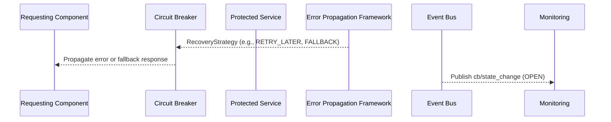
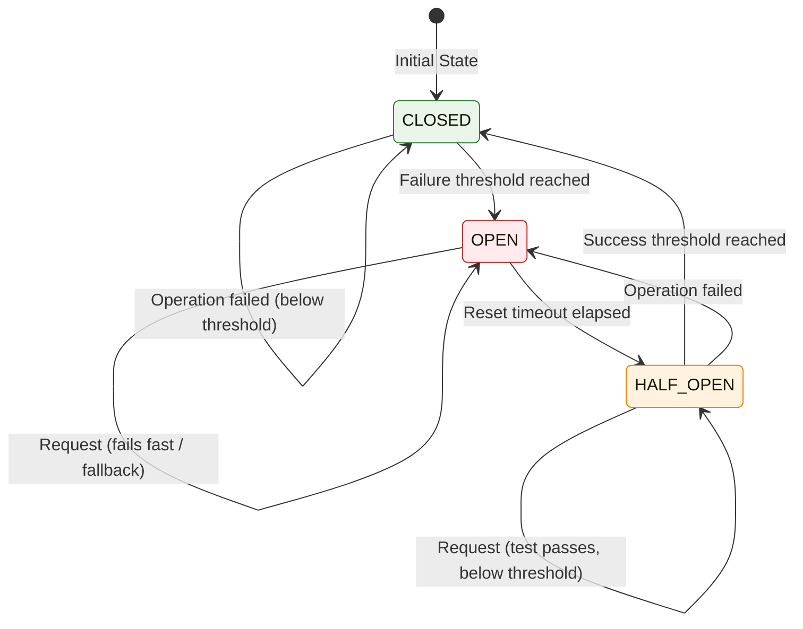

# Circuit Breaker Implementation

This document details the circuit breaker pattern as applied within Vrooli's inter-tier communication and error handling strategy. Circuit breakers are essential for preventing cascading failures and improving system resilience when downstream services or components become unresponsive or consistently produce errors.

```typescript
import type {
    ExecutionError,
    ExecutionErrorType,
    ErrorSeverity,
    RecoveryType
} from "../types/index.js";
```

## Circuit Breaker Protocol and Integration

The circuit breaker system integrates tightly with the [Error Propagation and Recovery Framework](../error-propagation.md) and the [Event Bus Protocol](../event-bus-protocol.md).



### **Error Handling Integration**
- When a circuit breaker is OPEN, subsequent calls typically result in an immediate `CIRCUIT_BREAKER_OPEN` error.
- This error is processed by the [Error Propagation and Recovery Framework](../error-propagation.md), which may trigger fallback strategies or alert monitoring systems.
- The decision to open or close the circuit, and the specific recovery actions, are determined by policies managed within the Error Framework, referencing [Error Classification](../decision-trees/error-classification-severity.md) and [Recovery Strategy Selection](../decision-trees/recovery-strategy-selection.md).

### **Core Circuit Breaker Interfaces**

```typescript
interface CircuitBreakerProtocol {
    // Circuit breaker state management
    getCircuitState(service: string, operation: string): CircuitState;
    
    // Circuit breaker operations
    executeWithCircuitBreaker<T>(
        service: string, 
        operationName: string, 
        operation: () => Promise<T>, 
        config?: Partial<CircuitBreakerConfig>
    ): Promise<T>;
    
    forceCircuitOpen(service: string, operation: string, reason: string): void;
    forceCircuitClosed(service: string, operation: string): void;
    resetCircuit(service: string, operation: string): void;
}

interface CircuitBreakerConfig {
    readonly failureThreshold: number;        // Number of failures before opening
    readonly timeoutMs: number;               // Timeout for operations
    readonly resetTimeoutMs: number;          // Time before trying half-open
    readonly successThreshold: number;        // Successes needed to close in half-open
    readonly monitoringWindowMs: number;      // Time window for failure counting
    readonly fallbackStrategy?: FallbackStrategy;
    readonly healthCheckInterval: number;     // Health check frequency
    readonly degradationMode: DegradationMode;
}

enum CircuitState {
    CLOSED = "closed",       // Normal operation
    OPEN = "open",          // Circuit is open, requests fail fast
    HALF_OPEN = "half_open" // Testing if service has recovered
}

enum DegradationMode {
    FAIL_FAST = "fail_fast",
    QUEUE_REQUESTS = "queue_requests",
    USE_FALLBACK = "use_fallback",
    PARTIAL_SERVICE = "partial_service"
}

interface FallbackStrategy {
    readonly type: string;
    readonly configuration: Record<string, unknown>;
    readonly qualityReduction: number;       // 0.0 - 1.0
}
```

### **Integration with Recovery Strategies**

Circuit breaker configurations are an integral part of recovery strategy definitions:

```typescript
interface RecoveryStrategy {
    readonly strategyType: RecoveryType;
    readonly maxAttempts: number;
    readonly backoffStrategy: BackoffStrategy;
    readonly fallbackActions: FallbackAction[];
    readonly circuitBreakerConfig?: CircuitBreakerConfig;
    readonly priority: string;
    readonly timeoutMs: number;
}

interface BackoffStrategy {
    readonly type: BackoffType;
    readonly initialDelayMs: number;
    readonly maxDelayMs: number;
    readonly multiplier: number;
    readonly jitterPercent: number;
    readonly adaptiveAdjustment: boolean;
}

enum BackoffType {
    FIXED = "fixed",
    LINEAR = "linear",
    EXPONENTIAL = "exponential",
    EXPONENTIAL_JITTER = "exponential_jitter",
    ADAPTIVE = "adaptive",
    FIBONACCI = "fibonacci",
    CUSTOM = "custom"
}

interface FallbackAction {
    readonly type: FallbackType;
    readonly configuration: Record<string, unknown>;
    readonly conditions: FallbackCondition[];
    readonly priority: number;
    readonly estimatedSuccessRate: number;
}

enum FallbackType {
    RETRY = "retry",
    ALTERNATE_STRATEGY = "alternate_strategy",
    ALTERNATE_MODEL = "alternate_model",
    ALTERNATE_TOOL = "alternate_tool",
    REDUCE_SCOPE = "reduce_scope",
    SKIP_STEP = "skip_step",
    USE_CACHED_RESULT = "use_cached_result",
    MANUAL_INTERVENTION = "manual_intervention",
    DEFAULT_RESPONSE = "default_response"
}

interface FallbackCondition {
    readonly type: string;
    readonly value: unknown;
    readonly operator: ConditionOperator;
    readonly description: string;
}

enum ConditionOperator {
    EQUALS = "equals",
    NOT_EQUALS = "not_equals",
    GREATER_THAN = "greater_than",
    LESS_THAN = "less_than",
    CONTAINS = "contains",
    IN = "in",
    NOT_IN = "not_in",
    REGEX_MATCH = "regex_match"
}
```

When a `RecoveryStrategy` that includes a `circuitBreakerConfig` is executed, operations within that strategy (especially retries or calls to potentially failing dependencies) should be wrapped by the `executeWithCircuitBreaker` method.

### **State Transition Diagram**



### **Implementation Example**

```typescript
class TierCircuitBreaker implements CircuitBreakerProtocol {
    private circuitStates = new Map<string, CircuitState>();
    private failureCounts = new Map<string, number>();
    private lastFailureTime = new Map<string, Date>();

    async executeWithCircuitBreaker<T>(
        service: string,
        operationName: string,
        operation: () => Promise<T>,
        config?: Partial<CircuitBreakerConfig>
    ): Promise<T> {
        const key = `${service}:${operationName}`;
        const state = this.getCircuitState(service, operationName);
        
        // Apply circuit breaker logic
        switch (state) {
            case CircuitState.OPEN:
                if (config?.fallbackStrategy) {
                    return this.executeFallback(config.fallbackStrategy);
                }
                throw new Error(`Circuit breaker OPEN for ${key}`);
                
            case CircuitState.HALF_OPEN:
                try {
                    const result = await operation();
                    this.recordSuccess(key, config);
                    return result;
                } catch (error) {
                    this.recordFailure(key, config);
                    throw error;
                }
                
            case CircuitState.CLOSED:
            default:
                try {
                    return await operation();
                } catch (error) {
                    this.recordFailure(key, config);
                    throw error;
                }
        }
    }

    getCircuitState(service: string, operation: string): CircuitState {
        const key = `${service}:${operation}`;
        return this.circuitStates.get(key) || CircuitState.CLOSED;
    }

    forceCircuitOpen(service: string, operation: string, reason: string): void {
        const key = `${service}:${operation}`;
        this.circuitStates.set(key, CircuitState.OPEN);
    }

    forceCircuitClosed(service: string, operation: string): void {
        const key = `${service}:${operation}`;
        this.circuitStates.set(key, CircuitState.CLOSED);
        this.failureCounts.delete(key);
    }

    resetCircuit(service: string, operation: string): void {
        const key = `${service}:${operation}`;
        this.circuitStates.set(key, CircuitState.CLOSED);
        this.failureCounts.delete(key);
        this.lastFailureTime.delete(key);
    }

    private recordFailure(key: string, config?: Partial<CircuitBreakerConfig>): void {
        const currentCount = this.failureCounts.get(key) || 0;
        const threshold = config?.failureThreshold || 5;
        
        this.failureCounts.set(key, currentCount + 1);
        this.lastFailureTime.set(key, new Date());
        
        if (currentCount + 1 >= threshold) {
            this.circuitStates.set(key, CircuitState.OPEN);
        }
    }

    private recordSuccess(key: string, config?: Partial<CircuitBreakerConfig>): void {
        const state = this.circuitStates.get(key);
        if (state === CircuitState.HALF_OPEN) {
            const successThreshold = config?.successThreshold || 2;
            // Implementation logic for success counting
            this.circuitStates.set(key, CircuitState.CLOSED);
            this.failureCounts.delete(key);
        }
    }

    private async executeFallback<T>(strategy: FallbackStrategy): Promise<T> {
        // Implementation of fallback execution
        throw new Error("Fallback execution not implemented");
    }
}
```

### **Workflow**

1. **Closed State**: All requests are passed through to the protected operation. If failures occur, they are counted. If the failure count exceeds `failureThreshold` within the `monitoringWindowMs`, the circuit opens.
2. **Open State**: Requests are not passed to the operation. They fail immediately or trigger a fallback. After `resetTimeoutMs`, the circuit transitions to Half-Open.
3. **Half-Open State**: A limited number of test requests are allowed to pass through. If these requests meet the `successThreshold`, the circuit closes. If any test request fails, the circuit re-opens.

### **Benefits**

*   **Prevents Cascading Failures**: Stops a failing service from overwhelming other parts of the system.
*   **Fast Failures**: Avoids long timeouts waiting for an unresponsive service.
*   **Automatic Recovery**: Allows the system to automatically detect when a service has recovered.
*   **Resource Protection**: Prevents wasting resources on calls to known unhealthy services.

This circuit breaker mechanism is a key component in building resilient and fault-tolerant communication pathways between the Vrooli execution tiers.

## Related Documentation
- **[Error Propagation and Recovery Framework](../error-propagation.md)**: Central authority for error handling, classification, and recovery strategies.
- **[Event Bus Protocol](../event-bus-protocol.md)**: For publishing and subscribing to circuit breaker state change events.
- **[Performance Characteristics](../performance-characteristics.md)**: Impact of circuit breakers on performance and latency.
- **[Integration Map and Validation Document](../integration-map.md)**: For testing and validating circuit breaker functionality.
- **[Centralized Type System](../types/core-types.ts)**: For `CircuitState`, `ExecutionErrorType.CIRCUIT_BREAKER_OPEN`, etc. 