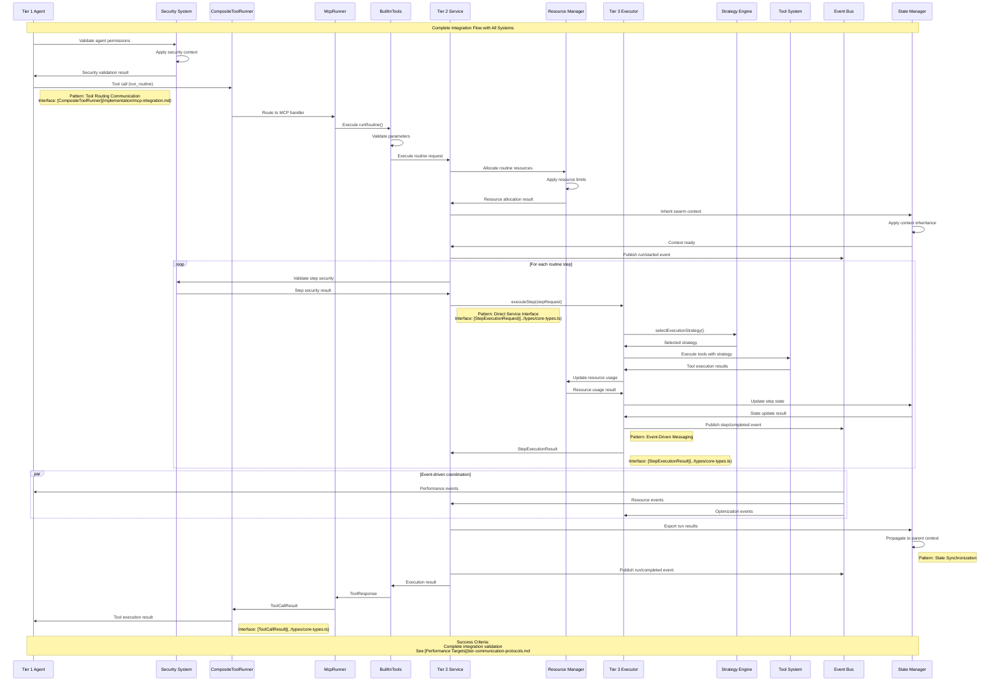
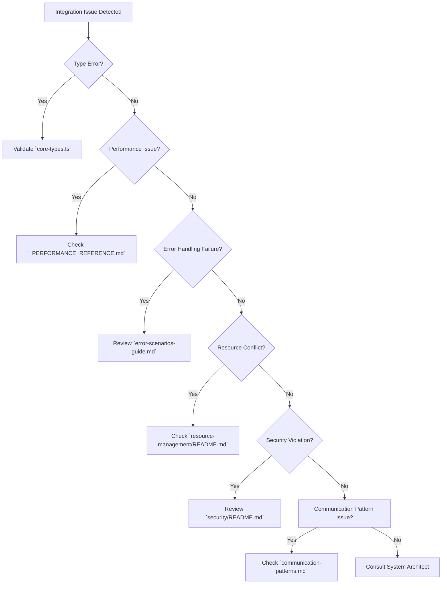

# Integration Map: Complete Implementation and Validation Guide

This document serves as the **master implementation and validation guide** for Vrooli's communication architecture. It provides comprehensive end-to-end flows, systematic validation procedures, and troubleshooting frameworks for implementing the complete communication system from scratch.

**Prerequisites**: 
- Complete [README.md Reading Order](README.md#implementation-reading-order) systematically
- Review [Centralized Type System](../types/core-types.ts) for all interface definitions
- Apply [Communication Patterns](communication-patterns.md) for pattern selection guidance

**This is the single source of truth for implementation validation and troubleshooting.**

## Complete Implementation Flows

### **End-to-End Agent-to-Execution Flow**

This represents the master execution flow integrating all communication patterns, error handling, resource management, and security validation.



**Flow Validation**: This flow validates integration of all four communication patterns with complete error handling, resource management, and security enforcement.

## 🎯 **Success Criteria and Performance Targets**

For comprehensive performance characteristics and targets, see **[Tier Communication Protocols](tier-communication-protocols.md#performance-targets)**.

**Key Integration Metrics:**
- **End-to-End Flow**: Complete user request → response cycle
- **Error Recovery**: System resilience under failure conditions  
- **Resource Efficiency**: Optimal resource utilization across tiers
- **Concurrent Load**: Performance under realistic concurrent usage

## 🔧 **Validation Framework**

## Implementation Validation Framework

### **Phase 1: Foundation Validation**

**Objective**: Validate basic type consistency and interface implementation

**Validation Procedures**:

1. **Type System Validation**
   ```bash
   # Validate all types compile without errors
   tsc --noEmit ../types/core-types.ts
   
   # Validate no duplicate type definitions
   grep -r "interface.*ExecutionError" . --exclude-dir=../types/
   # Should return only centralized definitions
   ```

2. **Interface Contract Validation**
   - [ ] All [RunRoutineMcpTool](../types/core-types.ts) implementations use centralized types
   - [ ] All [StepExecutionRequest/Result](../types/core-types.ts) implementations match interface contracts
   - [ ] All [Error Interfaces](../types/core-types.ts) properly reference centralized error types
   - [ ] All [Resource Interfaces](../types/core-types.ts) coordinate with resource management
   - [ ] All [Security Interfaces](../types/core-types.ts) enforce proper security boundaries

3. **Basic Communication Pattern Validation**
   - [ ] MCP tool calls successfully translate to service calls
   - [ ] Direct interface calls complete within latency targets
   - [ ] Event bus delivers events with proper ordering
   - [ ] State synchronization maintains consistency

**Foundation Success Criteria**: All interfaces compile, basic patterns work in isolation, no type duplicates exist.

### **Phase 2: Integration Validation**

**Objective**: Validate cross-tier communication and error handling integration

**Validation Procedures**:

1. **Tool Routing Validation**
   ```typescript
   // Test tool routing and execution
   const toolRunner = new CompositeToolRunner(mcpRunner, openaiRunner);
   
   // Test MCP tool routing
   const mcpResult = await toolRunner.run("run_routine", validMcpParameters, meta);
   assert(mcpResult.ok === true);
   assert(mcpResult.data.output !== undefined);
   
   // Test OpenAI tool routing
   const openaiResult = await toolRunner.run("web_search", validOpenAiParameters, meta);
   assert(openaiResult.ok === true);
   assert(openaiResult.data.creditsUsed !== "0");
   ```

2. **Error Handling Integration**
   - [ ] Errors classified using [Error Classification Decision Tree](../resilience/error-classification-severity.md)
   - [ ] Recovery strategies selected using [Recovery Strategy Selection](../resilience/recovery-strategy-selection.md)
   - [ ] Error propagation works across all communication patterns
   - [ ] Emergency stop procedures coordinate across all tiers
   - [ ] Error events properly trigger circuit breakers

3. **Resource Management Integration**
   - [ ] Resource allocation follows [Resource Allocation Flow](../resource-management/README.md#resource-allocation-flow)
   - [ ] Resource conflicts resolved using [Conflict Resolution Algorithm](../resource-management/resource-conflict-resolution.md)
   - [ ] Resource limits enforced at all tier boundaries
   - [ ] Emergency resource protocols activate correctly

4. **Security Integration**
   - [ ] Security context propagates correctly across tiers
   - [ ] Permission validation blocks unauthorized operations
   - [ ] Audit events generated for all security operations
   - [ ] Security violations trigger proper responses

**Integration Success Criteria**: Cross-tier communication works reliably, errors handle properly, resources coordinate without conflicts, security enforces boundaries.

### **Phase 3: End-to-End Validation**

**Objective**: Validate complete system operation under realistic conditions

**Validation Procedures**:

1. **Complete Flow Testing**
   ```typescript
   // End-to-end flow validation
   const result = await executeCompleteFlow({
       agent: testAgent,
       routine: complexTestRoutine,
       context: realisticSwarmContext,
       resourceLimits: productionLimits
   });
   
   assert(result.success === true);
   assert(result.performance.toolRoutingLatency < 2000); // ~1-2s target
   assert(result.performance.directLatency < 200); // ~100-200ms target
   assert(result.resources.withinLimits === true);
   assert(result.security.violations.length === 0);
   ```

2. **Performance Validation**
   - [ ] All communication patterns meet targets defined in [Tier Communication Protocols](tier-communication-protocols.md#performance-targets)
   - [ ] Error handling overhead: <10ms additional latency per error

3. **Load Testing Validation**
   - [ ] System handles 50 concurrent tool routing calls
   - [ ] System handles 500 concurrent direct interface calls
   - [ ] System handles 5,000 concurrent event messages
   - [ ] System handles 200 concurrent state synchronization operations
   - [ ] System maintains performance under mixed load

4. **Failure Scenario Validation**
   - [ ] Tier 1 failures: System gracefully degrades with swarm-level recovery
   - [ ] Tier 2 failures: System maintains execution with routine-level recovery
   - [ ] Tier 3 failures: System recovers with step-level fallbacks
   - [ ] Communication failures: Circuit breakers activate and recover
   - [ ] Resource exhaustion: Emergency protocols activate correctly

**End-to-End Success Criteria**: Complete system operates at production scale, meets all performance targets, handles failures gracefully, maintains security under load.

## Troubleshooting Integration Issues

### **Common Integration Problems and Solutions**

**Problem Categories**:
1. Type Inconsistencies
2. Performance Degradation
3. Error Handling Failures
4. Resource Management Conflicts
5. Security Validation Errors

**Troubleshooting Steps**:
1. **Validate Type System**: Ensure `tsc --noEmit` passes on all relevant files.
2. **Check Interface Contracts**: Verify implementations match definitions in `core-types.ts`.
3. **Review Communication Patterns**: Ensure correct patterns are used.
4. **Examine Error Logs**: Check for detailed error messages and stack traces.
5. **Analyze Performance Metrics**: Compare against targets in `_PERFORMANCE_REFERENCE.md`.
6. **Debug with Integration Tests**: Use end-to-end tests to isolate issues.

### **Tier-Specific Troubleshooting**

**Tier 1 Problems**:
- **Issue**: Goal decomposition fails
- **Solution**: Check AI model availability, prompt quality, and context relevance.

**Tier 2 Problems**:
- **Issue**: Routine state corruption
- **Solution**: Validate state transitions, check for race conditions, review persistence logic.

**Tier 3 Problems**:
- **Issue**: Tool execution failures
- **Solution**: Verify external API keys, check rate limits, validate tool inputs.

## Authoritative Requirements Checklist

### **Functional Requirements**

- **Communication**: Must use the five defined [Communication Patterns](communication-patterns.md)
- **Error Handling**: Must implement [Error Scenarios & Patterns](../resilience/error-scenarios-guide.md)
- **Resource Management**: Must adhere to [Resource Management](../resource-management/README.md)
- **Security**: Must enforce [Security Boundaries](../security/README.md)
- **Performance**: Must meet targets in [Performance Reference](../_PERFORMANCE_REFERENCE.md)

### **Implementation Checklist**

**Tier 1: Coordination Intelligence**
- [ ] Implements `SwarmStateMachine` with goal decomposition
- [ ] Uses `CompositeToolRunner` for T1→T2 communication
- [ ] Manages team formation and coordination

**Tier 2: Process Intelligence**
- [ ] Implements `RunStateMachine` for routine orchestration
- [ ] Uses direct interface calls for T2→T3 communication
- [ ] Manages routine state and context

**Tier 3: Execution Intelligence**
- [ ] Implements `UnifiedExecutor` for step execution
- [ ] Executes tools based on selected strategy
- [ ] Enforces resource and security constraints

## Detailed Troubleshooting Framework

### **Troubleshooting Decision Tree**



### **Cross-Cutting Concern Checklists**

**Error Handling Requirements**:
- Errors are classified by severity: `Critical`, `High`, `Medium`, `Low`
- Recovery strategies are selected: `Immediate`, `Fallback`, `Escalation`
- Emergency procedures follow [Emergency Scenarios](../resilience/error-scenarios-guide.md#emergency-scenarios)

**Resource Management Requirements**:
- Resource allocation follows [Resource Allocation Flow](../resource-management/README.md#resource-allocation-flow)
- Conflicts resolved using [Resource Conflict Resolution](../resource-management/resource-conflict-resolution.md)
- Emergency procedures use [Resource Emergency Protocols](../resource-management/README.md#emergency-protocols)

**Security Requirements**:
- Security context is propagated across all tiers
- Permissions are validated at each boundary
- Audit trails are generated for all security-sensitive operations

This integration map provides a complete framework for implementing, validating, and troubleshooting Vrooli's communication architecture, ensuring a robust and reliable system. 