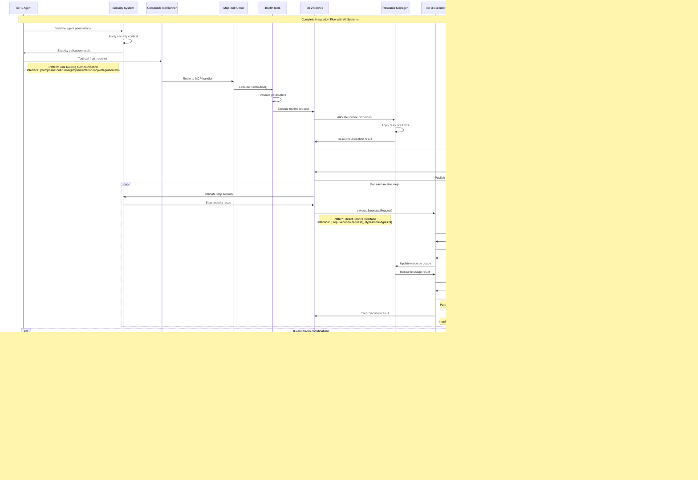

# Integration Map: Complete Implementation and Validation Guide

This document serves as the **master implementation and validation guide** for Vrooli's communication architecture. It provides comprehensive end-to-end flows, systematic validation procedures, and troubleshooting frameworks for implementing the complete communication system from scratch.

**Prerequisites**: 
- Complete [README.md Reading Order](README.md#implementation-reading-order) systematically
- Review [Centralized Type System](../types/core-types.ts) for all interface definitions
- Apply [Communication Patterns](communication-patterns.md) for pattern selection guidance

**This is the single source of truth for implementation validation and troubleshooting.**

## Complete Implementation Flows

### **End-to-End Agent-to-Execution Flow**

This represents the master execution flow integrating all communication patterns, error handling, resource management, and security validation.



**Flow Validation**: This flow validates integration of all four communication patterns with complete error handling, resource management, and security enforcement.

## 🎯 **Success Criteria and Performance Targets**

For comprehensive performance characteristics and targets, see **[Tier Communication Protocols](tier-communication-protocols.md#performance-targets)**.

**Key Integration Metrics:**
- **End-to-End Flow**: Complete user request → response cycle
- **Error Recovery**: System resilience under failure conditions  
- **Resource Efficiency**: Optimal resource utilization across tiers
- **Concurrent Load**: Performance under realistic concurrent usage

## 🔧 **Validation Framework**

## Implementation Validation Framework

### **Phase 1: Foundation Validation**

**Objective**: Validate basic type consistency and interface implementation

**Validation Procedures**:

1. **Type System Validation**
   ```bash
   # Validate all types compile without errors
   tsc --noEmit ../types/core-types.ts
   
   # Validate no duplicate type definitions
   grep -r "interface.*ExecutionError" . --exclude-dir=../types/
   # Should return only centralized definitions
   ```

2. **Interface Contract Validation**
   - [ ] All [RunRoutineMcpTool](../types/core-types.ts) implementations use centralized types
   - [ ] All [StepExecutionRequest/Result](../types/core-types.ts) implementations match interface contracts
   - [ ] All [Error Interfaces](../types/core-types.ts) properly reference centralized error types
   - [ ] All [Resource Interfaces](../types/core-types.ts) coordinate with resource management
   - [ ] All [Security Interfaces](../types/core-types.ts) enforce proper security boundaries

3. **Basic Communication Pattern Validation**
   - [ ] MCP tool calls successfully translate to service calls
   - [ ] Direct interface calls complete within latency targets
   - [ ] Event bus delivers events with proper ordering
   - [ ] State synchronization maintains consistency

**Foundation Success Criteria**: All interfaces compile, basic patterns work in isolation, no type duplicates exist.

### **Phase 2: Integration Validation**

**Objective**: Validate cross-tier communication and error handling integration

**Validation Procedures**:

1. **Tool Routing Validation**
   ```typescript
   // Test tool routing and execution
   const toolRunner = new CompositeToolRunner(mcpRunner, openaiRunner);
   
   // Test MCP tool routing
   const mcpResult = await toolRunner.run("run_routine", validMcpParameters, meta);
   assert(mcpResult.ok === true);
   assert(mcpResult.data.output !== undefined);
   
   // Test OpenAI tool routing
   const openaiResult = await toolRunner.run("web_search", validOpenAiParameters, meta);
   assert(openaiResult.ok === true);
   assert(openaiResult.data.creditsUsed !== "0");
   ```

2. **Error Handling Integration**
   - [ ] Errors classified using [Error Classification Decision Tree](../resilience/error-classification-severity.md)
   - [ ] Recovery strategies selected using [Recovery Strategy Selection](../resilience/recovery-strategy-selection.md)
   - [ ] Error propagation works across all communication patterns
   - [ ] Emergency stop procedures coordinate across all tiers
   - [ ] Error events properly trigger circuit breakers

3. **Resource Management Integration**
   - [ ] Resource allocation follows [Resource Allocation Flow](../resource-management/resource-coordination.md#resource-allocation-flow)
   - [ ] Resource conflicts resolved using [Conflict Resolution Algorithm](../resource-management/resource-conflict-resolution.md)
   - [ ] Resource limits enforced at all tier boundaries
   - [ ] Emergency resource protocols activate correctly

4. **Security Integration**
   - [ ] Security context propagates correctly across tiers
   - [ ] Permission validation blocks unauthorized operations
   - [ ] Audit events generated for all security operations
   - [ ] Security violations trigger proper responses

**Integration Success Criteria**: Cross-tier communication works reliably, errors handle properly, resources coordinate without conflicts, security enforces boundaries.

### **Phase 3: End-to-End Validation**

**Objective**: Validate complete system operation under realistic conditions

**Validation Procedures**:

1. **Complete Flow Testing**
   ```typescript
   // End-to-end flow validation
   const result = await executeCompleteFlow({
       agent: testAgent,
       routine: complexTestRoutine,
       context: realisticSwarmContext,
       resourceLimits: productionLimits
   });
   
   assert(result.success === true);
   assert(result.performance.toolRoutingLatency < 2000); // ~1-2s target
   assert(result.performance.directLatency < 200); // ~100-200ms target
   assert(result.resources.withinLimits === true);
   assert(result.security.violations.length === 0);
   ```

2. **Performance Validation**
   - [ ] All communication patterns meet targets defined in [Tier Communication Protocols](tier-communication-protocols.md#performance-targets)
   - [ ] Error handling overhead: <10ms additional latency per error

3. **Load Testing Validation**
   - [ ] System handles 50 concurrent tool routing calls
   - [ ] System handles 500 concurrent direct interface calls
   - [ ] System handles 5,000 concurrent event messages
   - [ ] System handles 200 concurrent state synchronization operations
   - [ ] System maintains performance under mixed load

4. **Failure Scenario Validation**
   - [ ] Tier 1 failures: System gracefully degrades with swarm-level recovery
   - [ ] Tier 2 failures: System maintains execution with routine-level recovery
   - [ ] Tier 3 failures: System recovers with step-level fallbacks
   - [ ] Communication failures: Circuit breakers activate and recover
   - [ ] Resource exhaustion: Emergency protocols activate correctly

**End-to-End Success Criteria**: Complete system operates at production scale, meets all performance targets, handles failures gracefully, maintains security under load.

## Troubleshooting Integration Issues

### **Common Integration Problems and Solutions**

**Problem Categories**:
1. Type Inconsistencies
2. Performance Degradation  
3. Error Handling Failures
4. Resource Coordination Issues
5. Security Boundary Violations

### **Type Inconsistency Troubleshooting**

**Symptoms**: Compilation errors, runtime type mismatches, interface contract violations

**Diagnostic Procedure**:
```bash
# Check for duplicate type definitions
find . -name "*.ts" -exec grep -l "interface ExecutionError" {} \;
# Should only return ../types/core-types.ts

# Validate import consistency
grep -r "import.*ExecutionError" . | grep -v "../types/index.js"
# Should show proper imports from centralized system
```

**Common Fixes**:
- Remove duplicate interface definitions
- Update imports to use centralized type system
- Ensure all interfaces reference [../types/core-types.ts](../types/core-types.ts)

### **Performance Degradation Troubleshooting**

**Symptoms**: Latency exceeding targets, throughput below expectations, timeouts

**Diagnostic Procedure**:
```typescript
// Performance diagnostic
const performanceDiagnostic = {
    toolRoutingLatency: await measureToolRoutingLatency(),
    directLatency: await measureDirectLatency(),
    eventLatency: await measureEventLatency(),
    bottlenecks: await identifyBottlenecks()
};

console.log('Performance Analysis:', performanceDiagnostic);
```

**Performance Targets**:
See [Tier Communication Protocols Performance Targets](tier-communication-protocols.md#performance-targets) for detailed specifications.

**Common Fixes**:
- Apply [Pattern-Specific Optimization](communication-patterns.md#performance-optimization-strategies)
- Optimize caching strategies
- Adjust resource allocation
- Enable circuit breakers for failing components

### **Error Handling Troubleshooting**

**Symptoms**: Unhandled errors, improper escalation, recovery failures

**Diagnostic Procedure**:
```typescript
// Error handling diagnostic
const errorDiagnostic = {
    classification: await validateErrorClassification(),
    recoveryStrategies: await validateRecoverySelection(), 
    escalationPaths: await validateEscalationPaths(),
    emergencyProcedures: await validateEmergencyProcedures()
};
```

**Error Handling Requirements**:
- All errors classified using [Error Classification Decision Tree](../resilience/error-classification-severity.md)
- All recovery strategies selected using [Recovery Strategy Selection](../resilience/recovery-strategy-selection.md)
- All error propagation uses [Error Interfaces](../types/core-types.ts)

**Common Fixes**:
- Implement missing error classification steps
- Add proper recovery strategy selection
- Ensure error interfaces properly implemented
- Validate emergency procedures activation

### **Resource Coordination Troubleshooting**

**Symptoms**: Resource conflicts, allocation failures, budget overruns

**Diagnostic Procedure**:
```typescript
// Resource diagnostic
const resourceDiagnostic = {
    allocation: await validateResourceAllocation(),
    conflicts: await identifyResourceConflicts(),
    usage: await analyzeResourceUsage(),
    emergencyProcedures: await validateResourceEmergencyProcedures()
};
```

**Resource Management Requirements**:
- Resource allocation follows [Resource Allocation Flow](../resource-management/resource-coordination.md#resource-allocation-flow)
- Conflicts resolved using [Resource Conflict Resolution](../resource-management/resource-conflict-resolution.md)
- Emergency procedures use [Resource Emergency Protocols](../resource-management/resource-coordination.md#emergency-protocols)

**Common Fixes**:
- Apply resource conflict resolution algorithms
- Implement proper resource limit enforcement
- Activate resource emergency procedures
- Optimize resource allocation strategies

### **Security Boundary Troubleshooting**

**Symptoms**: Security violations, unauthorized access, audit failures

**Diagnostic Procedure**:
```typescript
// Security diagnostic
const securityDiagnostic = {
    contextPropagation: await validateSecurityContextPropagation(),
    permissionValidation: await validatePermissionEnforcement(),
    auditTrail: await validateAuditTrail(),
    violationResponse: await validateViolationResponse()
};
```

**Security Requirements**:
- Security context propagates using [Security Interfaces](../types/core-types.ts)
- Permission validation follows [Security Context Propagation](../security/security-boundaries.md#security-context-propagation-flow)
- Audit events generated for all security operations

**Common Fixes**:
- Implement proper security context propagation
- Add missing permission validation
- Ensure audit events properly generated
- Validate security violation responses

## Implementation Best Practices

### **Development Guidelines**

1. **Always Start with Types**: Use [Centralized Type System](../types/core-types.ts) as foundation
2. **Apply Decision Trees**: Use systematic algorithms for error classification and recovery
3. **Validate Early**: Implement validation at every tier boundary
4. **Monitor Performance**: Continuously validate against performance targets
5. **Test Integration**: Validate complete flows regularly

### **Quality Assurance Checklist**

- [ ] **Type Consistency**: No duplicate types, all imports use centralized system
- [ ] **Performance Targets**: All patterns meet latency and throughput targets
- [ ] **Error Handling**: Complete error classification and recovery implementation
- [ ] **Resource Management**: Conflict-free resource allocation and emergency procedures
- [ ] **Security Enforcement**: Proper context propagation and violation response
- [ ] **Integration Testing**: End-to-end flows work under realistic conditions
- [ ] **Documentation**: All implementations properly documented and validated

### **Maintenance Procedures**

1. **Regular Validation**: Run complete validation suite weekly
2. **Performance Monitoring**: Continuous monitoring against performance targets
3. **Security Audits**: Regular security validation and boundary testing
4. **Resource Analysis**: Periodic resource allocation and conflict analysis
5. **Error Analysis**: Regular review of error patterns and recovery effectiveness

## Related Documentation

- **[README.md](README.md)** - Master navigation and implementation reading order
- **[Communication Patterns](communication-patterns.md)** - Pattern selection and decision framework
- **[Types System](../types/core-types.ts)** - Single source of truth for all interfaces
- **[Cross-Cutting Architecture Domains](README.md#phase-3-cross-cutting-architecture)** - Links to specialized architecture domains
- **[Error Handling](../resilience/error-propagation.md)** - Error handling coordination framework
- **[Resource Management](../resource-management/resource-coordination.md)** - Resource management coordination
- **[Security Boundaries](../security/security-boundaries.md)** - Security enforcement framework
- **[Performance & Monitoring](../monitoring/performance-characteristics.md)** - Performance requirements and optimization

This integration map provides the complete framework for implementing and validating Vrooli's communication architecture systematically, ensuring reliable operation through comprehensive testing and troubleshooting procedures. 