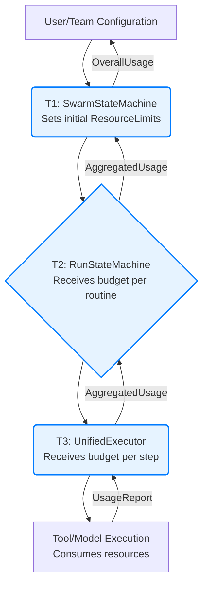

# Resource Coordination and Management

This document is the **authoritative source** for defining hierarchical resource management, allocation strategies, conflict resolution, and emergency protocols for resource handling within Vrooli's three-tier execution architecture.

**Prerequisites**: 
- Read [README.md](README.md) for architectural context and navigation.
- Review the [Centralized Type System](types/core-types.ts) for all resource-related interface and type definitions (e.g., `ResourceLimits`, `ResourceUsage`, `ExecutionPriority`).
- Understand the [Resource Conflict Resolution Decision Tree](decision-trees/resource-conflict-resolution.md) for resolving competing resource demands.
- Understand the [Error Propagation and Recovery Framework](error-propagation.md) for handling resource-related errors (e.g., `RESOURCE_EXHAUSTED`, `QUOTA_EXCEEDED`).

## Hierarchical Resource Management

Vrooli employs a hierarchical model for resource management, where limits are defined at higher levels (e.g., User, Team, Swarm) and propagated downwards. Each tier is responsible for managing resources within the budget allocated by its parent.

- **Tier 1 (Coordination)**: Manages overall swarm/task budgets (`ResourceLimits`). Allocates initial budgets to Tier 2 for routine execution. Monitors aggregate usage.
- **Tier 2 (Process)**: Manages resources for a single routine run, including distributing budgets to parallel branches and sub-routines. Tracks `RunContext` resource usage.
- **Tier 3 (Execution)**: Manages resources at the step level. Monitors exact credit usage for tool calls, model interactions, and code execution. Enforces fine-grained limits.

All relevant types like `ResourceLimits`, `ResourceUsage`, `ResourceRequirements`, and `ResourceLimitOverrides` are defined in [types/core-types.ts](types/core-types.ts).

## Resource Allocation Flow

1.  **Configuration**: Base resource limits are set at the user, team, or global level.
2.  **Tier 1 Allocation**: `SwarmStateMachine` receives or defines the total budget for a swarm/task and passes `ResourceLimits` to `RunStateMachine` for each top-level routine.
3.  **Tier 2 Allocation**: `RunStateMachine` further subdivides this budget for individual steps or sub-routine calls, passing relevant constraints to `UnifiedExecutor`.
4.  **Tier 3 Enforcement**: `UnifiedExecutor` enforces these limits for each step, tracking `ResourceUsage` (credits, time, memory, tool calls).
5.  **Reporting**: Usage is reported upwards, allowing higher tiers to monitor and adjust if necessary.

## Resource Conflict Resolution

When multiple operations compete for limited resources (e.g., concurrent tool calls under a quota, multiple branches needing credits), conflicts are resolved using the strategies outlined in the [Resource Conflict Resolution Decision Tree](decision-trees/resource-conflict-resolution.md). Key strategies include:
- `FIRST_COME_FIRST_SERVED`
- `PRIORITY_BASED` (using `ExecutionPriority` from [types/core-types.ts](types/core-types.ts))
- `PROPORTIONAL_SHARING`
- `PREEMPTION_ALLOWED`
- `QUEUE_AND_WAIT`

The `TierResourceManager` components at each tier are responsible for implementing these resolution strategies.

## Error Handling for Resource Issues

Resource-related errors are critical for system stability and are handled by the [Error Propagation and Recovery Framework](error-propagation.md). Common resource errors include:
- **`RESOURCE_EXHAUSTED`**: A specific resource (credits, time, memory) has been depleted.
- **`QUOTA_EXCEEDED`**: A rate limit or usage quota for a tool or service has been hit.
- **`RESOURCE_ALLOCATION_FAILED`**: Tier 1 or Tier 2 failed to secure necessary resources for a child operation.

**Severity and Recovery**:
- These errors are typically classified as `ERROR` or `CRITICAL` depending on impact, using the [Error Classification Decision Tree](decision-trees/error-classification-severity.md).
- Recovery strategies, selected via the [Recovery Strategy Selection Algorithm](decision-trees/recovery-strategy-selection.md), may include:
    - `RETRY_MODIFIED` (e.g., with reduced scope or after a delay).
    - `GRACEFUL_DEGRADATION` (e.g., completing with partial results).
    - `ESCALATE_TO_PARENT` or `ESCALATE_TO_HUMAN` if the budget is truly exhausted or limits are too restrictive.
    - Modifying `ExecutionPriority` to influence future resource contention.

Refer to the [Error Propagation and Recovery Framework](error-propagation.md) for the comprehensive approach to handling these errors.

## Emergency Protocols for Resource Crises

In severe resource exhaustion scenarios (e.g., a runaway routine rapidly consuming all available credits for a team), emergency protocols are triggered:
1.  **Detection**: Monitoring systems (detailed in [Performance Characteristics](performance-characteristics.md)) detect anomalous resource consumption.
2.  **Immediate Action**: The [Error Propagation and Recovery Framework](error-propagation.md) may trigger an `EMERGENCY_STOP` for the offending swarm/routine.
3.  **Load Shedding**: The system may temporarily disallow new high-consumption tasks or reduce the quality/scope of ongoing non-critical operations.
4.  **Alerting**: Administrators are alerted.

These protocols are designed to protect the overall system stability and ensure fair resource access for other users/teams.

## Related Documentation
- **[README.md](README.md)**: Overall navigation for the communication architecture.
- **[Centralized Type System](types/core-types.ts)**: Definitions for `ResourceLimits`, `ResourceUsage`, `ExecutionPriority`, etc.
- **[Decision Trees Folder](decision-trees/)**: Specifically, the [Resource Conflict Resolution Decision Tree](decision-trees/resource-conflict-resolution.md).
- **[Error Propagation and Recovery Framework](error-propagation.md)**: For handling errors like `RESOURCE_EXHAUSTED`.
- **[Performance Characteristics](performance-characteristics.md)**: For monitoring resource usage and detecting anomalies.
- **[Integration Map and Validation Document](integration-map.md)**: For testing and validating resource management features.

This document provides the definitive guide to resource coordination, ensuring efficient, fair, and stable resource utilization across the Vrooli platform. 