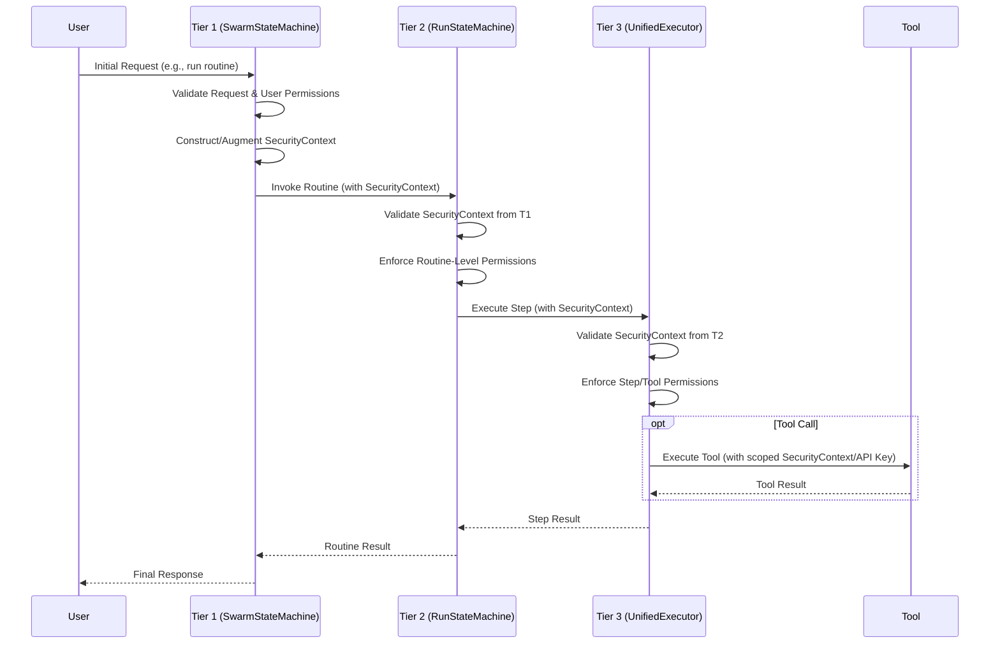

# Security Boundaries and Context Propagation

This document is the **authoritative source** for defining security boundaries, permission frameworks, and security context propagation across Vrooli's three-tier execution architecture. All security-related mechanisms and protocols are detailed herein.

**Prerequisites**: 
- Read [README.md](README.md) for architectural context and navigation.
- Review the [Centralized Type System](types/core-types.ts) for all security-related interface and type definitions (e.g., `SecurityContext`, `Permission`, `SecurityClearance`).
- Understand the overall [Error Propagation and Recovery Framework](error-propagation.md) for handling security violations and errors.

## Security Model Overview

Vrooli employs a multi-layered security model emphasizing strict boundaries between execution tiers and least-privilege access. Key principles include:
- **Tier Isolation**: Each tier operates with distinct security responsibilities and privileges.
- **Explicit Permissions**: Operations require explicit permissions defined in the `SecurityContext`.
- **Context Propagation**: `SecurityContext` is immutably passed and validated at each tier transition.
- **Auditability**: All security-relevant actions are logged for audit purposes, as detailed in the `AuditEntry` type.
- **Centralized Types**: All security enums, interfaces (`Permission`, `SecurityContext`, `PermissionCondition`, `ApprovalConfig` etc.) are defined in [types/core-types.ts](types/core-types.ts).

## Trust Boundaries and Tier Responsibilities

```mermaid
graph LR
    subgraph User/External
        UserInterface[User Interface/API Gateway]
    end

    subgraph Tier1 [Tier 1: Coordination Intelligence]
        direction LR
        T1_Entry[Entry Point Validation]
        T1_Swarm[Swarm Coordination & Permissions]
        T1_Resource[Resource & Team Policy Enforcement]
    end

    subgraph Tier2 [Tier 2: Process Intelligence]
        direction LR
        T2_Entry[T1->T2 Interface Validation]
        T2_Routine[Routine-Level Permissions]
        T2_Context[RunContext Security]
    end

    subgraph Tier3 [Tier 3: Execution Intelligence]
        direction LR
        T3_Entry[T2->T3 Interface Validation]
        T3_Step[Step & Tool Execution Permissions]
        T3_Sandbox[Sandbox & Isolation]
    end

    UserInterface --> T1_Entry
    T1_Entry --> T1_Swarm --> T1_Resource
    T1_Resource -- SecurityContext --> T2_Entry
    T2_Entry --> T2_Routine --> T2_Context
    T2_Context -- SecurityContext --> T3_Entry
    T3_Entry --> T3_Step --> T3_Sandbox

    classDef tier fill:#f0f8ff,stroke:#82a7c9,stroke-width:2px
    class T1,T2,T3 tier
```

- **Tier 1 (Coordination)**: Validates initial requests, enforces team/swarm policies, allocates resources based on high-level permissions, and constructs the initial `SecurityContext`.
- **Tier 2 (Process)**: Validates `SecurityContext` from Tier 1. Enforces routine-level permissions (e.g., can this routine access specific tools or data sensitivities?). Manages `RunContext` security, ensuring sub-routines inherit constrained permissions.
- **Tier 3 (Execution)**: Validates `SecurityContext` from Tier 2. Enforces fine-grained permissions for individual step execution, tool calls, and model interactions. Responsible for sandboxing and isolating execution environments.

## Security Context Propagation

The `SecurityContext` (defined in [types/core-types.ts](types/core-types.ts)) is the cornerstone of Vrooli's security. It is created or augmented at Tier 1 and passed down through Tier 2 to Tier 3. 

### **Security Context Propagation Flow**

- **Immutability**: While the `SecurityContext` can be augmented with more restrictive permissions or specific audit entries as it passes down, its core elements (like initial clearance level) should generally be treated as immutable for a given request flow.
- **Validation at Each Boundary**: Each tier interface is responsible for validating the incoming `SecurityContext` before processing a request.
- **Least Privilege**: When invoking sub-components or tools, tiers should derive a new `SecurityContext` with the minimum necessary permissions for that specific operation.

## Permission Model

The permission model, based on the `Permission` interface in [types/core-types.ts](types/core-types.ts), defines what actions can be performed on which resources. 
- **Resource Granularity**: Permissions can be defined for various resources (e.g., `routine:routine_id`, `tool:mcp_tool_name`, `data_sensitivity:confidential`).
- **Action Specificity**: Actions like `execute`, `read`, `write`, `manage_permissions`.
- **Conditions**: Permissions can have conditions attached (e.g., time-based, IP-based, specific input parameters).

## Approval Mechanisms

For sensitive operations, the `ApprovalConfig` (defined in [types/core-types.ts](types/core-types.ts)) allows specifying multi-agent/user approval workflows before an action can proceed.

## Error Handling for Security Violations

Security violations (e.g., `PERMISSION_DENIED`, `AUTHENTICATION_FAILED`, `SANDBOX_BREACH`, `SECURITY_VIOLATION`) are critical errors.
- They are classified and handled according to the [Error Propagation and Recovery Framework](error-propagation.md).
- Severity is typically `CRITICAL` or `FATAL`.
- Recovery might involve immediate termination of the operation, alerting administrators, and triggering emergency protocols.
- Audit trails in the `SecurityContext` are crucial for investigating security incidents.

Refer to the [Error Propagation and Recovery Framework](error-propagation.md) for detailed error handling procedures for security violations.

## Related Documentation
- **[README.md](README.md)**: Overall navigation for the communication architecture.
- **[Centralized Type System](types/core-types.ts)**: Authoritative definitions for `SecurityContext`, `Permission`, `AuditEntry`, etc.
- **[Tier Interface Contracts](tier-interfaces.md)**: How `SecurityContext` is passed between tiers.
- **[Error Propagation and Recovery Framework](error-propagation.md)**: Handling of security-related errors.
- **[Integration Map and Validation Document](integration-map.md)**: Validation and test cases for security features.

This document establishes the definitive approach to security within the Vrooli communication architecture, ensuring that all components adhere to these principles for a robust and secure system. 