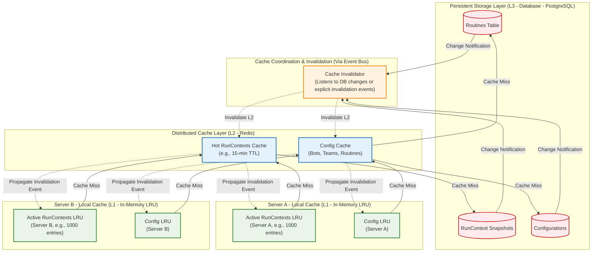
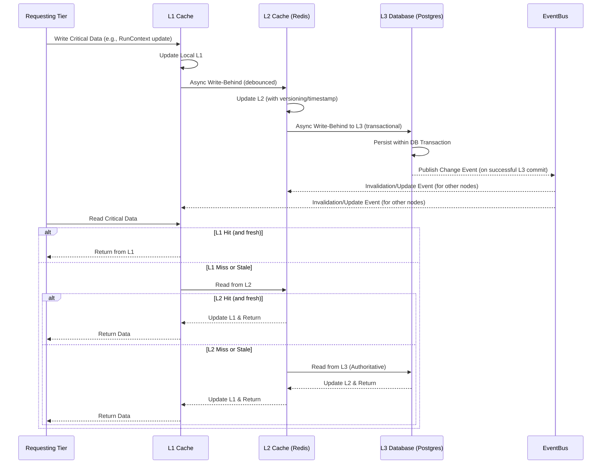

# State Synchronization and Context Management

This document is the **authoritative source** for defining state synchronization mechanisms, `RunContext` management, multi-tier caching, and data consistency protocols across Vrooli's three-tier execution architecture.

**Prerequisites**: 
- Read [README.md](README.md) for architectural context and navigation.
- Understand the [Communication Patterns](communication-patterns.md), particularly how state synchronization supports other patterns.
- Review the [Centralized Type System](types/core-types.ts) for all state and context-related interface and type definitions (e.g., `RunContext`, `ContextVariable`, `ResourceLimits`, `StateCacheConfig`).
- Understand the [Error Propagation and Recovery Framework](error-propagation.md) for handling state-related errors (e.g., `CONTEXT_CORRUPTION`, `STATE_CORRUPTION`, cache failures).

## State Management Overview

Effective state management is crucial for coordinating complex, potentially long-running operations across distributed tiers. Vrooli's approach includes:
- **`RunContext`**: The primary carrier of state for a single routine execution, detailed in [types/core-types.ts](types/core-types.ts).
- **Hierarchical Context**: `RunContext` supports parent-child relationships for sub-routines, enabling controlled state inheritance and isolation.
- **Multi-Tier Caching**: An aggressive caching strategy (L1 Local LRU, L2 Distributed Redis, L3 PostgreSQL) to optimize performance while ensuring eventual consistency.
- **Conflict Resolution**: Mechanisms for handling data conflicts during context merging or state updates.

## `RunContext` Lifecycle and Management

The `RunContext` (defined by `RunContext` and `RunContextInit` interfaces in [types/core-types.ts](types/core-types.ts)) is central to state management during routine execution.

- **Creation**: Instantiated by Tier 2 (`RunStateMachine`) for each routine execution, using `RunContextInit`.
- **Propagation**: Passed from Tier 2 to Tier 3 (`UnifiedExecutor`) for step execution.
- **Mutation**: Variables within `RunContext` (`variables`, `intermediate`, `exports`) are mutated by Tier 3 during step execution.
- **Sensitivity Tracking**: The `sensitivityMap` tracks `DataSensitivity` of context variables.
- **Child Contexts**: The `createChild` method allows for scoped contexts for sub-routines, with `inheritFromParent` managing how state is passed down.
- **Conflict Resolution**: `resolveVariableConflicts` (using `VariableConflict` and `ConflictResolutionStrategy` from [types/core-types.ts](types/core-types.ts)) handles discrepancies when merging child context data back into a parent or resolving concurrent updates.
- **Data Export**: `markForExport` (using `ExportDeclaration` and `ExportDestination` from [types/core-types.ts](types/core-types.ts)) defines how data from `RunContext` can be promoted to `SwarmSharedState.blackboard` or persisted.

## Multi-Tier Caching Architecture

To optimize performance, Vrooli employs a three-tier caching system for frequently accessed state, particularly `RunContext` and configurations. This is also visually represented in the main [Execution Architecture](../README.md#state-management-and-consistency).

- **L1 Cache (Local LRU)**: In-memory cache on each server instance for fastest access to very active `RunContext`s and configurations. Limited size.
- **L2 Cache (Distributed Redis)**: Shared cache for hot `RunContext`s and configurations, accessible by all server instances. Medium lifespan (e.g., 15-minute TTL for contexts).
- **L3 Cache (Database - PostgreSQL)**: The authoritative persistent store for all routine definitions, configurations, and potentially snapshots of `RunContext` for long-running or critical routines.

**Cache Coherence and Invalidation**: 
- Achieved through a combination of Time-To-Live (TTL) policies and an event-driven invalidation mechanism. 
- Changes in L3 (e.g., updated routine definition, team configuration change) trigger invalidation events via the [Event Bus Protocol](event-bus-protocol.md).
- These events instruct L2 and subsequently L1 caches to evict stale entries.
- A debounced write-behind strategy is used for updating L2/L3 from L1 to reduce database load.

## Data Consistency Protocols

Ensuring data consistency across distributed tiers and caches is paramount.

- **Eventual Consistency**: The primary model for cached data. Updates propagate through the cache layers, and there might be brief periods of stale reads, acceptable for most configuration data and non-critical context.
- **Read-After-Write Consistency (Scoped)**: For critical updates within a single request or routine execution flow, measures are taken to ensure that subsequent reads within that scope see the writes (e.g., by updating L1 cache directly and synchronously, or by pinning operations to a specific server instance).
- **Transactional Updates (L3)**: Operations modifying persistent state in L3 (e.g., finalizing a routine and its outputs) should use database transactions to ensure atomicity.
- **Optimistic Locking**: Can be used for updating shared resources in L2 or L3 if conflicts are rare, with mechanisms to handle write conflicts.
- **Conflict Resolution**: As defined in `RunContext` management, strategies like `PARENT_WINS`, `CHILD_WINS`, `MERGE_OBJECTS` are applied.

## Transaction and Consistency Protocol for Critical Operations

## Error Handling for State and Cache Issues

Failures in state management or caching mechanisms can lead to errors like `CONTEXT_CORRUPTION`, `STATE_CORRUPTION`, `TRANSACTION_FAILED`, or `COMMUNICATION_FAILURE` (if a cache service is down).
- These errors are handled by the [Error Propagation and Recovery Framework](error-propagation.md).
- **Severity**: Can range from `ERROR` (e.g., transient cache miss that resolves by going to L3) to `CRITICAL` (e.g., persistent context corruption, L2 Redis failure).
- **Recovery**: May involve:
    - Retrying operations.
    - Forcing a full reload from L3.
    - Invalidating broader sets of cached data.
    - Switching to a fallback cache or read-only mode for L3.
    - For `CONTEXT_CORRUPTION`, potentially terminating the affected routine and escalating, as per strategies from the [Recovery Strategy Selection Algorithm](decision-trees/recovery-strategy-selection.md).

Refer to the [Error Propagation and Recovery Framework](error-propagation.md) for detailed procedures.

## Related Documentation
- **[README.md](README.md)**: Overall navigation for the communication architecture.
- **[Centralized Type System](types/core-types.ts)**: Definitions for `RunContext`, `ContextVariable`, caching configurations, etc.
- **[Event Bus Protocol](event-bus-protocol.md)**: Used for cache invalidation events.
- **[Error Propagation and Recovery Framework](error-propagation.md)**: For handling state and cache-related errors.
- **[Performance Characteristics](performance-characteristics.md)**: Performance impact and targets for caching and state operations.
- **[Integration Map and Validation Document](integration-map.md)**: For testing and validating state management features.

This document provides the definitive guide to state synchronization and context management, ensuring data integrity and performance across the Vrooli communication architecture. 