# 🔄 Tier Communication Protocols: How the Three Tiers Work Together

> **TL;DR**: This document explains the specific protocols, interfaces, and data flows between Vrooli's three execution tiers. It answers the question "How do the tiers actually communicate?" with concrete examples and implementation details.

---

## 🎯 Communication Overview

The three tiers communicate through a combination of **direct interfaces**, **event-driven messaging**, and **shared state**. Each communication pattern is optimized for different types of interactions:

```mermaid
graph TB
    subgraph "🧠 Tier 1: Coordination Intelligence"
        T1[SwarmStateMachine<br/>📋 Goal management<br/>👥 Team coordination<br/>⚙️ Routine requests]
    end
    
    subgraph "⚙️ Tier 2: Process Intelligence"
        T2[RunStateMachine<br/>🔄 Workflow orchestration<br/>📊 State management<br/>🛠️ Step execution]
    end
    
    subgraph "🛠️ Tier 3: Execution Intelligence"
        T3[UnifiedExecutor<br/>⚡ Tool calls<br/>💰 Resource control<br/>✅ Safety enforcement]
    end
    
    subgraph "Communication Channels"
        ToolRouting["🎯 Tool Routing<br/>CompositeToolRunner<br/>MCP & OpenAI dispatch"]
        DirectInterface["📞 Direct Interface<br/>TypeScript interfaces<br/>Async/await calls"]
        EventBus["📡 Event Bus<br/>Pub/sub messaging<br/>Async coordination"]
        SharedState["💾 Shared State<br/>ChatConfigObject<br/>Context inheritance"]
    end
    
    T1 <-->|Primary| ToolRouting
    ToolRouting <--> T2
    T2 <-->|Primary| DirectInterface
    DirectInterface <--> T3
    
    T1 <-.->|Secondary| EventBus
    T2 <-.->|Secondary| EventBus
    T3 <-.->|Secondary| EventBus
    
    T1 <-->|State| SharedState
    T2 <-->|State| SharedState
    T3 <-->|State| SharedState
    
    classDef tier1 fill:#e3f2fd,stroke:#1565c0,stroke-width:2px
    classDef tier2 fill:#f3e5f5,stroke:#7b1fa2,stroke-width:2px
    classDef tier3 fill:#e8f5e8,stroke:#2e7d32,stroke-width:2px
    classDef comms fill:#fff3e0,stroke:#f57c00,stroke-width:2px
    
    class T1 tier1
    class T2 tier2
    class T3 tier3
    class ToolRouting,DirectInterface,EventBus,SharedState comms
```



---

## 🎯 T1 → T2: Tool Routing Communication

**Primary Pattern**: Tier 1 agents use MCP tools that automatically route to Tier 2 routines through the `CompositeToolRunner`.

### **Protocol Details:**
```typescript
// T1 Agent makes tool call
const result = await agent.callTool('execute_routine', {
  routineVersionId: 'market_analysis_v2',
  inputs: { timeframe: 'Q1_2024', depth: 'comprehensive' },
  priority: 'high',
  maxCredits: '5000'
});

// CompositeToolRunner automatically routes to T2
class CompositeToolRunner {
  async executeTool(toolCall: ToolCall): Promise<ToolResult> {
    if (toolCall.name === 'execute_routine') {
      // Route to RunStateMachine (T2)
      return await this.runStateMachine.executeRoutine({
        requestId: generateId(),
        routineVersionId: toolCall.parameters.routineVersionId,
        inputs: toolCall.parameters.inputs,
        context: this.buildExecutionContext(toolCall),
        priority: toolCall.parameters.priority || 'normal'
      });
    }
    // ... other tool routing logic
  }
}
```

### **Data Flow:**
1. **T1 Agent** makes tool call using natural language reasoning
2. **CompositeToolRunner** identifies routine execution request
3. **RunStateMachine (T2)** receives structured execution request
4. **T2** returns execution result to T1 agent
5. **T1 Agent** uses result in continued reasoning

### **Performance Characteristics:**
- **Latency**: ~1-2s P95 for routine initiation
- **Throughput**: ~50 routine requests/second per T1 agent
- **Reliability**: Built-in retry with exponential backoff

---

## ⚙️ T2 → T3: Direct Interface Communication

**Primary Pattern**: Tier 2 directly calls Tier 3 through TypeScript interfaces for step execution.

### **Protocol Details:**
```typescript
// T2 RunStateMachine calls T3 UnifiedExecutor
class RunStateMachine {
  async executeStep(
    step: RoutineStep,
    context: RunContext
  ): Promise<StepExecutionResult> {
    
    // Direct interface call to T3
    const stepRequest: StepExecutionRequest = {
      stepId: step.stepId,
      stepType: step.stepType,
      inputs: this.resolveInputs(step.inputMappings, context),
      strategy: step.strategy || context.defaultStrategy,
      resourceConstraints: this.getEffectiveConstraints(context),
      timeout: step.timeout || 30000
    };
    
    // Synchronous call to T3
    const result = await this.unifiedExecutor.executeStep(stepRequest);
    
    // Update run context with results
    context.completedSteps.push({
      stepId: step.stepId,
      result: result,
      timestamp: new Date()
    });
    
    return result;
  }
}

// T3 UnifiedExecutor interface
class UnifiedExecutor {
  async executeStep(request: StepExecutionRequest): Promise<StepExecutionResult> {
    // Validate resource constraints
    await this.validateResourceLimits(request);
    
    // Execute based on strategy
    switch (request.strategy) {
      case 'conversational':
        return await this.conversationalStrategy.execute(request);
      case 'reasoning':
        return await this.reasoningStrategy.execute(request);
      case 'deterministic':
        return await this.deterministicStrategy.execute(request);
      case 'routing':
        return await this.routingStrategy.execute(request);
    }
  }
}
```

### **Interface Definitions:**
```typescript
interface StepExecutionRequest {
  stepId: string;
  stepType: 'process' | 'decision' | 'parallel' | 'loop';
  inputs: Record<string, unknown>;
  strategy: 'conversational' | 'reasoning' | 'deterministic' | 'routing';
  resourceConstraints: ResourceConstraints;
  timeout: number;
  context?: ExecutionContext;
}

interface StepExecutionResult {
  stepId: string;
  success: boolean;
  outputs: Record<string, unknown>;
  resourcesUsed: ResourceUsage;
  duration: number;
  quality?: QualityMetrics;
  error?: ErrorDetails;
}
```

### **Performance Characteristics:**
- **Latency**: ~100-200ms P95 for step execution initiation
- **Throughput**: ~200 step executions/second per T2 instance
- **Reliability**: Immediate error propagation with detailed context

---

## 📡 Cross-Tier Event Communication

**Secondary Pattern**: All tiers participate in event-driven messaging for coordination, monitoring, and optimization.

### **Event Flow Examples:**

#### **Routine Execution Events:**
```typescript
// T2 publishes routine start event
await eventBus.publish('routine/started', {
  routineId: 'market_analysis_v2',
  runId: 'run_12345',
  swarmId: 'swarm_abc',
  strategy: 'reasoning',
  estimatedDuration: 180000,
  estimatedCredits: 2500
});

// T1 optimization agents subscribe to routine completion
eventBus.subscribe('routine/completed', async (event) => {
  const performance = analyzePerformance(event.payload);
  if (performance.improvementPotential > 0.2) {
    await proposeOptimizedVersion(event.payload.routineId);
  }
});

// T3 publishes step execution events
await eventBus.publish('step/completed', {
  stepId: 'data_collection_step',
  runId: 'run_12345',
  duration: 45000,
  creditsUsed: 150,
  quality: 0.92
});
```

#### **Resource Management Events:**
```typescript
// T3 publishes resource exhaustion event (barrier sync)
await eventBus.publishBarrier('swarm/resource/exhausted', {
  swarmId: 'swarm_abc',
  resourceType: 'credits',
  limit: '10000',
  used: '9950',
  requestedAction: 'halt_execution'
});

// T1 resource managers respond to barrier
eventBus.subscribeBarrier('swarm/resource/exhausted', async (event) => {
  const decision = await this.evaluateResourceRequest(event.payload);
  return decision.approved ? 'OK' : 'ALARM';
});
```

### **Event Categories by Tier:**

| Tier | Event Types | Purpose |
|------|-------------|---------|
| **T1** | `swarm/*`, `goal/*`, `team/*` | Coordination and strategic events |
| **T2** | `routine/*`, `state/*`, `context/*` | Process and workflow events |
| **T3** | `step/*`, `tool/*`, `execution/*` | Execution and resource events |
| **All** | `safety/*`, `emergency/*` | Cross-cutting safety events |

---

## 💾 Shared State Communication

**Persistent Pattern**: All tiers read from and update shared state through the `ChatConfigObject`.

### **State Access Patterns:**

#### **T1 State Management:**
```typescript
// T1 updates swarm configuration
await mcpTools.call('update_swarm_shared_state', {
  goal: "Enhanced market analysis with competitive intelligence",
  subtasks: [
    {
      id: "T1",
      description: "Collect financial data from multiple sources",
      status: "in_progress",
      assignee_bot_id: "data_specialist_001"
    }
  ],
  limits: {
    maxCredits: "15000",
    maxDurationMs: 1800000 // 30 minutes
  }
});
```

#### **T2 Context Inheritance:**
```typescript
// T2 inherits context from swarm state
class RunStateMachine {
  private buildExecutionContext(
    swarmConfig: ChatConfigObject,
    routineRequest: RunRequest
  ): RunContext {
    return {
      // Inherit from swarm
      parentGoal: swarmConfig.goal,
      availableResources: swarmConfig.resources,
      sharedKnowledge: swarmConfig.blackboard,
      
      // Runtime context
      routineId: routineRequest.routineVersionId,
      inputs: routineRequest.inputs,
      resourceLimits: this.inheritResourceLimits(swarmConfig.limits),
      
      // Execution state
      completedSteps: [],
      currentStep: null
    };
  }
}
```

#### **T3 Resource Enforcement:**
```typescript
// T3 enforces limits from swarm configuration
class UnifiedExecutor {
  private async validateResourceLimits(
    request: StepExecutionRequest,
    swarmConfig: ChatConfigObject
  ): Promise<void> {
    const currentStats = swarmConfig.stats;
    const limits = swarmConfig.limits;
    
    // Check credit limits
    if (BigInt(currentStats.totalCredits) >= BigInt(limits.maxCredits)) {
      throw new ResourceLimitExceededError('Credit limit reached');
    }
    
    // Check time limits
    const elapsed = Date.now() - currentStats.startedAt;
    if (elapsed >= limits.maxDurationMs) {
      throw new ResourceLimitExceededError('Time limit reached');
    }
  }
}
```

---

## 🔄 Complete Communication Example

Here's how a complete market analysis request flows through all three tiers:


---

## 🎯 Performance Targets

| Communication Type | Target Latency (P95) | Target Throughput | Monitoring |
|-------------------|----------------------|-------------------|------------|
| **T1→T2 Tool Routing** | ~1-2s | 50 req/sec/agent | Tool routing metrics |
| **T2→T3 Direct Interface** | ~100-200ms | 200 calls/sec | Direct call timing |
| **Event Bus Messaging** | ~200-500ms | 5,000 events/sec | Event delivery metrics |
| **Shared State Updates** | ~50-100ms | 1,000 ops/sec | State persistence timing |

---

## 🔧 Implementation Guidelines

### **For Tool Routing (T1→T2):**
- Use `CompositeToolRunner` for automatic routing
- Include comprehensive error handling and retries
- Implement request/response correlation for debugging

### **For Direct Interface (T2→T3):**
- Use strongly typed interfaces for all calls
- Implement timeout handling at the interface level
- Provide detailed error context for debugging

### **For Event Communication:**
- Use appropriate delivery guarantees (fire-and-forget vs. reliable)
- Implement event correlation for cross-tier workflows
- Monitor event lag and delivery failures

### **For Shared State:**
- Use optimistic updates with conflict resolution
- Implement state versioning for concurrent access
- Cache frequently accessed state for performance

---

> 💡 **Key Insight**: The communication architecture balances **performance** (direct interfaces), **reliability** (shared state), and **flexibility** (event-driven coordination) to create a robust and scalable execution system.

---

## 📚 Related Documentation

- **[Communication Architecture](README.md)** - High-level communication overview
- **[MCP Integration](implementation/mcp-integration.md)** - Tool routing implementation details
- **[Event Bus Protocol](../event-driven/event-bus-protocol.md)** - Event system specifications
- **[Swarm Execution Integration](../swarm-execution-integration.md)** - Shared state patterns 