# Context and Memory Architecture

> **TL;DR**: This document defines Vrooli's three-layer context architecture: **RunContext** (routine execution), **SwarmSharedState.blackboard** (swarm collaboration), and **Persistent Resources** (long-term storage). It explains how context flows between layers and how data is promoted through the hierarchy.

> 🏗️ **State Management**: For caching architecture, state synchronization, and persistence details, see **[State and Cache Management](../resource-management/state-and-cache-management.md)**.

---

## 🎯 Overview

Vrooli's execution architecture manages context and memory across three distinct layers, each with different lifetimes, access patterns, and purposes. This layered approach ensures efficient memory usage while providing the right level of persistence for different types of data.

## 📋 Three-Layer Context Architecture

Context is stored in three layers with different scopes and lifetimes:

| Layer (scope)                                          | Lifetime                        | Who can read/write?                                                           | What it's for                                                                | Where it lives                                                                                    |
| ------------------------------------------------------ | ------------------------------- | ----------------------------------------------------------------------------- | ---------------------------------------------------------------------------- | ------------------------------------------------------------------------------------------------- |
| **RunContext** <br/>*(formerly ExecutionContext)*      | "Until the sub-routine returns" | The RunStateMachine **and** Tier-3 executor that own this single run instance | Inputs, intermediate vars, step history, `exports[]` list (declared outputs) | In-memory object; cached using the [three-tier cache system](../resource-management/state-and-cache-management.md)                                     |
| **SwarmSharedState.blackboard\[]**                     | "As long as the swarm exists"   | Any agent in the chat via `update_swarm_shared_state`                         | Short-lived cross-task scratch: results, notes, ids, URLs, etc.              | Part of `ConversationState`; also streamed on the event-bus as `swarm/blackboard_updated` |
| **Persistent Resource** *(Note, Routine, API record…)* | Permanent                       | Agents only (through `resource_manage add/update`)                            | Anything the team might reuse tomorrow                                       | PostgreSQL + pgvector                                                                             |

## 🔄 Context Flow Architecture

**If data should outlive a run or swarm, somebody must push it up a layer:**

```mermaid
graph LR
    RunContext[RunContext<br/>🔄 Routine execution<br/>📊 Intermediate state<br/>⏱️ Temporary lifetime]
    
    blackboard[Swarm Blackboard<br/>🐝 Cross-task sharing<br/>📝 Collaborative notes<br/>⏱️ Swarm lifetime]
    
    resource_store[Persistent Resources<br/>💾 Long-term storage<br/>🔍 Searchable content<br/>⏱️ Permanent]
    
    RunContext -->|"configurable export"| blackboard
    blackboard -->|"agent decides"| resource_store
    
    classDef run fill:#e3f2fd,stroke:#1565c0,stroke-width:2px
    classDef swarm fill:#f3e5f5,stroke:#7b1fa2,stroke-width:2px
    classDef persistent fill:#e8f5e8,stroke:#2e7d32,stroke-width:2px
    
    class RunContext run
    class blackboard swarm
    class resource_store persistent
```



### **Detailed Context Flow**

Here's how context flows between layers during execution:


---

## 🔄 Layer 1: RunContext

### **Purpose and Scope**
- **Lifetime**: Duration of a single routine execution
- **Access**: RunStateMachine and UnifiedExecutor for the specific run
- **Storage**: In-memory with [three-tier caching](../resource-management/state-and-cache-management.md) for persistence

### **Data Types**
- **Input parameters**: Initial values passed to the routine
- **Intermediate variables**: Calculated values during execution
- **Step history**: Record of completed steps and their outcomes
- **Export declarations**: List of outputs to be exported when run completes

### **Implementation Details**

```typescript
interface RunContext {
    // Core execution state
    readonly runId: string;
    readonly routineId: string;
    readonly parentRunId?: string;
    
    // Input/Output management
    inputs: Record<string, unknown>;
    intermediateVars: Record<string, unknown>;
    exports: Record<string, unknown>;
    
    // Execution tracking
    stepHistory: ExecutionStep[];
    currentStepId?: string;
    
    // Context hierarchy
    createChild(inputs: Record<string, unknown>): RunContext;
    exportToParent(key: string, value: unknown): void;
}
```

### **Context Creation and Management**

```mermaid
graph TB
    subgraph "RunContext Lifecycle"
        Create[Create RunContext<br/>🎯 Initialize inputs<br/>📊 Set parent relationship<br/>🔄 Generate run ID]
        Execute[Execute Steps<br/>📝 Update intermediate vars<br/>📊 Track step history<br/>🔄 Manage state]
        Export[Export Results<br/>📤 Declare outputs<br/>🔄 Push to parent/blackboard<br/>💾 Persist final state]
        Cleanup[Cleanup<br/>🗑️ Release memory<br/>📊 Archive history<br/>🔄 Update references]
    end
    
    Create --> Execute --> Export --> Cleanup
    
    classDef lifecycle fill:#e3f2fd,stroke:#1565c0,stroke-width:2px
    class Create,Execute,Export,Cleanup lifecycle
```



---

## 🐝 Layer 2: SwarmSharedState.blackboard

### **Purpose and Scope**
- **Lifetime**: Duration of the swarm session
- **Access**: Any agent in the swarm via `update_swarm_shared_state`
- **Storage**: ConversationState with event streaming

### **Data Types**
- **Task results**: Outputs from completed routines
- **Shared notes**: Information for collaboration
- **Resource IDs**: References to created resources
- **URLs and external links**: Shared references

### **Event-Driven Updates**


### **Blackboard Data Structure**

```typescript
interface SwarmBlackboard {
    // Shared execution results
    taskResults: Record<string, TaskResult>;
    
    // Collaborative notes
    sharedNotes: BlackboardNote[];
    
    // Resource references
    resourceIds: string[];
    createdUrls: string[];
    
    // Coordination state
    activeRoutines: string[];
    completedTasks: string[];
    
    // Metadata
    lastUpdated: Date;
    updatedBy: string;
}

interface BlackboardNote {
    id: string;
    content: string;
    createdBy: string;
    createdAt: Date;
    tags: string[];
    priority?: 'low' | 'medium' | 'high';
}
```

---

## 💾 Layer 3: Persistent Resources

### **Purpose and Scope**
- **Lifetime**: Permanent (until explicitly deleted)
- **Access**: Agents via `resource_manage` tools
- **Storage**: PostgreSQL with pgvector for search

### **Resource Types**
- **Notes**: Persistent documentation and findings
- **Routines**: Reusable automation workflows
- **API Records**: Integration configurations
- **Knowledge Artifacts**: Structured information

### **Resource Management Architecture**


---

## 🔄 Context Export and Synchronization

### **Export Strategy Selection**

The system determines what to export based on context hierarchy and configuration:

```typescript
interface ContextExporter {
    // Export child context to parent
    exportToParent(childContext: RunContext, parentContext: RunContext): void;
    
    // Export root context to blackboard
    exportToBlackboard(context: RunContext, blackboard: SwarmBlackboard): void;
    
    // Export blackboard items to persistent storage
    exportToPersistent(blackboardItem: BlackboardNote): void;
}

// Export configuration
interface ExportConfiguration {
    // What to export automatically
    autoExportToParent: string[];        // Variable names to auto-export
    autoExportToBlackboard: string[];    // Items to auto-add to blackboard
    autoExportToPersistent: string[];    // Items to auto-persist
    
    // Export conditions
    exportTriggers: ExportTrigger[];     // When to trigger exports
    exportFilters: ExportFilter[];       // What to exclude
}
```

### **Context Synchronization Patterns**

```mermaid
graph TB
    subgraph "Synchronization Patterns"
        subgraph "Parent-Child Sync"
            PC1[Child Inherits<br/>🔄 Parent variables<br/>📊 Shared configuration<br/>🎯 Access permissions]
            PC2[Child Exports<br/>📤 Declared outputs<br/>📊 Computed results<br/>🔄 State updates]
        end
        
        subgraph "Swarm-Wide Sync"
            SW1[Agent Updates<br/>📝 Blackboard writes<br/>🔄 State changes<br/>📊 Progress reports]
            SW2[Event Propagation<br/>📡 Real-time notifications<br/>🔄 State synchronization<br/>👥 Multi-agent coordination]
        end
        
        subgraph "Persistent Sync"
            PS1[Resource Creation<br/>💾 Long-term storage<br/>🔍 Searchable content<br/>🏷️ Metadata tagging]
            PS2[Knowledge Building<br/>🧠 Incremental learning<br/>📊 Pattern recognition<br/>🔄 Continuous improvement]
        end
    end
    
    PC1 -.->|inherits| PC2
    SW1 -.->|propagates| SW2
    PS1 -.->|builds| PS2
    
    PC2 -->|promotes| SW1
    SW2 -->|persists| PS1
    
    classDef parentChild fill:#e3f2fd,stroke:#1565c0,stroke-width:2px
    classDef swarmWide fill:#f3e5f5,stroke:#7b1fa2,stroke-width:2px
    classDef persistent fill:#e8f5e8,stroke:#2e7d32,stroke-width:2px
    
    class PC1,PC2 parentChild
    class SW1,SW2 swarmWide
    class PS1,PS2 persistent
```



---

## 🚀 Memory Optimization Strategies

### **Context Size Management**

```typescript
interface ContextOptimizer {
    // Compress context when approaching limits
    compressContext(context: RunContext): CompressedContext;
    
    // Summarize step history
    summarizeStepHistory(steps: ExecutionStep[]): ExecutionSummary;
    
    // Archive old context data
    archiveOldContext(contextId: string): void;
}

// Optimization techniques
enum OptimizationTechnique {
    COMPRESSION = "compression",        // Compress large data structures
    SUMMARIZATION = "summarization",    // Summarize verbose content
    ARCHIVAL = "archival",             // Move old data to cold storage
    REFERENCE = "reference"            // Replace data with references
}
```

### **Performance Characteristics**

| Layer | Read Performance | Write Performance | Search Capability | Memory Usage |
|-------|------------------|-------------------|-------------------|--------------|
| **RunContext** | Instant (in-memory) | Instant | Limited (direct access) | High (temporary) |
| **Blackboard** | Fast (cached) | Fast | Event-based queries | Medium (session) |
| **Persistent** | Variable (DB query) | Slower (ACID) | Full-text + semantic | Low (on-demand) |

---

## 📚 Related Documentation

- **[State and Cache Management](../resource-management/state-and-cache-management.md)** - **🆕 Unified caching architecture and state synchronization**
- **[Main Execution Architecture](../README.md)** - Complete three-tier execution architecture
- **[Event-Driven Architecture](../event-driven/README.md)** - Event-based communication patterns
- **[Resource Management](../resource-management/README.md)** - Resource allocation and coordination
- **[Centralized Type System](../types/core-types.ts)** - Context and state type definitions

---

> 💡 **Key Insight**: The three-layer context architecture ensures **appropriate data lifetime management** through automatic promotion between layers. RunContext handles immediate execution needs, Blackboard enables swarm collaboration, and Persistent Resources provide long-term knowledge retention.