# Core Technologies

## **Terminology Definitions**

- **Team**: A persistent organizational unit at the strategic level, composed of humans and AI agents working together toward long-term goals. Teams define high-level objectives, allocate resources (credits, compute, personnel), and set overarching policies (e.g. security, compliance). Each Team maintains a shared context (members, roles, norms) that guides the swarms it spawns.  
- **Routine**: A reusable, versioned workflow that combines AI reasoning, API calls, code execution, and human oversight to accomplish specific tasks. Routines are the atomic units of automation in Vrooli. 

    *Note: Routines are always private by default, and can only be shared with other swarms you create unless you explicitly share them with the public.*
    
- **Run**: The execution instance of a routine, managed by the `RunStateMachine`.  
- **Navigator**: A pluggable component that translates between Vrooli's universal execution model and platform-specific workflow formats (BPMN, Langchain, etc.).  
- **Strategy**: The execution approach applied to a routine step (Conversational, Reasoning, or Deterministic), selected based on routine characteristics and context.  
- **Context**: The execution environment containing variables, state, permissions, and shared knowledge available to agents during routine execution.  
- **Chat:** The conversation data (messages, history, and persisted swarm context), which is tied 1-to-1 with a swarm  
- **Swarm:** The running swarm process managed by the `SwarmStateMachine`.

## **Hierarchical Boundaries**

```mermaid
graph TD
    subgraph "Strategic Boundary"
        Teams[Teams<br/>📈 Long-term goals, resource allocation<br/>🔄 Persistent organizational structures]
    end

    subgraph "Tactical Boundary"
        Swarms[Swarms<br/>🐝 Short-term objectives, dynamic coordination<br/>⏱️ Task-specific, disbanded when complete]
    end

    subgraph "Operational Boundary"
        Agents[Agents<br/>🤖 Persistent AI entities, specialized capabilities] 
        Routines[Routines<br/>⚙️ Versioned workflows, atomic automation<br/>📈 Evolve through usage]
    end

    Teams -.->|"Provides resources & strategic direction"| Swarms
    Swarms -.->|"Coordinates & assigns objectives"| Agents
    Agents -.->|"Execute & improve"| Routines

    classDef strategic fill:#e3f2fd,stroke:#1565c0,stroke-width:3px
    classDef tactical fill:#f3e5f5,stroke:#7b1fa2,stroke-width:2px
    classDef operational fill:#e8f5e8,stroke:#2e7d32,stroke-width:2px

    class Teams strategic
    class Swarms tactical
    class Agents,Routines operational
```

## **Cross-Boundary Communication Protocols**

- **Strategic ↔ Tactical**: Resource allocation requests, goal decomposition, performance reports
- **Tactical ↔ Operational**: Task assignments, capability requests, execution status updates
- **Operational ↔ Operational**: Context sharing, routine invocation, result propagation

## Conceptual Foundation

## Core Hierarchy

```mermaid
graph TD
    Teams[Teams<br/>🏢 Organizations & Goals]
    Swarms[Swarms<br/>🐝 Dynamic Task Forces]
    Agents[Agents<br/>🤖 Specialized Workers]
    Routines[Routines<br/>⚙️ Reusable Processes]
    
    Teams --> Swarms
    Swarms --> Agents
    Agents --> Routines
    
    Teams -.->|"Provides resources,<br/>sets strategic goals"| Swarms
    Swarms -.->|"Recruits specialists,<br/>coordinates work"| Agents
    Agents -.->|"Execute processes,<br/>create improvements"| Routines
    
    classDef teams fill:#e3f2fd,stroke:#1565c0,stroke-width:3px
    classDef swarms fill:#f3e5f5,stroke:#7b1fa2,stroke-width:2px
    classDef agents fill:#e8f5e8,stroke:#2e7d32,stroke-width:2px
    classDef routines fill:#fff3e0,stroke:#f57c00,stroke-width:2px
    
    class Teams teams
    class Swarms swarms
    class Agents agents
    class Routines routines
```

### **Teams** (Strategic Level)
- **Purpose**: Long-term goals, resource allocation, strategic direction
- **Composition**: Humans + AI agents organized around business objectives
- **Lifecycle**: Persistent, evolving with organizational needs
- **Examples**: "Customer Success Team," "Product Development Team," "Research Division"

### **Swarms** (Coordination Level)
- **Purpose**: Dynamic task forces assembled for specific complex objectives
- **Composition**: Temporary coalitions of specialized agents
- **Lifecycle**: Created for tasks, disbanded when complete
- **Examples**: "Analyze Market Trends," "Build Customer Onboarding Flow," "Optimize Supply Chain"

### **Agents** (Execution Level)
- **Purpose**: Specialized workers with specific capabilities and personas
- **Composition**: Individual AI entities with defined roles and skills
- **Lifecycle**: Persistent, but recruited into different swarms as needed
- **Examples**: "Data Analyst," "Content Writer," "API Integration Specialist"

### **Routines** (Process Level)
- **Purpose**: Reusable automation building blocks
- **Composition**: Workflows combining AI reasoning, API calls, code, and human oversight
- **Lifecycle**: Versioned, improved over time through use and feedback
- **Examples**: "Market Research Report," "Customer Sentiment Analysis," "API Integration Template"

## Execution Strategy Evolution

Routines evolve from abstract to concrete as usage patterns emerge:

```mermaid
graph LR
    subgraph "Conversational"
        A[Human-like reasoning<br/>💬 Natural language<br/>🤔 Creative problem-solving<br/>🔄 Adaptive responses]
    end
    
    subgraph "Reasoning"
        B[Structured thinking<br/>🧠 Logical frameworks<br/>📊 Data-driven decisions<br/>🎯 Goal optimization]
    end
    
    subgraph "Deterministic"
        C[Reliable automation<br/>⚙️ API integrations<br/>📋 Strict validation<br/>💰 Cost optimization]
    end
    
    A -->|"Patterns emerge"| B
    B -->|"Best practices proven"| C
    C -.->|"Edge cases discovered"| A
    
    A1[Goal alignment discussions] --> B1[Strategic planning frameworks] --> C1[Automated resource allocation]
    A2[Creative brainstorming] --> B2[Innovation methodologies] --> C2[Idea evaluation pipelines]
    A3[Customer service chats] --> B3[Support decision trees] --> C3[Automated ticket routing]
    
    classDef conv fill:#fff9c4,stroke:#f57f17,stroke-width:2px
    classDef reason fill:#f3e5f5,stroke:#7b1fa2,stroke-width:2px
    classDef determ fill:#e8f5e8,stroke:#2e7d32,stroke-width:2px
    
    class A,A1,A2,A3 conv
    class B,B1,B2,B3 reason
    class C,C1,C2,C3 determ
```

### **The Evolution Mechanism: Top-Down Decomposition**

The key insight driving this evolution is **top-down decomposition enabled by recursive routine composition**. Here's how it works:

**1. Conversational Phase - Natural Language Exploration**

```mermaid
graph TB
    subgraph "Conversational: 'Analyze Market Trends'"
        Conv[🗣️ Conversational Strategy<br/>Agent receives natural language goal<br/>'Analyze market trends for Q4']
        
        ConvSteps[Agent reasoning:<br/>💭 'I need to gather data...'<br/>💭 'Then analyze patterns...'<br/>💭 'Finally create insights...']
        
        ConvExec[Execution:<br/>🔄 Dynamic conversation<br/>🤔 Real-time decisions<br/>📝 Learning from feedback]
    end
    
    Conv --> ConvSteps --> ConvExec
    
    classDef conv fill:#fff9c4,stroke:#f57f17,stroke-width:2px
    class Conv,ConvSteps,ConvExec conv
```

**2. Reasoning Phase - Pattern Recognition**

```mermaid
graph TB
    subgraph "Reasoning: Structured Framework Emerges"
        Reason[🧠 Reasoning Strategy<br/>Patterns identified from conversational executions<br/>Structured approach developed]
        
        ReasonSteps[Logical framework:<br/>📊 1. Data Collection Phase<br/>📈 2. Pattern Analysis Phase<br/>📋 3. Insight Generation Phase]
        
        ReasonExec[Execution:<br/>🎯 Systematic approach<br/>📊 Data-driven decisions<br/>⚖️ Structured validation]
    end
    
    Reason --> ReasonSteps --> ReasonExec
    
    classDef reason fill:#f3e5f5,stroke:#7b1fa2,stroke-width:2px
    class Reason,ReasonSteps,ReasonExec reason
```

**3. Deterministic Phase - Automation Crystallization**

```mermaid
graph TB
    subgraph "Deterministic: Automated Multi-Step Routine"
        Determ[⚙️ Deterministic Strategy<br/>Best practices proven and codified<br/>Reliable automation workflow]
        
        DetermSteps[Multi-step routine:<br/>🌐 Step 1: Web Search APIs<br/>📊 Step 2: Data Processing Code<br/>📋 Step 3: Report Generation]
        
        DetermExec[Execution:<br/>🔄 Fully automated<br/>✅ Strict validation<br/>💰 Cost optimized]
    end
    
    Determ --> DetermSteps --> DetermExec
    
    classDef determ fill:#e8f5e8,stroke:#2e7d32,stroke-width:2px
    class Determ,DetermSteps,DetermExec determ
```

### **Recursive Routine Composition: The Foundation of Evolution**

The evolution from conversational to deterministic strategies is enabled by Vrooli's **recursive routine composition** capability:

**Key Evolution Insights:**

1. **Gradual Refinement**: Routines don't evolve all at once - individual sub-routines can be at different strategy levels
2. **Strategic Mixing**: A deterministic parent routine can contain conversational sub-routines for creative tasks
3. **Context Preservation**: Each sub-routine maintains its own execution context while contributing to the parent's goals
4. **Learning Propagation**: Insights from sub-routine execution inform parent routine optimization

### **The Decomposition Process**

This recursive composition and gradual evolution is what enables Vrooli's **compound knowledge effect** - every routine becomes a building block for more sophisticated automation, creating an exponential growth in capability over time.

### **Context Inheritance and Data Flow**

Each routine execution creates its own **context object** that stores inputs and outputs. When routines contain sub-routines:

- **Context Inheritance**: Sub-routines inherit appropriate context from their parent
- **Selective Output**: Sub-routines specify which outputs to pass to the parent routine  
- **Sensitivity Levels**: Inputs and outputs have sensitivity classifications (public, internal, confidential, secret, PII) that influence data handling and security
- **Hierarchical Scoping**: Parents only receive outputs they're authorized for, maintaining security boundaries

This ensures that complex multi-level routines can share data appropriately while maintaining security and only keeping track of relevant information at each level.