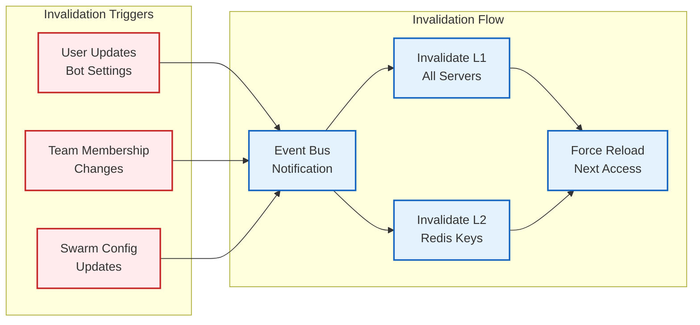

# State Management and Consistency

## **Overall State Management Architecture**

```mermaid
graph TB
    subgraph "Persistent Storage Layer (L3 - Database)"
        TeamsDB[(Teams Table<br/>🏢 Team configurations<br/>👥 Member relationships<br/>🎯 Team objectives)]
        BotsDB[(Users Table<br/>🤖 Bot configurations<br/>🧠 Bot personas<br/>⚙️ Capabilities)]
        ChatsDB[(Chats Table<br/>💬 Chat metadata<br/>🐝 Swarm configurations<br/>📊 Conversation state)]
        RoutinesDB[(Routines Table<br/>⚙️ Routine definitions<br/>📋 Step configurations<br/>🔄 Version history)]
    end
    
    subgraph "Distributed Cache Layer (L2 - Redis)"
        SwarmL2[Swarm State Cache<br/>🐝 Active swarm states<br/>📊 15-minute TTL<br/>🔄 Cross-server sharing]
        RunL2[Run State Cache<br/>🔄 Active routine runs<br/>💾 Execution context<br/>⚡ Fast retrieval]
        ConfigL2[Config Cache<br/>⚙️ Bot/Team configs<br/>📋 Routine metadata<br/>🚀 Quick lookups]
    end
    
    subgraph "Server A - Local Cache (L1 - LRU)"
        SwarmL1A[Swarm LRU<br/>🐝 Hot conversations<br/>⚡ Sub-ms access<br/>🎯 1000 entry limit]
        RunL1A[Run LRU<br/>🔄 Active executions<br/>💾 Context state<br/>📊 Real-time updates]
    end
    
    subgraph "Server B - Local Cache (L1 - LRU)"
        SwarmL1B[Swarm LRU<br/>🐝 Hot conversations<br/>⚡ Sub-ms access<br/>🎯 1000 entry limit]
        RunL1B[Run LRU<br/>🔄 Active executions<br/>💾 Context state<br/>📊 Real-time updates]
    end
    
    subgraph "Cache Coordination"
        CacheInvalidator[Cache Invalidator<br/>🔄 Cross-layer sync<br/>📢 Invalidation events<br/>⚡ Consistency maintenance]
    end
    
    %% Data flow connections
    SwarmL1A -.->|"Cache miss"| SwarmL2
    SwarmL1B -.->|"Cache miss"| SwarmL2
    SwarmL2 -.->|"Cache miss"| ChatsDB
    
    RunL1A -.->|"Cache miss"| RunL2
    RunL1B -.->|"Cache miss"| RunL2
    RunL2 -.->|"Cache miss"| RoutinesDB
    
    ConfigL2 -.->|"Cache miss"| TeamsDB
    ConfigL2 -.->|"Cache miss"| BotsDB
    
    CacheInvalidator -.->|"Invalidate"| SwarmL1A
    CacheInvalidator -.->|"Invalidate"| SwarmL1B
    CacheInvalidator -.->|"Invalidate"| SwarmL2
    CacheInvalidator -.->|"Invalidate"| RunL2
    
    classDef database fill:#ffebee,stroke:#c62828,stroke-width:3px
    classDef l2cache fill:#e3f2fd,stroke:#1565c0,stroke-width:2px
    classDef l1cache fill:#e8f5e8,stroke:#2e7d32,stroke-width:2px
    classDef coordinator fill:#fff3e0,stroke:#f57c00,stroke-width:2px
    
    class TeamsDB,BotsDB,ChatsDB,RoutinesDB database
    class SwarmL2,RunL2,ConfigL2 l2cache
    class SwarmL1A,RunL1A,SwarmL1B,RunL1B l1cache
    class CacheInvalidator coordinator
```



## **Three-Tier Cache System Detail**

```mermaid
graph TB
    subgraph "Cache Miss Resolution Flow"
        Request[Request for<br/>Swarm/Run State]
        
        subgraph "L1 - Local LRU Cache"
            L1Check{L1 Cache Hit?}
            L1Return[Return from L1<br/>⚡ <1ms response]
            L1Store[Store in L1<br/>🎯 Evict if full]
        end
        
        subgraph "L2 - Distributed Redis Cache"
            L2Check{L2 Cache Hit?}
            L2Return[Return from L2<br/>⚡ ~5ms response]
            L2Store[Store in L2<br/>⏰ 15min TTL]
        end
        
        subgraph "L3 - PostgreSQL Database"
            L3Query[Query Database<br/>💾 ~50ms response]
            L3Return[Return from DB<br/>📊 Authoritative data]
        end
        
        subgraph "Write-Behind Pattern"
            WriteBuffer[Debounced Write Buffer<br/>⏱️ 2s debounce<br/>📊 Batch updates]
            WriteBack[Async Write-Back<br/>💾 Update L2 & L3<br/>🔄 Eventual consistency]
        end
    end
    
    Request --> L1Check
    L1Check -->|"Hit"| L1Return
    L1Check -->|"Miss"| L2Check
    L2Check -->|"Hit"| L2Return
    L2Return --> L1Store
    L2Check -->|"Miss"| L3Query
    L3Query --> L3Return
    L3Return --> L2Store
    L2Store --> L1Store
    
    %% Write path
    L1Store -.->|"Updates"| WriteBuffer
    WriteBuffer -.->|"Batch"| WriteBack
    WriteBack -.->|"Persist"| L2Store
    WriteBack -.->|"Persist"| L3Query
    
    classDef request fill:#e3f2fd,stroke:#1565c0,stroke-width:3px
    classDef l1 fill:#e8f5e8,stroke:#2e7d32,stroke-width:2px
    classDef l2 fill:#fff3e0,stroke:#f57c00,stroke-width:2px
    classDef l3 fill:#ffebee,stroke:#c62828,stroke-width:2px
    classDef write fill:#f3e5f5,stroke:#7b1fa2,stroke-width:2px
    
    class Request request
    class L1Check,L1Return,L1Store l1
    class L2Check,L2Return,L2Store l2
    class L3Query,L3Return l3
    class WriteBuffer,WriteBack write
```



## **State Consistency Patterns**

**1. Chat-Swarm State Coupling**

Since swarms are tied to exactly one chat for their entire lifecycle, the state management leverages this coupling:

```typescript
interface ConversationState {
    id: string;                           // Chat ID (also Swarm ID)
    config: ChatConfigObject;             // Swarm configuration
    participants: BotParticipant[];       // Active swarm members
    availableTools: ToolDefinition[];     // Swarm capabilities
    teamConfig?: TeamConfigObject;        // Team context (runtime-only)
}
```

**2. Debounced Write-Behind Strategy**

The cache system uses a write-behind pattern with debouncing to reduce database load:

- **Immediate**: Updates go to L1 cache instantly
- **Debounced**: L2/L3 writes are debounced by 2 seconds
- **Batched**: Multiple rapid updates are collapsed into single DB writes
- **Eventual**: Consistency is guaranteed but may be delayed

**3. Cache Invalidation Strategy**



**4. Server Affinity Benefits**

- **Cache Locality**: Same-server processing keeps hot data in L1 cache
- **Reduced Latency**: No network round-trips for cache access
- **Consistency**: Eliminates race conditions between servers
- **Resource Efficiency**: Lower memory usage across the cluster

**5. Failure Recovery**

- **L1 Failure**: Automatic fallback to L2/L3 with minimal impact
- **L2 Failure**: Direct L1→L3 access with performance degradation
- **L3 Failure**: Read-only mode using cached data until recovery
- **Server Failure**: Work redistribution with cache rebuilding

This architecture ensures that swarm and routine execution benefits from aggressive caching while maintaining data consistency and providing graceful degradation under failure conditions. 

### **Distributed State Architecture**

```mermaid
graph TB
    subgraph "Global State Store"
        GlobalState[Global State<br/>🌐 Team configurations<br/>📊 System metrics<br/>🔧 Global settings]
    end
    
    subgraph "Swarm State Stores"
        SwarmState1[Swarm State 1<br/>🎯 Active objectives<br/>👥 Agent assignments<br/>📊 Progress tracking]
        SwarmState2[Swarm State 2<br/>🎯 Active objectives<br/>👥 Agent assignments<br/>📊 Progress tracking]
    end
    
    subgraph "Execution State Stores"
        ExecState1[Execution State 1<br/>🔄 Routine progress<br/>💾 Variable state<br/>📍 Current position]
        ExecState2[Execution State 2<br/>🔄 Routine progress<br/>💾 Variable state<br/>📍 Current position]
    end
    
    subgraph "Consistency Mechanisms"
        EventSourcing[Event Sourcing<br/>📝 Immutable event log<br/>🔄 State reconstruction<br/>⏪ Time travel debugging]
        CQRS[CQRS Pattern<br/>📖 Separate read models<br/>✍️ Optimized writes<br/>📊 Materialized views]
        Consensus[Distributed Consensus<br/>🤝 Raft/PBFT protocols<br/>🔄 Leader election<br/>🎯 Conflict resolution]
    end
    
    GlobalState -.->|"Propagates"| SwarmState1
    GlobalState -.->|"Propagates"| SwarmState2
    SwarmState1 -.->|"Inherits"| ExecState1
    SwarmState2 -.->|"Inherits"| ExecState2
    
    EventSourcing --> GlobalState
    EventSourcing --> SwarmState1
    EventSourcing --> SwarmState2
    
    CQRS --> ExecState1
    CQRS --> ExecState2
    
    classDef global fill:#e3f2fd,stroke:#1565c0,stroke-width:3px
    classDef swarm fill:#f3e5f5,stroke:#7b1fa2,stroke-width:2px
    classDef execution fill:#e8f5e8,stroke:#2e7d32,stroke-width:2px
    classDef consistency fill:#fff3e0,stroke:#f57c00,stroke-width:2px
    
    class GlobalState global
    class SwarmState1,SwarmState2 swarm
    class ExecState1,ExecState2 execution
    class EventSourcing,CQRS,Consensus consistency
```


