# 🌱 Emergent Capabilities: Intelligence Through Composition

> **TL;DR**: Vrooli's most powerful capabilities aren't built-in—they **emerge** from intelligent composition. Teams deploy specialized agent swarms and adaptive routines that combine to create sophisticated, domain-specific intelligence that evolves continuously through use.

---

## 🎯 What Makes Capabilities "Emergent"?

### **Built-In vs. Emergent: A Fundamental Difference**

```mermaid
graph TB
    subgraph "⌠Traditional Built-In Approach"
        BI1[Hard-Coded Security<br/>🔒 Fixed threat detection<br/>📋 Static compliance rules<br/>🚫 Rigid policy enforcement]
        BI2[Pre-Built Monitoring<br/>📊 Standard dashboards<br/>📈 Generic alerts<br/>🔄 One-size-fits-all metrics]
        BI3[Static Optimization<br/>âš™ï¸ Fixed performance rules<br/>💰 Universal cost patterns<br/>🯠Generic improvements]
    end
    
    subgraph "✅ Vrooli's Emergent Approach"
        E1[Emergent Security<br/>🧠 Intelligent threat analysis<br/>🯠Domain-specific compliance<br/>🔄 Adaptive defense strategies]
        E2[Emergent Monitoring<br/>📊 Context-aware insights<br/>🚨 Predictive analytics<br/>🯠Team-specific metrics]
        E3[Emergent Optimization<br/>⚡ Pattern-based improvements<br/>💡 Usage-driven enhancements<br/>🌱 Continuous evolution]
    end
    
    BI1 & BI2 & BI3 -.->|"Limited, rigid"| Limitation[⌠Can't adapt to<br/>unique team needs]
    E1 & E2 & E3 -.->|"Adaptive, intelligent"| Power[✨ Evolves with<br/>your specific domain]
    
    classDef builtin fill:#ffebee,stroke:#c62828,stroke-width:2px
    classDef emergent fill:#e8f5e8,stroke:#2e7d32,stroke-width:2px
    classDef limitation fill:#fafafa,stroke:#757575,stroke-width:1px
    classDef power fill:#f3e5f5,stroke:#7b1fa2,stroke-width:2px
    
    class BI1,BI2,BI3 builtin
    class E1,E2,E3 emergent
    class Limitation limitation
    class Power power
```



### **Key Principles of Emergent Capabilities**

1. **🧠 Intelligence-First**: Capabilities come from AI reasoning through specialized agents, not hard-coded logic
2. **🎯 Domain-Adaptive**: Each team's capabilities evolve to match their specific needs through agent learning
3. **🔄 Continuously Learning**: Agents analyze patterns and propose improvements through usage observation
4. **🌱 Composable**: Complex capabilities emerge from agents collaborating and improving workflows
5. **📊 Event-Driven**: Agents respond intelligently to real-time system events and routine performance data

---

## 🤖 Emergent Resources: The Building Blocks

Vrooli's emergent capabilities are built from two primary intelligent resources:

### **🔄 Adaptive Routines**
**What they are**: Static workflows that serve specific purposes, from conversational problem-solving to optimized deterministic execution.

**How they evolve through agents**:
- Routines execute and generate performance data through events
- **Optimization agents** subscribe to routine completion events and analyze patterns
- Agents identify improvement opportunities (speed, cost, quality) in routine performance
- **Agents create new, improved routine versions** and propose them via pull requests
- Teams review agent-proposed improvements and adopt successful optimizations

**Examples**: Customer support workflows, financial analysis pipelines, content generation processes

### **🤖 Intelligent Agents**
**What they are**: Specialized AI entities that subscribe to events and provide domain-specific intelligence.

**How they create emergent capabilities**:
- Teams deploy agents with specific goals and capabilities
- Agents learn from event patterns and domain-specific feedback
- Agent swarms collaborate to handle complex, multi-faceted challenges
- **Agents propose routine improvements** based on usage pattern analysis
- Successful agent patterns get shared and adapted across organizations

**Examples**: Security monitoring agents, quality assurance agents, performance optimization agents

```mermaid
graph LR
    subgraph "🔄 Agent-Driven Routine Evolution"
        R1[Conversational Routine<br/>💭 Flexible reasoning<br/>🤔 Creative problem-solving]
        R2[Reasoning Routine<br/>📊 Structured approach<br/>🯠Pattern recognition]
        R3[Deterministic Routine<br/>⚡ Optimized execution<br/>🚀 Predictable performance]
        
        A1[Optimization Agent<br/>📊 Analyzes R1 patterns<br/>💡 Proposes R2 version]
        A2[Optimization Agent<br/>📊 Analyzes R2 patterns<br/>💡 Proposes R3 version]
        A3[Quality Agent<br/>📊 Monitors R3 quality<br/>💡 Suggests R1 for edge cases]
        
        R1 -->|"Performance events"| A1
        A1 -->|"Creates improved version"| R2
        R2 -->|"Performance events"| A2
        A2 -->|"Creates optimized version"| R3
        R3 -->|"Quality events"| A3
        A3 -.->|"Suggests fallback"| R1
    end
    
    subgraph "🤖 Agent Collaboration"
        S1[Security Agent<br/>🔒 Threat detection<br/>📊 Compliance monitoring]
        S2[Quality Agent<br/>✅ Output validation<br/>🔠Bias detection]  
        S3[Optimization Agent<br/>⚡ Performance tuning<br/>💰 Cost reduction]
        
        S1 <-.-> S2
        S2 <-.-> S3
        S3 <-.-> S1
    end
    
    R3 -.->|"Security events"| S1
    S3 -.->|"Creates improvements"| R1
    
    classDef routine fill:#e3f2fd,stroke:#1565c0,stroke-width:2px
    classDef agent fill:#e8f5e8,stroke:#2e7d32,stroke-width:2px
    
    class R1,R2,R3 routine
    class A1,A2,A3,S1,S2,S3 agent
```



---

## 🌟 Emergent Capability Categories

### **🔌 Infrastructure Integration**

#### **API Bootstrapping** 
Dynamic service integration through routine composition rather than code changes.

- **[API Bootstrapping Guide](./api-bootstrapping.md)** - Complete guide to emergent API integration
- **Dynamic Service Integration**: Add support for new APIs without infrastructure changes
- **Schema Discovery**: Automatically analyze and document API capabilities  
- **Authentication Integration**: Seamless integration with External Integrations layer
- **Testing & Validation**: Automated generation of test suites and documentation

#### **Data Bootstrapping**
Emergent creation and management of shared documentation and data resources.

- **[Data Bootstrapping Guide](./data-bootstrapping.md)** - Complete guide to emergent document and data creation
- **Multi-Format Support**: Create documents in optimal formats (.docx, .pptx, .ipynb, .pdf, etc.)
- **External Storage Integration**: Seamless integration with Google Drive, OneDrive, GitHub, Dropbox
- **Intelligent Format Selection**: Automatic selection of best format based on content and audience
- **Collaborative Workflows**: AI-enhanced collaborative document creation and maintenance

### **🧠 Intelligence Enhancement**

#### **Routine Creation**
Autonomous generation of new routines based on successful patterns and emerging needs.

- **Pattern Recognition**: Identify successful automation patterns for replication
- **Template Generation**: Create reusable routine templates from proven workflows
- **Parameterization**: Make routines configurable for different contexts and requirements
- **Quality Assurance**: Automated testing and validation of generated routines

#### **Strategy Evolution**
Development of new execution strategies optimized for specific domains and use cases.

- **Performance Analysis**: Identify optimization opportunities in execution strategies
- **Strategy Synthesis**: Combine successful strategy elements into new approaches
- **Context Adaptation**: Create strategies optimized for specific domains or constraints
- **A/B Testing**: Systematically evaluate new strategies against existing approaches

### **🤖 Agent Specialization**

#### **Event-Driven Agents**
Specialized agents for monitoring, optimization, and system management.

- **Security Agents**: Create agents specialized in threat detection and response
- **Performance Agents**: Develop agents focused on system optimization and monitoring
- **Compliance Agents**: Agents for regulatory compliance and audit requirements
- **Business Logic Agents**: Create domain-specific agents for industry automation

#### **Cross-Swarm Coordination**
Advanced coordination patterns between swarms and organizations.

- **Communication Protocols**: Develop new inter-swarm communication patterns
- **Resource Sharing**: Create mechanisms for resource pooling and sharing
- **Knowledge Transfer**: Knowledge sharing protocols between organizations
- **Collaborative Planning**: Enable joint planning and execution across swarm boundaries

### **📊 Knowledge & Learning**

#### **Knowledge Base Expansion**
Dynamically expand knowledge base capabilities and integration patterns.

- **Source Integration**: Add support for new knowledge sources and data formats
- **Indexing Strategies**: Create optimized indexing approaches for different content types
- **Retrieval Enhancement**: Develop improved retrieval algorithms and ranking methods
- **Quality Control**: Quality assessment and validation routines

#### **Learning Acceleration**
Create learning and adaptation mechanisms for faster capability development.

- **Feedback Loops**: Establish systematic feedback collection and integration
- **Pattern Mining**: Extract successful patterns from execution history
- **Adaptation Strategies**: Create mechanisms for automatic system adaptation
- **Performance Prediction**: Develop predictive models for execution optimization

### **🔒 Security & Governance**

#### **Security Automation**
Comprehensive security monitoring and response capabilities.

- **Threat Detection**: Create specialized threat detection and analysis routines
- **Incident Response**: Develop automated incident response and containment procedures
- **Compliance Monitoring**: Regulatory compliance and audit automation
- **Risk Assessment**: Create dynamic risk assessment and mitigation strategies

#### **Governance Mechanisms**
Democratic governance and policy automation for large-scale operations.

- **Policy Creation**: Policy definition and enforcement mechanisms
- **Voting Systems**: Create democratic decision-making processes for swarm coordination
- **Compliance Automation**: Develop automated compliance checking and reporting
- **Audit Trails**: Establish comprehensive audit and accountability systems

---

## 🌟 Real-World Emergent Capability Examples

### **🏥 Healthcare Compliance Ecosystem**
**The Challenge**: HIPAA compliance across diverse medical AI workflows

**Emergent Solution**:
- **PHI Detection Agent**: Scans all AI outputs for protected health information
- **Audit Trail Routine**: Automatically generates compliance documentation
- **Violation Response Agent**: Immediate containment and notification protocols
- **Medical Quality Agent**: Validates medical accuracy and ethical compliance

**Why It's Emergent**: Each component learns from healthcare-specific patterns and evolves to handle new compliance scenarios that emerge in medical AI usage.

### **💰 Financial Risk Management Swarm**
**The Challenge**: Real-time risk assessment for algorithmic trading

**Emergent Solution**:
- **Market Volatility Agent**: Analyzes market conditions and adjusts risk thresholds
- **Portfolio Risk Routine**: Calculates position-level and portfolio-level risk metrics
- **Regulatory Compliance Agent**: Ensures all trades meet SEC and FINRA requirements
- **Cost Optimization Agent**: Balances trading performance with transaction costs

**Why It's Emergent**: The system learns from actual trading patterns, market conditions, and regulatory changes to continuously improve risk assessment accuracy.

### **📝 Content Quality Assurance Network**
**The Challenge**: Maintaining brand voice and quality across AI-generated content

**Emergent Solution**:
- **Brand Voice Agent**: Learns and enforces company-specific writing styles
- **Fact-Checking Routine**: Verifies claims against authoritative knowledge bases
- **Bias Detection Agent**: Identifies and flags potential bias in generated content
- **Engagement Prediction Agent**: Estimates audience engagement for content optimization

**Why It's Emergent**: Each agent improves by learning from actual content performance, user feedback, and brand-specific quality indicators.

---

## 📁 Browse Emergent Capability Examples

### **🔄 [Routine Examples](routine-examples/README.md)**
Explore adaptive routines that evolve from conversational to deterministic:

- **[Optimization Agents](routine-examples/optimization-agents.md)** - Self-improving performance enhancement routines
- **[Security Agents](routine-examples/security-agents.md)** - Adaptive threat detection and response
- **[Quality Agents](routine-examples/quality-agents.md)** - Intelligent output validation and improvement
- **[Monitoring Agents](routine-examples/monitoring-agents.md)** - Context-aware system observability
- **[Decision Support](routine-examples/decision-support.md)** - Intelligent decision-making frameworks
- **[Productivity](routine-examples/productivity.md)** - Workflow optimization and automation
- **[Metareasoning](routine-examples/metareasoning.md)** - Self-reflective capability improvement

### **🤖 [Agent Examples](agent-examples/README.md)**
Discover intelligent agents that provide specialized domain expertise:

- **[Security Agents](agent-examples/security-agents.md)** - Adaptive threat detection and compliance monitoring

### **🔌 [Infrastructure Capabilities](./api-bootstrapping.md)**
Learn how to create emergent infrastructure integrations:

- **[API Bootstrapping](./api-bootstrapping.md)** - Dynamic service integration through routine composition
- **[Data Bootstrapping](./data-bootstrapping.md)** - Emergent document and data creation with external storage
- **Service Discovery** - Intelligent discovery and integration of external services
- **Authentication Management** - Emergent OAuth and API key handling

---

## 🛠️ Building Your Own Emergent Capabilities

### **Start Simple, Evolve Naturally**

```typescript
// 1. Deploy a basic monitoring agent
const performanceAgent = await deployAgent({
  goal: "Monitor API response times and identify bottlenecks",
  subscriptions: ["api/response_time/*", "routine/completed"],
  initialRoutine: "analyze_performance_patterns"
});

// 2. Agent learns from real routine executions
// Agent automatically collects data, identifies patterns, proposes routine improvements

// 3. Review and adopt agent-suggested routine enhancements
const proposedOptimization = await performanceAgent.getLatestProposal();
if (proposedOptimization.confidence > 0.8) {
  await performanceAgent.acceptProposal(proposedOptimization.id);
}
```

### **Implementation Guidelines**

When developing new emergent capabilities, follow these principles:

1. **🏗️ Leverage Existing Infrastructure**: Build upon Vrooli's three-tier architecture and existing capabilities
2. **🧩 Ensure Composability**: Make new patterns combinable with existing routines and strategies
3. **🛡️ Maintain Security**: Integrate with security frameworks and maintain isolation boundaries
4. **📈 Enable Evolution**: Design patterns that can improve and adapt over time
5. **📚 Document Thoroughly**: Provide clear documentation and examples for community adoption

### **Quality Standards**

Emergent capabilities must meet these quality standards:

- **⚡ Performance**: Minimal impact on system performance with efficient resource usage
- **🔄 Reliability**: Robust error handling and graceful degradation
- **🔒 Security**: Comprehensive security validation and threat mitigation
- **📖 Documentation**: Clear documentation with examples and integration guides
- **🧪 Testing**: Comprehensive test suites and validation procedures

### **Composition Patterns**

**Single Agent → Agent Swarm → Ecosystem**
1. **Start**: Deploy one focused agent for a specific need
2. **Grow**: Add complementary agents that work together  
3. **Evolve**: Let agent collaboration create sophisticated capabilities through routine improvements
4. **Share**: Export successful agent patterns for other teams to adapt

### **Event-Driven Intelligence**

All emergent capabilities are powered by intelligent event processing:

```typescript
// Security agent that learns from patterns
class AdaptiveSecurityAgent {
  async onSecurityEvent(event) {
    // Analyze threat patterns
    const threatPattern = await this.analyzeThreatPattern(event);
    
    // Learn from similar incidents
    const historicalContext = await this.getHistoricalContext(threatPattern);
    
    // Adapt response strategy
    const responseStrategy = await this.adaptResponseStrategy(
      threatPattern, 
      historicalContext
    );
    
    // Execute intelligent response
    await this.executeResponse(responseStrategy);
    
    // Learn from outcome for future improvements
    await this.updateThreatModel(threatPattern, responseStrategy);
  }
}
```

---

## 🎯 Integration with Core Architecture

### **How Emergent Capabilities Connect to Tiers**

| Tier | Role in Emergent Capabilities | Examples |
|------|-------------------------------|----------|
| **Tier 1: Coordination** | Deploys and manages agent swarms | Team formation for security swarms |
| **Tier 2: Process** | Orchestrates routine evolution | Converting conversational → deterministic |
| **Tier 3: Execution** | Executes intelligent agent actions | Running agent analysis routines |

### **Integration Requirements**

All emergent capabilities must integrate with:

- **[Knowledge Base](../knowledge-base/README.md)** for routine storage and discovery
- **[External Integrations](../../external-integrations/README.md)** for authentication and service access
- **[Event-Driven Architecture](../event-driven/README.md)** for coordination and monitoring
- **[Security Boundaries](../security/security-boundaries.md)** for safe execution
- **[Resource Management](../resource-management/resource-coordination.md)** for sustainable operation

### **Event-Driven Intelligence Flow**


---

## 🚀 The Compound Effect

**What makes emergent capabilities revolutionary**:

1. **🔄 Agent-Driven Improvement**: Specialized agents continuously analyze and propose routine enhancements
2. **🌱 Cross-Pollination**: Successful agent patterns and routine improvements spread across teams
3. **📈 Exponential Growth**: Agent intelligence compounds—better analysis enables better improvements
4. **🎯 Domain Specificity**: Each organization develops unique competitive advantages through specialized agents
5. **🔮 Future-Proof**: Agents evolve with new threats, opportunities, and technologies

**The Result**: Instead of slowly implementing features, you deploy intelligence that rapidly adapts to become exactly what your team needs through continuous agent-driven optimization.

---

## 📚 Related Documentation

- **[Strategy Evolution Mechanics](../strategy-evolution-mechanics.md)** - How routines evolve from conversational to deterministic
- **[Event-Driven Architecture](../event-driven/README.md)** - The event system that powers emergent intelligence
- **[Tier 1: Coordination Intelligence](../tiers/tier1-coordination-intelligence/README.md)** - How agent swarms are coordinated
- **[MOISE+ Organizational Modeling](../tiers/tier1-coordination-intelligence/moise-comprehensive-guide.md)** - Formal frameworks for agent collaboration
- **[Knowledge Base Architecture](../knowledge-base/README.md)** - Routine storage and management
- **[External Integrations](../../external-integrations/README.md)** - Service integration capabilities
- **[Future Expansion Roadmap](../future-expansion-roadmap.md)** - Long-term vision for recursive self-improvement
- **[Implementation Roadmap](../implementation-roadmap.md)** - Near-term development phases

> **💡 Remember**: The most powerful capabilities in Vrooli aren't the ones we build—they're the ones that **emerge** from intelligent agents reasoning about your specific domain challenges and automatically proposing routine improvements through experience. 