# 🤖 Agent Examples: Specialized Intelligence for Every Domain

> **TL;DR**: Intelligent agents are specialized AI entities that subscribe to events and provide domain-specific intelligence. Unlike hard-coded monitoring or security systems, these agents learn, adapt, and evolve based on your team's specific patterns and needs.

---

## 🎯 What Are Intelligent Agents?

### **Agents vs. Traditional Systems**

```mermaid
graph TB
    subgraph "❌ Traditional Monitoring Systems"
        TS1[Fixed Dashboards<br/>📊 Pre-defined metrics<br/>🔄 Static thresholds<br/>📈 Generic alerts]
        TS2[Rule-Based Security<br/>🔒 Static policies<br/>📋 Manual updates<br/>⚠️ Reactive responses]
        TS3[Standard Analytics<br/>📊 Universal reports<br/>📈 One-size-fits-all<br/>🔄 Manual interpretation]
    end
    
    subgraph "✅ Vrooli Intelligent Agents"
        IA1[Adaptive Monitoring<br/>🧠 Pattern recognition<br/>📊 Context-aware insights<br/>🚨 Predictive alerts]
        IA2[Learning Security<br/>🔒 Evolving threat models<br/>🎯 Domain-specific rules<br/>⚡ Proactive defense]
        IA3[Intelligent Analytics<br/>📊 Custom insights<br/>🎯 Team-specific patterns<br/>💡 Actionable recommendations]
    end
    
    TS1 & TS2 & TS3 -.->|"Limited adaptability"| Static[❌ Can't learn from<br/>your specific patterns]
    IA1 & IA2 & IA3 -.->|"Continuous learning"| Dynamic[✨ Evolves with your<br/>team's unique needs]
    
    classDef traditional fill:#ffebee,stroke:#c62828,stroke-width:2px
    classDef intelligent fill:#e8f5e8,stroke:#2e7d32,stroke-width:2px
    classDef static fill:#fafafa,stroke:#757575,stroke-width:1px
    classDef dynamic fill:#f3e5f5,stroke:#7b1fa2,stroke-width:2px
    
    class TS1,TS2,TS3 traditional
    class IA1,IA2,IA3 intelligent
    class Static static
    class Dynamic dynamic
```



### **Key Agent Characteristics**

1. **🎯 Goal-Oriented**: Each agent has a specific purpose and success criteria
2. **📊 Event-Driven**: Agents subscribe to relevant events and respond intelligently
3. **🧠 Learning-Enabled**: Agents improve their performance through experience
4. **🌱 Composable**: Agents work together to create sophisticated capabilities
5. **🔄 Self-Improving**: Agents propose enhancements to their own routines

---

## 📂 Agent Categories & Examples

### **🔒 [Security Agents](security-agents.md)**
**Purpose**: Adaptive threat detection, compliance monitoring, and security enforcement

**Examples**:
- **HIPAA Compliance Agent**: Healthcare-specific PHI detection and audit trail generation
- **Financial Security Agent**: Trading fraud detection and regulatory compliance
- **API Security Agent**: Adaptive rate limiting and abuse prevention
- **Data Privacy Agent**: GDPR/CCPA compliance and privacy violation detection

### **✅ [Quality Assurance Agents](quality-agents.md)**
**Purpose**: Intelligent output validation, bias detection, and quality improvement

**Examples**:
- **Medical AI Quality Agent**: Clinical accuracy validation and bias detection
- **Content Quality Agent**: Brand voice consistency and factual verification
- **Code Quality Agent**: Security vulnerability detection and best practice enforcement
- **Translation Quality Agent**: Cultural sensitivity and accuracy validation

### **📊 [Performance Monitoring Agents](monitoring-agents.md)**
**Purpose**: Context-aware system observability and performance optimization

**Examples**:
- **API Performance Agent**: Response time optimization and bottleneck detection
- **Cost Monitoring Agent**: Budget tracking and spend optimization
- **User Experience Agent**: Journey analysis and satisfaction prediction
- **Infrastructure Health Agent**: Predictive maintenance and capacity planning

### **🎯 [Domain-Specific Agents](domain-specific-agents.md)**
**Purpose**: Specialized intelligence for specific industries and use cases

**Examples**:
- **Healthcare Workflow Agent**: Clinical decision support and patient safety
- **Financial Risk Agent**: Portfolio risk assessment and regulatory compliance
- **Legal Document Agent**: Contract analysis and compliance checking
- **Educational Content Agent**: Learning outcome optimization and accessibility

---

## 🚀 Agent Deployment Patterns

### **Single Agent: Focused Intelligence**

```typescript
// Deploy a focused security agent
const hipaaAgent = await deployAgent({
  name: "HIPAA Compliance Monitor",
  goal: "Ensure all medical AI interactions comply with HIPAA regulations",
  
  subscriptions: [
    "ai/medical/*",           // All medical AI interactions
    "data/patient/*",         // Patient data access
    "audit/medical/*"         // Medical audit events
  ],
  
  capabilities: [
    "phi_detection",          // Detect protected health information
    "audit_trail_generation", // Create compliance documentation
    "violation_response"      // Handle compliance violations
  ],
  
  domain_knowledge: {
    regulations: ["HIPAA", "HITECH"],
    sensitivity_patterns: "medical_phi_patterns.json",
    escalation_procedures: "hipaa_violation_response.md"
  }
});
```

### **Agent Swarm: Collaborative Intelligence**

```typescript
// Deploy a coordinated security swarm
const securitySwarm = await deploySwarm({
  goal: "Comprehensive security monitoring for financial trading platform",
  
  agents: [
    {
      role: "threat_detector",
      subscriptions: ["auth/*", "api/suspicious/*"],
      specialization: "real_time_threat_analysis"
    },
    {
      role: "compliance_monitor", 
      subscriptions: ["trading/*", "regulatory/*"],
      specialization: "financial_regulatory_compliance"
    },
    {
      role: "incident_responder",
      subscriptions: ["security/alert/*", "security/violation/*"],
      specialization: "automated_incident_response"
    }
  ],
  
  coordination_pattern: "hierarchical", // Lead agent coordinates responses
  shared_context: "financial_security_context"
});
```

### **Agent Ecosystem: Emergent Intelligence**

```mermaid
graph TB
    subgraph "🏥 Healthcare Agent Ecosystem"
        HA1[PHI Detection Agent<br/>🔒 Scans all outputs<br/>📊 Learning patterns<br/>🚨 Real-time alerts]
        HA2[Clinical Quality Agent<br/>✅ Medical accuracy<br/>🎯 Best practices<br/>📊 Outcome tracking]
        HA3[Audit Trail Agent<br/>📝 Compliance docs<br/>🔄 Auto-generation<br/>📊 Regulatory reports]
        HA4[Patient Safety Agent<br/>⚠️ Risk assessment<br/>🚨 Safety alerts<br/>📊 Incident tracking]
    end
    
    subgraph "🔄 Agent Collaboration"
        HA1 -->|"PHI violations"| HA3
        HA2 -->|"Quality issues"| HA4
        HA4 -->|"Safety patterns"| HA1
        HA3 -->|"Audit insights"| HA2
    end
    
    subgraph "📈 Emergent Capabilities"
        EC1[Predictive Compliance<br/>🔮 Anticipate violations<br/>🎯 Preventive measures]
        EC2[Quality Optimization<br/>📊 Continuous improvement<br/>🚀 Best practice evolution]
        EC3[Integrated Risk Model<br/>⚖️ Holistic risk assessment<br/>🎯 Coordinated responses]
    end
    
    HA1 & HA2 & HA3 & HA4 -.->|"Learning compounds"| EC1 & EC2 & EC3
    
    classDef agent fill:#e8f5e8,stroke:#2e7d32,stroke-width:2px
    classDef emergent fill:#f3e5f5,stroke:#7b1fa2,stroke-width:2px
    
    class HA1,HA2,HA3,HA4 agent
    class EC1,EC2,EC3 emergent
```



---

## 🔄 Agent Evolution Lifecycle

### **Learning and Adaptation Process**


### **Self-Improvement Examples**

```typescript
// Security agent that learns from threat patterns
class AdaptiveThreatDetectionAgent {
  async onSecurityEvent(event) {
    // Analyze current threat
    const threatAnalysis = await this.analyzeThreat(event);
    
    // Check against known patterns
    const patternMatch = await this.findSimilarThreats(threatAnalysis);
    
    // Adapt response based on learning
    const response = await this.adaptResponse(threatAnalysis, patternMatch);
    
    // Execute response
    await this.executeResponse(response);
    
    // Learn from outcome
    const outcome = await this.monitorResponseEffectiveness(response);
    await this.updateThreatModel(threatAnalysis, response, outcome);
    
    // Propose improvements if pattern emerges
    if (outcome.improvementOpportunity) {
      await this.proposeSelfImprovement(outcome.insights);
    }
  }
  
  async proposeSelfImprovement(insights) {
    const improvement = {
      type: "routine_enhancement",
      description: "Improve threat detection based on recent patterns",
      confidence: insights.confidence,
      estimatedImpact: insights.impactEstimate,
      proposedChanges: insights.suggestedChanges
    };
    
    // Create pull request for team review
    await this.createImprovementProposal(improvement);
  }
}
```

---

## 📊 Real-World Agent Success Stories

### **🏥 Medical AI Quality Agent**
**Challenge**: Ensuring clinical accuracy in AI-generated medical recommendations

**Agent Solution**:
- Validates medical recommendations against clinical guidelines
- Detects potential bias in diagnostic suggestions  
- Learns from clinician feedback to improve accuracy
- Generates compliance reports for medical review boards

**Results**: 95% reduction in medical accuracy issues, 80% faster compliance reporting

### **💰 Financial Fraud Detection Agent**
**Challenge**: Real-time fraud detection for high-frequency trading

**Agent Solution**:
- Analyzes trading patterns for suspicious activity
- Adapts to new fraud techniques through pattern learning
- Coordinates with regulatory compliance for immediate reporting
- Balances security with trading performance requirements

**Results**: 87% improvement in fraud detection accuracy, 60% reduction in false positives

### **📝 Content Quality Agent**
**Challenge**: Maintaining brand voice across AI-generated marketing content

**Agent Solution**:
- Learns brand voice patterns from approved content
- Validates factual claims against authoritative sources
- Detects potential bias or insensitive language
- Predicts audience engagement for content optimization

**Results**: 75% improvement in brand consistency, 40% increase in content engagement

---

## 🛠️ Building Custom Agents

### **Agent Development Template**

```typescript
interface CustomAgentConfig {
  // Core Identity
  name: string;
  goal: string;
  domain: string;
  
  // Event Processing
  subscriptions: string[];
  eventFilters: EventFilter[];
  
  // Intelligence Capabilities
  analysisRoutines: RoutineConfig[];
  learningModels: LearningConfig[];
  
  // Domain Knowledge
  knowledgeBase: string;
  domainRules: DomainRule[];
  
  // Collaboration
  coordinationPattern: "independent" | "hierarchical" | "peer";
  sharedContext: string;
  
  // Self-Improvement
  improvementThreshold: number;
  reviewProcess: "auto" | "manual" | "hybrid";
}
```

### **Agent Collaboration Patterns**

| Pattern | Use Case | Example |
|---------|----------|---------|
| **Independent** | Specialized analysis | Content quality agent |
| **Hierarchical** | Coordinated response | Security incident swarm |
| **Peer-to-Peer** | Collaborative analysis | Multi-agent quality review |
| **Ecosystem** | Complex workflows | Healthcare compliance network |

---

## 📚 Next Steps

### **Start Simple**
1. **Identify a specific need** (security, quality, monitoring)
2. **Deploy a focused agent** with clear goals and event subscriptions
3. **Monitor agent performance** and learning patterns
4. **Review AI-proposed improvements** and iterate

### **Scale Intelligently**
1. **Add complementary agents** that work together
2. **Enable agent collaboration** through shared context
3. **Let emergent capabilities** develop naturally
4. **Share successful patterns** with other teams

### **Explore Examples**
- **[Security Agents](security-agents.md)** - Start with adaptive threat detection
- **[Quality Agents](quality-agents.md)** - Deploy intelligent output validation
- **[Monitoring Agents](monitoring-agents.md)** - Create context-aware observability
- **[Domain Agents](domain-specific-agents.md)** - Explore industry-specific intelligence

---

## 🔗 Related Documentation

- **[Emergent Capabilities Overview](../README.md)** - Understanding emergent vs. built-in capabilities
- **[Routine Examples](../routine-examples/README.md)** - How routines evolve and improve
- **[Event-Driven Architecture](../../event-driven/README.md)** - The event system powering agent intelligence
- **[Strategy Evolution Mechanics](../../strategy-evolution-mechanics.md)** - How agents propose improvements

> **💡 Key Insight**: The most powerful agents aren't the ones we pre-program—they're the ones that **learn** from your team's specific patterns and continuously **evolve** to provide exactly the intelligence you need. 