# 🤖 Resilience Agents: AI-Driven Adaptive Error Handling

> **TL;DR**: Resilience agents are specialized AI agents that continuously monitor system behavior, learn from error patterns, and proactively improve recovery strategies. Unlike traditional hard-coded error handling, they provide emergent intelligence that adapts to your team's unique failure patterns and operational context.

---

## 📚 Table of Contents

- [🎯 What Are Resilience Agents?](#-what-are-resilience-agents)
- [🧠 How Resilience Agents Learn](#-how-resilience-agents-learn)
- [🔄 Agent Types and Capabilities](#-agent-types-and-capabilities)
- [⚡ Event-Driven Intelligence](#-event-driven-intelligence)
- [📊 Pattern Recognition and Learning](#-pattern-recognition-and-learning)
- [🛠️ Implementation Examples](#️-implementation-examples)
- [📈 Measuring Agent Effectiveness](#-measuring-agent-effectiveness)

---

## 🎯 What Are Resilience Agents?

**Resilience agents** are specialized AI agents that provide adaptive, intelligent error handling by learning from your system's unique failure patterns and continuously improving recovery strategies.

### **Traditional vs. AI-Driven Resilience**

```mermaid
graph LR
    subgraph "Traditional Hard-Coded Approach"
        T1[Static Rules<br/>🔧 Fixed retry counts<br/>📋 Hardcoded timeouts<br/>⚙️ Manual configuration]
        T2[Manual Updates<br/>👨‍💻 Developer intervention<br/>📊 Manual threshold tuning<br/>🔄 Periodic reviews]
        T3[Generic Solutions<br/>🎯 One-size-fits-all<br/>📊 Average case optimization<br/>⚖️ Fixed trade-offs]
    end
    
    subgraph "Vrooli's AI-Driven Approach"
        A1[Adaptive Intelligence<br/>🤖 Pattern learning<br/>📊 Dynamic thresholds<br/>💡 Context awareness]
        A2[Continuous Evolution<br/>🔄 Real-time adaptation<br/>📈 Performance optimization<br/>🧠 Self-improvement]
        A3[Team-Specific Intelligence<br/>🎯 Custom patterns<br/>🏢 Domain expertise<br/>👥 Workflow adaptation]
    end
    
    T1 --> T2 --> T3
    A1 --> A2 --> A3
    
    classDef traditional fill:#ffebee,stroke:#c62828,stroke-width:2px
    classDef ai fill:#e3f2fd,stroke:#1565c0,stroke-width:2px
    
    class T1,T2,T3 traditional
    class A1,A2,A3 ai
```



### **Key Capabilities**

**🧠 Pattern Recognition**: Analyze error patterns, recovery success rates, and system behavior to identify optimization opportunities.

**📊 Adaptive Thresholds**: Dynamically adjust circuit breaker thresholds, retry counts, and timeout values based on actual performance data.

**💡 Proactive Prevention**: Predict potential failures and apply preventive measures before errors occur.

**🎯 Context Awareness**: Understand team workflows, domain-specific patterns, and operational context to provide targeted improvements.

---

## 🧠 How Resilience Agents Learn

Resilience agents use a sophisticated learning pipeline that transforms raw error data into actionable intelligence:


### **Learning Process Steps**

1. **📊 Data Collection**: Agents continuously collect error events, recovery outcomes, and system context
2. **🔍 Pattern Recognition**: Machine learning algorithms identify patterns, clusters, and trends in error data
3. **💡 Strategy Generation**: AI generates optimized recovery strategies based on learned patterns
4. **⚡ Continuous Validation**: Agents test new strategies and measure their effectiveness
5. **🔄 Iterative Improvement**: Successful strategies are reinforced while ineffective ones are refined

---

## 🔄 Agent Types and Capabilities

Vrooli's resilience system includes several specialized agent types, each focusing on different aspects of system resilience:

### **1. Pattern Learning Agents**

**Purpose**: Identify and learn from error patterns to improve recovery strategy selection.

```typescript
class PatternLearningAgent {
  async analyzeErrorPattern(event: ResilienceEvent): Promise<void> {
    // Extract pattern signature
    const signature = await this.extractPatternSignature(event);
    
    // Find similar historical patterns
    const similarPatterns = await this.findSimilarPatterns(signature);
    
    // Update pattern database
    await this.updatePatternKnowledge(signature, event.recoveryOutcome);
    
    // Generate strategy recommendations if pattern is significant
    if (await this.isSignificantPattern(signature)) {
      await this.generateStrategyRecommendations(signature);
    }
  }
  
  private async extractPatternSignature(event: ResilienceEvent): Promise<PatternSignature> {
    return {
      errorType: event.classification.type,
      errorCategory: event.classification.category,
      contextFingerprint: this.hashContext(event.context),
      systemStateFingerprint: this.hashSystemState(event.systemState),
      recoveryStrategy: event.recoveryStrategy,
      successIndicators: {
        succeeded: event.recoverySuccess,
        duration: event.recoveryTime,
        qualityImpact: event.performanceImpact.qualityImpact
      }
    };
  }
  
  async generateStrategyRecommendations(
    signature: PatternSignature
  ): Promise<void> {
    const analysis = await this.analyzePatternEffectiveness(signature);
    
    if (analysis.confidence > 0.8 && analysis.improvementPotential > 0.15) {
      await this.eventBus.publish({
        eventType: 'resilience/strategy_recommendation',
        payload: {
          targetPattern: signature,
          recommendedStrategy: analysis.optimizedStrategy,
          expectedImprovement: analysis.improvementPotential,
          confidence: analysis.confidence,
          reasoning: analysis.reasoning
        }
      });
    }
  }
}
```

### **2. Threshold Optimization Agents**

**Purpose**: Continuously optimize circuit breaker thresholds, timeout values, and retry parameters.

```typescript
class ThresholdOptimizationAgent {
  private optimizationTargets = [
    'circuit_breaker_thresholds',
    'retry_counts',
    'timeout_values',
    'backoff_strategies'
  ];
  
  async optimizeThresholds(): Promise<void> {
    for (const target of this.optimizationTargets) {
      await this.optimizeParameterSet(target);
    }
  }
  
  private async optimizeParameterSet(parameterType: string): Promise<void> {
    // Collect recent performance data
    const performanceData = await this.collectPerformanceData(parameterType);
    
    // Analyze current effectiveness
    const analysis = await this.analyzeCurrentEffectiveness(performanceData);
    
    // Generate optimization recommendations
    const recommendations = await this.generateOptimizations(analysis);
    
    // Test optimizations in controlled manner
    for (const recommendation of recommendations) {
      await this.testOptimization(recommendation);
    }
  }
  
  private async testOptimization(
    recommendation: ParameterOptimization
  ): Promise<void> {
    // Create A/B test for the optimization
    const experiment = await this.createOptimizationExperiment(recommendation);
    
    // Run experiment with safety controls
    const results = await this.runControlledExperiment(experiment);
    
    // Analyze results and apply if beneficial
    if (results.improvementConfirmed && results.riskAssessment.acceptable) {
      await this.applyOptimization(recommendation);
      
      await this.eventBus.publish({
        eventType: 'resilience/threshold_optimized',
        payload: {
          parameterType: recommendation.parameterType,
          oldValue: recommendation.currentValue,
          newValue: recommendation.optimizedValue,
          expectedImprovement: recommendation.expectedImprovement,
          actualImprovement: results.actualImprovement
        }
      });
    }
  }
}
```

### **3. Predictive Failure Agents**

**Purpose**: Predict potential failures before they occur and trigger preventive actions.

```typescript
class PredictiveFailureAgent {
  async monitorForFailurePredictors(): Promise<void> {
    // Collect current system metrics
    const metrics = await this.collectSystemMetrics();
    
    // Run prediction models
    const predictions = await this.runPredictionModels(metrics);
    
    // Process high-confidence predictions
    for (const prediction of predictions) {
      if (prediction.confidence > 0.75 && prediction.timeToFailure < 3600000) { // 1 hour
        await this.handleFailurePrediction(prediction);
      }
    }
  }
  
  private async handleFailurePrediction(
    prediction: FailurePrediction
  ): Promise<void> {
    // Emit early warning event
    await this.eventBus.publish({
      eventType: 'resilience/failure_predicted',
      payload: {
        predictionId: prediction.id,
        failureType: prediction.failureType,
        affectedComponents: prediction.affectedComponents,
        confidence: prediction.confidence,
        timeToFailure: prediction.timeToFailure,
        severity: prediction.estimatedSeverity,
        recommendedActions: prediction.preventiveActions
      }
    });
    
    // Execute preventive actions if confidence is very high
    if (prediction.confidence > 0.9) {
      await this.executePreventiveActions(prediction);
    }
  }
  
  private async executePreventiveActions(
    prediction: FailurePrediction
  ): Promise<void> {
    for (const action of prediction.preventiveActions) {
      switch (action.type) {
        case 'scale_resources':
          await this.scaleResourcesPreventively(action);
          break;
          
        case 'circuit_breaker_preopen':
          await this.preOpenCircuitBreaker(action);
          break;
          
        case 'cache_warmup':
          await this.warmupCaches(action);
          break;
          
        case 'connection_pool_expansion':
          await this.expandConnectionPools(action);
          break;
          
        case 'alert_human_operators':
          await this.alertOperators(prediction, action);
          break;
      }
    }
  }
}
```

### **4. Recovery Strategy Evolution Agents**

**Purpose**: Evolve and improve recovery strategies based on success patterns and changing conditions.

```typescript
class RecoveryStrategyEvolutionAgent {
  async evolveRecoveryStrategies(): Promise<void> {
    // Analyze recent recovery performance
    const performanceAnalysis = await this.analyzeRecoveryPerformance();
    
    // Identify underperforming strategies
    const underperformers = performanceAnalysis.strategies.filter(
      s => s.successRate < 0.8 || s.avgRecoveryTime > s.targetTime * 1.5
    );
    
    // Evolve underperforming strategies
    for (const strategy of underperformers) {
      await this.evolveStrategy(strategy);
    }
    
    // Identify emerging patterns that need new strategies
    const emergingPatterns = await this.identifyEmergingPatterns();
    for (const pattern of emergingPatterns) {
      await this.createNewStrategy(pattern);
    }
  }
  
  private async evolveStrategy(
    strategy: RecoveryStrategy
  ): Promise<void> {
    // Analyze failure modes of current strategy
    const failureAnalysis = await this.analyzeStrategyFailures(strategy);
    
    // Generate variations based on successful patterns
    const variations = await this.generateStrategyVariations(strategy, failureAnalysis);
    
    // Test variations in controlled environment
    const bestVariation = await this.testStrategyVariations(variations);
    
    if (bestVariation.performsBetter) {
      // Create evolved strategy
      const evolvedStrategy = await this.createEvolvedStrategy(strategy, bestVariation);
      
      // Gradually roll out evolved strategy
      await this.gradualRollout(evolvedStrategy);
      
      await this.eventBus.publish({
        eventType: 'resilience/strategy_evolved',
        payload: {
          originalStrategy: strategy.id,
          evolvedStrategy: evolvedStrategy.id,
          improvements: bestVariation.improvements,
          rolloutPlan: evolvedStrategy.rolloutPlan
        }
      });
    }
  }
  
  private async createNewStrategy(
    pattern: EmergingErrorPattern
  ): Promise<void> {
    // Design strategy for new pattern
    const newStrategy = await this.designStrategyForPattern(pattern);
    
    // Validate strategy through simulation
    const simulationResults = await this.simulateStrategy(newStrategy, pattern);
    
    if (simulationResults.viability > 0.8) {
      // Register new strategy
      await this.registerNewStrategy(newStrategy);
      
      await this.eventBus.publish({
        eventType: 'resilience/new_strategy_created',
        payload: {
          strategyId: newStrategy.id,
          targetPattern: pattern,
          expectedEffectiveness: simulationResults.viability,
          capabilities: newStrategy.capabilities
        }
      });
    }
  }
}
```

---

## ⚡ Event-Driven Intelligence

Resilience agents operate through an event-driven architecture that enables real-time learning and adaptation:

### **Event Flow Architecture**


### **Event Types and Payloads**

```typescript
// Core resilience events that drive agent learning
interface ResilienceEventCatalog {
  // Error and recovery events
  'error/detected': {
    classification: ErrorClassification;
    context: OperationContext;
    systemState: SystemState;
  };
  
  'recovery/attempted': {
    strategy: RecoveryStrategy;
    errorId: string;
    startTime: number;
  };
  
  'recovery/completed': {
    errorId: string;
    success: boolean;
    duration: number;
    qualityImpact: number;
    resourceUsage: ResourceUsage;
  };
  
  // Agent learning events
  'pattern/identified': {
    patternSignature: PatternSignature;
    confidence: number;
    occurrenceCount: number;
    recommendations: string[];
  };
  
  'strategy/recommendation': {
    targetPattern: PatternSignature;
    recommendedStrategy: RecoveryStrategy;
    expectedImprovement: number;
    confidence: number;
  };
  
  'threshold/optimized': {
    parameterType: string;
    component: string;
    oldValue: number;
    newValue: number;
    expectedImprovement: number;
  };
  
  'failure/predicted': {
    predictionId: string;
    failureType: string;
    confidence: number;
    timeToFailure: number;
    preventiveActions: PreventiveAction[];
  };
  
  'strategy/evolved': {
    originalStrategy: string;
    evolvedStrategy: string;
    improvements: StrategyImprovement[];
    rolloutPlan: RolloutPlan;
  };
}
```

---

## 📊 Pattern Recognition and Learning

### **Error Pattern Analysis**

Resilience agents use sophisticated pattern recognition to identify meaningful error clusters:

```typescript
class ErrorPatternAnalyzer {
  async analyzeErrorPatterns(
    timeWindow: TimeWindow
  ): Promise<IdentifiedPattern[]> {
    
    // Collect error events in time window
    const events = await this.getErrorEvents(timeWindow);
    
    // Extract features for clustering
    const features = events.map(event => this.extractFeatures(event));
    
    // Apply clustering algorithms
    const clusters = await this.clusterErrors(features);
    
    // Analyze each cluster for significance
    const patterns = [];
    for (const cluster of clusters) {
      const pattern = await this.analyzeCluster(cluster);
      if (pattern.significance > 0.6) {
        patterns.push(pattern);
      }
    }
    
    return patterns;
  }
  
  private extractFeatures(event: ResilienceEvent): ErrorFeatureVector {
    return {
      // Error characteristics
      errorType: this.encodeErrorType(event.classification.type),
      errorCategory: this.encodeCategory(event.classification.category),
      severity: this.encodeSeverity(event.classification.severity),
      
      // Context features
      component: this.encodeComponent(event.context.component),
      tier: this.encodeTier(event.context.tier),
      operation: this.encodeOperation(event.context.operation),
      
      // System state features
      resourceUtilization: event.systemState.resourceUtilization,
      loadLevel: event.systemState.loadLevel,
      timeOfDay: event.timestamp.getHours(),
      dayOfWeek: event.timestamp.getDay(),
      
      // Recovery context
      recoveryStrategy: this.encodeStrategy(event.recoveryStrategy),
      recoverySuccess: event.recoverySuccess ? 1 : 0,
      recoveryTime: Math.log(event.recoveryTime + 1), // Log transform
      
      // Performance impact
      latencyImpact: event.performanceImpact.latencyIncrease,
      qualityImpact: event.performanceImpact.qualityImpact
    };
  }
  
  private async analyzeCluster(cluster: ErrorCluster): Promise<IdentifiedPattern> {
    const events = cluster.events;
    
    // Calculate pattern metrics
    const successRate = events.filter(e => e.recoverySuccess).length / events.length;
    const avgRecoveryTime = events.reduce((sum, e) => sum + e.recoveryTime, 0) / events.length;
    const avgQualityImpact = events.reduce((sum, e) => sum + e.performanceImpact.qualityImpact, 0) / events.length;
    
    // Identify common characteristics
    const commonContext = this.identifyCommonContext(events);
    const dominantStrategy = this.identifyDominantStrategy(events);
    
    // Calculate pattern significance
    const significance = this.calculateSignificance(cluster);
    
    return {
      patternId: generateId(),
      signature: {
        errorCharacteristics: cluster.centroid,
        contextConditions: commonContext,
        recoveryApproach: dominantStrategy
      },
      metrics: {
        occurrenceCount: events.length,
        successRate,
        avgRecoveryTime,
        avgQualityImpact,
        significance
      },
      recommendations: await this.generateRecommendations(cluster, {
        successRate,
        avgRecoveryTime,
        avgQualityImpact
      })
    };
  }
}
```

### **Strategy Effectiveness Learning**

```typescript
class StrategyEffectivenessLearner {
  async learnStrategyEffectiveness(): Promise<void> {
    // Get all recovery strategies
    const strategies = await this.getAllRecoveryStrategies();
    
    for (const strategy of strategies) {
      await this.analyzeStrategyPerformance(strategy);
    }
  }
  
  private async analyzeStrategyPerformance(
    strategy: RecoveryStrategy
  ): Promise<void> {
    
    // Collect recent usage data
    const usageData = await this.getStrategyUsageData(strategy.id);
    
    // Analyze performance across different contexts
    const contextAnalysis = await this.analyzePerformanceByContext(usageData);
    
    // Identify optimal and problematic contexts
    const insights = this.generatePerformanceInsights(contextAnalysis);
    
    // Update strategy metadata with learned insights
    await this.updateStrategyKnowledge(strategy.id, insights);
    
    // Generate recommendations if needed
    if (insights.needsImprovement) {
      await this.generateImprovementRecommendations(strategy, insights);
    }
  }
  
  private generatePerformanceInsights(
    contextAnalysis: ContextPerformanceAnalysis
  ): StrategyInsights {
    
    const insights = {
      optimalContexts: [],
      problematicContexts: [],
      performanceTrends: [],
      needsImprovement: false
    };
    
    // Identify contexts where strategy performs well
    for (const [context, performance] of contextAnalysis.entries()) {
      if (performance.successRate > 0.9 && performance.avgRecoveryTime < performance.targetTime) {
        insights.optimalContexts.push({
          context,
          performance,
          confidence: performance.sampleSize > 20 ? 'high' : 'medium'
        });
      } else if (performance.successRate < 0.7 || performance.avgRecoveryTime > performance.targetTime * 2) {
        insights.problematicContexts.push({
          context,
          performance,
          issues: this.identifyPerformanceIssues(performance)
        });
        insights.needsImprovement = true;
      }
    }
    
    // Analyze performance trends over time
    insights.performanceTrends = this.analyzeTrends(contextAnalysis);
    
    return insights;
  }
}
```

---

## 🛠️ Implementation Examples

### **Setting Up Resilience Agents**

```typescript
class ResilienceAgentOrchestrator {
  private agents: Map<string, ResilienceAgent> = new Map();
  
  async initializeAgents(): Promise<void> {
    // Initialize pattern learning agent
    const patternAgent = new PatternLearningAgent({
      eventBus: this.eventBus,
      patternStore: this.patternStore,
      mlEngine: this.mlEngine
    });
    
    // Initialize threshold optimization agent
    const thresholdAgent = new ThresholdOptimizationAgent({
      eventBus: this.eventBus,
      configManager: this.configManager,
      experimentRunner: this.experimentRunner
    });
    
    // Initialize predictive failure agent
    const predictiveAgent = new PredictiveFailureAgent({
      eventBus: this.eventBus,
      metricsCollector: this.metricsCollector,
      predictionModels: this.predictionModels
    });
    
    // Initialize strategy evolution agent
    const evolutionAgent = new RecoveryStrategyEvolutionAgent({
      eventBus: this.eventBus,
      strategyStore: this.strategyStore,
      simulationEngine: this.simulationEngine
    });
    
    // Register agents
    this.agents.set('pattern_learning', patternAgent);
    this.agents.set('threshold_optimization', thresholdAgent);
    this.agents.set('predictive_failure', predictiveAgent);
    this.agents.set('strategy_evolution', evolutionAgent);
    
    // Start agent processing
    await this.startAgentProcessing();
  }
  
  private async startAgentProcessing(): Promise<void> {
    // Set up event subscriptions for each agent
    for (const [agentId, agent] of this.agents) {
      await this.setupAgentSubscriptions(agentId, agent);
    }
    
    // Start periodic processing tasks
    this.schedulePeriodicTasks();
  }
  
  private async setupAgentSubscriptions(
    agentId: string,
    agent: ResilienceAgent
  ): Promise<void> {
    
    // Subscribe to relevant events based on agent type
    const subscriptions = agent.getEventSubscriptions();
    
    for (const subscription of subscriptions) {
      await this.eventBus.subscribe(subscription.eventType, async (event) => {
        try {
          await agent.processEvent(event);
        } catch (error) {
          console.error(`Error in agent ${agentId} processing event:`, error);
          // Don't let agent errors break the system
        }
      });
    }
  }
}
```

### **Agent Configuration and Tuning**

```typescript
interface AgentConfiguration {
  patternLearning: {
    minPatternOccurrences: number;
    confidenceThreshold: number;
    learningRate: number;
    patternRetentionDays: number;
  };
  
  thresholdOptimization: {
    optimizationInterval: number;
    experimentSampleSize: number;
    improvementThreshold: number;
    rollbackSafety: boolean;
  };
  
  predictiveFailure: {
    predictionHorizon: number;
    confidenceThreshold: number;
    preventiveActionThreshold: number;
    modelRetrainingInterval: number;
  };
  
  strategyEvolution: {
    evolutionInterval: number;
    performanceThreshold: number;
    variationTestSize: number;
    rolloutPercentage: number;
  };
}

class AgentConfigurationManager {
  async optimizeAgentConfiguration(
    performanceMetrics: AgentPerformanceMetrics
  ): Promise<AgentConfiguration> {
    
    // Analyze current agent performance
    const analysis = await this.analyzeAgentPerformance(performanceMetrics);
    
    // Generate configuration optimizations
    const optimizations = await this.generateConfigOptimizations(analysis);
    
    // Validate optimizations through simulation
    const validatedConfig = await this.validateOptimizations(optimizations);
    
    return validatedConfig;
  }
}
```

---

## 📈 Measuring Agent Effectiveness

### **Key Performance Indicators**

```typescript
interface AgentEffectivenessMetrics {
  // Learning effectiveness
  patternRecognitionAccuracy: number;
  strategyImprovementRate: number;
  predictionAccuracy: number;
  
  // System impact
  overallRecoveryTimeImprovement: number;
  errorRateReduction: number;
  qualityImprovementRate: number;
  
  // Adaptation metrics
  timeToLearnNewPatterns: number;
  strategyAdaptationSpeed: number;
  contextSensitivity: number;
  
  // Business impact
  downTimeReduction: number;
  operationalCostSavings: number;
  customerSatisfactionImprovement: number;
}

class AgentEffectivenessTracker {
  async generateEffectivenessReport(
    timeWindow: TimeWindow
  ): Promise<EffectivenessReport> {
    
    // Collect baseline metrics (before agent deployment)
    const baseline = await this.getBaselineMetrics(timeWindow);
    
    // Collect current metrics (with agents active)
    const current = await this.getCurrentMetrics(timeWindow);
    
    // Calculate improvements
    const improvements = this.calculateImprovements(baseline, current);
    
    // Analyze agent contributions
    const agentContributions = await this.analyzeAgentContributions(timeWindow);
    
    return {
      timeWindow,
      baseline,
      current,
      improvements,
      agentContributions,
      overallEffectiveness: this.calculateOverallEffectiveness(improvements),
      recommendations: await this.generateRecommendations(improvements, agentContributions)
    };
  }
  
  private calculateOverallEffectiveness(
    improvements: ImprovementMetrics
  ): number {
    // Weighted average of key improvements
    const weights = {
      recoveryTimeImprovement: 0.3,
      errorRateReduction: 0.25,
      qualityImprovement: 0.2,
      downTimeReduction: 0.15,
      costSavings: 0.1
    };
    
    return Object.entries(weights).reduce((effectiveness, [metric, weight]) => {
      return effectiveness + (improvements[metric] * weight);
    }, 0);
  }
}
```

### **Agent Performance Dashboard**

```typescript
interface AgentDashboard {
  // Real-time agent status
  agentHealth: {
    [agentId: string]: AgentHealthStatus;
  };
  
  // Learning progress
  learningMetrics: {
    patternsIdentified: number;
    strategiesOptimized: number;
    predictionsGenerated: number;
    evolutionsApplied: number;
  };
  
  // Impact metrics
  systemImprovements: {
    errorRateReduction: number;
    recoveryTimeImprovement: number;
    qualityEnhancement: number;
    preventedFailures: number;
  };
  
  // Agent recommendations
  activeRecommendations: AgentRecommendation[];
  pendingOptimizations: PendingOptimization[];
}

class AgentDashboardService {
  async getDashboardData(): Promise<AgentDashboard> {
    return {
      agentHealth: await this.getAgentHealth(),
      learningMetrics: await this.getLearningMetrics(),
      systemImprovements: await this.getSystemImprovements(),
      activeRecommendations: await this.getActiveRecommendations(),
      pendingOptimizations: await this.getPendingOptimizations()
    };
  }
}
```

---

## 🚀 Best Practices

### **Agent Deployment**

1. **🎯 Start Simple**: Begin with pattern learning agents before adding predictive capabilities
2. **📊 Monitor Closely**: Track agent performance and system impact during initial deployment
3. **🔄 Iterative Tuning**: Gradually adjust agent parameters based on observed effectiveness
4. **🛡️ Safety First**: Always include rollback mechanisms for agent recommendations

### **Learning Optimization**

1. **📈 Quality Data**: Ensure high-quality error event data for effective learning
2. **🎯 Domain Knowledge**: Incorporate domain-specific knowledge to guide agent learning
3. **⚖️ Balance Exploration**: Balance learning new patterns with exploiting known effective strategies
4. **🔄 Continuous Validation**: Continuously validate agent recommendations against real outcomes

### **Integration Guidelines**

1. **📡 Event-Driven**: Use event-driven architecture for real-time agent intelligence
2. **🔒 Non-Blocking**: Never let agent processing block critical system operations
3. **🎯 Context-Aware**: Provide rich context in events to enable better agent decisions
4. **📊 Measurable Impact**: Implement comprehensive metrics to measure agent effectiveness

---

## 🔗 Related Documentation

- **[Emergent Capabilities Overview](../README.md)** - Understanding how AI capabilities emerge from event-driven intelligence
- **[Security Agents](security-agents.md)** - AI agents for adaptive threat detection and compliance
- **[Agent Examples Overview](README.md)** - Complete catalog of intelligent agent types
- **[Resilience Framework](../../resilience/README.md)** - The systematic resilience framework that agents enhance
- **[Event-Driven Architecture](../../event-driven/README.md)** - The event system powering agent intelligence

> 💡 **Next Steps**: 
> - Deploy pattern learning agents to begin collecting error pattern data
> - Implement comprehensive event publishing to enable agent learning
> - Set up agent performance monitoring and effectiveness tracking
> - Gradually introduce more sophisticated agents based on initial results 