# 🔒 Security Agents: Adaptive Threat Detection & Compliance

> **TL;DR**: Security agents provide intelligent, domain-specific security monitoring that learns from your team's patterns and evolves with emerging threats. Unlike static security rules, these agents adapt to new attack vectors and understand the nuances of your specific domain.

---

## 🎯 Why Security Agents vs. Traditional Security?

### **Traditional Security Limitations**

```mermaid
graph TB
    subgraph "❌ Traditional Security Systems"
        TS1[Static Rule Engine<br/>🔒 Fixed threat signatures<br/>📋 Manual rule updates<br/>⚠️ Reactive responses]
        TS2[Generic Compliance<br/>📊 One-size-fits-all rules<br/>🔄 Manual auditing<br/>📈 Lagging indicators]
        TS3[Alert Fatigue<br/>🚨 High false positives<br/>📧 Generic notifications<br/>👥 Human bottlenecks]
    end
    
    subgraph "✅ Vrooli Security Agents"
        SA1[Adaptive Threat Model<br/>🧠 Learning patterns<br/>🎯 Context-aware detection<br/>⚡ Proactive defense]
        SA2[Domain-Specific Rules<br/>🏥 HIPAA for healthcare<br/>💰 SOX for finance<br/>🌍 GDPR for global ops]
        SA3[Intelligent Alerts<br/>📊 Pattern-based prioritization<br/>🎯 Actionable insights<br/>🤖 Automated responses]
    end
    
    TS1 & TS2 & TS3 -.->|"Can't adapt"| Static[❌ Misses new threats<br/>High false positives]
    SA1 & SA2 & SA3 -.->|"Continuously evolving"| Dynamic[✨ Learns threat patterns<br/>Context-aware accuracy]
    
    classDef traditional fill:#ffebee,stroke:#c62828,stroke-width:2px
    classDef intelligent fill:#e8f5e8,stroke:#2e7d32,stroke-width:2px
    classDef static fill:#fafafa,stroke:#757575,stroke-width:1px
    classDef dynamic fill:#f3e5f5,stroke:#7b1fa2,stroke-width:2px
    
    class TS1,TS2,TS3 traditional
    class SA1,SA2,SA3 intelligent
    class Static static
    class Dynamic dynamic
```



---

## 🏥 Healthcare Security Agents

### **HIPAA Compliance Agent**

**Purpose**: Ensure all medical AI interactions comply with HIPAA regulations through intelligent PHI detection and audit trail generation.

```typescript
const hipaaComplianceAgent = {
  name: "HIPAA Compliance Monitor",
  goal: "Zero HIPAA violations across all medical AI workflows",
  
  subscriptions: [
    "ai/medical/*",           // All medical AI generations
    "data/patient/*",         // Patient data access
    "api/medical/*",          // Medical API calls
    "audit/medical/*"         // Medical system audits
  ],
  
  capabilities: {
    phiDetection: {
      description: "Scan for protected health information in all outputs",
      patterns: [
        "social_security_numbers",
        "medical_record_numbers", 
        "patient_names_with_medical_context",
        "detailed_medical_histories",
        "specific_treatment_details"
      ],
      confidenceThreshold: 0.85
    },
    
    auditTrailGeneration: {
      description: "Automatically generate HIPAA-compliant audit documentation",
      includes: [
        "who_accessed_what_when",
        "purpose_of_access",
        "data_transformation_tracking",
        "compliance_validation_results"
      ]
    },
    
    violationResponse: {
      description: "Immediate response to potential HIPAA violations",
      actions: [
        "quarantine_potentially_exposed_data",
        "notify_privacy_officer",
        "generate_incident_report",
        "recommend_remediation_steps"
      ]
    }
  },
  
  learningPatterns: {
    medicalContextRecognition: "Learn to distinguish PHI from general medical knowledge",
    falsePositiveReduction: "Reduce alerts on legitimate medical education content",
    newPHIPatterns: "Identify emerging PHI exposure patterns in AI outputs"
  }
};
```

### **Medical AI Quality & Safety Agent**

```typescript
const medicalSafetyAgent = {
  name: "Medical AI Quality & Safety Monitor",
  goal: "Ensure clinical accuracy and patient safety in all AI-generated medical content",
  
  subscriptions: [
    "ai/diagnosis/*",         // AI diagnostic suggestions
    "ai/treatment/*",         // Treatment recommendations
    "ai/drug_interaction/*",  // Medication analysis
    "ai/medical_writing/*"    // Medical content generation
  ],
  
  safetyChecks: {
    clinicalAccuracy: {
      validationSources: [
        "pubmed_latest_research",
        "clinical_guidelines_database", 
        "fda_drug_interaction_database",
        "medical_consensus_protocols"
      ],
      accuracyThreshold: 0.95
    },
    
    biasDetection: {
      biasTypes: [
        "demographic_bias_in_diagnosis",
        "socioeconomic_treatment_bias",
        "gender_based_symptom_interpretation",
        "racial_disparities_in_recommendations"
      ],
      interventions: [
        "flag_potentially_biased_recommendations",
        "suggest_bias_neutral_alternatives",
        "require_human_review_for_high_risk"
      ]
    },
    
    harmPrevention: {
      riskCategories: [
        "contraindicated_medication_combinations",
        "inappropriate_dosage_recommendations",
        "missed_critical_symptoms",
        "delayed_care_suggestions"
      ],
      responses: [
        "immediate_alert_to_medical_team",
        "block_dangerous_recommendations",
        "suggest_safer_alternatives"
      ]
    }
  }
};
```

---

## 💰 Financial Security Agents

### **Trading Fraud Detection Agent**

**Purpose**: Real-time fraud detection for financial trading platforms with adaptive pattern recognition.

```typescript
const tradingFraudAgent = {
  name: "Trading Fraud Detection System",
  goal: "Prevent financial fraud while maintaining trading performance",
  
  subscriptions: [
    "trading/order_placed",   // All trading orders
    "trading/execution",      // Trade executions
    "account/access/*",       // Account access patterns
    "api/trading_calls",      // API usage patterns
    "market/unusual_activity" // Market anomaly events
  ],
  
  fraudDetection: {
    suspiciousPatterns: [
      {
        name: "wash_trading",
        description: "Artificially inflating trading volume",
        indicators: [
          "rapid_buy_sell_same_security",
          "minimal_price_movement",
          "coordinated_account_activity"
        ],
        severity: "high",
        action: "immediate_investigation"
      },
      {
        name: "pump_and_dump",
        description: "Coordinated price manipulation",
        indicators: [
          "sudden_volume_spike",
          "social_media_coordination",
          "rapid_position_building_then_selling"
        ],
        severity: "critical",
        action: "freeze_positions_notify_sec"
      },
      {
        name: "insider_trading",
        description: "Trading on non-public information",
        indicators: [
          "unusual_pre_announcement_activity",
          "employee_trading_before_earnings",
          "atypical_options_activity"
        ],
        severity: "critical",
        action: "immediate_sec_notification"
      }
    ],
    
    adaptiveLearning: {
      newPatternDetection: "Identify emerging fraud techniques",
      falsePositiveReduction: "Learn from legitimate trading patterns",
      crossMarketAnalysis: "Detect fraud across multiple markets"
    }
  },
  
  regulatoryCompliance: {
    reportingRequirements: [
      "suspicious_activity_reports",
      "large_trader_reporting",
      "cross_border_transaction_monitoring"
    ],
    
    realTimeMonitoring: [
      "position_limits_enforcement",
      "market_manipulation_detection",
      "customer_due_diligence_verification"
    ]
  }
};
```

### **Financial Risk & Compliance Agent**

```typescript
const financialComplianceAgent = {
  name: "Financial Risk & Regulatory Compliance",
  goal: "Ensure all financial operations meet regulatory requirements",
  
  subscriptions: [
    "transaction/large_amount", // Transactions over thresholds
    "customer/kyc_check",       // Know Your Customer verification
    "trading/cross_border",     // International transactions
    "compliance/rule_change"    // Regulatory updates
  ],
  
  complianceFrameworks: {
    sox: {
      description: "Sarbanes-Oxley compliance for public companies",
      controls: [
        "financial_reporting_accuracy",
        "internal_control_validation",
        "executive_certification_tracking"
      ]
    },
    
    bsa: {
      description: "Bank Secrecy Act compliance",
      requirements: [
        "currency_transaction_reporting",
        "suspicious_activity_monitoring",
        "record_keeping_validation"
      ]
    },
    
    mifid: {
      description: "Markets in Financial Instruments Directive",
      compliance: [
        "best_execution_reporting",
        "transaction_cost_analysis",
        "client_categorization_validation"
      ]
    }
  },
  
  riskAssessment: {
    creditRisk: "Analyze counterparty risk in real-time",
    marketRisk: "Monitor portfolio exposure and volatility",
    operationalRisk: "Detect system failures and human errors",
    reputationalRisk: "Monitor social sentiment and news"
  }
};
```

---

## 🌐 API & Data Security Agents

### **API Security Agent**

**Purpose**: Adaptive API protection that learns normal usage patterns and detects anomalies.

```typescript
const apiSecurityAgent = {
  name: "Adaptive API Security Monitor",
  goal: "Protect APIs from abuse while maintaining legitimate access",
  
  subscriptions: [
    "api/request",            // All API requests
    "api/authentication",     // Auth events
    "api/rate_limit_hit",     // Rate limiting events
    "api/error_spike",        // Error pattern events
    "security/ip_reputation"  // IP reputation changes
  ],
  
  threatDetection: {
    ddosProtection: {
      indicators: [
        "sudden_request_volume_spike",
        "requests_from_many_ips_to_same_endpoint",
        "repeated_requests_with_same_payload"
      ],
      responses: [
        "adaptive_rate_limiting",
        "temporary_ip_blocking", 
        "traffic_pattern_analysis"
      ]
    },
    
    bruteForceDetection: {
      patterns: [
        "repeated_failed_auth_attempts",
        "password_spray_attacks",
        "credential_stuffing_attempts"
      ],
      mitigations: [
        "progressive_delay_implementation",
        "account_lockout_procedures",
        "suspicious_ip_flagging"
      ]
    },
    
    dataExfiltration: {
      anomalies: [
        "unusual_data_access_patterns",
        "bulk_data_requests",
        "off_hours_high_volume_access"
      ],
      protections: [
        "data_access_rate_limiting",
        "unusual_pattern_alerts",
        "data_classification_enforcement"
      ]
    }
  },
  
  adaptiveLearning: {
    normalTrafficPatterns: "Learn legitimate usage patterns for each API",
    seasonalAdjustments: "Adjust baselines for business cycles",
    userBehaviorProfiling: "Create behavioral profiles for regular users"
  }
};
```

### **Data Privacy Agent**

```typescript
const dataPrivacyAgent = {
  name: "Global Data Privacy Compliance",
  goal: "Ensure GDPR, CCPA, and other privacy regulations compliance",
  
  subscriptions: [
    "data/personal_access",   // Personal data access
    "data/cross_border",      // International data transfers
    "user/consent_change",    // User consent modifications
    "data/retention_check"    // Data retention reviews
  ],
  
  privacyProtections: {
    gdprCompliance: {
      dataSubjectRights: [
        "right_to_access_monitoring",
        "right_to_erasure_enforcement",
        "right_to_portability_facilitation",
        "right_to_rectification_tracking"
      ],
      
      legalBasisValidation: [
        "consent_verification",
        "legitimate_interest_assessment",
        "contract_fulfillment_validation",
        "legal_obligation_compliance"
      ]
    },
    
    ccpaCompliance: {
      californiaRights: [
        "right_to_know_what_data_collected",
        "right_to_delete_personal_information",
        "right_to_opt_out_of_sale",
        "right_to_non_discrimination"
      ]
    },
    
    dataMinimization: {
      principles: [
        "collect_only_necessary_data",
        "retain_only_as_long_as_needed",
        "process_only_for_stated_purposes",
        "ensure_data_accuracy_and_relevance"
      ]
    }
  },
  
  crossBorderCompliance: {
    adequacyAssessment: "Validate data transfer destination compliance",
    transferMechanisms: "Ensure proper safeguards for international transfers",
    dataLocalization: "Enforce data residency requirements where applicable"
  }
};
```

---

## 🚀 Agent Collaboration Examples

### **Healthcare Security Ecosystem**

```mermaid
graph TB
    subgraph "🏥 Healthcare Security Agents"
        HSA1[HIPAA Compliance Agent<br/>🔒 PHI detection<br/>📊 Audit trail generation<br/>🚨 Violation response]
        HSA2[Medical Safety Agent<br/>✅ Clinical accuracy<br/>⚠️ Harm prevention<br/>🎯 Bias detection]
        HSA3[Patient Data Agent<br/>🔐 Access control<br/>📝 Consent validation<br/>🌍 Cross-border compliance]
        HSA4[Medical Device Agent<br/>🖥️ Device security<br/>📡 Network monitoring<br/>🔄 Update validation]
    end
    
    subgraph "🔄 Collaborative Intelligence"
        HSA1 -->|"PHI exposure alerts"| HSA3
        HSA2 -->|"Clinical safety issues"| HSA1
        HSA3 -->|"Unusual access patterns"| HSA4
        HSA4 -->|"Device security events"| HSA2
    end
    
    subgraph "📈 Emergent Security"
        ES1[Predictive Threat Model<br/>🔮 Anticipate new attack vectors<br/>🎯 Proactive defenses]
        ES2[Integrated Compliance<br/>📊 Holistic compliance view<br/>🔄 Automated reporting]
        ES3[Adaptive Response<br/>⚡ Context-aware responses<br/>🧠 Learning from incidents]
    end
    
    HSA1 & HSA2 & HSA3 & HSA4 -.->|"Collaborative learning"| ES1 & ES2 & ES3
    
    classDef agent fill:#e8f5e8,stroke:#2e7d32,stroke-width:2px
    classDef emergent fill:#f3e5f5,stroke:#7b1fa2,stroke-width:2px
    
    class HSA1,HSA2,HSA3,HSA4 agent
    class ES1,ES2,ES3 emergent
```



### **Financial Security Swarm**

```typescript
const financialSecuritySwarm = {
  goal: "Comprehensive financial security and compliance monitoring",
  
  agents: [
    {
      name: "Market Manipulation Detector",
      specialization: "Real-time trading pattern analysis",
      subscriptions: ["trading/*", "market/volume_anomaly"]
    },
    {
      name: "Fraud Prevention Specialist", 
      specialization: "Cross-account fraud detection",
      subscriptions: ["account/*", "transaction/suspicious"]
    },
    {
      name: "Regulatory Compliance Monitor",
      specialization: "Multi-jurisdiction compliance",
      subscriptions: ["compliance/*", "regulatory/update"]
    },
    {
      name: "Risk Assessment Coordinator",
      specialization: "Portfolio and counterparty risk",
      subscriptions: ["risk/*", "market/volatility"]
    }
  ],
  
  coordinationPattern: "hierarchical",
  leadAgent: "Risk Assessment Coordinator",
  
  sharedIntelligence: {
    threatDatabase: "Shared threat pattern database",
    incidentHistory: "Cross-agent incident learning",
    complianceUpdates: "Real-time regulatory change distribution"
  },
  
  emergentCapabilities: [
    "predictive_fraud_detection",
    "automated_compliance_reporting", 
    "integrated_risk_dashboard",
    "cross_market_threat_correlation"
  ]
};
```

---

## 📊 Success Metrics & ROI

### **Security Agent Performance Examples**

| Agent Type | Metric | Before Agents | After Agents | Improvement |
|------------|--------|---------------|---------------|-------------|
| **HIPAA Compliance** | Violations detected | 2-3 weeks post-incident | Real-time detection | 95% faster |
| **Trading Fraud** | False positive rate | 60% | 12% | 80% reduction |
| **API Security** | Attack detection time | 24-48 hours | 30 seconds | 99.9% faster |
| **Data Privacy** | GDPR compliance score | 75% | 98% | 31% improvement |

### **Cost Savings Examples**

```typescript
// Example: HIPAA Compliance Agent ROI
const hipaaAgentROI = {
  deploymentCost: "$50,000",
  
  savings: {
    compliancePersonnel: "$200,000/year",    // Reduced manual auditing
    violationPrevention: "$2,500,000",       // Average HIPAA fine avoided
    automatedReporting: "$100,000/year",     // Automated compliance reports
    auditPreparation: "$150,000/year"        // Faster audit preparation
  },
  
  totalAnnualSavings: "$2,950,000",
  paybackPeriod: "6.2 days",
  threeYearROI: "17,600%"
};

// Example: Trading Fraud Agent ROI
const fraudAgentROI = {
  deploymentCost: "$75,000",
  
  savings: {
    fraudPrevention: "$5,000,000/year",      // Average fraud loss prevented
    regulatoryFines: "$1,200,000",           // Avoided SEC penalties
    reputationProtection: "$3,000,000",      // Brand value protection
    operationalEfficiency: "$300,000/year"   // Reduced manual investigation
  },
  
  totalAnnualSavings: "$9,500,000", 
  paybackPeriod: "2.9 days",
  threeYearROI: "37,900%"
};
```

---

## 🛠️ Deployment Guide

### **Quick Start: Deploy Your First Security Agent**

```typescript
// 1. Start with a focused security need
const securityAgent = await deployAgent({
  name: "API Abuse Detection",
  goal: "Detect and prevent API abuse patterns",
  
  subscriptions: [
    "api/request",           // Monitor API requests
    "api/error",             // Track error patterns
    "api/rate_limit"         // Rate limiting events
  ],
  
  initialRoutines: [
    "detect_unusual_traffic_patterns",
    "identify_potential_ddos_attacks", 
    "monitor_authentication_failures"
  ],
  
  learningEnabled: true,
  humanReviewThreshold: 0.7  // Review decisions with <70% confidence
});

// 2. Monitor and refine
const insights = await securityAgent.getWeeklyInsights();
console.log(`Threats detected: ${insights.threatsDetected}`);
console.log(`False positive rate: ${insights.falsePositiveRate}`);

// 3. Accept AI-proposed improvements
const improvements = await securityAgent.getPendingImprovements();
for (const improvement of improvements) {
  if (improvement.confidence > 0.8) {
    await securityAgent.acceptImprovement(improvement.id);
  }
}
```

### **Advanced: Security Agent Swarm**

```typescript
// Deploy a coordinated security ecosystem
const securityEcosystem = await deploySecuritySwarm({
  goal: "Comprehensive organizational security",
  
  agents: [
    {
      type: "ThreatDetection",
      focus: "External threats and intrusion attempts",
      criticality: "high"
    },
    {
      type: "ComplianceMonitoring", 
      focus: "Regulatory compliance across all operations",
      criticality: "high"
    },
    {
      type: "DataProtection",
      focus: "Sensitive data access and privacy",
      criticality: "critical"
    },
    {
      type: "IncidentResponse",
      focus: "Automated response to security events", 
      criticality: "critical"
    }
  ],
  
  coordination: {
    pattern: "peer-to-peer",        // Agents collaborate directly
    sharedContext: "security_intelligence",
    escalationChain: ["IncidentResponse", "ComplianceMonitoring"]
  },
  
  learningSharing: true,            // Agents share threat intelligence
  automaticUpdates: true           // Accept high-confidence improvements
});
```

---

## 🔗 Related Documentation

- **[Agent Examples Overview](README.md)** - Understanding intelligent agents
- **[Quality Assurance Agents](quality-agents.md)** - Output validation and bias detection
- **[Monitoring Agents](monitoring-agents.md)** - Performance and system health monitoring
- **[Event-Driven Architecture](../../event-driven/README.md)** - The event system powering security intelligence

> **🔒 Security through Intelligence**: The most effective security isn't built on rigid rules—it emerges from intelligent agents that understand your specific threat landscape and continuously adapt to new attack vectors. 