# 🎭 Strategy Evolution Agents: The Intelligence Behind Routine Optimization

> **TL;DR**: Strategy evolution agents are specialized AI agents that observe routine execution patterns, identify optimization opportunities, and propose improved versions through collaborative workflows. This document details their technical implementation and intelligence mechanisms.

> 📊 **Real-World Examples**: For concrete performance results and business impact, see **[Optimization Agent Routines](../routine-examples/optimization-agents.md)**.

---

## 📚 Table of Contents

- [🤖 Agent Architecture Overview](#-agent-architecture-overview)
- [🔍 Pattern Recognition Engine](#-pattern-recognition-engine)
- [💡 Optimization Proposal System](#-optimization-proposal-system)
- [🔄 Continuous Learning Loop](#-continuous-learning-loop)
- [🎯 Specialized Evolution Agents](#-specialized-evolution-agents)
- [👥 Collaborative Review Process](#-collaborative-review-process)

---

## 🤖 Agent Architecture Overview

Strategy evolution agents operate through event-driven observation and intelligent analysis:

```mermaid
graph TB
    subgraph "📡 Event-Driven Intelligence"
        ER[Routine Execution Events<br/>📊 Performance metrics<br/>⏱️ Timing data<br/>💰 Cost tracking<br/>✅ Quality scores]
        
        EA[Evolution Agents<br/>🔍 Pattern analysis agents<br/>💡 Optimization agents<br/>📊 Quality tracking agents<br/>💰 Cost reduction agents]
        
        AI[Agent Intelligence<br/>🧠 Custom optimization logic<br/>🎯 Domain-specific expertise<br/>📈 Adaptive learning algorithms<br/>🔄 Cross-routine insights]
        
        PR[Improvement Proposals<br/>📝 New routine versions<br/>🔗 Linked to originals<br/>👥 Collaborative review<br/>✅ A/B testing results]
    end
    
    ER -->|Events| EA
    EA -->|Analysis| AI
    AI -->|Proposals| PR
    PR -.->|Feedback| AI
    
    classDef events fill:#e8f5e8,stroke:#2e7d32,stroke-width:2px
    classDef agents fill:#e3f2fd,stroke:#1565c0,stroke-width:2px
    classDef intelligence fill:#f3e5f5,stroke:#7b1fa2,stroke-width:2px
    classDef proposals fill:#fff3e0,stroke:#f57c00,stroke-width:2px
    
    class ER events
    class EA agents
    class AI intelligence
    class PR proposals
```



---

## 🔍 Pattern Recognition Engine

The core intelligence of strategy evolution agents lies in their pattern recognition capabilities:

### **Routine Performance Tracker**

```typescript
const routinePerformanceAgent = {
  name: "Routine Performance Optimization Monitor",
  goal: "Identify and propose optimizations for routine execution patterns",
  
  subscriptions: [
    "routine/completed",       // Routine execution completions
    "step/completed",          // Individual step completions
    "tool/completed",          // Tool usage events
    "performance/measured",    // Performance metric events
    "cost/tracked"            // Cost tracking events
  ],
  
  capabilities: {
    patternRecognition: {
      description: "Identify consistent patterns in routine executions",
      patterns: [
        "deterministic_candidates",
        "api_usage_consistency",
        "caching_opportunities",
        "parallelization_potential"
      ],
      minimumExecutions: 5,
      confidenceThreshold: 0.75
    },
    
    optimizationProposal: {
      description: "Generate concrete optimization proposals",
      types: [
        "strategy_evolution",
        "cost_reduction",
        "speed_improvement",
        "quality_enhancement"
      ],
      improvementThreshold: 0.20 // 20% improvement required
    },
    
    performanceTracking: {
      description: "Track detailed performance metrics",
      metrics: [
        "execution_time",
        "credits_used",
        "quality_score",
        "cache_hit_rate",
        "error_frequency"
      ]
    }
  },
  
  learningPatterns: {
    strategyEvolution: "Learn optimal strategy progression from conversational to deterministic",
    costOptimization: "Identify expensive operations that can be optimized",
    qualityCorrelation: "Understand relationship between optimization and quality",
    domainAdaptation: "Learn domain-specific optimization patterns"
  }
};

// Implementation class
class RoutinePerformanceTracker {
    private executionHistory: Map<string, ExecutionRecord[]> = new Map();
    private patternThresholds = {
        minimumExecutions: 5,           // Need at least 5 executions for patterns
        confidenceThreshold: 0.75,      // 75% confidence before recommending evolution
        significantImprovementThreshold: 0.20 // 20% improvement potential required
    };
    
    async onRoutineCompleted(event: RoutineCompletionEvent): Promise<void> {
        const { routineId, performance, strategy, quality } = event.payload;
        
        // Track execution performance
        await this.recordExecution(routineId, {
            executionTime: performance.duration,
            creditsUsed: performance.creditsUsed,
            qualityScore: quality.score,
            strategy: strategy.type,
            timestamp: event.timestamp,
            apiCalls: performance.apiCalls,
            cacheHitRate: performance.cacheHitRate,
            errorCount: performance.errorCount
        });
        
        // Analyze for optimization opportunities
        const executionCount = await this.getExecutionCount(routineId);
        if (executionCount >= this.patternThresholds.minimumExecutions) {
            const pattern = await this.analyzeRoutinePattern(routineId);
            await this.evaluateOptimizationOpportunity(routineId, pattern);
        }
    }
    
    private async analyzeRoutinePattern(routineId: string): Promise<RoutinePattern> {
        const executions = this.executionHistory.get(routineId) || [];
        
        return {
            routineId,
            executionCount: executions.length,
            
            // Performance patterns
            averageCost: this.calculateAverage(executions, 'creditsUsed'),
            averageTime: this.calculateAverage(executions, 'executionTime'),
            averageQuality: this.calculateAverage(executions, 'qualityScore'),
            
            // Variability analysis
            costVariability: this.calculateVariability(executions, 'creditsUsed'),
            timeVariability: this.calculateVariability(executions, 'executionTime'),
            qualityVariability: this.calculateVariability(executions, 'qualityScore'),
            
            // Pattern identification
            commonExecutionPaths: await this.identifyCommonPaths(executions),
            frequentApiCalls: await this.analyzeApiUsage(executions),
            cachingOpportunities: await this.identifyCachingOpportunities(executions),
            parallelizationPotential: await this.analyzeParallelizationPotential(executions),
            
            // Optimization potential
            deterministicCandidateConfidence: this.calculateDeterministicConfidence(executions),
            costOptimizationPotential: this.calculateCostOptimizationPotential(executions),
            speedOptimizationPotential: this.calculateSpeedOptimizationPotential(executions),
            
            // Strategic insights
            currentStrategy: this.getCurrentStrategy(executions),
            recommendedNextStrategy: this.recommendNextStrategy(executions),
            confidence: this.calculateOverallConfidence(executions)
        };
    }
}
```

### **API Usage Pattern Analyzer**

```typescript
class ApiUsagePatternAnalyzer {
    async analyzeApiUsage(executions: ExecutionRecord[]): Promise<ApiUsagePattern> {
        const apiCallsByExecution = executions.map(exec => exec.apiCalls);
        
        // Analyze frequency and consistency of API calls
        const patterns = {
            consistentApis: this.findConsistentApiCalls(apiCallsByExecution),
            variableApis: this.findVariableApiCalls(apiCallsByExecution),
            batchingOpportunities: this.identifyBatchingOpportunities(apiCallsByExecution),
            cachingCandidates: this.identifyCachingCandidates(apiCallsByExecution)
        };
        
        return {
            // Consistent API usage (>80% frequency)
            consistentApis: patterns.consistentApis.map(api => ({
                name: api.name,
                frequency: api.frequency,
                averageResponseTime: api.averageResponseTime,
                cachePotential: this.calculateCachePotential(api),
                batchPotential: this.calculateBatchPotential(api)
            })),
            
            // Optimization recommendations
            optimizationRecommendations: [
                ...this.generateCachingRecommendations(patterns.cachingCandidates),
                ...this.generateBatchingRecommendations(patterns.batchingOpportunities),
                ...this.generateParallelizationRecommendations(patterns.consistentApis)
            ]
        };
    }
    
    private calculateCachePotential(api: ApiCall): number {
        // Calculate caching potential based on:
        // - Response time
        // - Data staleness tolerance
        // - Call frequency
        // - Data size
        
        const responseTimeScore = Math.min(api.averageResponseTime / 1000, 1.0); // Higher response time = more benefit
        const frequencyScore = Math.min(api.frequency, 1.0); // Higher frequency = more benefit
        const stalenessToleranceScore = api.stalenessToleranceMinutes / 60; // Higher tolerance = more benefit
        
        return (responseTimeScore * 0.4 + frequencyScore * 0.4 + stalenessToleranceScore * 0.2);
    }
}
```

---

## 💡 Optimization Proposal System

When patterns are identified, agents create concrete optimization proposals:

### **Deterministic Strategy Generator**

```typescript
const deterministicStrategyAgent = {
  name: "Deterministic Strategy Evolution Agent",
  goal: "Convert predictable routine patterns into efficient deterministic workflows",
  
  subscriptions: [
    "pattern/identified",      // Pattern recognition events
    "routine/analyzed",        // Routine analysis results
    "optimization/requested",  // Explicit optimization requests
    "feedback/received"        // User feedback on optimizations
  ],
  
  capabilities: {
    deterministicConversion: {
      description: "Convert reasoning-based steps to deterministic operations",
      conversions: [
        "api_call_standardization",
        "conditional_logic_mapping",
        "data_transformation_templates",
        "error_handling_paths"
      ],
      confidenceRequired: 0.75
    },
    
    stepOptimization: {
      description: "Optimize individual steps for performance",
      techniques: [
        "result_caching",
        "batch_processing",
        "parallel_execution",
        "resource_preallocation"
      ]
    },
    
    workflowGeneration: {
      description: "Generate optimized workflow definitions",
      features: [
        "step_dependencies",
        "conditional_branching",
        "error_recovery_paths",
        "performance_guarantees"
      ]
    }
  },
  
  learningPatterns: {
    conversionSuccess: "Track which conversions maintain quality",
    edgeCaseHandling: "Learn to preserve flexibility for edge cases",
    performanceValidation: "Validate actual vs predicted improvements",
    rollbackPatterns: "Learn when optimizations need reverting"
  }
};

// Implementation class
class DeterministicStrategyGenerator {
    async proposeDeterministicVersion(
        routineId: string, 
        pattern: RoutinePattern
    ): Promise<RoutineOptimizationProposal> {
        
        // Only propose deterministic evolution if confidence is high
        if (pattern.deterministicCandidateConfidence < 0.75) {
            return null;
        }
        
        const optimizedSteps = await this.generateOptimizedSteps(pattern);
        
        const proposedRoutine = {
            name: `${pattern.routineName} (Deterministic Optimized)`,
            description: `Optimized version based on ${pattern.executionCount} executions with ${Math.round(pattern.deterministicCandidateConfidence * 100)}% confidence`,
            
            strategy: 'deterministic',
            steps: optimizedSteps,
            
            estimatedPerformance: {
                costReduction: pattern.costOptimizationPotential,
                speedImprovement: pattern.speedOptimizationPotential,
                qualityTarget: pattern.averageQuality * 0.98, // Slight buffer for safety
                consistencyImprovement: 1 - (pattern.timeVariability * 0.2) // Reduce variability
            },
            
            optimizationStrategies: await this.identifyOptimizationStrategies(pattern)
        };
        
        // Create routine through manage_resource tool
        return await this.createOptimizationProposal(routineId, proposedRoutine, pattern);
    }
    
    private async generateOptimizedSteps(pattern: RoutinePattern): Promise<RoutineStep[]> {
        const optimizedSteps: RoutineStep[] = [];
        
        // Convert common execution paths to deterministic steps
        for (const commonPath of pattern.commonExecutionPaths) {
            if (commonPath.frequency > 0.8) { // Used in 80%+ of executions
                
                // Check if this step can be cached
                if (this.isCacheable(commonPath)) {
                    optimizedSteps.push({
                        type: 'cached_operation',
                        operation: commonPath.operation,
                        cacheKey: this.generateCacheKey(commonPath),
                        cacheDuration: this.calculateOptimalCacheDuration(commonPath),
                        fallback: {
                            type: 'api_call',
                            endpoint: commonPath.endpoint,
                            parameters: commonPath.parameters
                        }
                    });
                }
                
                // Check if this step can be batched with others
                else if (this.isBatchable(commonPath, pattern.commonExecutionPaths)) {
                    const batchGroup = this.findBatchGroup(commonPath, pattern.commonExecutionPaths);
                    optimizedSteps.push({
                        type: 'batched_operation',
                        operations: batchGroup.operations,
                        batchSize: batchGroup.optimalBatchSize,
                        parallelExecution: batchGroup.canParallelize
                    });
                }
                
                // Otherwise create optimized individual step
                else {
                    optimizedSteps.push({
                        type: 'optimized_operation',
                        operation: commonPath.operation,
                        optimizations: this.generateStepOptimizations(commonPath)
                    });
                }
            } else {
                // Keep reasoning fallback for edge cases
                optimizedSteps.push({
                    type: 'reasoning_fallback',
                    trigger: `edge_case_${commonPath.operation}`,
                    reasoning: 'Handle uncommon execution patterns with flexible reasoning'
                });
            }
        }
        
        return optimizedSteps;
    }
}
```

### **Cost Optimization Agent**

```typescript
const costOptimizationAgent = {
  name: "Intelligent Cost Optimizer",
  goal: "Reduce routine execution costs while maintaining quality standards",
  
  subscriptions: [
    "routine/completed",       // Track routine costs
    "step/completed",          // Monitor step-level costs
    "tool/completed",          // Analyze tool usage costs
    "model/invoked",           // Track AI model usage
    "cache/hit_miss"           // Monitor caching effectiveness
  ],
  
  capabilities: {
    costAnalysis: {
      description: "Analyze cost structure of routine executions",
      metrics: [
        "api_call_costs",
        "model_inference_costs",
        "compute_resource_costs",
        "storage_costs"
      ],
      granularity: ["per_routine", "per_step", "per_tool"]
    },
    
    optimizationIdentification: {
      description: "Identify cost reduction opportunities",
      strategies: [
        "model_right_sizing",
        "api_call_batching",
        "result_caching",
        "compute_optimization"
      ],
      minimumSavings: 0.20 // 20% cost reduction threshold
    },
    
    qualityPreservation: {
      description: "Ensure optimizations maintain quality",
      constraints: [
        "quality_score_maintenance",
        "accuracy_thresholds",
        "response_time_limits",
        "reliability_requirements"
      ]
    }
  },
  
  learningPatterns: {
    costEffectiveness: "Learn which optimizations provide best ROI",
    qualityTradeoffs: "Understand acceptable quality vs cost tradeoffs",
    usagePatterns: "Identify usage patterns that drive costs",
    scalingBehavior: "Learn how costs scale with usage"
  }
};

// Implementation class
class CostOptimizationAgent extends EvolutionAgent {
    subscriptions = [
        'routine/completed',
        'step/completed',
        'tool/completed'
    ];
    
    async proposeCostOptimization(
        routineId: string, 
        pattern: RoutinePattern
    ): Promise<CostOptimizationProposal> {
        
        const costAnalysis = await this.analyzeCostStructure(pattern);
        const optimizations: CostOptimization[] = [];
        
        // Identify expensive operations that can be optimized
        for (const expensiveOp of costAnalysis.expensiveOperations) {
            
            // Check for model downgrade opportunities
            if (expensiveOp.type === 'ai_model_call' && expensiveOp.overkillPotential > 0.3) {
                optimizations.push({
                    type: 'model_optimization',
                    description: `Use ${expensiveOp.recommendedModel} instead of ${expensiveOp.currentModel}`,
                    estimatedSavings: expensiveOp.modelDowngradeSavings,
                    qualityImpact: expensiveOp.qualityImpact,
                    confidence: expensiveOp.confidence
                });
            }
            
            // Check for caching opportunities
            if (expensiveOp.cachePotential > 0.4) {
                optimizations.push({
                    type: 'result_caching',
                    description: `Cache ${expensiveOp.operation} results for ${expensiveOp.optimalCacheDuration}`,
                    estimatedSavings: expensiveOp.cachingSavings,
                    qualityImpact: 0, // No quality impact for caching
                    confidence: expensiveOp.cachePotential
                });
            }
            
            // Check for batch processing opportunities
            if (expensiveOp.batchPotential > 0.3) {
                optimizations.push({
                    type: 'batch_processing',
                    description: `Batch ${expensiveOp.operation} calls to reduce API overhead`,
                    estimatedSavings: expensiveOp.batchingSavings,
                    qualityImpact: 0,
                    confidence: expensiveOp.batchPotential
                });
            }
        }
        
        // Calculate total optimization impact
        const totalSavings = optimizations.reduce((sum, opt) => sum + opt.estimatedSavings, 0);
        const weightedConfidence = this.calculateWeightedConfidence(optimizations);
        
        if (totalSavings > 0.2 && weightedConfidence > 0.7) { // 20% savings with 70% confidence
            return {
                routineId,
                optimizations,
                estimatedCostReduction: totalSavings,
                estimatedQualityImpact: this.calculateQualityImpact(optimizations),
                confidence: weightedConfidence,
                implementationEffort: this.estimateImplementationEffort(optimizations)
            };
        }
        
        return null; // Not worth optimizing
    }
}
```

---

## 🔄 Continuous Learning Loop

Evolution agents learn from both successes and failures to improve their optimization strategies:

### **Learning Engine**

```typescript
const evolutionLearningAgent = {
  name: "Evolution Learning Coordinator",
  goal: "Learn from optimization outcomes to improve future recommendations",
  
  subscriptions: [
    "optimization/applied",    // When optimizations are implemented
    "optimization/results",    // Actual performance results
    "optimization/reverted",   // When optimizations are rolled back
    "feedback/user",          // User feedback on optimizations
    "performance/compared"     // Before/after comparisons
  ],
  
  capabilities: {
    outcomeAnalysis: {
      description: "Analyze optimization success and failure patterns",
      metrics: [
        "prediction_accuracy",
        "actual_improvement",
        "unexpected_effects",
        "failure_reasons"
      ],
      learningRate: 0.1
    },
    
    modelRefinement: {
      description: "Refine prediction models based on outcomes",
      models: [
        "cost_prediction_model",
        "performance_prediction_model",
        "quality_impact_model",
        "risk_assessment_model"
      ],
      techniques: ["gradient_descent", "bayesian_updating"]
    },
    
    knowledgeTransfer: {
      description: "Apply learnings across similar routines",
      strategies: [
        "pattern_generalization",
        "domain_adaptation",
        "cross_routine_insights",
        "failure_mode_sharing"
      ]
    }
  },
  
  learningPatterns: {
    predictionCalibration: "Improve accuracy of optimization predictions",
    edgeCaseCollection: "Build library of edge cases and exceptions",
    successFactorIdentification: "Identify what makes optimizations succeed",
    failurePreventionLearning: "Learn to predict and prevent optimization failures"
  }
};

// Implementation class
class EvolutionLearningEngine {
    private optimizationHistory: Map<string, OptimizationResult[]> = new Map();
    private learningModels: Map<string, LearningModel> = new Map();
    
    async processOptimizationResult(
        routineId: string,
        optimizationProposal: OptimizationProposal,
        actualResult: OptimizationResult
    ): Promise<LearningUpdate> {
        
        // Compare predicted vs actual results
        const learningInsight = {
            proposalAccuracy: {
                costReductionAccuracy: this.calculateAccuracy(
                    optimizationProposal.estimatedCostReduction,
                    actualResult.actualCostReduction
                ),
                speedImprovementAccuracy: this.calculateAccuracy(
                    optimizationProposal.estimatedSpeedImprovement,
                    actualResult.actualSpeedImprovement
                ),
                qualityImpactAccuracy: this.calculateAccuracy(
                    optimizationProposal.estimatedQualityImpact,
                    actualResult.actualQualityImpact
                )
            },
            
            unexpectedBenefits: this.identifyUnexpectedBenefits(
                optimizationProposal,
                actualResult
            ),
            
            unexpectedCosts: this.identifyUnexpectedCosts(
                optimizationProposal,
                actualResult
            )
        };
        
        // Update learning models
        await this.updatePredictionModels(learningInsight);
        
        // Apply insights to future optimizations
        return {
            improvedConfidenceCalculation: await this.improveConfidenceCalculation(learningInsight),
            enhancedPatternRecognition: await this.enhancePatternRecognition(learningInsight),
            refinedOptimizationStrategies: await this.refineOptimizationStrategies(learningInsight)
        };
    }
    
    private async updatePredictionModels(insight: LearningInsight): Promise<void> {
        // Update cost prediction model
        const costModel = this.learningModels.get('cost_prediction');
        if (costModel) {
            costModel.addTrainingData({
                features: insight.optimizationFeatures,
                actualOutcome: insight.proposalAccuracy.costReductionAccuracy,
                weight: insight.confidenceLevel
            });
            await costModel.retrain();
        }
        
        // Update quality impact model
        const qualityModel = this.learningModels.get('quality_prediction');
        if (qualityModel) {
            qualityModel.addTrainingData({
                features: insight.optimizationFeatures,
                actualOutcome: insight.proposalAccuracy.qualityImpactAccuracy,
                weight: insight.confidenceLevel
            });
            await qualityModel.retrain();
        }
    }
}
```

---

## 🎯 Specialized Evolution Agents

Different agents focus on specific types of optimizations:

### **Domain-Specific Financial Agent**

```typescript
const financialOptimizationAgent = {
  name: "Financial Domain Optimization Specialist",
  goal: "Apply financial industry expertise to optimize trading and analysis routines",
  
  subscriptions: [
    "routine/financial/*",     // All financial routine events
    "market/data_access",      // Market data usage patterns
    "compliance/check",        // Compliance verification events
    "risk/calculation",        // Risk computation events
    "trading/execution"        // Trading workflow events
  ],
  
  capabilities: {
    marketDataOptimization: {
      description: "Optimize market data access patterns",
      strategies: [
        "batch_market_calls",
        "cache_static_data",
        "parallel_indicator_calculation",
        "delta_updates_only"
      ],
      complianceAware: true
    },
    
    riskCalculationEfficiency: {
      description: "Optimize risk calculation workflows",
      techniques: [
        "precompute_risk_matrices",
        "cache_correlation_data",
        "monte_carlo_optimization",
        "gpu_acceleration"
      ],
      accuracyThreshold: 0.9999 // High accuracy required
    },
    
    regulatoryOptimization: {
      description: "Optimize compliance workflows",
      approaches: [
        "cache_regulatory_rules",
        "batch_compliance_checks",
        "automated_reporting",
        "audit_trail_compression"
      ],
      regulations: ["SEC", "FINRA", "MiFID II", "Dodd-Frank"]
    }
  },
  
  learningPatterns: {
    marketMicrostructure: "Learn optimal data access patterns for different markets",
    regulatoryEvolution: "Adapt to changing regulatory requirements",
    riskModelCalibration: "Improve risk calculation accuracy over time",
    tradingPatternOptimization: "Optimize based on trading strategy patterns"
  }
};

// Implementation class
class FinancialOptimizationAgent extends EvolutionAgent {
    domainKnowledge = {
        marketDataOptimization: {
            patterns: ['batch_market_calls', 'cache_static_data', 'parallel_indicator_calculation'],
            triggers: ['high_api_costs', 'slow_data_retrieval', 'repeated_calculations']
        },
        
        riskCalculationOptimization: {
            patterns: ['precompute_risk_matrices', 'cache_correlation_data', 'optimize_monte_carlo'],
            triggers: ['computation_intensive', 'repeated_risk_calcs', 'real_time_requirements']
        },
        
        complianceOptimization: {
            patterns: ['cache_regulatory_rules', 'batch_compliance_checks', 'automated_reporting'],
            triggers: ['frequent_rule_checks', 'report_generation_slowness', 'audit_requirements']
        }
    };
    
    async analyzeFinancialRoutine(
        routineId: string, 
        pattern: RoutinePattern
    ): Promise<FinancialOptimizationProposal> {
        
        const financialOptimizations: FinancialOptimization[] = [];
        
        // Analyze market data usage patterns
        if (pattern.containsMarketData) {
            const marketDataAnalysis = await this.analyzeMarketDataUsage(pattern);
            
            if (marketDataAnalysis.apiCallFrequency > 10) {
                financialOptimizations.push({
                    type: 'batched_market_data',
                    description: 'Batch market data calls to reduce API costs and improve speed',
                    financialDomain: 'market_data',
                    estimatedSavings: marketDataAnalysis.batchingSavings,
                    regulatoryCompliance: 'maintained', // Ensure compliance is preserved
                    dataFreshnessImpact: marketDataAnalysis.freshnessImpact
                });
            }
            
            if (marketDataAnalysis.staticDataRepeated > 0.4) {
                financialOptimizations.push({
                    type: 'static_data_caching',
                    description: 'Cache static market reference data',
                    financialDomain: 'reference_data',
                    estimatedSavings: marketDataAnalysis.cachingSavings,
                    regulatoryCompliance: 'enhanced', // Better audit trail
                    dataFreshnessImpact: 'none' // Static data doesn't need freshness
                });
            }
        }
        
        // Analyze risk calculation patterns
        if (pattern.containsRiskCalculations) {
            const riskAnalysis = await this.analyzeRiskCalculations(pattern);
            
            if (riskAnalysis.computationTime > 30000) { // 30+ seconds
                financialOptimizations.push({
                    type: 'precomputed_risk_matrices',
                    description: 'Precompute and cache risk correlation matrices',
                    financialDomain: 'risk_management',
                    estimatedSavings: riskAnalysis.precomputationSavings,
                    regulatoryCompliance: 'enhanced', // Better reproducibility
                    auditTrail: 'improved' // Clear calculation lineage
                });
            }
        }
        
        return {
            routineId,
            domainSpecificOptimizations: financialOptimizations,
            overallFinancialImpact: this.calculateFinancialImpact(financialOptimizations),
            complianceAssessment: this.assessComplianceImpact(financialOptimizations),
            auditabilityImprovement: this.calculateAuditabilityImprovement(financialOptimizations)
        };
    }
}
```

---

## 👥 Collaborative Review Process

Evolution agents work together to ensure high-quality optimizations:

### **Optimization Review Coordinator**

```typescript
class OptimizationReviewCoordinator {
    async coordinateOptimizationReview(
        proposal: OptimizationProposal
    ): Promise<ReviewResult> {
        
        const reviewers = await this.selectReviewers(proposal);
        const reviews: AgentReview[] = [];
        
        // Parallel review by multiple specialized agents
        const reviewPromises = reviewers.map(async (reviewer) => {
            return await reviewer.reviewOptimization(proposal);
        });
        
        const agentReviews = await Promise.all(reviewPromises);
        
        // Aggregate reviews and make final decision
        const aggregatedReview = this.aggregateReviews(agentReviews);
        
        // Check for consensus
        if (aggregatedReview.consensus === 'approve') {
            return {
                decision: 'approved',
                confidence: aggregatedReview.confidence,
                recommendations: aggregatedReview.recommendations,
                nextSteps: ['deploy_to_staging', 'monitor_performance', 'gather_feedback']
            };
        } else if (aggregatedReview.consensus === 'reject') {
            return {
                decision: 'rejected',
                reasons: aggregatedReview.rejectionReasons,
                suggestions: aggregatedReview.improvementSuggestions,
                nextSteps: ['revise_proposal', 'gather_more_data', 'try_alternative_approach']
            };
        } else {
            return {
                decision: 'needs_revision',
                concerns: aggregatedReview.concerns,
                suggestions: aggregatedReview.revisionSuggestions,
                nextSteps: ['address_concerns', 'provide_clarification', 'adjust_approach']
            };
        }
    }
    
    private async selectReviewers(proposal: OptimizationProposal): Promise<EvolutionAgent[]> {
        const reviewers: EvolutionAgent[] = [];
        
        // Always include safety reviewer
        reviewers.push(this.safetyReviewAgent);
        
        // Include domain-specific reviewer if applicable
        if (proposal.domain) {
            const domainReviewer = this.getDomainReviewer(proposal.domain);
            if (domainReviewer) {
                reviewers.push(domainReviewer);
            }
        }
        
        // Include optimization type specialist
        const typeSpecialist = this.getOptimizationTypeSpecialist(proposal.optimizationType);
        if (typeSpecialist) {
            reviewers.push(typeSpecialist);
        }
        
        // Include quality assurance reviewer
        reviewers.push(this.qualityAssuranceAgent);
        
        return reviewers;
    }
}
```

---

## 🚀 Concrete Evolution Examples

### **Customer Support Bot Evolution**

```typescript
const customerSupportEvolution = {
  scenario: "AI customer support routine optimization journey",
  
  stages: [
    {
      phase: "Initial Conversational",
      metrics: {
        avgResponseTime: 45000, // 45 seconds
        costPerQuery: 0.12,
        qualityScore: 0.85,
        strategy: "conversational"
      },
      characteristics: [
        "Full reasoning for each query",
        "No pattern recognition",
        "Redundant API calls"
      ]
    },
    {
      phase: "Pattern Recognition",
      trigger: "After 500 support interactions",
      discoveries: [
        "70% queries about shipping status",
        "15% password reset requests", 
        "10% product availability",
        "5% complex issues"
      ]
    },
    {
      phase: "Reasoning Strategy",
      optimizations: [
        "Categorize query type first",
        "Use templates for common queries",
        "Only reason for complex issues"
      ],
      metrics: {
        avgResponseTime: 15000, // 15 seconds
        costPerQuery: 0.08,
        qualityScore: 0.88
      }
    },
    {
      phase: "Deterministic Evolution", 
      transformations: [
        "Shipping queries → Direct API lookup",
        "Password resets → Automated workflow",
        "Product checks → Cached inventory data"
      ],
      metrics: {
        avgResponseTime: 2000, // 2 seconds
        costPerQuery: 0.02,
        qualityScore: 0.92
      }
    }
  ],
  
  overallImprovement: {
    speedup: "22.5x faster",
    costReduction: "83% cheaper",
    qualityIncrease: "8% better"
  }
};
```

### **Financial Analysis Routine Evolution**

```typescript
const financialAnalysisEvolution = {
  scenario: "Portfolio risk assessment routine optimization",
  
  evolutionPath: [
    {
      stage: "Conversational Baseline",
      approach: "AI reasons through each portfolio position",
      performance: {
        executionTime: 300000, // 5 minutes
        apiCalls: 450,
        modelCost: 2.50,
        accuracy: 0.94
      }
    },
    {
      stage: "Cost Optimization Applied",
      agentActions: [
        {
          agent: "Cost Optimization Agent",
          findings: [
            "Using GPT-4 for simple calculations",
            "Repeated API calls for same data",
            "Sequential processing of independent positions"
          ],
          recommendations: [
            "Downgrade to GPT-3.5 for calculations",
            "Batch market data API calls",
            "Parallelize position analysis"
          ]
        }
      ],
      performance: {
        executionTime: 180000, // 3 minutes
        apiCalls: 125,
        modelCost: 0.75,
        accuracy: 0.94 // Maintained
      }
    },
    {
      stage: "Domain-Specific Optimization",
      agentActions: [
        {
          agent: "Financial Optimization Agent",
          domainInsights: [
            "Risk matrices can be precomputed daily",
            "Correlation data changes slowly",
            "Regulatory rules are static"
          ],
          implementations: [
            "Cache risk correlation matrices",
            "Precompute common risk scenarios",
            "Store regulatory rule interpretations"
          ]
        }
      ],
      performance: {
        executionTime: 30000, // 30 seconds
        apiCalls: 15,
        modelCost: 0.25,
        accuracy: 0.96 // Improved!
      }
    }
  ],
  
  totalOptimization: {
    speedImprovement: "10x",
    costReduction: "90%",
    accuracyGain: "+2%"
  }
};
```

### **Content Generation Pipeline Evolution**

```typescript
const contentGenerationEvolution = {
  scenario: "Blog post creation workflow optimization",
  
  learningJourney: [
    {
      observation: "Pattern Learning Agent Discovery",
      findings: {
        consistentSteps: [
          "Research topic (80% use same 3 sources)",
          "Create outline (90% follow template)",
          "Write sections (70% similar structure)",
          "SEO optimization (95% same rules)",
          "Image selection (60% from same library)"
        ]
      }
    },
    {
      optimization: "Deterministic Conversion",
      conversions: {
        research: "Pre-indexed source database",
        outline: "Template-based generation",
        seoOptimization: "Rule-based application",
        imageSelection: "Automated matching algorithm"
      },
      remaining: {
        writing: "Still requires creativity",
        editing: "Needs human-like reasoning"
      }
    },
    {
      evolution: "Hybrid Strategy",
      implementation: {
        deterministicSteps: ["research", "outline", "seo", "images"],
        reasoningSteps: ["writing", "tone_adjustment"],
        parallelExecution: true
      },
      results: {
        timeReduction: "75%",
        costSavings: "68%",
        qualityScore: "Maintained at 0.91"
      }
    }
  ]
};
```

### **Healthcare Diagnosis Assistant Evolution**

```typescript
const healthcareDiagnosisEvolution = {
  scenario: "Medical symptom analysis routine",
  
  criticalRequirement: "Maintain 99.9% accuracy while optimizing",
  
  evolutionStages: [
    {
      stage: "Conservative Optimization",
      agent: "Medical Safety Agent collaboration",
      approach: [
        "Keep full reasoning for diagnoses",
        "Optimize only data retrieval",
        "Cache medical reference data",
        "Batch lab result lookups"
      ],
      validation: "Each optimization validated by medical experts"
    },
    {
      stage: "Selective Determinism",
      conversions: {
        "vitals_checking": "Deterministic thresholds",
        "medication_interactions": "Database lookup",
        "standard_protocols": "Rule-based application"
      },
      preserved: {
        "differential_diagnosis": "Full reasoning required",
        "treatment_planning": "Context-dependent reasoning",
        "patient_communication": "Conversational approach"
      }
    },
    {
      stage: "Routing Strategy",
      architecture: {
        controller: "Medical Routing Coordinator",
        subRoutines: [
          "vital_signs_analyzer",
          "medication_checker",
          "diagnosis_reasoner",
          "treatment_planner"
        ],
        safetyChecks: "Every step validated"
      },
      benefits: {
        speed: "5x faster responses",
        accuracy: "99.95% maintained",
        auditability: "Complete trace of decisions"
      }
    }
  ]
};
```

---

## 🔄 Routing Strategy: Advanced Multi-Routine Coordination

The **Routing strategy** represents the most sophisticated evolution phase, emerging when routines become complex enough to benefit from **intelligent multi-routine coordination**. Instead of a single monolithic routine, the Routing strategy delegates subtasks to specialized routines and orchestrates their execution.

### **When Routing Strategy Emerges:**
- **Complex workflows** with multiple distinct phases requiring different expertise
- **Parallel processing opportunities** where independent subtasks can run concurrently  
- **Specialized capability requirements** where different parts need different tools or models
- **Scale optimization** where breaking down tasks improves overall efficiency

### **Routing Strategy Architecture:**
```typescript
interface RoutingStrategy {
  type: "routing";
  coordinationPattern: "fan-out" | "pipeline" | "scatter-gather" | "hybrid";
  subRoutines: {
    routineId: string;
    strategy: "conversational" | "reasoning" | "deterministic";
    triggers: string[];
    dependencies: string[];
    parallelizable: boolean;
  }[];
  aggregationLogic: "merge" | "prioritize" | "validate" | "synthesize";
  failureHandling: "cascade" | "isolate" | "retry" | "fallback";
}
```

### **Routing Strategy Implementation:**
```typescript
class RoutingStrategyExecutor {
  async executeRoutingStrategy(
    routingConfig: RoutingStrategy,
    context: ExecutionContext
  ): Promise<RoutineExecutionResult> {
    
    // 1. Analyze dependencies and create execution graph
    const executionGraph = this.buildExecutionGraph(routingConfig.subRoutines);
    
    // 2. Identify parallelizable tasks
    const parallelBatches = this.identifyParallelBatches(executionGraph);
    
    // 3. Execute in optimized order
    const results: Map<string, any> = new Map();
    
    for (const batch of parallelBatches) {
      // Execute parallel routines concurrently
      const batchPromises = batch.map(async (subRoutine) => {
        const subContext = this.buildSubRoutineContext(context, subRoutine, results);
        const result = await this.runStateMachine.executeRoutine(subRoutine.routineId, subContext);
        results.set(subRoutine.routineId, result);
        return result;
      });
      
      await Promise.all(batchPromises);
    }
    
    // 4. Aggregate results according to aggregation logic
    return this.aggregateResults(results, routingConfig.aggregationLogic);
  }
  
  private buildExecutionGraph(subRoutines: SubRoutine[]): ExecutionGraph {
    // Build dependency graph for optimal execution ordering
    const graph = new ExecutionGraph();
    
    for (const routine of subRoutines) {
      graph.addNode(routine.routineId, {
        routine,
        dependencies: routine.dependencies,
        parallelizable: routine.parallelizable
      });
    }
    
    return graph.optimizeForParallelExecution();
  }
  
  private identifyParallelBatches(graph: ExecutionGraph): SubRoutine[][] {
    // Group independent routines that can run in parallel
    return graph.getParallelExecutionBatches();
  }
}
```

### **Example: Market Analysis with Routing Strategy**
```typescript
const marketAnalysisRoutingExample = {
  name: "comprehensive_market_analysis",
  strategy: "routing",
  coordinationPattern: "scatter-gather",
  
  subRoutines: [
    {
      routineId: "financial_data_collection",
      strategy: "deterministic",
      triggers: ["start"],
      dependencies: [],
      parallelizable: true,
      estimatedDuration: 60000 // 1 minute
    },
    {
      routineId: "competitive_intelligence_gathering", 
      strategy: "reasoning",
      triggers: ["start"],
      dependencies: [],
      parallelizable: true,
      estimatedDuration: 180000 // 3 minutes
    },
    {
      routineId: "trend_analysis",
      strategy: "reasoning", 
      triggers: ["financial_data_available"],
      dependencies: ["financial_data_collection"],
      parallelizable: false,
      estimatedDuration: 120000 // 2 minutes
    },
    {
      routineId: "report_synthesis",
      strategy: "conversational",
      triggers: ["all_data_collected"],
      dependencies: ["financial_data_collection", "competitive_intelligence_gathering", "trend_analysis"],
      parallelizable: false,
      estimatedDuration: 240000 // 4 minutes
    }
  ],
  
  aggregationLogic: "synthesize",
  
  estimatedImprovement: {
    parallelizationBenefit: 0.4, // 40% faster through parallel execution
    specializedOptimization: 0.25, // 25% better quality through specialization
    overallEfficiency: 0.55 // 55% overall improvement
  }
};
```

### **Benefits of Routing Strategy:**
- **🔄 Parallel Efficiency**: Execute independent subtasks concurrently
- **🎯 Specialized Optimization**: Each subroutine uses optimal strategy for its specific task
- **📊 Quality Enhancement**: Specialized routines provide higher quality outputs
- **🚀 Scalability**: Complex tasks scale better through decomposition
- **🔄 Reusability**: Subroutines can be reused across different routing contexts

### **Evolution to Routing Strategy:**
The transition to Routing strategy typically happens when optimization agents identify:

1. **Performance Analysis** showing parallelization opportunities
2. **Complexity Growth** making monolithic routines inefficient  
3. **Specialization Benefits** for different task components
4. **Scale Requirements** demanding sophisticated coordination


### **Complete Strategy Evolution Path:**

**Conversational → Reasoning → Deterministic → Routing**

- **Conversational**: Initial human-like exploration and problem-solving
- **Reasoning**: Structured approaches as patterns emerge  
- **Deterministic**: Optimized automation for proven workflows
- **Routing**: Intelligent coordination for complex multi-phase tasks

This creates a **compound intelligence effect** where simple routines become building blocks for increasingly sophisticated automation.

---

## 🚀 Key Implementation Benefits

### **Emergent Intelligence**
- **Adaptive Learning**: Agents improve their optimization strategies based on real outcomes
- **Domain Specialization**: Specialized agents understand specific business contexts
- **Cross-Routine Learning**: Insights from one optimization benefit other similar routines
- **Collaborative Wisdom**: Multiple agents review and refine optimization proposals

### **Business Value**
- **Measurable ROI**: Clear cost reduction and speed improvement metrics
- **Quality Maintenance**: Optimizations preserve or improve output quality
- **Risk Management**: Multi-agent review process prevents harmful optimizations
- **Continuous Improvement**: System gets smarter through each optimization cycle

### **Technical Innovation**
- **Event-Driven Architecture**: Agents respond to real execution data, not scheduled scans
- **Probabilistic Confidence**: Agents calculate and improve their prediction accuracy over time
- **Collaborative Decision Making**: No single agent makes optimization decisions alone
- **Safe Evolution**: Gradual improvement with rollback capabilities and human oversight

---

> 🔄 **Real-World Impact**: These agents drive the concrete performance improvements shown in **[Optimization Agent Routines](../routine-examples/optimization-agents.md)**, creating measurable business value through intelligent automation evolution.

---

This technical implementation enables Vrooli's **compound knowledge effect** - every routine optimization makes the entire system more intelligent and efficient, creating exponential capability growth over time through emergent agent collaboration. 