# 🔌 API Bootstrapping: Emergent Service Integration

> **TL;DR**: One of the most powerful emergent capabilities is **API bootstrapping** - where swarms autonomously discover, create, and deploy new API integrations through routine composition rather than requiring specialized infrastructure changes.

---

## **The Emergent Bootstrapping Pattern**

Instead of hard-coding API integrations, Vrooli enables swarms to dynamically create new service integrations by composing existing routines and leveraging the `resource_manage` tool. This approach creates unprecedented flexibility and enables teams to rapidly integrate new services as needs emerge.


---

## **Example API Discovery & Creation Routine**

The beauty of emergent bootstrapping is that the actual discovery and creation routines can vary greatly and evolve over time. Here's one possible example of what an API discovery and creation routine might look like internally:

```mermaid
graph TD
    subgraph "API Discovery Routine Example"
        Start["`Input: API requirement
        (e.g., 'payment processing')`"]
        
        InternalSearch["`resource_manage find
        search existing API routines
        🔍 Embedding search`"]
        
        FoundInternal{Internal API found?}
        
        WebResearch["`run_routine
        routineId: 'web-api-researcher'
        🌐 Search for public APIs`"]
        
        AnalyzeOptions["`run_routine
        routineId: 'api-option-analyzer'
        📊 Compare alternatives`"]
        
        CreateChoice{Best approach?}
        
        UseExternal["`run_routine
        routineId: 'external-api-integrator'
        🔗 Integrate external service`"]
        
        BuildCustom["`run_routine
        routineId: 'custom-api-builder'
        ⚙️ Build custom API`"]
        
        CreateResource["`resource_manage add
        resource_type: 'RoutineApi'
        📝 Store API definition`"]
        
        GenerateEndpoints["`Multiple resource_manage add
        Create routines for each endpoint
        🔧 GET, POST, PUT, DELETE operations`"]
        
        TestSuite["`run_routine
        routineId: 'api-test-generator'
        ✅ Create validation routines`"]
        
        Documentation["`run_routine
        routineId: 'api-documentation-generator'
        📚 Generate usage examples`"]
        
        Result["`Output: Ready-to-use
        API routines and documentation`"]
    end
    
    Start --> InternalSearch
    InternalSearch --> FoundInternal
    FoundInternal -->|Yes| Result
    FoundInternal -->|No| WebResearch
    WebResearch --> AnalyzeOptions
    AnalyzeOptions --> CreateChoice
    
    CreateChoice -->|Use External| UseExternal
    CreateChoice -->|Build Custom| BuildCustom
    
    UseExternal --> CreateResource
    BuildCustom --> CreateResource
    CreateResource --> GenerateEndpoints
    GenerateEndpoints --> TestSuite
    TestSuite --> Documentation
    Documentation --> Result
    
    classDef input fill:#f0f8ff,stroke:#4682b4,stroke-width:2px
    classDef search fill:#e3f2fd,stroke:#1565c0,stroke-width:2px
    classDef decision fill:#fff3e0,stroke:#f57c00,stroke-width:2px
    classDef creation fill:#e8f5e8,stroke:#2e7d32,stroke-width:2px
    classDef output fill:#f5f5dc,stroke:#8b4513,stroke-width:2px
    
    class Start,Result input
    class InternalSearch,WebResearch,AnalyzeOptions search
    class FoundInternal,CreateChoice decision
    class UseExternal,BuildCustom,CreateResource,GenerateEndpoints,TestSuite,Documentation creation
```



> **Note**: This is just one example of how an API discovery and creation routine might work internally. The actual routines used by swarms will likely be much more varied and sophisticated, evolving over time based on usage patterns, domain requirements, and emerging best practices.

---

## **Core Mechanisms**

### **1. Flexible API Discovery**
Instead of just searching existing resources, swarms use sophisticated discovery routines that can:

```typescript
// Example: Comprehensive API discovery routine
{
  "routineId": "comprehensive-api-finder",
  "inputs": {
    "requirement": "real-time stock market data",
    "budget": "enterprise",
    "latency_requirements": "< 100ms",
    "compliance": ["SOX", "FINRA"]
  }
}

// This routine might internally:
// 1. Search internal API routines using resource_manage
// 2. Research public APIs via web search  
// 3. Analyze API documentation and pricing
// 4. Test API performance and reliability
// 5. Check compliance requirements
// 6. Compare alternatives and recommend best option
```

### **2. Emergent API Creation Strategies**
Different creation routines emerge based on use cases:

```typescript
// Fast prototyping approach
{
  "routineId": "rapid-api-prototyper",
  "optimizedFor": "speed_to_market"
}

// Enterprise-grade approach  
{
  "routineId": "enterprise-api-builder",
  "features": ["comprehensive_testing", "security_scanning", "compliance_validation"]
}

// Custom domain approach
{
  "routineId": "fintech-api-creator", 
  "specializations": ["PCI_compliance", "fraud_detection", "audit_trails"]
}
```

### **3. Automatic Evolution & Optimization**
Once deployed, API integration routines continue to evolve:

- **Performance agents** monitor API response times and suggest optimizations
- **Cost agents** analyze usage patterns and recommend more efficient approaches  
- **Security agents** continuously validate API security and compliance
- **Quality agents** ensure API integrations maintain reliability standards

---

## **Real-World Examples**

### **🏦 Financial Services Integration**
A fintech team needs to integrate with multiple payment processors:

```typescript
// Swarm discovers existing payment routines
const paymentOptions = await runRoutine('payment-api-finder', {
  requirements: ['PCI_DSS', 'real_time_processing', 'international_support'],
  volume: 'high',
  budget: 'enterprise'
});

// Swarm creates specialized routine for their needs
const customPaymentRoutine = await runRoutine('payment-api-creator', {
  providers: ['stripe', 'square', 'paypal'],
  failover_strategy: 'automatic',
  fraud_detection: 'enhanced'
});
```

### **🩺 Healthcare Data Integration**
Medical research team needs to access clinical trial databases:

```typescript
// Swarm finds HIPAA-compliant data access routines
const clinicalDataAPI = await runRoutine('healthcare-api-finder', {
  data_types: ['clinical_trials', 'patient_outcomes'],
  compliance: ['HIPAA', 'FDA_CFR_21'],
  anonymization: 'required'
});

// Custom routine ensures proper data handling
const medicalDataRoutine = await runRoutine('clinical-api-creator', {
  anonymization_level: 'full',
  audit_trail: 'comprehensive',
  retention_policy: '7_years'
});
```

---

## **Why This Approach Is Revolutionary**

### **🚀 Speed to Integration**
- **Traditional**: Weeks to months to integrate new APIs
- **Emergent**: Hours to days for complex integrations

### **🔄 Continuous Optimization**
- APIs automatically improve through usage analysis
- Performance, security, and cost optimization happens continuously
- New integration patterns emerge and spread across teams

### **🎯 Domain Specialization**
- Integration routines adapt to specific industry requirements
- Compliance and security patterns become embedded in the routines
- Teams develop competitive advantages through specialized integrations

### **🌱 Self-Improving Ecosystem**
- Successful integration patterns get shared across organizations
- Each new integration improves the discovery and creation routines
- The system becomes exponentially more capable over time

---

## **Integration with Vrooli Architecture**

API bootstrapping leverages multiple architectural components:

- **[Knowledge Base](../knowledge-base/README.md)** - Stores and discovers existing API routines
- **[External Integrations](../../external-integrations/README.md)** - Manages API keys and OAuth connections  
- **[Resource Management](../resource-management/README.md)** - Tracks API usage and costs
- **[Event-Driven Architecture](../event-driven/README.md)** - Enables continuous monitoring and optimization
- **[Security Framework](../security/README.md)** - Ensures safe API access and data handling

---

## **Future Potential**

With sufficiently advanced AI (GPT-5, Claude 5, etc.), swarms can bootstrap incredibly sophisticated infrastructure by building on patterns established by previous swarms, creating a truly self-improving system that:

- **Minimizes infrastructure burden** while maximizing flexibility
- **Accelerates innovation** through rapid service integration
- **Builds competitive advantages** through specialized domain knowledge
- **Creates compound learning effects** where each integration improves the entire ecosystem

This emergent approach represents a fundamental shift from traditional API management to intelligent, self-improving service orchestration.

---

## **Related Documentation**

- **[Emergent Capabilities Overview](./README.md)** - How emergent capabilities work in Vrooli
- **[Knowledge Base Architecture](../knowledge-base/README.md)** - How routines are stored and discovered
- **[Resource Management](../resource-management/README.md)** - The `resource_manage` tool used in bootstrapping
- **[External Integrations](../../external-integrations/README.md)** - Authentication and service access management 