# 📊 Data Bootstrapping: Emergent Knowledge Creation

> **TL;DR**: **Data bootstrapping** enables swarms to autonomously discover, create, and manage shared documentation and data resources through intelligent composition. From research reports to Jupyter notebooks, swarms can generate rich content and seamlessly integrate with external storage services for formats beyond native text support.

---

## **The Emergent Data Creation Pattern**

Instead of manual document creation and management, Vrooli enables swarms to dynamically generate, organize, and maintain shared knowledge resources by composing existing routines and leveraging both internal storage and external services for rich file format support.


---

## **Multi-Format Document Creation Workflow**

Vrooli supports both native text formats and rich external formats through seamless integration with external storage services:

```mermaid
graph TD
    subgraph "Document Creation Routine Example"
        Start["`Input: Document requirement
        (e.g., 'market research report')`"]
        
        FormatAnalysis["`run_routine
        routineId: 'format-analyzer'
        📊 Determine optimal format`"]
        
        FormatChoice{Best format?}
        
        NativeText["`Native Text Creation
        📝 Markdown, plain text
        💾 Internal PostgreSQL storage`"]
        
        ExternalRich["`External Rich Format
        📄 .docx, .pptx, .xlsx, .pdf
        ☁️ Google Drive, OneDrive storage`"]
        
        JupyterNotebook["`Jupyter Notebook
        📓 .ipynb with code/analysis
        🐙 GitHub or Drive storage`"]
        
        MediaRich["`Media-Rich Content
        🖼️ Images, charts, videos
        📁 External storage services`"]
        
        ContentGeneration["`run_routine
        routineId: 'content-generator'
        🤖 Generate structured content`"]
        
        ExternalStorage["`External Storage Integration
        ☁️ Upload to Google Drive/OneDrive
        🔗 Create shareable links
        🔐 Set permissions`"]
        
        KnowledgeBase["`resource_manage add
        📚 Store metadata in knowledge base
        🔍 Enable semantic search
        🔗 Link to external files`"]
        
        Collaboration["`run_routine
        routineId: 'collaboration-setup'
        👥 Configure sharing & editing
        📨 Notify stakeholders`"]
        
        Result["`Output: Accessible shared
        documentation with collaboration`"]
    end
    
    Start --> FormatAnalysis
    FormatAnalysis --> FormatChoice
    
    FormatChoice -->|Simple Text| NativeText
    FormatChoice -->|Rich Documents| ExternalRich
    FormatChoice -->|Data Analysis| JupyterNotebook
    FormatChoice -->|Media Content| MediaRich
    
    NativeText --> ContentGeneration
    ExternalRich --> ContentGeneration
    JupyterNotebook --> ContentGeneration
    MediaRich --> ContentGeneration
    
    ContentGeneration --> ExternalStorage
    ExternalStorage --> KnowledgeBase
    KnowledgeBase --> Collaboration
    Collaboration --> Result
    
    classDef input fill:#f0f8ff,stroke:#4682b4,stroke-width:2px
    classDef analysis fill:#e3f2fd,stroke:#1565c0,stroke-width:2px
    classDef decision fill:#fff3e0,stroke:#f57c00,stroke-width:2px
    classDef creation fill:#e8f5e8,stroke:#2e7d32,stroke-width:2px
    classDef storage fill:#f5f5dc,stroke:#8b4513,stroke-width:2px
    classDef output fill:#f0f8ff,stroke:#4682b4,stroke-width:2px
    
    class Start,Result input
    class FormatAnalysis analysis
    class FormatChoice decision
    class NativeText,ExternalRich,JupyterNotebook,MediaRich,ContentGeneration creation
    class ExternalStorage,KnowledgeBase,Collaboration storage
```



---

## **Core Mechanisms**

### **1. Intelligent Format Selection**
Swarms automatically choose the best format based on content type, audience, and collaboration needs:

```typescript
// Example: Smart format selection routine
{
  "routineId": "intelligent-format-selector",
  "inputs": {
    "content_type": "financial_analysis",
    "audience": "executive_team",
    "collaboration_level": "high",
    "data_complexity": "advanced",
    "presentation_context": "board_meeting"
  }
}

// This routine might decide:
// - Executive summary: PowerPoint (.pptx) in OneDrive
// - Detailed analysis: Jupyter notebook (.ipynb) in GitHub
// - Supporting data: Excel spreadsheet (.xlsx) in Google Drive
// - Quick reference: Markdown in internal knowledge base
```

### **2. External Storage Integration**
Seamless integration with external services for rich file format support:

```typescript
// Google Drive document creation
{
  "routineId": "google-drive-document-creator",
  "inputs": {
    "document_type": "research_report",
    "template": "corporate_research_template",
    "sharing_permissions": ["team@company.com"],
    "folder": "/Research Reports/Q1 2024"
  }
}

// OneDrive presentation creation
{
  "routineId": "onedrive-presentation-builder",
  "inputs": {
    "presentation_type": "investor_pitch",
    "slide_count": 15,
    "branding": "company_template",
    "collaboration_mode": "real_time_editing"
  }
}

// GitHub notebook creation
{
  "routineId": "github-jupyter-creator",
  "inputs": {
    "repository": "data-science-projects",
    "notebook_type": "market_analysis",
    "dependencies": ["pandas", "matplotlib", "seaborn"],
    "data_sources": ["api_endpoints", "csv_files"]
  }
}
```

### **3. Hybrid Storage Strategy**
Optimal use of both internal and external storage based on content characteristics:

```typescript
interface StorageStrategy {
  // Native Vrooli storage (PostgreSQL)
  useInternalStorage: {
    criteria: ["text_based", "markdown", "json_data", "small_datasets"];
    benefits: ["fast_search", "version_control", "security", "backup"];
    limitations: ["text_only", "size_limits"];
  };
  
  // External storage services
  useExternalStorage: {
    criteria: ["rich_formats", "large_files", "media_content", "collaboration"];
    services: {
      google_drive: ["documents", "presentations", "spreadsheets"];
      onedrive: ["office_files", "team_collaboration"];
      github: ["jupyter_notebooks", "code", "documentation"];
      dropbox: ["media_files", "large_datasets"];
    };
    benefits: ["rich_formats", "native_editing", "external_collaboration"];
  };
}
```

### **4. Intelligent Content Generation**
Context-aware content creation with format-specific optimization:

```typescript
// Research report generation
{
  "routineId": "research-report-generator",
  "capabilities": {
    "data_analysis": "statistical_analysis",
    "visualization": "charts_and_graphs", 
    "citation_management": "academic_references",
    "format_optimization": "executive_summary_style"
  }
}

// Jupyter notebook creation
{
  "routineId": "jupyter-notebook-creator",
  "capabilities": {
    "code_generation": "python_data_analysis",
    "data_visualization": "matplotlib_seaborn",
    "narrative_text": "markdown_explanations",
    "reproducibility": "environment_specification"
  }
}
```

---

## **Real-World Examples**

### **📊 Market Research Report Creation**
A business intelligence team needs comprehensive market analysis:

```typescript
// Swarm creates multi-format research deliverable
const marketResearch = await runRoutine('market-research-creator', {
  topic: 'AI automation market trends Q1 2024',
  formats: ['executive_summary', 'detailed_analysis', 'data_workbook'],
  storage_preferences: {
    executive_summary: 'google_drive_slides',
    detailed_analysis: 'google_drive_docs',
    data_workbook: 'excel_onedrive',
    raw_data: 'github_jupyter_notebook'
  },
  collaboration: {
    reviewers: ['research_team@company.com'],
    stakeholders: ['executives@company.com'],
    external_experts: ['consultant@advisory.com']
  }
});

// Results in:
// - PowerPoint executive summary in Google Drive
// - Detailed Google Doc with analysis
// - Excel workbook with data and charts
// - Jupyter notebook with reproducible analysis
// - All linked in internal knowledge base
```

### **🔬 Scientific Research Documentation**
A research team conducting a longitudinal study:

```typescript
// Multi-format research documentation
const researchDocumentation = await runRoutine('scientific-research-documenter', {
  study_type: 'longitudinal_data_analysis',
  compliance: ['IRB_approved', 'HIPAA_compliant'],
  outputs: {
    methodology: 'latex_document',
    data_analysis: 'jupyter_notebooks',
    visualizations: 'high_res_figures',
    collaboration: 'shared_notebooks',
    publication: 'manuscript_draft'
  },
  storage_strategy: {
    sensitive_data: 'encrypted_internal',
    analysis_code: 'private_github_repo',
    figures: 'google_drive_organized',
    manuscripts: 'overleaf_collaboration'
  }
});
```

### **💼 Business Process Documentation**
A team documenting new operational procedures:

```typescript
// Comprehensive process documentation
const processDocumentation = await runRoutine('process-documentation-creator', {
  process_type: 'customer_onboarding',
  audience_levels: ['executive_overview', 'manager_details', 'staff_procedures'],
  formats: {
    overview: 'infographic_pdf',
    procedures: 'interactive_guides',
    training: 'video_presentations',
    reference: 'searchable_wiki'
  },
  integration: {
    existing_tools: ['slack', 'notion', 'confluence'],
    automation: 'zapier_workflows',
    metrics: 'dashboard_integration'
  }
});
```

### **📈 Financial Analysis Workbooks**
A finance team creating quarterly analysis:

```typescript
// Comprehensive financial analysis package
const financialAnalysis = await runRoutine('financial-analysis-creator', {
  period: 'Q1_2024',
  analysis_types: ['variance_analysis', 'trend_analysis', 'forecasting'],
  data_sources: ['erp_system', 'crm_data', 'market_data_apis'],
  deliverables: {
    executive_dashboard: 'powerbi_online',
    detailed_workbook: 'excel_with_macros',
    model_documentation: 'jupyter_notebook',
    presentation: 'powerpoint_template'
  },
  automation: {
    data_refresh: 'scheduled_updates',
    alert_thresholds: 'variance_monitoring',
    distribution: 'automated_emails'
  }
});
```

---

## **External Service Integration**

### **📁 Google Drive Integration**
Seamless creation and management of Google Workspace documents:

```typescript
interface GoogleDriveDataBootstrapping {
  // Document creation
  createDocument(template: string, data: DocumentData): Promise<GoogleDoc>;
  createPresentation(slides: SlideData[], template?: string): Promise<GoogleSlides>;
  createSpreadsheet(data: TableData[], formulas?: FormulaSet): Promise<GoogleSheets>;
  
  // Collaboration setup
  configureSharing(fileId: string, permissions: SharingConfig): Promise<void>;
  setupRealTimeEditing(fileId: string, editors: User[]): Promise<void>;
  
  // Integration features
  embedInKnowledgeBase(fileId: string, metadata: DocumentMetadata): Promise<void>;
  syncWithInternalData(fileId: string, dataSources: DataSource[]): Promise<void>;
}
```

### **🐙 GitHub Integration**
Advanced notebook and documentation management:

```typescript
interface GitHubDataBootstrapping {
  // Jupyter notebook creation
  createJupyterNotebook(config: NotebookConfig): Promise<GitHubNotebook>;
  setupNotebookEnvironment(requirements: DependencyList): Promise<Environment>;
  
  // Documentation workflows
  createDocumentationSite(structure: DocStructure): Promise<GitHubPages>;
  setupCollaborativeEditing(repo: string, contributors: Contributor[]): Promise<void>;
  
  // Integration features
  linkToKnowledgeBase(repo: string, path: string, metadata: RepoMetadata): Promise<void>;
  automateDataUpdates(notebook: string, dataSource: string, schedule: CronSchedule): Promise<void>;
}
```

### **☁️ OneDrive Integration**
Microsoft Office document creation and collaboration:

```typescript
interface OneDriveDataBootstrapping {
  // Office document creation
  createWordDocument(content: RichContent, template?: string): Promise<WordDocument>;
  createPowerPointPresentation(outline: PresentationOutline): Promise<PowerPoint>;
  createExcelWorkbook(datasets: DataSet[], analysis?: AnalysisConfig): Promise<ExcelWorkbook>;
  
  // Team collaboration
  setupTeamSite(teamId: string, documents: Document[]): Promise<TeamSite>;
  configureCoAuthoring(fileId: string, team: Team): Promise<void>;
  
  // Business integration
  connectToBusinessData(fileId: string, dataConnectors: DataConnector[]): Promise<void>;
  setupAutomatedReporting(template: string, schedule: ReportSchedule): Promise<void>;
}
```

---

## **Advanced Features**

### **🔄 Cross-Platform Synchronization**
Intelligent synchronization across multiple storage platforms:

```typescript
// Multi-platform document ecosystem
const documentEcosystem = await runRoutine('cross-platform-document-manager', {
  primary_document: 'google_drive_presentation',
  synchronized_formats: {
    pdf_version: 'dropbox_client_sharing',
    data_source: 'excel_onedrive_live_data',
    analysis_notebook: 'github_jupyter_reproducible',
    internal_reference: 'vrooli_knowledge_base'
  },
  sync_triggers: ['content_updates', 'data_refreshes', 'collaboration_changes'],
  conflict_resolution: 'timestamp_priority_with_manual_review'
});
```

### **📊 Automated Data Pipelines**
Intelligent data collection and document generation:

```typescript
// Automated research pipeline
const automatedResearch = await runRoutine('automated-research-pipeline', {
  data_sources: ['market_apis', 'news_feeds', 'social_sentiment'],
  analysis_frequency: 'weekly',
  output_formats: {
    trending_topics: 'automated_slide_deck',
    detailed_analysis: 'jupyter_notebook_github',
    stakeholder_summary: 'email_formatted_report',
    dashboard_updates: 'real_time_visualization'
  },
  distribution: {
    executives: 'google_drive_folder_notification',
    analysts: 'github_repository_updates',
    teams: 'slack_channel_summaries'
  }
});
```

### **🤝 Collaborative Intelligence**
AI-enhanced collaborative document creation:

```typescript
// Intelligent collaboration orchestration
const collaborativeIntelligence = await runRoutine('collaborative-intelligence-coordinator', {
  document_type: 'strategic_planning_document',
  participants: [
    { role: 'data_analyst', expertise: 'market_analysis' },
    { role: 'strategist', expertise: 'business_planning' },
    { role: 'designer', expertise: 'visual_communication' }
  ],
  ai_assistance: {
    content_generation: 'section_drafting',
    data_analysis: 'trend_identification',
    visual_design: 'chart_optimization',
    quality_assurance: 'consistency_checking'
  },
  workflow: {
    parallel_sections: 'role_based_assignments',
    review_cycles: 'ai_mediated_feedback',
    final_integration: 'intelligent_merging'
  }
});
```

---

## **Why This Approach Is Revolutionary**

### **🚀 Speed to Documentation**
- **Traditional**: Days to weeks for comprehensive documentation
- **Emergent**: Hours to create multi-format, collaborative documentation

### **🎯 Format Optimization**
- **Automatic format selection** based on content, audience, and collaboration needs
- **Cross-platform compatibility** ensuring accessibility across different tools
- **Rich media support** through external service integration
- **Version control** and collaboration built-in

### **🔄 Continuous Improvement**
- Documents automatically improve through usage analysis and feedback
- **Content quality agents** ensure accuracy and consistency
- **Collaboration patterns** emerge and optimize team workflows
- **Template evolution** based on successful document patterns

### **🌱 Knowledge Ecosystem**
- **Seamless discovery** across internal and external storage
- **Intelligent linking** between related documents and data
- **Cross-reference generation** for comprehensive knowledge mapping
- **Automated maintenance** of document relationships and updates

---

## **Integration with Vrooli Architecture**

Data bootstrapping leverages multiple architectural components:

- **[Knowledge Base](../knowledge-base/README.md)** - Unified search across internal and external documents
- **[External Integrations](../../external-integrations/README.md)** - Authentication and file management for external services
- **[Resource Management](../resource-management/README.md)** - Storage quota and collaboration tracking
- **[Event-Driven Architecture](../event-driven/README.md)** - Real-time collaboration and update notifications
- **[Security Framework](../security/README.md)** - Permission management and data protection across platforms

### **Knowledge Base Integration**
The [Knowledge Base](../knowledge-base/README.md) provides comprehensive support for external document storage:

- **Hybrid storage management** with metadata in PostgreSQL and content in external services
- **Cross-platform search** enabling discovery of documents regardless of storage location
- **Permission synchronization** respecting original service access controls
- **Intelligent caching** for performance optimization of external content

---

## **Future Potential**

With advanced AI capabilities, data bootstrapping enables:

- **🤖 Autonomous research teams** that continuously generate insights and documentation
- **📊 Self-updating dashboards** that evolve with changing business needs
- **🔄 Living documentation** that automatically maintains accuracy and relevance
- **🌍 Global knowledge sharing** with intelligent translation and localization
- **🧠 Predictive content creation** anticipating information needs before they arise

This emergent approach transforms documentation from a manual burden into an intelligent, collaborative, and continuously improving knowledge ecosystem.

---

## **Related Documentation**

- **[Emergent Capabilities Overview](./README.md)** - How emergent capabilities work in Vrooli
- **[API Bootstrapping](./api-bootstrapping.md)** - Complementary emergent service integration capabilities
- **[Knowledge Base Architecture](../knowledge-base/README.md)** - Hybrid storage and cross-platform search capabilities
- **[External Integrations](../../external-integrations/README.md)** - Authentication and service management for external storage
- **[Resource Management](../resource-management/README.md)** - Storage allocation and collaboration tracking
- **[Event-Driven Architecture](../event-driven/README.md)** - Real-time collaboration and update coordination 