```mermaid
graph TB
    Start([🚀 Decision Request Received]) --> DefineDecision[📋 Define Decision Context]
    DefineDecision --> IdentifyOptions[⚙️ Identify Available Options]
    
    IdentifyOptions --> SetCriteria[📋 Establish Evaluation Criteria]
    SetCriteria --> WeightCriteria[⚙️ Assign Criteria Weights]
    
    WeightCriteria --> AnalyzeOption1[🔄 Analyze Option 1]
    WeightCriteria --> AnalyzeOption2[🔄 Analyze Option 2]
    WeightCriteria --> AnalyzeOptionN[🔄 Analyze Option N]
    
    AnalyzeOption1 --> GatherPros1[⚙️ Identify Pros for Option 1]
    AnalyzeOption2 --> GatherPros2[⚙️ Identify Pros for Option 2]
    AnalyzeOptionN --> GatherProsN[⚙️ Identify Pros for Option N]
    
    GatherPros1 --> GatherCons1[⚙️ Identify Cons for Option 1]
    GatherPros2 --> GatherCons2[⚙️ Identify Cons for Option 2]
    GatherProsN --> GatherConsN[⚙️ Identify Cons for Option N]
    
    GatherCons1 --> ScoreOption1[⚙️ Calculate Weighted Score 1]
    GatherCons2 --> ScoreOption2[⚙️ Calculate Weighted Score 2]
    GatherConsN --> ScoreOptionN[⚙️ Calculate Weighted Score N]
    
    ScoreOption1 --> CompareResults[📋 Compare All Options]
    ScoreOption2 --> CompareResults
    ScoreOptionN --> CompareResults
    
    CompareResults --> ValidateResults{🔀 Results Conclusive?}
    ValidateResults -->|Yes| GenerateRecommendation[📋 Generate Recommendation]
    ValidateResults -->|No| RefineAnalysis[🔄 Refine Analysis]
    
    RefineAnalysis --> SetCriteria
    GenerateRecommendation --> DocumentRationale[⚙️ Document Decision Rationale]
    
    DocumentRationale --> CreateReport[📋 Create Decision Report]
    CreateReport --> End([✅ Evaluation Complete])
    
    classDef startEnd fill:#e8f5e8,stroke:#2e7d32,stroke-width:2px
    classDef task fill:#e3f2fd,stroke:#1565c0,stroke-width:2px
    classDef gateway fill:#fff3e0,stroke:#f57c00,stroke-width:2px
    classDef routine fill:#f3e5f5,stroke:#7b1fa2,stroke-width:2px
    classDef action fill:#fce4ec,stroke:#ad1457,stroke-width:2px
    
    class Start,End startEnd
    class DefineDecision,SetCriteria,CompareResults,GenerateRecommendation,CreateReport task
    class ValidateResults gateway
    class AnalyzeOption1,AnalyzeOption2,AnalyzeOptionN,RefineAnalysis routine
    class IdentifyOptions,WeightCriteria,GatherPros1,GatherPros2,GatherProsN,GatherCons1,GatherCons2,GatherConsN,ScoreOption1,ScoreOption2,ScoreOptionN,DocumentRationale action
```

```mermaid
graph TB
    Start([🚀 SWOT Analysis Request]) --> DefineContext[📋 Define Analysis Context]
    DefineContext --> GatherStakeholders[⚙️ Identify Key Stakeholders]
    
    GatherStakeholders --> AnalyzeStrengths[🔄 Strengths Analysis]
    GatherStakeholders --> AnalyzeWeaknesses[🔄 Weaknesses Analysis]
    GatherStakeholders --> AnalyzeOpportunities[🔄 Opportunities Analysis]
    GatherStakeholders --> AnalyzeThreats[🔄 Threats Analysis]
    
    AnalyzeStrengths --> CategorizeStrengths[⚙️ Categorize Strengths]
    AnalyzeWeaknesses --> CategorizeWeaknesses[⚙️ Categorize Weaknesses]
    AnalyzeOpportunities --> CategorizeOpportunities[⚙️ Categorize Opportunities]
    AnalyzeThreats --> CategorizeThreats[⚙️ Categorize Threats]
    
    CategorizeStrengths --> PrioritizeStrengths[⚙️ Prioritize by Impact]
    CategorizeWeaknesses --> PrioritizeWeaknesses[⚙️ Prioritize by Risk]
    CategorizeOpportunities --> PrioritizeOpportunities[⚙️ Prioritize by Potential]
    CategorizeThreats --> PrioritizeThreats[⚙️ Prioritize by Severity]
    
    PrioritizeStrengths --> CrossMatrix[📋 Create SWOT Matrix]
    PrioritizeWeaknesses --> CrossMatrix
    PrioritizeOpportunities --> CrossMatrix
    PrioritizeThreats --> CrossMatrix
    
    CrossMatrix --> IdentifyStrategies[🔄 Strategic Options Analysis]
    IdentifyStrategies --> SOStrategies[⚙️ Strengths-Opportunities Strategies]
    IdentifyStrategies --> STStrategies[⚙️ Strengths-Threats Strategies]
    IdentifyStrategies --> WOStrategies[⚙️ Weaknesses-Opportunities Strategies]
    IdentifyStrategies --> WTStrategies[⚙️ Weaknesses-Threats Strategies]
    
    SOStrategies --> ValidateStrategies[📋 Validate Strategic Options]
    STStrategies --> ValidateStrategies
    WOStrategies --> ValidateStrategies
    WTStrategies --> ValidateStrategies
    
    ValidateStrategies --> RankStrategies{🔀 Strategies Viable?}
    RankStrategies -->|Yes| CreateActionPlan[📋 Create Action Plan]
    RankStrategies -->|No| RefineAnalysis[🔄 Refine SWOT Analysis]
    
    RefineAnalysis --> AnalyzeStrengths
    CreateActionPlan --> GenerateReport[📋 Generate SWOT Report]
    
    GenerateReport --> ScheduleReview[⚙️ Schedule Periodic Review]
    ScheduleReview --> End([✅ SWOT Analysis Complete])
    
    classDef startEnd fill:#e8f5e8,stroke:#2e7d32,stroke-width:2px
    classDef task fill:#e3f2fd,stroke:#1565c0,stroke-width:2px
    classDef gateway fill:#fff3e0,stroke:#f57c00,stroke-width:2px
    classDef routine fill:#f3e5f5,stroke:#7b1fa2,stroke-width:2px
    classDef action fill:#fce4ec,stroke:#ad1457,stroke-width:2px
    
    class Start,End startEnd
    class DefineContext,CrossMatrix,ValidateStrategies,CreateActionPlan,GenerateReport task
    class RankStrategies gateway
    class AnalyzeStrengths,AnalyzeWeaknesses,AnalyzeOpportunities,AnalyzeThreats,IdentifyStrategies,RefineAnalysis routine
    class GatherStakeholders,CategorizeStrengths,CategorizeWeaknesses,CategorizeOpportunities,CategorizeThreats,PrioritizeStrengths,PrioritizeWeaknesses,PrioritizeOpportunities,PrioritizeThreats,SOStrategies,STStrategies,WOStrategies,WTStrategies,ScheduleReview action
```

```mermaid
graph TB
    Start([🚀 Risk Assessment Request]) --> DefineScope[📋 Define Assessment Scope]
    DefineScope --> IdentifyAssets[⚙️ Identify Critical Assets]
    
    IdentifyAssets --> BrainstormRisks[🔄 Risk Identification Session]
    BrainstormRisks --> CategorizeRisks[⚙️ Categorize Risk Types]
    
    CategorizeRisks --> AssessProbability[📋 Assess Risk Probability]
    AssessProbability --> AssessImpact[📋 Assess Risk Impact]
    
    AssessImpact --> CalculateRiskScore[⚙️ Calculate Risk Scores]
    CalculateRiskScore --> CreateRiskMatrix[📋 Create Risk Matrix]
    
    CreateRiskMatrix --> PrioritizeRisks{🔀 High Priority Risks?}
    PrioritizeRisks -->|Yes| DevelopMitigation[📋 Develop Mitigation Strategies]
    PrioritizeRisks -->|No| MonitorLowRisks[⚙️ Setup Low-Risk Monitoring]
    
    DevelopMitigation --> EvaluateMitigation[🔄 Mitigation Cost-Benefit Analysis]
    EvaluateMitigation --> SelectStrategies[⚙️ Select Optimal Strategies]
    
    SelectStrategies --> CreateResponsePlan[📋 Create Risk Response Plan]
    MonitorLowRisks --> CreateResponsePlan
    
    CreateResponsePlan --> AssignOwnership[⚙️ Assign Risk Ownership]
    AssignOwnership --> SetupMonitoring[📋 Setup Risk Monitoring]
    
    SetupMonitoring --> DefineMetrics[⚙️ Define Risk Metrics]
    DefineMetrics --> CreateDashboard[📋 Create Risk Dashboard]
    
    CreateDashboard --> EstablishReporting{🔀 Reporting Required?}
    EstablishReporting -->|Yes| SetupReports[⚙️ Setup Regular Reports]
    EstablishReporting -->|No| FinalizeAssessment[📋 Finalize Assessment]
    
    SetupReports --> FinalizeAssessment
    FinalizeAssessment --> ScheduleReview[⚙️ Schedule Periodic Review]
    
    ScheduleReview --> End([✅ Risk Assessment Complete])
    
    classDef startEnd fill:#e8f5e8,stroke:#2e7d32,stroke-width:2px
    classDef task fill:#e3f2fd,stroke:#1565c0,stroke-width:2px
    classDef gateway fill:#fff3e0,stroke:#f57c00,stroke-width:2px
    classDef routine fill:#f3e5f5,stroke:#7b1fa2,stroke-width:2px
    classDef action fill:#fce4ec,stroke:#ad1457,stroke-width:2px
    
    class Start,End startEnd
    class DefineScope,AssessProbability,AssessImpact,CreateRiskMatrix,DevelopMitigation,CreateResponsePlan,SetupMonitoring,CreateDashboard,FinalizeAssessment task
    class PrioritizeRisks,EstablishReporting gateway
    class BrainstormRisks,EvaluateMitigation routine
    class IdentifyAssets,CategorizeRisks,CalculateRiskScore,MonitorLowRisks,SelectStrategies,AssignOwnership,DefineMetrics,SetupReports,ScheduleReview action
```

# 🧭 Decision Support & Prioritization Routines

Decision support routines provide structured frameworks for complex decision-making, risk assessment, and strategic analysis. These routines help ensure thorough evaluation of options and informed choices.

## 📋 Table of Contents

- [⚖️ Pros & Cons Evaluator](#️-pros--cons-evaluator)
- [📊 SWOT Analysis Generator](#-swot-analysis-generator)
- [⚠️ Risk Assessment Generator](#️-risk-assessment-generator)

---

## ⚖️ Pros & Cons Evaluator

**Purpose**: Systematically evaluate options by identifying and weighing advantages and disadvantages to support informed decision-making.

**Execution Mode**: 🧠 **Reasoning** - Structured analysis with weighted criteria evaluation

**Description**: This routine creates comprehensive pros and cons analyses with weighted scoring, helping decision-makers understand trade-offs and make better choices based on objective criteria.

### BPMN Workflow

---

## 📊 SWOT Analysis Generator

**Purpose**: Conduct comprehensive SWOT (Strengths, Weaknesses, Opportunities, Threats) analysis for strategic planning and assessment.

**Execution Mode**: 🧠 **Reasoning** - Strategic analysis requiring multi-perspective evaluation

**Description**: This routine systematically analyzes internal strengths and weaknesses alongside external opportunities and threats to provide comprehensive strategic insights for decision-making.

### BPMN Workflow

---

## ⚠️ Risk Assessment Generator

**Purpose**: Systematically identify, analyze, and prioritize risks to enable informed risk management decisions.

**Execution Mode**: 🧠 **Reasoning** - Comprehensive risk analysis with probability and impact assessment

**Description**: This routine conducts thorough risk assessments by identifying potential risks, evaluating their probability and impact, and recommending mitigation strategies based on risk tolerance levels.

### BPMN Workflow

---

## 🎯 Implementation Notes

### **Decision Framework Integration**
- **Multiple Frameworks**: Support for various decision-making methodologies (AHP, MCDM, etc.)
- **Customizable Criteria**: Adaptive criteria weighting based on decision context and stakeholder priorities
- **Historical Learning**: Learn from past decision outcomes to improve future recommendations

### **Stakeholder Collaboration**
- **Multi-Perspective Input**: Gather insights from different stakeholders and subject matter experts
- **Consensus Building**: Facilitate group decision-making with transparent process documentation
- **Conflict Resolution**: Handle disagreements through structured discussion and compromise protocols

### **Quality Assurance**
- **Bias Detection**: Identify and mitigate cognitive biases in analysis processes
- **Sensitivity Analysis**: Test how changes in assumptions affect final recommendations
- **Validation Checks**: Cross-reference findings with external data sources and expert opinions

### **Documentation and Audit Trail**
- **Complete Records**: Maintain detailed documentation of all analysis steps and rationale
- **Version Control**: Track changes and iterations in decision analysis
- **Reproducibility**: Enable others to understand and validate the decision process

### **Integration Capabilities**
- **Data Sources**: Connect to business intelligence systems, databases, and external data feeds
- **Visualization**: Generate charts, matrices, and dashboards for clear communication
- **Export Options**: Output results in various formats for reporting and presentation needs

These decision support routines create a **structured decision-making ecosystem** that reduces bias, improves analysis quality, and leads to better organizational outcomes through systematic evaluation processes. 