```mermaid
graph TB
    Start([🚀 User Request Received]) --> ParseRequest[📋 Parse Request Intent]
    ParseRequest --> CheckComplexity{🔀 Is Request Complex/Sensitive?}
    
    CheckComplexity -->|Simple| DirectResponse[⚙️ Generate Direct Response]
    CheckComplexity -->|Complex| DevilsAdvocate[🔄 Devils Advocate Analysis]
    
    DevilsAdvocate --> IdentifyRisks[⚙️ Identify Potential Risks]
    IdentifyRisks --> ConsiderAlternatives[⚙️ Generate Alternative Approaches]
    ConsiderAlternatives --> EvaluateBias[⚙️ Check for Confirmation Bias]
    
    EvaluateBias --> BalancedResponse{🔀 Can Provide Balanced View?}
    BalancedResponse -->|Yes| StructuredResponse[📋 Create Balanced Response]
    BalancedResponse -->|No| SeekClarification[⚙️ Request Clarification]
    
    DirectResponse --> QualityCheck[📋 Quality Review]
    StructuredResponse --> QualityCheck
    SeekClarification --> QualityCheck
    
    QualityCheck --> LogDecision[⚙️ Log Reasoning Process]
    LogDecision --> End([✅ Response Delivered])
    
    classDef startEnd fill:#e8f5e8,stroke:#2e7d32,stroke-width:2px
    classDef task fill:#e3f2fd,stroke:#1565c0,stroke-width:2px
    classDef gateway fill:#fff3e0,stroke:#f57c00,stroke-width:2px
    classDef routine fill:#f3e5f5,stroke:#7b1fa2,stroke-width:2px
    classDef action fill:#fce4ec,stroke:#ad1457,stroke-width:2px
    
    class Start,End startEnd
    class ParseRequest,QualityCheck,StructuredResponse task
    class CheckComplexity,BalancedResponse gateway
    class DevilsAdvocate routine
    class DirectResponse,IdentifyRisks,ConsiderAlternatives,EvaluateBias,SeekClarification,LogDecision action
```

```mermaid
graph TB
    Start([🚀 Self-Review Triggered]) --> GatherHistory[📋 Gather Recent Decision History]
    GatherHistory --> AnalyzePatterns[🔄 Pattern Analysis Routine]
    
    AnalyzePatterns --> IdentifySuccesses[⚙️ Identify Successful Decisions]
    IdentifySuccesses --> IdentifyFailures[⚙️ Identify Failed/Suboptimal Decisions]
    
    IdentifyFailures --> RootCauseAnalysis{🔀 Patterns Found?}
    RootCauseAnalysis -->|Yes| DeepDive[📋 Deep Dive Analysis]
    RootCauseAnalysis -->|No| GeneralReview[⚙️ General Performance Review]
    
    DeepDive --> IdentifyBiases[⚙️ Identify Cognitive Biases]
    IdentifyBiases --> CheckAssumptions[⚙️ Validate Core Assumptions]
    CheckAssumptions --> ProposedImprovements[📋 Generate Improvement Plan]
    
    GeneralReview --> ProposedImprovements
    ProposedImprovements --> ValidateImprovements{🔀 Improvements Actionable?}
    
    ValidateImprovements -->|Yes| UpdateApproach[⚙️ Update Decision Framework]
    ValidateImprovements -->|No| RequestFeedback[⚙️ Request External Feedback]
    
    UpdateApproach --> DocumentLearnings[⚙️ Document Insights]
    RequestFeedback --> DocumentLearnings
    
    DocumentLearnings --> ScheduleFollowup[⚙️ Schedule Next Review]
    ScheduleFollowup --> End([✅ Self-Review Complete])
    
    classDef startEnd fill:#e8f5e8,stroke:#2e7d32,stroke-width:2px
    classDef task fill:#e3f2fd,stroke:#1565c0,stroke-width:2px
    classDef gateway fill:#fff3e0,stroke:#f57c00,stroke-width:2px
    classDef routine fill:#f3e5f5,stroke:#7b1fa2,stroke-width:2px
    classDef action fill:#fce4ec,stroke:#ad1457,stroke-width:2px
    
    class Start,End startEnd
    class GatherHistory,DeepDive,ProposedImprovements task
    class RootCauseAnalysis,ValidateImprovements gateway
    class AnalyzePatterns routine
    class IdentifySuccesses,IdentifyFailures,GeneralReview,IdentifyBiases,CheckAssumptions,UpdateApproach,RequestFeedback,DocumentLearnings,ScheduleFollowup action
```

```mermaid
graph TB
    Start([🚀 Checkpoint Triggered]) --> ReviewCurrentGoal[📋 Review Current Goal Statement]
    ReviewCurrentGoal --> GatherProgress[⚙️ Gather Progress Metrics]
    
    GatherProgress --> AnalyzeAlignment[🔄 Goal Alignment Analysis]
    AnalyzeAlignment --> MeasureProgress[⚙️ Calculate Progress Percentage]
    
    MeasureProgress --> ProgressCheck{🔀 On Track?}
    ProgressCheck -->|Yes| ContinueCurrentPath[⚙️ Continue Current Approach]
    ProgressCheck -->|Behind| DiagnoseBlocks[📋 Diagnose Blockers]
    ProgressCheck -->|Ahead| OptimizeEfficiency[📋 Optimize for Efficiency]
    
    DiagnoseBlocks --> IdentifyBottlenecks[⚙️ Identify Bottlenecks]
    IdentifyBottlenecks --> CreateActionPlan[⚙️ Create Recovery Plan]
    
    OptimizeEfficiency --> IdentifyWins[⚙️ Identify Success Factors]
    IdentifyWins --> ScaleSuccesses[⚙️ Scale Successful Approaches]
    
    ContinueCurrentPath --> UpdateStakeholders[⚙️ Update Stakeholders]
    CreateActionPlan --> UpdateStakeholders
    ScaleSuccesses --> UpdateStakeholders
    
    UpdateStakeholders --> CheckGoalValidity{🔀 Goal Still Valid?}
    CheckGoalValidity -->|Yes| ScheduleNextCheckpoint[⚙️ Schedule Next Checkpoint]
    CheckGoalValidity -->|No| InitiateGoalReview[🔄 Goal Revision Process]
    
    ScheduleNextCheckpoint --> End([✅ Checkpoint Complete])
    InitiateGoalReview --> End
    
    classDef startEnd fill:#e8f5e8,stroke:#2e7d32,stroke-width:2px
    classDef task fill:#e3f2fd,stroke:#1565c0,stroke-width:2px
    classDef gateway fill:#fff3e0,stroke:#f57c00,stroke-width:2px
    classDef routine fill:#f3e5f5,stroke:#7b1fa2,stroke-width:2px
    classDef action fill:#fce4ec,stroke:#ad1457,stroke-width:2px
    
    class Start,End startEnd
    class ReviewCurrentGoal,DiagnoseBlocks,OptimizeEfficiency task
    class ProgressCheck,CheckGoalValidity gateway
    class AnalyzeAlignment,InitiateGoalReview routine
    class GatherProgress,MeasureProgress,ContinueCurrentPath,IdentifyBottlenecks,CreateActionPlan,IdentifyWins,ScaleSuccesses,UpdateStakeholders,ScheduleNextCheckpoint action
```

```mermaid
graph TB
    Start([🚀 Gap Analysis Triggered]) --> DefineObjectives[📋 Define Required Capabilities]
    DefineObjectives --> AssessCurrent[⚙️ Assess Current Capabilities]
    
    AssessCurrent --> IdentifyGaps[🔄 Gap Identification Analysis]
    IdentifyGaps --> PrioritizeGaps[⚙️ Prioritize Gaps by Impact]
    
    PrioritizeGaps --> CategorizeSolutions{🔀 Solution Category?}
    CategorizeSolutions -->|Learn| CreateLearningPlan[📋 Create Learning Plan]
    CategorizeSolutions -->|Tool| IdentifyTools[📋 Research Available Tools]
    CategorizeSolutions -->|Delegate| FindExpertise[📋 Find External Expertise]
    
    CreateLearningPlan --> EstimateEffort[⚙️ Estimate Learning Effort]
    IdentifyTools --> EvaluateTools[⚙️ Evaluate Tool Options]
    FindExpertise --> AssessOptions[⚙️ Assess Collaboration Options]
    
    EstimateEffort --> CostBenefit[🔄 Cost-Benefit Analysis]
    EvaluateTools --> CostBenefit
    AssessOptions --> CostBenefit
    
    CostBenefit --> DevelopPlan[📋 Develop Implementation Plan]
    DevelopPlan --> ValidatePlan{🔀 Plan Feasible?}
    
    ValidatePlan -->|Yes| BeginImplementation[⚙️ Begin Implementation]
    ValidatePlan -->|No| RevisePlanning[⚙️ Revise Approach]
    
    RevisePlanning --> DevelopPlan
    BeginImplementation --> TrackProgress[⚙️ Track Implementation Progress]
    
    TrackProgress --> ScheduleReview[⚙️ Schedule Progress Review]
    ScheduleReview --> End([✅ Gap Analysis Complete])
    
    classDef startEnd fill:#e8f5e8,stroke:#2e7d32,stroke-width:2px
    classDef task fill:#e3f2fd,stroke:#1565c0,stroke-width:2px
    classDef gateway fill:#fff3e0,stroke:#f57c00,stroke-width:2px
    classDef routine fill:#f3e5f5,stroke:#7b1fa2,stroke-width:2px
    classDef action fill:#fce4ec,stroke:#ad1457,stroke-width:2px
    
    class Start,End startEnd
    class DefineObjectives,CreateLearningPlan,IdentifyTools,FindExpertise,DevelopPlan task
    class CategorizeSolutions,ValidatePlan gateway
    class IdentifyGaps,CostBenefit routine
    class AssessCurrent,PrioritizeGaps,EstimateEffort,EvaluateTools,AssessOptions,BeginImplementation,RevisePlanning,TrackProgress,ScheduleReview action
```

# 🧠 Metareasoning Routines

Metareasoning routines enable AI agents to think about their own thinking, avoiding common cognitive pitfalls and maintaining alignment with goals. These routines are essential for creating truly intelligent, self-aware automation systems.

## 📋 Table of Contents

- [🚫 Yes-Man Avoidance](#-yes-man-avoidance)
- [🔍 Introspective Self-Review](#-introspective-self-review)  
- [🎯 Goal Alignment & Progress Checkpoint](#-goal-alignment--progress-checkpoint)
- [📊 Capability Gap Analysis](#-capability-gap-analysis)

---

## 🚫 Yes-Man Avoidance

**Purpose**: Prevent AI agents from blindly agreeing or providing overly accommodating responses without critical evaluation.

**Execution Mode**: 🧠 **Reasoning** - Requires structured analysis and critical thinking

**Description**: This routine helps AI agents maintain intellectual honesty by systematically evaluating requests, identifying potential issues, and providing balanced perspectives rather than automatically agreeing.

### BPMN Workflow

---

## 🔍 Introspective Self-Review

**Purpose**: Enable AI agents to reflect on their own reasoning processes and identify potential improvements.

**Execution Mode**: 🧠 **Reasoning** - Deep analytical self-reflection required

**Description**: This routine creates a systematic self-evaluation process where AI agents examine their recent decisions, identify patterns in their reasoning, and adjust their approaches for better outcomes.

### BPMN Workflow

---

## 🎯 Goal Alignment & Progress Checkpoint

**Purpose**: Ensure AI agents remain aligned with original objectives and make measurable progress toward goals.

**Execution Mode**: 🧠 **Reasoning** - Requires strategic analysis and goal evaluation

**Description**: This routine provides regular checkpoints to evaluate whether current activities align with stated goals, measure progress, and adjust course when necessary to maintain strategic focus.

### BPMN Workflow

---

## 📊 Capability Gap Analysis

**Purpose**: Identify areas where AI agents lack necessary capabilities and develop strategies to address those gaps.

**Execution Mode**: 🧠 **Reasoning** - Systematic analysis and strategic planning required

**Description**: This routine helps AI agents recognize their limitations, understand what capabilities they need to develop or acquire, and create actionable plans for addressing capability gaps.

### BPMN Workflow

---

## 🎯 Implementation Notes

### **Integration with Swarm Context**
- All metareasoning routines access the **shared blackboard** to maintain insights across agents
- Decision histories are stored in **swarm resources** for cross-agent learning
- Capability gaps are shared to enable collaborative improvement

### **Continuous Learning**
- Each routine contributes to a **learning knowledge base** that improves over time
- Pattern recognition becomes more sophisticated with more execution data
- Success metrics inform future metareasoning strategy selection

### **Adaptive Triggers**
- Routines can be triggered by **performance thresholds**, **time intervals**, or **specific events**
- Trigger sensitivity adapts based on agent maturity and domain complexity
- Emergency triggers activate when critical decision quality issues are detected

These metareasoning routines form the foundation of **truly intelligent AI agents** that can think critically about their own processes and continuously improve their decision-making capabilities. 