```mermaid
graph TB
    Start([🚀 Health Check Cycle Start]) --> CollectMetrics[⚙️ Collect System Metrics]
    CollectMetrics --> CheckServices[📋 Check Service Availability]
    
    CheckServices --> MonitorResponseTimes[⚙️ Monitor Response Times]
    MonitorResponseTimes --> AnalyzeErrorRates[⚙️ Analyze Error Rates]
    
    AnalyzeErrorRates --> CheckResourceLimits[📋 Check Resource Limits]
    CheckResourceLimits --> ValidateConnections[⚙️ Validate External Connections]
    
    ValidateConnections --> CalculateHealthScore[📋 Calculate Overall Health Score]
    CalculateHealthScore --> HealthStatus{🔀 System Health?}
    
    HealthStatus -->|Healthy| LogHealthy[⚙️ Log Healthy Status]
    HealthStatus -->|Warning| InvestigateDegradation[📋 Investigate Performance Degradation]
    HealthStatus -->|Critical| TriggerAlerts[📋 Trigger Critical Alerts]
    
    InvestigateDegradation --> IdentifyCauses[⚙️ Identify Degradation Causes]
    TriggerAlerts --> InitiateResponse[📋 Initiate Emergency Response]
    
    IdentifyCauses --> DetermineImpact[⚙️ Determine User Impact]
    InitiateResponse --> NotifyOnCall[⚙️ Notify On-Call Team]
    
    DetermineImpact --> RecommendActions[🔄 Recommend Corrective Actions]
    NotifyOnCall --> EscalateIfNeeded[⚙️ Escalate If Needed]
    
    LogHealthy --> UpdateDashboard[📋 Update Health Dashboard]
    RecommendActions --> UpdateDashboard
    EscalateIfNeeded --> UpdateDashboard
    
    UpdateDashboard --> RecordMetrics[⚙️ Record Historical Metrics]
    RecordMetrics --> ScheduleNextCheck[⚙️ Schedule Next Health Check]
    
    ScheduleNextCheck --> End([✅ Health Check Complete])
    
    classDef startEnd fill:#e8f5e8,stroke:#2e7d32,stroke-width:2px
    classDef task fill:#e3f2fd,stroke:#1565c0,stroke-width:2px
    classDef gateway fill:#fff3e0,stroke:#f57c00,stroke-width:2px
    classDef routine fill:#f3e5f5,stroke:#7b1fa2,stroke-width:2px
    classDef action fill:#fce4ec,stroke:#ad1457,stroke-width:2px
    classDef critical fill:#ffebee,stroke:#c62828,stroke-width:2px
    classDef warning fill:#fff3e0,stroke:#f57c00,stroke-width:2px
    
    class Start,End startEnd
    class CheckServices,CheckResourceLimits,CalculateHealthScore,InvestigateDegradation,TriggerAlerts,InitiateResponse,UpdateDashboard task
    class HealthStatus gateway
    class RecommendActions routine
    class CollectMetrics,MonitorResponseTimes,AnalyzeErrorRates,ValidateConnections,LogHealthy,IdentifyCauses,NotifyOnCall,DetermineImpact,EscalateIfNeeded,RecordMetrics,ScheduleNextCheck action
    class TriggerAlerts,InitiateResponse,NotifyOnCall critical
    class InvestigateDegradation,IdentifyCauses warning
```

```mermaid
graph TB
    Start([🚀 Trend Analysis Triggered]) --> GatherHistoricalData[⚙️ Gather Historical Performance Data]
    GatherHistoricalData --> CleanData[⚙️ Clean and Normalize Data]
    
    CleanData --> AnalyzeTrends[🔄 Trend Analysis Engine]
    AnalyzeTrends --> IdentifyPatterns[⚙️ Identify Performance Patterns]
    
    IdentifyPatterns --> DetectAnomalies[📋 Detect Trend Anomalies]
    DetectAnomalies --> PredictFuture[🔄 Future Performance Prediction]
    
    PredictFuture --> AssessRisks[⚙️ Assess Risk Levels]
    AssessRisks --> CalculateCapacity[📋 Calculate Capacity Requirements]
    
    CalculateCapacity --> TrendSeverity{🔀 Trend Severity?}
    TrendSeverity -->|Normal| DocumentTrends[⚙️ Document Normal Trends]
    TrendSeverity -->|Concerning| GenerateWarning[📋 Generate Trend Warning]
    TrendSeverity -->|Critical| PredictiveAlert[📋 Generate Predictive Alert]
    
    GenerateWarning --> RecommendActions[🔄 Recommend Preventive Actions]
    PredictiveAlert --> UrgentRecommendations[📋 Generate Urgent Recommendations]
    
    RecommendActions --> PrioritizeActions[⚙️ Prioritize Recommended Actions]
    UrgentRecommendations --> EscalateToTeam[⚙️ Escalate to Operations Team]
    
    DocumentTrends --> CreateReport[📋 Create Trend Analysis Report]
    PrioritizeActions --> CreateReport
    EscalateToTeam --> CreateReport
    
    CreateReport --> UpdateForecasts[⚙️ Update Performance Forecasts]
    UpdateForecasts --> ShareInsights[📋 Share Performance Insights]
    
    ShareInsights --> ScheduleNextAnalysis[⚙️ Schedule Next Analysis]
    ScheduleNextAnalysis --> End([✅ Trend Analysis Complete])
    
    classDef startEnd fill:#e8f5e8,stroke:#2e7d32,stroke-width:2px
    classDef task fill:#e3f2fd,stroke:#1565c0,stroke-width:2px
    classDef gateway fill:#fff3e0,stroke:#f57c00,stroke-width:2px
    classDef routine fill:#f3e5f5,stroke:#7b1fa2,stroke-width:2px
    classDef action fill:#fce4ec,stroke:#ad1457,stroke-width:2px
    classDef predictive fill:#e8f5e8,stroke:#388e3c,stroke-width:2px
    classDef urgent fill:#ffebee,stroke:#c62828,stroke-width:2px
    
    class Start,End startEnd
    class DetectAnomalies,CalculateCapacity,GenerateWarning,PredictiveAlert,UrgentRecommendations,CreateReport,ShareInsights task
    class TrendSeverity gateway
    class AnalyzeTrends,PredictFuture,RecommendActions routine
    class GatherHistoricalData,CleanData,IdentifyPatterns,AssessRisks,DocumentTrends,PrioritizeActions,EscalateToTeam,UpdateForecasts,ScheduleNextAnalysis action
    class PredictiveAlert,UrgentRecommendations predictive
    class EscalateToTeam urgent
```

```mermaid
graph TB
    Start([🚀 Alert Received]) --> CaptureAlert[⚙️ Capture Alert Details]
    CaptureAlert --> ValidateAlert[⚙️ Validate Alert Authenticity]
    
    ValidateAlert --> FilterDuplicates[📋 Filter Duplicate Alerts]
    FilterDuplicates --> CorrelateRelated[⚙️ Correlate Related Alerts]
    
    CorrelateRelated --> ClassifyAlert[📋 Classify Alert Type]
    ClassifyAlert --> AssessSeverity[⚙️ Assess Alert Severity]
    
    AssessSeverity --> DeterminePriority{🔀 Alert Priority?}
    DeterminePriority -->|Low| QueueLowPriority[⚙️ Queue for Low Priority Processing]
    DeterminePriority -->|Medium| AssignToTeam[📋 Assign to Appropriate Team]
    DeterminePriority -->|High| ImmediateEscalation[📋 Immediate Escalation]
    DeterminePriority -->|Critical| EmergencyResponse[📋 Emergency Response Protocol]
    
    QueueLowPriority --> UpdateTicketSystem[⚙️ Update Ticket System]
    AssignToTeam --> NotifyTeam[⚙️ Notify Assigned Team]
    ImmediateEscalation --> AlertOnCall[📋 Alert On-Call Engineer]
    EmergencyResponse --> ActivateWarRoom[📋 Activate War Room]
    
    NotifyTeam --> SetSLA[⚙️ Set Response SLA Timer]
    AlertOnCall --> SetUrgentSLA[⚙️ Set Urgent SLA Timer]
    ActivateWarRoom --> InitiateBridge[⚙️ Initiate Emergency Bridge]
    
    UpdateTicketSystem --> TrackResponse[📋 Track Alert Response]
    SetSLA --> TrackResponse
    SetUrgentSLA --> TrackResponse
    InitiateBridge --> TrackResponse
    
    TrackResponse --> MonitorProgress{🔀 Response Adequate?}
    MonitorProgress -->|Yes| ContinueMonitoring[⚙️ Continue Monitoring]
    MonitorProgress -->|No| EscalateAlert[📋 Escalate Alert Level]
    
    EscalateAlert --> AssessSeverity
    ContinueMonitoring --> ResolveAlert[📋 Process Alert Resolution]
    
    ResolveAlert --> DocumentOutcome[⚙️ Document Alert Outcome]
    DocumentOutcome --> UpdateMetrics[📋 Update Alert Metrics]
    
    UpdateMetrics --> End([✅ Alert Processing Complete])
    
    classDef startEnd fill:#e8f5e8,stroke:#2e7d32,stroke-width:2px
    classDef task fill:#e3f2fd,stroke:#1565c0,stroke-width:2px
    classDef gateway fill:#fff3e0,stroke:#f57c00,stroke-width:2px
    classDef routine fill:#f3e5f5,stroke:#7b1fa2,stroke-width:2px
    classDef action fill:#fce4ec,stroke:#ad1457,stroke-width:2px
    classDef escalation fill:#ffebee,stroke:#c62828,stroke-width:2px
    classDef emergency fill:#d32f2f,color:#ffffff,stroke-width:3px
    
    class Start,End startEnd
    class FilterDuplicates,ClassifyAlert,AssignToTeam,ImmediateEscalation,EmergencyResponse,AlertOnCall,ActivateWarRoom,TrackResponse,EscalateAlert,ResolveAlert,UpdateMetrics task
    class DeterminePriority,MonitorProgress gateway
    class EscalateAlert routine
    class CaptureAlert,ValidateAlert,CorrelateRelated,AssessSeverity,QueueLowPriority,UpdateTicketSystem,NotifyTeam,SetSLA,SetUrgentSLA,InitiateBridge,ContinueMonitoring,DocumentOutcome action
    class ImmediateEscalation,AlertOnCall escalation
    class EmergencyResponse,ActivateWarRoom emergency
```

```mermaid
graph TB
    Start([🚀 SLA Monitoring Cycle]) --> LoadSLADefinitions[⚙️ Load SLA Definitions]
    LoadSLADefinitions --> CollectPerformanceData[⚙️ Collect Performance Data]
    
    CollectPerformanceData --> CalculateMetrics[📋 Calculate SLA Metrics]
    CalculateMetrics --> CompareThresholds[⚙️ Compare Against Thresholds]
    
    CompareThresholds --> ComplianceStatus{🔀 SLA Compliance?}
    ComplianceStatus -->|Compliant| DocumentCompliance[⚙️ Document Compliance Success]
    ComplianceStatus -->|At Risk| GenerateWarning[📋 Generate Compliance Warning]
    ComplianceStatus -->|Breached| ProcessBreach[📋 Process SLA Breach]
    
    GenerateWarning --> AnalyzeRisk[⚙️ Analyze Risk Factors]
    ProcessBreach --> NotifyStakeholders[📋 Notify Key Stakeholders]
    
    AnalyzeRisk --> RecommendActions[🔄 Recommend Corrective Actions]
    NotifyStakeholders --> DocumentBreach[⚙️ Document Breach Details]
    
    RecommendActions --> ImplementPreventive[⚙️ Implement Preventive Measures]
    DocumentBreach --> InvestigateRootCause[🔄 Investigate Root Cause]
    
    DocumentCompliance --> GenerateReports[📋 Generate SLA Reports]
    ImplementPreventive --> GenerateReports
    InvestigateRootCause --> GenerateReports
    
    GenerateReports --> UpdateDashboards[⚙️ Update SLA Dashboards]
    UpdateDashboards --> DistributeReports[📋 Distribute Reports to Stakeholders]
    
    DistributeReports --> ScheduleReview{🔀 Review Required?}
    ScheduleReview -->|Yes| ScheduleMeeting[⚙️ Schedule SLA Review Meeting]
    ScheduleReview -->|No| ArchiveData[⚙️ Archive Historical Data]
    
    ScheduleMeeting --> ArchiveData
    ArchiveData --> ScheduleNextCycle[⚙️ Schedule Next Monitoring Cycle]
    
    ScheduleNextCycle --> End([✅ SLA Monitoring Complete])
    
    classDef startEnd fill:#e8f5e8,stroke:#2e7d32,stroke-width:2px
    classDef task fill:#e3f2fd,stroke:#1565c0,stroke-width:2px
    classDef gateway fill:#fff3e0,stroke:#f57c00,stroke-width:2px
    classDef routine fill:#f3e5f5,stroke:#7b1fa2,stroke-width:2px
    classDef action fill:#fce4ec,stroke:#ad1457,stroke-width:2px
    classDef breach fill:#ffebee,stroke:#c62828,stroke-width:2px
    classDef warning fill:#fff3e0,stroke:#f57c00,stroke-width:2px
    
    class Start,End startEnd
    class CalculateMetrics,GenerateWarning,ProcessBreach,NotifyStakeholders,GenerateReports,DistributeReports task
    class ComplianceStatus,ScheduleReview gateway
    class RecommendActions,InvestigateRootCause routine
    class LoadSLADefinitions,CollectPerformanceData,CompareThresholds,DocumentCompliance,AnalyzeRisk,DocumentBreach,ImplementPreventive,UpdateDashboards,ScheduleMeeting,ArchiveData,ScheduleNextCycle action
    class ProcessBreach,NotifyStakeholders,DocumentBreach breach
    class GenerateWarning,AnalyzeRisk warning
```

# 📊 Monitoring Agent Routines

Monitoring agent routines provide comprehensive system observability, alerting, and health assessment through continuous monitoring and intelligent analysis. These routines ensure system reliability and provide early warning for potential issues.

## 📋 Table of Contents

- [🔍 System Health Monitor](#-system-health-monitor)
- [📈 Performance Trend Analyzer](#-performance-trend-analyzer)
- [🚨 Alert Management System](#-alert-management-system)
- [📋 SLA Compliance Tracker](#-sla-compliance-tracker)

---

## 🔍 System Health Monitor

**Purpose**: Continuously monitor system health across all components and provide early warning of potential issues before they impact users.

**Execution Mode**: ⚙️ **Deterministic** - Consistent health checks with predictable monitoring patterns

**Description**: This routine performs comprehensive health monitoring including service availability, response times, error rates, and resource utilization to maintain optimal system performance.

### BPMN Workflow

---

## 📈 Performance Trend Analyzer

**Purpose**: Analyze long-term performance trends to identify gradual degradation patterns and predict future capacity needs.

**Execution Mode**: 🧠 **Reasoning** - Complex trend analysis requiring intelligent pattern recognition and forecasting

**Description**: This routine analyzes historical performance data to identify trends, predict future performance issues, and recommend proactive measures to maintain optimal system performance.

### BPMN Workflow

---

## 🚨 Alert Management System

**Purpose**: Intelligently manage alerts to reduce noise, prioritize critical issues, and ensure appropriate response times for different alert severities.

**Execution Mode**: ⚙️ **Deterministic** - Rule-based alert processing with consistent escalation procedures

**Description**: This routine processes incoming alerts, filters false positives, correlates related alerts, and manages escalation procedures to ensure timely response to critical issues.

### BPMN Workflow

---

## 📋 SLA Compliance Tracker

**Purpose**: Monitor service level agreement compliance and ensure contractual performance commitments are met consistently.

**Execution Mode**: ⚙️ **Deterministic** - Systematic SLA monitoring with standardized compliance reporting

**Description**: This routine tracks SLA metrics, identifies compliance issues, and generates reports to ensure service level commitments are maintained and stakeholders are informed of performance status.

### BPMN Workflow

---

## 🎯 Implementation Notes

### **Real-Time Monitoring Infrastructure**
- **High-Frequency Data Collection**: Monitor critical metrics at sub-second intervals for immediate detection
- **Distributed Monitoring**: Deploy monitoring agents across all system components and geographic regions
- **Event Streaming**: Use real-time event streams for immediate processing of monitoring data

### **Intelligent Alert Processing**
- **Machine Learning-Based Filtering**: Use ML algorithms to reduce false positives and improve alert quality
- **Dynamic Thresholds**: Automatically adjust alert thresholds based on historical patterns and seasonal variations
- **Alert Correlation**: Group related alerts to provide context and reduce notification noise

### **Visualization and Reporting**
- **Real-Time Dashboards**: Provide immediate visibility into system health and performance metrics
- **Executive Reporting**: Generate high-level summaries for stakeholder communication
- **Drill-Down Capabilities**: Enable detailed investigation from high-level metrics to specific incidents

### **Integration Ecosystem**
- **ITSM Integration**: Connect with ServiceNow, Jira Service Management, and other IT service management tools
- **Communication Platforms**: Integrate with Slack, Teams, PagerDuty, and other collaboration tools
- **Automation Platforms**: Trigger automated remediation through integration with orchestration systems

### **Performance Optimization**
- **Efficient Data Storage**: Use time-series databases optimized for monitoring data
- **Intelligent Archiving**: Automatically archive old data while maintaining accessibility
- **Query Optimization**: Ensure monitoring queries don't impact system performance

### **Compliance and Governance**
- **Audit Trails**: Maintain complete records of all monitoring decisions and actions
- **Data Retention Policies**: Implement appropriate data retention based on regulatory requirements
- **Access Controls**: Secure monitoring data and ensure appropriate access permissions

### **Continuous Improvement**
- **Monitoring Effectiveness**: Track the effectiveness of monitoring rules and alert quality
- **Coverage Analysis**: Regularly assess monitoring coverage and identify blind spots
- **Feedback Integration**: Incorporate operational feedback to improve monitoring accuracy

These monitoring agent routines create a **comprehensive observability ecosystem** that provides deep visibility into system health while minimizing alert fatigue and ensuring rapid response to critical issues through intelligent automation and escalation procedures. 