```mermaid
graph TB
    Start([🚀 Optimization Analysis Triggered]) --> AccessTaskRecord[⚙️ Access Swarm Task Records]
    AccessTaskRecord --> AnalyzePatterns[🔄 Pattern Analysis Engine]
    
    AnalyzePatterns --> IdentifyRepetition[⚙️ Identify Repetitive Sequences]
    IdentifyRepetition --> CalculateFrequency[⚙️ Calculate Pattern Frequency]
    
    CalculateFrequency --> AssessComplexity[⚙️ Assess Automation Complexity]
    AssessComplexity --> EstimateValue{🔀 Worth Automating?}
    
    EstimateValue -->|High Value| ResearchApproach[📋 Research Automation Approach]
    EstimateValue -->|Low Value| LogLowPriority[⚙️ Log Low Priority Pattern]
    
    ResearchApproach --> DesignRoutine[📋 Design Routine Architecture]
    DesignRoutine --> ValidateDesign[🔄 Validate Routine Design]
    
    ValidateDesign --> CreatePrototype[⚙️ Create Routine Prototype]
    CreatePrototype --> TestPrototype[📋 Test Prototype Performance]
    
    TestPrototype --> EvaluateResults{🔀 Performance Acceptable?}
    EvaluateResults -->|Yes| DeployRoutine[📋 Deploy Production Routine]
    EvaluateResults -->|No| RefineDesign[🔄 Refine Routine Design]
    
    RefineDesign --> ValidateDesign
    
    DeployRoutine --> UpdateTaskMapping[⚙️ Update Task-to-Routine Mapping]
    UpdateTaskMapping --> NotifySwarm[⚙️ Notify Swarm of New Routine]
    
    LogLowPriority --> DocumentFindings[⚙️ Document Analysis Findings]
    NotifySwarm --> DocumentFindings
    
    DocumentFindings --> ScheduleNextAnalysis[⚙️ Schedule Next Analysis]
    ScheduleNextAnalysis --> End([✅ Optimization Complete])
    
    classDef startEnd fill:#e8f5e8,stroke:#2e7d32,stroke-width:2px
    classDef task fill:#e3f2fd,stroke:#1565c0,stroke-width:2px
    classDef gateway fill:#fff3e0,stroke:#f57c00,stroke-width:2px
    classDef routine fill:#f3e5f5,stroke:#7b1fa2,stroke-width:2px
    classDef action fill:#fce4ec,stroke:#ad1457,stroke-width:2px
    classDef optimization fill:#e8f5e8,stroke:#388e3c,stroke-width:2px
    
    class Start,End startEnd
    class ResearchApproach,DesignRoutine,TestPrototype,DeployRoutine task
    class EstimateValue,EvaluateResults gateway
    class AnalyzePatterns,ValidateDesign,RefineDesign routine
    class AccessTaskRecord,IdentifyRepetition,CalculateFrequency,AssessComplexity,LogLowPriority,CreatePrototype,UpdateTaskMapping,NotifySwarm,DocumentFindings,ScheduleNextAnalysis action
    class ResearchApproach,DesignRoutine,DeployRoutine optimization
```

```mermaid
graph TB
    Start([🚀 Cost Analysis Cycle Start]) --> GatherCostData[⚙️ Gather Cost & Usage Data]
    GatherCostData --> AnalyzeSpending[📋 Analyze Spending Patterns]
    
    AnalyzeSpending --> IdentifyExpensive[⚙️ Identify High-Cost Operations]
    IdentifyExpensive --> ResearchAlternatives[📋 Research Cost-Effective Alternatives]
    
    ResearchAlternatives --> EvaluateTradeoffs[🔄 Cost-Performance Tradeoff Analysis]
    EvaluateTradeoffs --> CalculateSavings[⚙️ Calculate Potential Savings]
    
    CalculateSavings --> SavingsThreshold{🔀 Significant Savings?}
    SavingsThreshold -->|Yes| DevelopOptimization[📋 Develop Optimization Plan]
    SavingsThreshold -->|No| ContinueMonitoring[⚙️ Continue Regular Monitoring]
    
    DevelopOptimization --> TestOptimization[📋 Test Optimization Safely]
    TestOptimization --> ValidateResults{🔀 Maintains Quality?}
    
    ValidateResults -->|Yes| ImplementChanges[📋 Implement Cost Optimization]
    ValidateResults -->|No| AdjustApproach[🔄 Adjust Optimization Approach]
    
    AdjustApproach --> TestOptimization
    
    ImplementChanges --> MonitorImpact[⚙️ Monitor Impact Metrics]
    MonitorImpact --> VerifyEffectiveness[📋 Verify Cost Reduction]
    
    VerifyEffectiveness --> DocumentSavings[⚙️ Document Achieved Savings]
    ContinueMonitoring --> DocumentSavings
    
    DocumentSavings --> UpdateOptimizationDB[⚙️ Update Optimization Database]
    UpdateOptimizationDB --> ShareLearnings[📋 Share Optimization Learnings]
    
    ShareLearnings --> ScheduleNextAnalysis[⚙️ Schedule Next Analysis]
    ScheduleNextAnalysis --> End([✅ Cost Analysis Complete])
    
    classDef startEnd fill:#e8f5e8,stroke:#2e7d32,stroke-width:2px
    classDef task fill:#e3f2fd,stroke:#1565c0,stroke-width:2px
    classDef gateway fill:#fff3e0,stroke:#f57c00,stroke-width:2px
    classDef routine fill:#f3e5f5,stroke:#7b1fa2,stroke-width:2px
    classDef action fill:#fce4ec,stroke:#ad1457,stroke-width:2px
    classDef savings fill:#e8f5e8,stroke:#388e3c,stroke-width:2px
    
    class Start,End startEnd
    class AnalyzeSpending,ResearchAlternatives,DevelopOptimization,TestOptimization,ImplementChanges,VerifyEffectiveness,ShareLearnings task
    class SavingsThreshold,ValidateResults gateway
    class EvaluateTradeoffs,AdjustApproach routine
    class GatherCostData,IdentifyExpensive,CalculateSavings,ContinueMonitoring,MonitorImpact,DocumentSavings,UpdateOptimizationDB,ScheduleNextAnalysis action
    class DevelopOptimization,ImplementChanges,VerifyEffectiveness savings
```

```mermaid
graph TB
    Start([🚀 Performance Analysis Start]) --> CollectMetrics[⚙️ Collect Performance Metrics]
    CollectMetrics --> AnalyzeBottlenecks[🔄 Bottleneck Analysis Engine]
    
    AnalyzeBottlenecks --> IdentifySlowOperations[⚙️ Identify Slow Operations]
    IdentifySlowOperations --> ClassifyBottlenecks[📋 Classify Bottleneck Types]
    
    ClassifyBottlenecks --> PrioritizeImpact[⚙️ Prioritize by Performance Impact]
    PrioritizeImpact --> SelectOptimization{🔀 Optimization Strategy?}
    
    SelectOptimization -->|Caching| DesignCachingStrategy[📋 Design Caching Strategy]
    SelectOptimization -->|Parallelization| DesignParallelization[📋 Design Parallel Execution]
    SelectOptimization -->|Algorithm| ResearchBetterAlgorithms[📋 Research Algorithm Improvements]
    
    DesignCachingStrategy --> ImplementCaching[⚙️ Implement Caching Solution]
    DesignParallelization --> ImplementParallel[⚙️ Implement Parallel Processing]
    ResearchBetterAlgorithms --> ImplementAlgorithm[⚙️ Implement Algorithm Changes]
    
    ImplementCaching --> BenchmarkCaching[📋 Benchmark Caching Performance]
    ImplementParallel --> BenchmarkParallel[📋 Benchmark Parallel Performance]
    ImplementAlgorithm --> BenchmarkAlgorithm[📋 Benchmark Algorithm Performance]
    
    BenchmarkCaching --> ValidateImprovement{🔀 Performance Improved?}
    BenchmarkParallel --> ValidateImprovement
    BenchmarkAlgorithm --> ValidateImprovement
    
    ValidateImprovement -->|Yes| DeployOptimization[📋 Deploy Performance Optimization]
    ValidateImprovement -->|No| RollbackChanges[⚙️ Rollback Changes]
    
    RollbackChanges --> TryAlternative[🔄 Try Alternative Approach]
    TryAlternative --> SelectOptimization
    
    DeployOptimization --> MonitorPerformance[📋 Monitor Performance Impact]
    MonitorPerformance --> MeasureGains[⚙️ Measure Performance Gains]
    
    MeasureGains --> DocumentOptimization[⚙️ Document Optimization Results]
    DocumentOptimization --> ShareBestPractices[📋 Share Best Practices]
    
    ShareBestPractices --> UpdatePerformanceDB[⚙️ Update Performance Database]
    UpdatePerformanceDB --> End([✅ Performance Enhancement Complete])
    
    classDef startEnd fill:#e8f5e8,stroke:#2e7d32,stroke-width:2px
    classDef task fill:#e3f2fd,stroke:#1565c0,stroke-width:2px
    classDef gateway fill:#fff3e0,stroke:#f57c00,stroke-width:2px
    classDef routine fill:#f3e5f5,stroke:#7b1fa2,stroke-width:2px
    classDef action fill:#fce4ec,stroke:#ad1457,stroke-width:2px
    classDef enhancement fill:#e8f5e8,stroke:#388e3c,stroke-width:2px
    
    class Start,End startEnd
    class ClassifyBottlenecks,DesignCachingStrategy,DesignParallelization,ResearchBetterAlgorithms,BenchmarkCaching,BenchmarkParallel,BenchmarkAlgorithm,DeployOptimization,MonitorPerformance,ShareBestPractices task
    class SelectOptimization,ValidateImprovement gateway
    class AnalyzeBottlenecks,TryAlternative routine
    class CollectMetrics,IdentifySlowOperations,PrioritizeImpact,ImplementCaching,ImplementParallel,ImplementAlgorithm,RollbackChanges,MeasureGains,DocumentOptimization,UpdatePerformanceDB action
    class DesignCachingStrategy,DesignParallelization,DeployOptimization enhancement
```

```mermaid
graph TB
    Start([🚀 Resource Analysis Triggered]) --> MonitorResources[⚙️ Monitor System Resources]
    MonitorResources --> AnalyzeUtilization[📋 Analyze Utilization Patterns]
    
    AnalyzeUtilization --> IdentifyWaste[⚙️ Identify Resource Waste]
    IdentifyWaste --> FindBottlenecks[⚙️ Find Resource Bottlenecks]
    
    FindBottlenecks --> CalculateOptimization[📋 Calculate Optimization Potential]
    CalculateOptimization --> PlanReallocation[🔄 Plan Resource Reallocation]
    
    PlanReallocation --> EstimateImpact[⚙️ Estimate Performance Impact]
    EstimateImpact --> OptimizationWorthwhile{🔀 Optimization Worthwhile?}
    
    OptimizationWorthwhile -->|Yes| ImplementReallocation[📋 Implement Resource Reallocation]
    OptimizationWorthwhile -->|No| DocumentAnalysis[⚙️ Document Analysis Results]
    
    ImplementReallocation --> MonitorChanges[📋 Monitor Resource Changes]
    MonitorChanges --> ValidateEfficiency{🔀 Efficiency Improved?}
    
    ValidateEfficiency -->|Yes| ConfirmOptimization[⚙️ Confirm Optimization Success]
    ValidateEfficiency -->|No| RevertChanges[📋 Revert Resource Changes]
    
    RevertChanges --> AdjustStrategy[🔄 Adjust Optimization Strategy]
    AdjustStrategy --> PlanReallocation
    
    ConfirmOptimization --> UpdateResourceModel[⚙️ Update Resource Model]
    UpdateResourceModel --> ScaleOptimization[📋 Scale Optimization Across System]
    
    ScaleOptimization --> TrackEfficiencyGains[⚙️ Track Efficiency Gains]
    DocumentAnalysis --> TrackEfficiencyGains
    
    TrackEfficiencyGains --> GenerateReport[📋 Generate Optimization Report]
    GenerateReport --> ScheduleNextOptimization[⚙️ Schedule Next Optimization]
    
    ScheduleNextOptimization --> End([✅ Resource Optimization Complete])
    
    classDef startEnd fill:#e8f5e8,stroke:#2e7d32,stroke-width:2px
    classDef task fill:#e3f2fd,stroke:#1565c0,stroke-width:2px
    classDef gateway fill:#fff3e0,stroke:#f57c00,stroke-width:2px
    classDef routine fill:#f3e5f5,stroke:#7b1fa2,stroke-width:2px
    classDef action fill:#fce4ec,stroke:#ad1457,stroke-width:2px
    classDef optimization fill:#e8f5e8,stroke:#388e3c,stroke-width:2px
    
    class Start,End startEnd
    class AnalyzeUtilization,CalculateOptimization,ImplementReallocation,MonitorChanges,RevertChanges,ScaleOptimization,GenerateReport task
    class OptimizationWorthwhile,ValidateEfficiency gateway
    class PlanReallocation,AdjustStrategy routine
    class MonitorResources,IdentifyWaste,FindBottlenecks,EstimateImpact,DocumentAnalysis,ConfirmOptimization,UpdateResourceModel,TrackEfficiencyGains,ScheduleNextOptimization action
    class ImplementReallocation,ScaleOptimization,UpdateResourceModel optimization
```

# ⚡ Optimization Agent Routines

Optimization agent routines continuously analyze system performance and identify opportunities for improvement, cost reduction, and efficiency gains. These routines examine task records, resource usage, and execution patterns to suggest and implement optimizations.

## 📋 Table of Contents

- [🔄 Routine Creation Optimizer](#-routine-creation-optimizer)
- [💰 Cost Reduction Analyzer](#-cost-reduction-analyzer)
- [🚀 Performance Enhancement Engine](#-performance-enhancement-engine)
- [📊 Resource Utilization Optimizer](#-resource-utilization-optimizer)

---

## 🔄 Routine Creation Optimizer

**Purpose**: Analyze task records in swarm shared context to identify repetitive patterns and create automated routines to streamline future executions.

**Execution Mode**: 🧠 **Reasoning** - Pattern recognition and automation opportunity analysis

**Description**: This routine examines the task record history to identify frequently repeated sequences of actions, then researches and creates new automated routines to handle these patterns more efficiently in the future.

### BPMN Workflow

---

## 💰 Cost Reduction Analyzer

**Purpose**: Continuously monitor resource consumption and identify opportunities to reduce operational costs while maintaining or improving performance.

**Execution Mode**: ⚙️ **Deterministic** - Systematic cost analysis with predictable optimization procedures

**Description**: This routine analyzes API usage, model selection, execution patterns, and resource allocation to identify cost-saving opportunities and automatically implement approved optimizations.

### BPMN Workflow

---

## 🚀 Performance Enhancement Engine

**Purpose**: Identify bottlenecks and inefficiencies in routine execution and implement performance improvements to increase speed and reliability.

**Execution Mode**: 🧠 **Reasoning** - Complex performance analysis requiring intelligent optimization strategies

**Description**: This routine analyzes execution metrics, identifies performance bottlenecks, and implements intelligent optimizations including caching, parallelization, and algorithm improvements.

### BPMN Workflow

---

## 📊 Resource Utilization Optimizer

**Purpose**: Optimize resource allocation and utilization across the system to maximize efficiency and minimize waste.

**Execution Mode**: ⚙️ **Deterministic** - Systematic resource analysis with optimization recommendations

**Description**: This routine monitors CPU, memory, network, and storage utilization patterns to identify underutilized resources and optimize allocation for better overall system efficiency.

### BPMN Workflow

---

## 🎯 Implementation Notes

### **Data Collection & Analysis**
- **Comprehensive Metrics**: Collect detailed performance, cost, and resource utilization metrics across all system components
- **Historical Trending**: Maintain long-term data to identify patterns and seasonal variations
- **Real-Time Monitoring**: Enable immediate detection of optimization opportunities and performance regressions

### **Optimization Strategies**
- **Multi-Objective Optimization**: Balance competing objectives like cost, performance, and reliability
- **Intelligent Caching**: Implement adaptive caching strategies based on access patterns and data freshness requirements
- **Dynamic Scaling**: Automatically adjust resource allocation based on demand patterns

### **Integration with Swarm Context**
- **Task Record Analysis**: Leverage swarm shared context to understand actual usage patterns and automation opportunities
- **Cross-Agent Learning**: Share optimization insights across all agents in the swarm
- **Blackboard Updates**: Use shared blackboard to communicate optimization results and recommendations

### **Risk Management**
- **Safe Testing**: Implement optimization changes in controlled environments before production deployment
- **Rollback Capabilities**: Ensure all optimizations can be quickly reversed if issues arise
- **Performance Monitoring**: Continuously monitor the impact of optimizations on system reliability

### **Continuous Improvement**
- **Feedback Loops**: Learn from optimization successes and failures to improve future recommendations
- **A/B Testing**: Compare different optimization approaches to identify the most effective strategies
- **Knowledge Sharing**: Build a comprehensive knowledge base of optimization patterns and best practices

### **Automation Boundaries**
- **Approval Thresholds**: Define clear boundaries for automatic vs. human-approved optimizations
- **Impact Assessment**: Require human review for optimizations with significant system impact
- **Escalation Procedures**: Clear protocols for handling unexpected optimization results

These optimization agent routines create a **self-improving performance ecosystem** that continuously identifies and implements efficiency improvements while maintaining system stability and reliability through intelligent risk management. 

> 📊 **Performance Data**: For detailed technical implementation of the agents that drive these optimizations, see **[Strategy Evolution Agents](../agent-examples/strategy-evolution-agents.md)**. 