```mermaid
graph TB
    Start([🚀 Planning Request Triggered]) --> GatherData[📋 Gather Planning Data]
    GatherData --> AnalyzeAvailability[⚙️ Analyze Calendar Availability]
    
    AnalyzeAvailability --> GetTasks[⚙️ Retrieve Pending Tasks]
    GetTasks --> AssessEnergy[🔄 Energy Pattern Analysis]
    
    AssessEnergy --> CategorizeTasks[⚙️ Categorize Tasks by Type]
    CategorizeTasks --> EstimateEfforts[⚙️ Estimate Time Requirements]
    
    EstimateEfforts --> CheckConstraints{🔀 Constraints Present?}
    CheckConstraints -->|Yes| HandleConstraints[📋 Process Constraints]
    CheckConstraints -->|No| OptimizeSchedule[🔄 Schedule Optimization]
    
    HandleConstraints --> ValidateConstraints[⚙️ Validate Constraint Feasibility]
    ValidateConstraints --> OptimizeSchedule
    
    OptimizeSchedule --> BalanceWorkload[⚙️ Balance Workload Distribution]
    BalanceWorkload --> IncludeBreaks[⚙️ Schedule Breaks & Buffer Time]
    
    IncludeBreaks --> ReviewSchedule{🔀 Schedule Realistic?}
    ReviewSchedule -->|Yes| GenerateAgenda[📋 Generate Final Agenda]
    ReviewSchedule -->|No| AdjustPriorities[⚙️ Adjust Priorities/Scope]
    
    AdjustPriorities --> OptimizeSchedule
    GenerateAgenda --> SendNotifications[⚙️ Send Calendar Updates]
    
    SendNotifications --> SetReminders[⚙️ Set Progress Reminders]
    SetReminders --> End([✅ Agenda Created])
    
    classDef startEnd fill:#e8f5e8,stroke:#2e7d32,stroke-width:2px
    classDef task fill:#e3f2fd,stroke:#1565c0,stroke-width:2px
    classDef gateway fill:#fff3e0,stroke:#f57c00,stroke-width:2px
    classDef routine fill:#f3e5f5,stroke:#7b1fa2,stroke-width:2px
    classDef action fill:#fce4ec,stroke:#ad1457,stroke-width:2px
    
    class Start,End startEnd
    class GatherData,HandleConstraints,GenerateAgenda task
    class CheckConstraints,ReviewSchedule gateway
    class AssessEnergy,OptimizeSchedule routine
    class AnalyzeAvailability,GetTasks,CategorizeTasks,EstimateEfforts,ValidateConstraints,BalanceWorkload,IncludeBreaks,AdjustPriorities,SendNotifications,SetReminders action
```

```mermaid
graph TB
    Start([🚀 Prioritization Request]) --> GatherTasks[📋 Gather All Pending Tasks]
    GatherTasks --> AnalyzeDependencies[🔄 Dependency Analysis]
    
    AnalyzeDependencies --> AssessUrgency[⚙️ Assess Urgency Levels]
    AssessUrgency --> EvaluateImportance[⚙️ Evaluate Strategic Importance]
    
    EvaluateImportance --> EstimateEffort[⚙️ Estimate Required Effort]
    EstimateEffort --> CalculateValue[⚙️ Calculate Value Score]
    
    CalculateValue --> ApplyFramework{🔀 Which Framework?}
    ApplyFramework -->|Eisenhower| EisenhowerMatrix[📋 Apply Eisenhower Matrix]
    ApplyFramework -->|Value-Based| ValueScoring[📋 Apply Value Scoring]
    ApplyFramework -->|Hybrid| HybridApproach[📋 Apply Hybrid Method]
    
    EisenhowerMatrix --> RankTasks[⚙️ Rank Tasks by Priority]
    ValueScoring --> RankTasks
    HybridApproach --> RankTasks
    
    RankTasks --> CheckCapacity{🔀 Capacity Available?}
    CheckCapacity -->|Yes| AssignToTimeSlots[⚙️ Assign to Time Slots]
    CheckCapacity -->|No| IdentifyOverload[📋 Handle Capacity Overload]
    
    IdentifyOverload --> SuggestDelegation[⚙️ Suggest Delegation Options]
    SuggestDelegation --> RepriorizeScope[⚙️ Reprioritize or Reduce Scope]
    RepriorizeScope --> AssignToTimeSlots
    
    AssignToTimeSlots --> GeneratePriorityList[📋 Generate Priority List]
    GeneratePriorityList --> UpdateTaskManager[⚙️ Update Task Management System]
    
    UpdateTaskManager --> ScheduleReview[⚙️ Schedule Priority Review]
    ScheduleReview --> End([✅ Prioritization Complete])
    
    classDef startEnd fill:#e8f5e8,stroke:#2e7d32,stroke-width:2px
    classDef task fill:#e3f2fd,stroke:#1565c0,stroke-width:2px
    classDef gateway fill:#fff3e0,stroke:#f57c00,stroke-width:2px
    classDef routine fill:#f3e5f5,stroke:#7b1fa2,stroke-width:2px
    classDef action fill:#fce4ec,stroke:#ad1457,stroke-width:2px
    
    class Start,End startEnd
    class GatherTasks,EisenhowerMatrix,ValueScoring,HybridApproach,IdentifyOverload,GeneratePriorityList task
    class ApplyFramework,CheckCapacity gateway
    class AnalyzeDependencies routine
    class AssessUrgency,EvaluateImportance,EstimateEffort,CalculateValue,RankTasks,AssignToTimeSlots,SuggestDelegation,RepriorizeScope,UpdateTaskManager,ScheduleReview action
```

```mermaid
graph TB
    Start([🚀 Monitoring Cycle Start]) --> ScanProjects[⚙️ Scan Active Projects]
    ScanProjects --> CheckProgress[⚙️ Check Progress Status]
    
    CheckProgress --> CalculateProjection[🔄 Project Completion Analysis]
    CalculateProjection --> AssessRisk[⚙️ Assess Deadline Risk]
    
    AssessRisk --> RiskLevel{🔀 Risk Level?}
    RiskLevel -->|Green| ContinueMonitoring[⚙️ Continue Normal Monitoring]
    RiskLevel -->|Yellow| EarlyWarning[📋 Generate Early Warning]
    RiskLevel -->|Red| CriticalAlert[📋 Generate Critical Alert]
    
    EarlyWarning --> AnalyzeBottlenecks[⚙️ Identify Bottlenecks]
    CriticalAlert --> EscalationProtocol[📋 Execute Escalation Protocol]
    
    AnalyzeBottlenecks --> SuggestInterventions[⚙️ Suggest Interventions]
    EscalationProtocol --> AssignUrgentResources[⚙️ Assign Urgent Resources]
    
    SuggestInterventions --> NotifyStakeholders[⚙️ Notify Relevant Stakeholders]
    AssignUrgentResources --> NotifyStakeholders
    ContinueMonitoring --> NotifyStakeholders
    
    NotifyStakeholders --> UpdateDashboard[⚙️ Update Monitoring Dashboard]
    UpdateDashboard --> LogMetrics[⚙️ Log Performance Metrics]
    
    LogMetrics --> ScheduleNextCheck{🔀 Schedule Next Check?}
    ScheduleNextCheck -->|Normal| StandardInterval[⚙️ Schedule Standard Check]
    ScheduleNextCheck -->|Accelerated| AcceleratedInterval[⚙️ Schedule Frequent Check]
    
    StandardInterval --> End([✅ Monitoring Cycle Complete])
    AcceleratedInterval --> End
    
    classDef startEnd fill:#e8f5e8,stroke:#2e7d32,stroke-width:2px
    classDef task fill:#e3f2fd,stroke:#1565c0,stroke-width:2px
    classDef gateway fill:#fff3e0,stroke:#f57c00,stroke-width:2px
    classDef routine fill:#f3e5f5,stroke:#7b1fa2,stroke-width:2px
    classDef action fill:#fce4ec,stroke:#ad1457,stroke-width:2px
    
    class Start,End startEnd
    class EarlyWarning,CriticalAlert,EscalationProtocol task
    class RiskLevel,ScheduleNextCheck gateway
    class CalculateProjection routine
    class ScanProjects,CheckProgress,AssessRisk,ContinueMonitoring,AnalyzeBottlenecks,SuggestInterventions,AssignUrgentResources,NotifyStakeholders,UpdateDashboard,LogMetrics,StandardInterval,AcceleratedInterval action
```

# ⚡ Productivity & Task Management Routines

Productivity routines help optimize personal and team efficiency through intelligent scheduling, prioritization, and monitoring. These routines adapt to work patterns and continuously improve resource allocation.

## 📋 Table of Contents

- [📅 Daily Agenda Planner](#-daily-agenda-planner)
- [🎯 Task Prioritizer](#-task-prioritizer)
- [⏰ Deadline Monitor](#-deadline-monitor)

---

## 📅 Daily Agenda Planner

**Purpose**: Create optimized daily schedules that balance priorities, energy levels, and available time blocks.

**Execution Mode**: 🧠 **Reasoning** - Requires strategic planning and optimization analysis

**Description**: This routine analyzes calendar availability, task priorities, energy patterns, and constraints to generate an optimized daily agenda that maximizes productivity while maintaining work-life balance.

### BPMN Workflow

---

## 🎯 Task Prioritizer

**Purpose**: Intelligently prioritize tasks based on urgency, importance, dependencies, and strategic value.

**Execution Mode**: 🧠 **Reasoning** - Multi-factor analysis and strategic evaluation required

**Description**: This routine applies sophisticated prioritization frameworks (Eisenhower Matrix, value scoring, dependency analysis) to rank tasks and projects, ensuring the most important work gets done first.

### BPMN Workflow

---

## ⏰ Deadline Monitor

**Purpose**: Proactively track project deadlines and alert stakeholders when intervention is needed to prevent delays.

**Execution Mode**: ⚙️ **Deterministic** - Systematic monitoring with predictable alert patterns

**Description**: This routine continuously monitors project timelines, calculates completion probability, and triggers early warning systems to prevent deadline breaches through proactive intervention.

### BPMN Workflow

---

## 🎯 Implementation Notes

### **Learning and Adaptation**
- **Pattern Recognition**: Routines learn from historical productivity patterns and adjust recommendations
- **Personal Optimization**: Algorithms adapt to individual work styles and energy patterns
- **Team Dynamics**: Multi-agent coordination for team-based productivity optimization

### **Integration Points**
- **Calendar Systems**: Seamless integration with Google Calendar, Outlook, and other scheduling platforms
- **Task Management**: Connects with Asana, Trello, Jira, and other project management tools
- **Communication**: Integrates with Slack, Teams, and email for notifications and updates

### **Metrics and KPIs**
- **Completion Rates**: Track task and project completion statistics
- **Time Accuracy**: Measure estimation accuracy and improve over time
- **Satisfaction Scores**: Monitor user satisfaction with scheduling and prioritization
- **Productivity Trends**: Identify patterns and optimization opportunities

### **Customization Options**
- **Work Style Profiles**: Adapt to different personality types and work preferences
- **Industry Templates**: Pre-configured settings for different professional domains
- **Cultural Considerations**: Respect cultural differences in work-life balance and scheduling

These productivity routines create a **self-improving productivity ecosystem** that learns from user behavior and continuously optimizes for better work-life balance and achievement outcomes. 