```mermaid
graph TB
    Start([🚀 Output Generated Event]) --> CaptureOutput[⚙️ Capture Generated Output]
    CaptureOutput --> ParseContent[⚙️ Parse Content Structure]
    
    ParseContent --> ValidateFormat{🔀 Format Valid?}
    ValidateFormat -->|No| FormatError[📋 Flag Format Issues]
    ValidateFormat -->|Yes| CheckCompleteness[⚙️ Check Completeness]
    
    CheckCompleteness --> ValidateFactualness[🔄 Factual Accuracy Check]
    ValidateFactualness --> CheckSafety[⚙️ Safety & Appropriateness Check]
    
    CheckSafety --> AssessQuality[📋 Quality Assessment]
    AssessQuality --> CalculateScore[⚙️ Calculate Quality Score]
    
    CalculateScore --> QualityGate{🔀 Meets Standards?}
    QualityGate -->|Pass| ApproveOutput[⚙️ Approve for Delivery]
    QualityGate -->|Fail| RejectionProcess[📋 Initiate Rejection Process]
    
    FormatError --> RejectionProcess
    
    RejectionProcess --> IdentifyIssues[⚙️ Identify Specific Issues]
    IdentifyIssues --> Providefeedback[⚙️ Generate Improvement Feedback]
    
    ProvideeFeedback --> RequestRevision[📋 Request Output Revision]
    RequestRevision --> LogQualityIssue[⚙️ Log Quality Issue]
    
    ApproveOutput --> LogApproval[⚙️ Log Successful Validation]
    LogApproval --> UpdateMetrics[📋 Update Quality Metrics]
    LogQualityIssue --> UpdateMetrics
    
    UpdateMetrics --> ImprovementAnalysis[🔄 Quality Improvement Analysis]
    ImprovementAnalysis --> End([✅ Validation Complete])
    
    classDef startEnd fill:#e8f5e8,stroke:#2e7d32,stroke-width:2px
    classDef task fill:#e3f2fd,stroke:#1565c0,stroke-width:2px
    classDef gateway fill:#fff3e0,stroke:#f57c00,stroke-width:2px
    classDef routine fill:#f3e5f5,stroke:#7b1fa2,stroke-width:2px
    classDef action fill:#fce4ec,stroke:#ad1457,stroke-width:2px
    classDef error fill:#ffebee,stroke:#c62828,stroke-width:2px
    
    class Start,End startEnd
    class FormatError,AssessQuality,RejectionProcess,RequestRevision,UpdateMetrics task
    class ValidateFormat,QualityGate gateway
    class ValidateFactualness,ImprovementAnalysis routine
    class CaptureOutput,ParseContent,CheckCompleteness,CheckSafety,CalculateScore,ApproveOutput,IdentifyIssues,ProvideFeedback,LogQualityIssue,LogApproval action
    class FormatError,RejectionProcess,RequestRevision error
```

```mermaid
graph TB
    Start([🚀 Bias Analysis Triggered]) --> LoadBiasModels[⚙️ Load Bias Detection Models]
    LoadBiasModels --> AnalyzeContent[📋 Analyze Content for Bias]
    
    AnalyzeContent --> CheckDemographic[🔄 Demographic Bias Analysis]
    AnalyzeContent --> CheckCultural[🔄 Cultural Bias Analysis]
    AnalyzeContent --> CheckCognitive[🔄 Cognitive Bias Analysis]
    
    CheckDemographic --> ScoreDemographic[⚙️ Score Demographic Fairness]
    CheckCultural --> ScoreCultural[⚙️ Score Cultural Sensitivity]
    CheckCognitive --> ScoreCognitive[⚙️ Score Logical Consistency]
    
    ScoreDemographic --> AggregateBiasScores[📋 Aggregate Bias Scores]
    ScoreCultural --> AggregateBiasScores
    ScoreCognitive --> AggregateBiasScores
    
    AggregateBiasScores --> BiasThreshold{🔀 Bias Detected?}
    BiasThreshold -->|None| ApproveFairContent[⚙️ Approve Fair Content]
    BiasThreshold -->|Minor| FlagForReview[📋 Flag for Human Review]
    BiasThreshold -->|Significant| InitiateMitigation[📋 Initiate Bias Mitigation]
    
    FlagForReview --> HumanReview[⚙️ Queue for Human Analyst]
    InitiateMitigation --> GenerateAlternatives[🔄 Generate Alternative Formulations]
    
    GenerateAlternatives --> TestAlternatives[⚙️ Test Alternative Versions]
    TestAlternatives --> SelectBest[📋 Select Best Alternative]
    
    SelectBest --> ValidateImprovement{🔀 Bias Reduced?}
    ValidateImprovement -->|Yes| ReplaceBiasedContent[⚙️ Replace with Fair Version]
    ValidateImprovement -->|No| EscalateToHuman[📋 Escalate to Human Expert]
    
    ApproveFairContent --> DocumentDecision[⚙️ Document Bias Analysis]
    HumanReview --> DocumentDecision
    ReplaceBiasedContent --> DocumentDecision
    EscalateToHuman --> DocumentDecision
    
    DocumentDecision --> UpdateBiasModels[🔄 Update Bias Detection Models]
    UpdateBiasModels --> LogBiasMetrics[⚙️ Log Bias Metrics]
    
    LogBiasMetrics --> End([✅ Bias Analysis Complete])
    
    classDef startEnd fill:#e8f5e8,stroke:#2e7d32,stroke-width:2px
    classDef task fill:#e3f2fd,stroke:#1565c0,stroke-width:2px
    classDef gateway fill:#fff3e0,stroke:#f57c00,stroke-width:2px
    classDef routine fill:#f3e5f5,stroke:#7b1fa2,stroke-width:2px
    classDef action fill:#fce4ec,stroke:#ad1457,stroke-width:2px
    classDef mitigation fill:#e8f5e8,stroke:#388e3c,stroke-width:2px
    
    class Start,End startEnd
    class AnalyzeContent,FlagForReview,InitiateMitigation,SelectBest,EscalateToHuman task
    class BiasThreshold,ValidateImprovement gateway
    class CheckDemographic,CheckCultural,CheckCognitive,GenerateAlternatives,UpdateBiasModels routine
    class LoadBiasModels,ScoreDemographic,ScoreCultural,ScoreCognitive,AggregateBiasScores,ApproveFairContent,HumanReview,TestAlternatives,ReplaceBiasedContent,DocumentDecision,LogBiasMetrics action
    class InitiateMitigation,GenerateAlternatives,ReplaceBiasedContent mitigation
```

```mermaid
graph TB
    Start([🚀 Quality Assessment Request]) --> LoadQualityFramework[⚙️ Load Quality Framework]
    LoadQualityFramework --> AnalyzeReadability[📋 Readability Analysis]
    
    AnalyzeReadability --> CheckCoherence[🔄 Coherence Analysis]
    CheckCoherence --> AssessRelevance[⚙️ Assess Content Relevance]
    
    AssessRelevance --> EvaluateAccuracy[📋 Accuracy Evaluation]
    EvaluateAccuracy --> MeasureEngagement[⚙️ Measure Engagement Potential]
    
    MeasureEngagement --> CheckCompleteness[⚙️ Check Information Completeness]
    CheckCompleteness --> ValidateStructure[⚙️ Validate Logical Structure]
    
    ValidateStructure --> CalculateScores[📋 Calculate Quality Scores]
    CalculateScores --> WeightDimensions[⚙️ Apply Dimensional Weights]
    
    WeightDimensions --> OverallQuality{🔀 Overall Quality?}
    OverallQuality -->|Excellent| CertifyHighQuality[⚙️ Certify High Quality]
    OverallQuality -->|Good| ApproveWithNotes[📋 Approve with Notes]
    OverallQuality -->|Poor| RequireImprovement[📋 Require Improvement]
    
    RequireImprovement --> IdentifyWeaknesses[⚙️ Identify Quality Weaknesses]
    IdentifyWeaknesses --> GenerateRecommendations[🔄 Generate Improvement Recommendations]
    
    GenerateRecommendations --> PrioritizeChanges[⚙️ Prioritize Required Changes]
    PrioritizeChanges --> CreateActionPlan[📋 Create Improvement Plan]
    
    CertifyHighQuality --> DocumentQuality[⚙️ Document Quality Assessment]
    ApproveWithNotes --> DocumentQuality
    CreateActionPlan --> DocumentQuality
    
    DocumentQuality --> UpdateQualityMetrics[📋 Update Quality Metrics]
    UpdateQualityMetrics --> TrendAnalysis[🔄 Quality Trend Analysis]
    
    TrendAnalysis --> End([✅ Quality Assessment Complete])
    
    classDef startEnd fill:#e8f5e8,stroke:#2e7d32,stroke-width:2px
    classDef task fill:#e3f2fd,stroke:#1565c0,stroke-width:2px
    classDef gateway fill:#fff3e0,stroke:#f57c00,stroke-width:2px
    classDef routine fill:#f3e5f5,stroke:#7b1fa2,stroke-width:2px
    classDef action fill:#fce4ec,stroke:#ad1457,stroke-width:2px
    classDef improvement fill:#fff3e0,stroke:#f57c00,stroke-width:2px
    
    class Start,End startEnd
    class AnalyzeReadability,EvaluateAccuracy,CalculateScores,ApproveWithNotes,RequireImprovement,CreateActionPlan,UpdateQualityMetrics task
    class OverallQuality gateway
    class CheckCoherence,GenerateRecommendations,TrendAnalysis routine
    class LoadQualityFramework,AssessRelevance,MeasureEngagement,CheckCompleteness,ValidateStructure,WeightDimensions,CertifyHighQuality,IdentifyWeaknesses,PrioritizeChanges,DocumentQuality action
    class RequireImprovement,GenerateRecommendations,CreateActionPlan improvement
```

```mermaid
graph TB
    Start([🚀 Accuracy Check Triggered]) --> ExtractClaims[⚙️ Extract Factual Claims]
    ExtractClaims --> CategorizeClaims[⚙️ Categorize Claim Types]
    
    CategorizeClaims --> VerifyFacts[📋 Fact Verification Process]
    VerifyFacts --> CheckSources[⚙️ Check Against Trusted Sources]
    
    CheckSources --> CrossReference[🔄 Cross-Reference Multiple Sources]
    CrossReference --> CalculateConfidence[⚙️ Calculate Confidence Scores]
    
    CalculateConfidence --> AccuracyAssessment{🔀 Accuracy Level?}
    AccuracyAssessment -->|High Confidence| MarkAccurate[⚙️ Mark as Verified Accurate]
    AccuracyAssessment -->|Medium Confidence| FlagUncertain[📋 Flag as Uncertain]
    AccuracyAssessment -->|Low Confidence| FlagInaccurate[📋 Flag as Potentially Inaccurate]
    
    FlagUncertain --> RequestHumanVerification[⚙️ Request Human Verification]
    FlagInaccurate --> InitiateCorrection[📋 Initiate Correction Process]
    
    InitiateCorrection --> FindCorrectInfo[🔄 Research Correct Information]
    FindCorrectInfo --> ProposeCorrection[⚙️ Propose Factual Correction]
    
    ProposeCorrection --> ValidateCorrection{🔀 Correction Valid?}
    ValidateCorrection -->|Yes| ApplyCorrection[⚙️ Apply Factual Correction]
    ValidateCorrection -->|No| EscalateToExpert[📋 Escalate to Subject Expert]
    
    MarkAccurate --> LogAccuracy[⚙️ Log Accuracy Results]
    RequestHumanVerification --> LogAccuracy
    ApplyCorrection --> LogAccuracy
    EscalateToExpert --> LogAccuracy
    
    LogAccuracy --> UpdateAccuracyMetrics[📋 Update Accuracy Metrics]
    UpdateAccuracyMetrics --> ImproveVerification[🔄 Improve Verification Models]
    
    ImproveVerification --> End([✅ Accuracy Check Complete])
    
    classDef startEnd fill:#e8f5e8,stroke:#2e7d32,stroke-width:2px
    classDef task fill:#e3f2fd,stroke:#1565c0,stroke-width:2px
    classDef gateway fill:#fff3e0,stroke:#f57c00,stroke-width:2px
    classDef routine fill:#f3e5f5,stroke:#7b1fa2,stroke-width:2px
    classDef action fill:#fce4ec,stroke:#ad1457,stroke-width:2px
    classDef correction fill:#e8f5e8,stroke:#388e3c,stroke-width:2px
    classDef escalation fill:#ffebee,stroke:#c62828,stroke-width:2px
    
    class Start,End startEnd
    class VerifyFacts,FlagUncertain,FlagInaccurate,InitiateCorrection,EscalateToExpert,UpdateAccuracyMetrics task
    class AccuracyAssessment,ValidateCorrection gateway
    class CrossReference,FindCorrectInfo,ImproveVerification routine
    class ExtractClaims,CategorizeClaims,CheckSources,CalculateConfidence,MarkAccurate,RequestHumanVerification,ProposeCorrection,ApplyCorrection,LogAccuracy action
    class InitiateCorrection,FindCorrectInfo,ApplyCorrection correction
    class FlagInaccurate,EscalateToExpert escalation
```

# ✅ Quality Agent Routines

Quality agent routines ensure output excellence through automated validation, bias detection, and continuous quality improvement. These routines monitor AI-generated content and system outputs to maintain high standards and reliability.

## 📋 Table of Contents

- [🔍 Output Validator](#-output-validator)
- [⚖️ Bias Detection & Mitigation](#️-bias-detection--mitigation)
- [📊 Content Quality Assessor](#-content-quality-assessor)
- [🎯 Accuracy Monitoring System](#-accuracy-monitoring-system)

---

## 🔍 Output Validator

**Purpose**: Systematically validate AI-generated outputs for correctness, completeness, and adherence to quality standards before delivery.

**Execution Mode**: ⚙️ **Deterministic** - Consistent validation patterns with predictable quality checks

**Description**: This routine performs comprehensive validation of AI outputs including factual accuracy, format compliance, completeness checks, and safety validation to ensure high-quality deliverables.

### BPMN Workflow

---

## ⚖️ Bias Detection & Mitigation

**Purpose**: Identify and mitigate various forms of bias in AI outputs to ensure fair and equitable content generation.

**Execution Mode**: 🧠 **Reasoning** - Complex bias analysis requiring nuanced understanding of context and fairness

**Description**: This routine analyzes AI outputs for demographic bias, cultural bias, cognitive bias, and other forms of unfairness, providing mitigation strategies and alternative formulations when bias is detected.

### BPMN Workflow

---

## 📊 Content Quality Assessor

**Purpose**: Evaluate content quality across multiple dimensions including clarity, coherence, relevance, and engagement.

**Execution Mode**: 🧠 **Reasoning** - Multi-dimensional quality analysis requiring comprehensive evaluation

**Description**: This routine assesses content quality using natural language processing, readability analysis, coherence checking, and domain-specific quality metrics to ensure high-value output delivery.

### BPMN Workflow

---

## 🎯 Accuracy Monitoring System

**Purpose**: Continuously monitor and validate the factual accuracy of AI-generated content against reliable sources and ground truth data.

**Execution Mode**: ⚙️ **Deterministic** - Systematic fact-checking with reliable verification procedures

**Description**: This routine performs real-time fact-checking by cross-referencing claims against trusted databases, detecting inconsistencies, and flagging potentially inaccurate information for review.

### BPMN Workflow

---

## 🎯 Implementation Notes

### **Quality Metrics Framework**
- **Multi-Dimensional Scoring**: Evaluate content across readability, accuracy, relevance, and engagement dimensions
- **Domain-Specific Criteria**: Adapt quality standards based on content type and target audience
- **Continuous Calibration**: Regularly update quality thresholds based on user feedback and performance data

### **Bias Detection Techniques**
- **Intersectional Analysis**: Detect bias across multiple demographic dimensions simultaneously
- **Contextual Awareness**: Consider cultural and situational context when evaluating fairness
- **Dynamic Bias Models**: Update bias detection algorithms based on evolving understanding of fairness

### **Accuracy Verification Sources**
- **Trusted Databases**: Integrate with authoritative sources like Wikipedia, academic databases, and fact-checking organizations
- **Real-Time Validation**: Check against live data sources for time-sensitive information
- **Source Reliability Scoring**: Weight different sources based on their historical accuracy and domain expertise

### **Human-AI Collaboration**
- **Expert Networks**: Route domain-specific questions to subject matter experts
- **Feedback Integration**: Learn from human reviewer decisions to improve automated assessments
- **Escalation Protocols**: Clear procedures for handling edge cases and disagreements

### **Performance Optimization**
- **Caching Strategies**: Cache frequently verified facts to reduce verification overhead
- **Parallel Processing**: Run multiple quality checks simultaneously for faster processing
- **Progressive Enhancement**: Start with basic checks and add more sophisticated analysis as needed

### **Continuous Improvement**
- **A/B Testing**: Compare different quality assessment approaches to optimize effectiveness
- **User Satisfaction Tracking**: Monitor how quality improvements affect user satisfaction
- **Model Drift Detection**: Identify when quality models need retraining or updating

These quality agent routines create a **comprehensive quality assurance ecosystem** that ensures AI outputs meet high standards for accuracy, fairness, and overall excellence while continuously learning and improving quality assessment capabilities. 