# Event-Driven Architecture

This directory contains comprehensive documentation for Vrooli's event-driven messaging system, coordination protocols, and intelligent event processing across the three-tier execution architecture.

**Quick Start**: New to event-driven architecture? Start with the [Event-Driven Overview](#event-driven-overview) below, then explore the [Event Catalog](event-catalog.md) for complete event specifications.

## Event-Driven Overview

> 📖 **Architecture Context**: For complete execution architecture overview, see the **[Main Execution Architecture](../README.md)**. For communication patterns, see **[Communication Architecture](../communication/README.md)**.

Vrooli's event-driven architecture enables **emergent, customizable capabilities** through specialized agent swarms rather than hard-coded infrastructure. Instead of building security, monitoring, and optimization directly into the system, these capabilities emerge from intelligent agents that teams deploy according to their specific needs.

> **🎯 Core Philosophy**: Minimal event infrastructure + specialized intelligence agents = customizable, evolving capabilities that adapt to team needs.

```mermaid
graph TB
    subgraph "🌊 Event Bus (Minimal Core)"
        EventBus[Event Bus<br/>📊 Topic routing<br/>🔄 Delivery guarantees<br/>⚡ Barrier sync]
    end
    
    subgraph "🤖 Intelligent Capabilities (Agent-Provided)"
        SecuritySwarms[🔒 Security Agents<br/>Domain-specific threat detection<br/>Adaptive compliance monitoring<br/>Evolving defense strategies]
        MonitoringSwarms[📊 Monitoring Agents<br/>Performance tracking<br/>Business metrics analysis<br/>Predictive alerting]
        OptimizationSwarms[⚡ Optimization Agents<br/>Pattern recognition<br/>Cost reduction strategies<br/>Process improvements]
        QualitySwarms[✅ Quality Agents<br/>Output validation<br/>Bias detection<br/>Accuracy tracking]
    end
    
    EventBus --> SecuritySwarms
    EventBus --> MonitoringSwarms 
    EventBus --> OptimizationSwarms
    EventBus --> QualitySwarms
    
    %% Cross-agent learning
    OptimizationSwarms -.->|"Improved strategies"| SecuritySwarms
    QualitySwarms -.->|"Quality insights"| MonitoringSwarms
    SecuritySwarms -.->|"Security patterns"| OptimizationSwarms
    
    classDef eventBus fill:#e3f2fd,stroke:#1565c0,stroke-width:3px
    classDef agents fill:#fff3e0,stroke:#f57c00,stroke-width:2px
    
    class EventBus eventBus
    class SecuritySwarms,MonitoringSwarms,OptimizationSwarms,QualitySwarms agents
```



**Key Advantages:**
- **🎯 Team Autonomy**: Deploy specialized agents for your domain
- **🔄 Continuous Evolution**: Capabilities improve through agent learning
- **📊 Comprehensive Coverage**: Multiple specialized agents provide overlapping protection
- **⚡ Real-Time Response**: Immediate reaction to events as they occur

## Implementation Reading Order

**Prerequisites**: Read [Main Execution Architecture](../README.md) for complete architectural context.

### **Phase 1: Foundation (Must Read First)**
1. **[Event Catalog](event-catalog.md)** - Complete event specifications, payloads, and delivery guarantees
2. **[Event Bus Protocol](event-bus-protocol.md)** - Core event communication protocols
3. **[Centralized Type System](../types/core-types.ts)** - Event interface definitions

### **Phase 2: Core Event Processing** 
4. **Event Routing** - Event routing and subscription mechanisms *(Coming Soon)*
5. **Event Ordering** - Event ordering guarantees and delivery *(Coming Soon)*
6. **Event Storage** - Event persistence and replay capabilities *(Coming Soon)*

### **Phase 3: Intelligent Event Processing**
7. **Event-Driven Intelligence** - Intelligent event consumers and agents *(Coming Soon)*
8. **Barrier Synchronization** - Safety-critical event coordination *(Coming Soon)*
9. **Event Analytics** - Event stream analysis and insights *(Coming Soon)*

### **Phase 4: Advanced Features**
10. **Event Security** - Security event processing and response *(Coming Soon)*
11. **Event Monitoring** - Event system monitoring and observability *(Coming Soon)*
12. **Event Evolution** - Event schema evolution and versioning *(Coming Soon)*

## The Customizable Intelligence Philosophy

**Traditional Approach Problems:**
- Hard-coded safety rules that don't adapt to domain-specific requirements
- Centralized performance monitoring that can't understand specialized workflows
- Rigid security policies that don't evolve with emerging threats
- One-size-fits-all optimization that misses domain-specific opportunities

**Vrooli's Event-Driven Solution:**
- **🎯 Team Autonomy**: Each team deploys specialized intelligence agents for their domain
- **🔄 Continuous Evolution**: Intelligence capabilities improve through agent refinement and learning
- **📊 Comprehensive Coverage**: Multiple specialized agents provide redundant, overlapping monitoring
- **⚡ Real-Time Responsiveness**: Agents respond to events as they occur, enabling immediate action
- **🔒 Security Through Diversity**: Distributed monitoring reduces single points of failure

## Event Delivery Models

### **Fire-and-Forget vs Barrier Events**

| Event class                                                                                 | Delivery guarantee                                                                                            | Typical emitters                               | Consumption style             |
| ------------------------------------------------------------------------------------------- | ------------------------------------------------------------------------------------------------------------- | ---------------------------------------------- | ----------------------------- |
| **Telemetry**<br>(`swarm/perf.*`, `routine/execution.*`, `resource/usage.*`)                | At-most-once. No ack needed.                                                                                  | Tier-2 RunStateMachine, Tier-3 ResourceManager | Dashboards, optimisation bots |
| **Business / domain**<br>(`customer.*`, `transaction.*`)                                    | At-least-once (retry) but **no barrier**                                                                      | Code inside routines                           | Line-of-business bots         |
| **Safety-critical**<br>(`safety/pre_action`, `safety/post_action`, `safety/emergency_stop`) | **Barrier handshake**:<br>• quorum ≥ 1 OK response<br>• timeout default 2 s<br>• any `ALARM` ⇒ action aborted | Guard-Rails in Tier-2 & Tier-3                 | Safety agents only            |

### **Barrier Synchronization Protocol**

Here's what the barrier handshake looks like:

```mermaid
sequenceDiagram
    autonumber
    participant GR as Guard-Rails
    participant BUS as EventBus
    participant SA1 as SafetyAgent-1
    participant SA2 as SafetyAgent-2
    participant SRC as Caller (T3 or T2)

    GR->>BUS: emit safety/pre_action cid=abc
    par fan-out
        BUS-->>SA1: event abc
        BUS-->>SA2: event abc
    end
    par agent-responses
        SA1-->>BUS: safety/resp/abc status=OK
        SA2-->>BUS: safety/resp/abc status=ALARM reason="bias"
    end
    GR->>BUS: awaitBarrier(abc, timeout=2 s)
    alt any ALARM or timeout
        GR-->>SRC: SafetyError ⇒ emergencyStop()
    else all OK
        GR-->>SRC: proceed()
    end
```


## Event Consumer Types and Capabilities

### **1. 🔒 Security Bots - Adaptive Threat Intelligence**

Security capabilities are provided by specialized agents that can be customized for different threat models:

```typescript
// Healthcare Security Bot Example
const hipaaSecurityBot = {
    subscriptions: [
        "data/access/medical/*",     // Medical data access patterns
        "ai/generation/medical/*",   // Medical AI outputs
        "audit/hipaa/*"             // HIPAA-specific events
    ],
    
    capabilities: {
        phiDetection: "detect_protected_health_info",
        complianceCheck: "hipaa_compliance_validation", 
        auditTrail: "medical_audit_logging"
    },
    
    policies: ["zero_phi_exposure", "medical_device_compliance"],
    
    responses: [
        { threat: "phi_exposure", action: "immediate_quarantine" },
        { threat: "compliance_violation", action: "halt_and_notify" },
        { threat: "suspicious_access", action: "enhanced_monitoring" }
    ]
};

// Financial Security Bot Example  
const financeSecurityBot = {
    subscriptions: [
        "transaction/*",            // All financial transactions
        "market/data/access/*",     // Market data access
        "trading/algorithm/*"       // Algorithmic trading
    ],
    
    capabilities: {
        fraudDetection: "financial_fraud_patterns",
        marketManipulation: "trading_pattern_analysis",
        regulatoryCompliance: "sox_finra_validation"
    },
    
    responses: [
        { threat: "fraud_pattern", action: "freeze_account" },
        { threat: "market_manipulation", action: "report_to_sec" },
        { threat: "wash_trading", action: "immediate_investigation" }
    ]
};
```

### **2. 📊 Quality Bots - Domain-Specific Quality Assurance**

Quality monitoring adapts to the specific quality requirements of different domains:

```typescript
// Medical AI Quality Bot
const medicalQualityBot = {
    subscriptions: [
        "ai/diagnosis/*",           // AI diagnostic outputs
        "ai/treatment/*",           // Treatment recommendations  
        "ai/medical_writing/*"      // Medical content generation
    ],
    
    qualityChecks: {
        medicalAccuracy: "validate_against_medical_knowledge_base",
        biasDetection: "check_demographic_bias_in_diagnoses", 
        hallucinationCheck: "verify_medical_facts_and_citations",
        ethicalCompliance: "medical_ethics_validation"
    },
    
    qualityThresholds: {
        accuracyMinimum: 0.95,      // 95% accuracy required for medical AI
        biasToleranceMaximum: 0.05, // Very low bias tolerance
        hallucinationRate: 0.01     // Extremely low hallucination tolerance
    }
};

// Creative Content Quality Bot
const creativeQualityBot = {
    subscriptions: [
        "ai/creative_writing/*",    // Creative content generation
        "ai/marketing/*",           // Marketing content
        "ai/social_media/*"         // Social media posts
    ],
    
    qualityChecks: {
        creativityScore: "assess_originality_and_creativity",
        brandAlignment: "check_brand_voice_consistency",
        audienceAppeal: "predict_audience_engagement",
        toxicityCheck: "content_toxicity_detection"
    },
    
    qualityThresholds: {
        creativityMinimum: 0.7,     // High creativity expected
        brandAlignmentMinimum: 0.8, // Strong brand consistency
        toxicityMaximum: 0.1        // Low toxicity tolerance
    }
};
```

### **3. ⚡ Optimization Bots - Continuous Performance Enhancement**

Optimization agents identify and implement improvements specific to team routines:

```typescript
// Routine Optimization Bot
const routineOptimizerBot = {
    subscriptions: [
        "routine/execution/completed/*", // All routine completions
        "swarm/perf/latency/*",         // Performance metrics
        "swarm/perf/cost/*",            // Cost efficiency data
        "strategy/evolution/*"           // Strategy changes
    ],
    
    analysisCapabilities: {
        bottleneckIdentification: "identify_performance_bottlenecks",
        costOptimization: "analyze_cost_efficiency_patterns",
        strategyEvolution: "recommend_strategy_upgrades",
        routineComposition: "suggest_routine_combinations"
    },
    
    optimizationActions: [
        { trigger: "high_latency_pattern", action: "suggest_caching_strategy" },
        { trigger: "cost_inefficiency", action: "recommend_cheaper_models" },
        { trigger: "repetitive_tasks", action: "create_reusable_subroutine" },
        { trigger: "manual_steps", action: "suggest_automation_upgrade" }
    ]
};

// Resource Usage Optimizer Bot
const resourceOptimizerBot = {
    subscriptions: [
        "resource/usage/*",          // Resource consumption
        "swarm/scaling/*",           // Scaling events
        "performance/bottleneck/*"   // Performance issues
    ],
    
    optimizationStrategies: {
        creditOptimization: "minimize_ai_model_costs",
        timeOptimization: "reduce_execution_latency", 
        parallelization: "identify_parallelization_opportunities",
        caching: "optimize_caching_strategies"
    }
};
```

### **4. 📈 Monitoring Bots - Intelligent Observability**

Monitoring agents provide domain-aware observability that understands the specific metrics that matter to each team:

```typescript
// Business Process Monitor Bot
const businessProcessMonitor = {
    subscriptions: [
        "business/process/*",        // Business process events
        "customer/journey/*",        // Customer interaction events
        "conversion/*"               // Conversion events
    ],
    
    businessMetrics: {
        processEfficiency: "measure_end_to_end_process_time",
        customerSatisfaction: "track_customer_satisfaction_scores",
        conversionOptimization: "analyze_conversion_funnel_performance",
        slaCompliance: "monitor_service_level_agreements"
    },
    
    insights: [
        "identify_process_bottlenecks",
        "predict_customer_churn_risk", 
        "recommend_process_improvements",
        "alert_on_sla_violations"
    ]
};

// Technical Performance Monitor Bot
const techPerformanceMonitor = {
    subscriptions: [
        "system/performance/*",      // System performance metrics
        "api/response_time/*",       // API performance
        "database/query/*",          // Database performance
        "cache/hit_rate/*"          // Cache efficiency
    ],
    
    technicalMetrics: {
        systemHealth: "overall_system_health_score",
        performanceRegression: "detect_performance_degradation",
        resourceUtilization: "optimize_resource_allocation",
        errorRateTracking: "monitor_error_rates_and_patterns"
    }
};
```

## Agent Collaboration and Evolution

### **Cross-Agent Learning**
Agents can learn from each other's insights and adapt their behavior:

```typescript
// Agents share insights through the event bus
await publishEvent({
    type: "agent/insight/bias_pattern_detected",
    payload: {
        pattern: "gender_bias_in_hiring_recommendations",
        confidence: 0.87,
        recommendedMitigation: "add_demographic_blind_review_step",
        affectedDomains: ["hr", "recruiting", "talent_management"]
    }
});

// Other agents can subscribe to insights and adapt
const adaptiveQualityBot = {
    subscriptions: ["agent/insight/*"],
    
    onInsight: async (insight) => {
        if (insight.type === "bias_pattern_detected") {
            await this.updateQualityChecks({
                biasPatterns: [...this.biasPatterns, insight.pattern],
                mitigationStrategies: [...this.mitigations, insight.recommendedMitigation]
            });
        }
    }
};
```

### **Dynamic Agent Deployment**
Teams can deploy new specialized agents as their needs evolve:

```typescript
// Deploying a specialized compliance agent for a new regulatory requirement
await spawnSwarm({
    goal: "Monitor GDPR compliance for EU customer data",
    agents: [
        {
            type: "gdpr_compliance_monitor",
            config: {
                subscriptions: ["data/eu_customer/*", "ai/personal_data/*"],
                complianceRules: "gdpr_article_6_lawful_basis",
                alertThresholds: "zero_tolerance_for_violations"
            }
        }
    ],
    schedule: "continuous_monitoring"
});

// Deploying performance optimization agents for a new product launch
await spawnSwarm({
    goal: "Optimize performance for Black Friday traffic surge", 
    agents: [
        { type: "load_balancer_optimizer", config: trafficConfig },
        { type: "cache_efficiency_monitor", config: cacheConfig },
        { type: "cost_optimizer", config: budgetConfig }
    ],
    duration: "november_1_to_december_1"
});
```

### **Agent Marketplace and Knowledge Sharing**
Successful agent configurations can be shared across teams and organizations:

```typescript
// Publishing a successful agent configuration
await publishAgentPattern({
    name: "healthcare_hipaa_compliance_agent",
    domain: "healthcare",
    useCase: "hipaa_compliance_monitoring",
    
    configuration: {
        subscriptions: ["data/medical/*", "ai/health/*"],
        compliance: ["hipaa", "hitech"],
        qualityThresholds: { phi_exposure_tolerance: 0.0 }
    },
    
    successMetrics: {
        complianceRate: 0.999,
        falsePositiveRate: 0.02,
        responseTime: "< 100ms"
    },
    
    testimonials: [
        "Reduced compliance violations by 95%",
        "Automated 80% of compliance checks",
        "Saved 40 hours/week of manual auditing"
    ]
});

// Other healthcare teams can easily deploy this proven configuration
const deployedAgent = await deployAgentFromMarketplace({
    patternId: "healthcare_hipaa_compliance_agent",
    customizations: {
        alertChannels: ["slack://our-compliance-channel"],
        auditingIntegration: "our_audit_system_api"
    }
});
```

## Event-Driven Documentation Structure

### **Core Event Documents**
- **[Event Bus Protocol](event-bus-protocol.md)** - Core event communication protocols
- **[Event Classification](event-classification.md)** - Event types and taxonomy
- **[Event Routing](event-routing.md)** - Event routing and subscription mechanisms

### **Event Processing**
- **[Event Ordering](event-ordering.md)** - Event ordering guarantees and delivery
- **[Event Storage](event-storage.md)** - Event persistence and replay capabilities
- **[Event Analytics](event-analytics.md)** - Event stream analysis and insights
- **[Event Filtering](event-filtering.md)** - Event filtering and pattern matching

### **Intelligent Event Processing**
- **[Event-Driven Intelligence](event-driven-intelligence.md)** - Intelligent event consumers and agents
- **[Agent Patterns](agent-patterns.md)** - Common agent patterns and implementations
- **[Agent Collaboration](agent-collaboration.md)** - Cross-agent coordination and learning
- **[Agent Marketplace](agent-marketplace.md)** - Agent sharing and discovery

### **Safety and Coordination**
- **[Barrier Synchronization](barrier-synchronization.md)** - Safety-critical event coordination
- **[Safety Events](safety-events.md)** - Safety-critical event processing
- **[Emergency Protocols](emergency-protocols.md)** - Emergency event handling

### **Event Security**
- **[Event Security](event-security.md)** - Security event processing and response
- **[Event Auditing](event-auditing.md)** - Event audit trails and compliance
- **[Event Encryption](event-encryption.md)** - Event encryption and secure transmission

### **Event System Management**
- **[Event Monitoring](event-monitoring.md)** - Event system monitoring and observability
- **[Event Performance](event-performance.md)** - Event system performance optimization
- **[Event Evolution](event-evolution.md)** - Event schema evolution and versioning

## Integration with Architecture

### **Cross-Architecture Integration**
- **[Communication Events](../communication/event-integration.md)** - Event integration with communication patterns
- **[Resource Events](../resource-management/event-coordination.md)** - Resource management event coordination
- **[Security Events](../security/event-security.md)** - Security event handling
- **[State Events](../context-memory/event-context.md)** - State management event coordination

### **Tier-Specific Event Processing**
- **[Tier 1 Events](../tiers/tier1-events.md)** - Coordination intelligence event handling
- **[Tier 2 Events](../tiers/tier2-events.md)** - Process intelligence event handling
- **[Tier 3 Events](../tiers/tier3-events.md)** - Execution intelligence event handling

## Related Documentation

- **[Main Execution Architecture](../README.md)** - Complete architectural overview
- **[Communication Patterns](../communication/communication-patterns.md)** - Event-driven communication patterns
- **[Error Handling](../resilience/error-propagation.md)** - Event-driven error handling
- **[Security Architecture](../security/README.md)** - Security event processing
- **[Types System](../types/core-types.ts)** - Event interface definitions

> ℹ️ This event-driven intelligence architecture ensures that Vrooli becomes more intelligent and capable over time, not through system updates, but through the **collective intelligence of specialized agents** that teams deploy, refine, and share with each other. 