# Event Bus Communication Protocol

This document defines the event-driven messaging protocol for Vrooli's three-tier execution architecture, enabling asynchronous coordination, monitoring, and real-time system intelligence.

**Prerequisites**: 
- Read [Communication Patterns](../communication/communication-patterns.md) to understand event-driven messaging in context
- Review [Types System](../types/core-types.ts) for complete event type definitions

**All event types are defined in the centralized type system** at `../types/core-types.ts`. This document focuses on event protocols, ordering guarantees, and integration patterns.

```typescript
import type {
    EventType,
    EventPriority,
    EventPayload,
    SubscriptionFilter,
    EventSubscription,
    EventDeliveryGuarantee,
    BarrierSynchronizationEvent
} from "../types/index.js";
```

## Event Communication Protocol

### **Event Classification and Taxonomy**

The event system implements a comprehensive taxonomy for system-wide coordination:

**Event Categories**: All event types use [EventType Enum](../types/core-types.ts) from the centralized type system.

**Event Delivery Models**:
- **Fire-and-Forget**: [Telemetry and monitoring events](../types/core-types.ts) with at-most-once delivery
- **Reliable Delivery**: [Business events](../types/core-types.ts) with at-least-once delivery and retry mechanisms
- **Barrier Synchronization**: [Safety-critical events](../types/core-types.ts) with quorum-based handshakes

### **Event Communication Architecture**

```mermaid
graph TB
    subgraph "Event Publishers"
        T1Events[Tier 1 Publishers<br/>🐝 Swarm state changes<br/>🎯 Goal updates<br/>👥 Team modifications]
        T2Events[Tier 2 Publishers<br/>🔄 Routine state transitions<br/>📊 Execution progress<br/>⚠️ Run errors]
        T3Events[Tier 3 Publishers<br/>⚡ Step completions<br/>🔧 Tool executions<br/>📊 Strategy changes]
        SystemEvents[System Publishers<br/>💾 Infrastructure events<br/>🔐 Security incidents<br/>📊 Performance metrics]
    end
    
    subgraph "Event Bus Infrastructure"
        EventRouter[Event Router<br/>📊 Topic-based routing<br/>🔄 Load balancing<br/>⚡ Priority queuing]
        EventStore[Event Store<br/>💾 Persistent storage<br/>🔄 Event replay<br/>📊 Audit trail]
        EventFilter[Event Filter<br/>🎯 Subscription matching<br/>📊 Content filtering<br/>⚡ Performance optimization]
    end
    
    subgraph "Event Consumers"
        MonitoringAgents[Monitoring Agents<br/>📊 Performance tracking<br/>📈 Trend analysis<br/>🚨 Alert generation]
        SecurityAgents[Security Agents<br/>🔒 Threat detection<br/>📝 Audit logging<br/>🚨 Incident response]
        OptimizationAgents[Optimization Agents<br/>⚡ Performance tuning<br/>🔄 Resource balancing<br/>📊 Predictive scaling]
        BusinessAgents[Business Agents<br/>📊 Business logic<br/>🔄 Workflow coordination<br/>📈 Analytics processing]
    end
    
    %% Event flow
    T1Events --> EventRouter
    T2Events --> EventRouter
    T3Events --> EventRouter
    SystemEvents --> EventRouter
    
    EventRouter --> EventStore
    EventRouter --> EventFilter
    
    EventFilter --> MonitoringAgents
    EventFilter --> SecurityAgents
    EventFilter --> OptimizationAgents
    EventFilter --> BusinessAgents
    
    %% Feedback loops
    MonitoringAgents -.->|Optimization Events| T2Events
    SecurityAgents -.->|Security Events| SystemEvents
    OptimizationAgents -.->|Tuning Events| T1Events
    
    classDef publishers fill:#e8f5e8,stroke:#2e7d32,stroke-width:2px
    classDef infrastructure fill:#e3f2fd,stroke:#1565c0,stroke-width:2px
    classDef consumers fill:#fff3e0,stroke:#f57c00,stroke-width:2px
    
    class T1Events,T2Events,T3Events,SystemEvents publishers
    class EventRouter,EventStore,EventFilter infrastructure
    class MonitoringAgents,SecurityAgents,OptimizationAgents,BusinessAgents consumers
```



**Event Infrastructure Integration**: Event bus coordinates with [Performance Requirements](../monitoring/performance-characteristics.md#performance-requirements-by-communication-pattern) and [Resource Allocation](../resource-management/resource-coordination.md#resource-allocation-flow).

## Event Ordering and Delivery

### **Event Ordering Guarantees**

The event system provides different ordering guarantees based on event classification:

**Ordering Models**: All ordering types use [EventOrderingGuarantee](../types/core-types.ts) from the centralized type system.

- **Total Ordering**: Critical system events require global ordering
- **Partial Ordering**: Domain events require causal ordering within scope
- **No Ordering**: Telemetry events prioritize throughput over ordering

### **Event Delivery Implementation**


**Delivery Integration**: Event delivery coordinates with [Error Handling](../resilience/error-propagation.md#error-handling-across-patterns) for failed deliveries.

## Barrier Synchronization

### **Safety-Critical Event Coordination**

Barrier synchronization provides synchronous coordination for safety-critical operations:

**Barrier Events**: All barrier types use [BarrierSynchronizationEvent](../types/core-types.ts) from the centralized type system.

**Implementation**: Barrier synchronization integrates with [Emergency Stop Protocols](../resilience/error-propagation.md#emergency-stop-protocols).

### **Barrier Synchronization Protocol**


**Barrier Integration**: Barrier synchronization coordinates with [Circuit Breaker Protocol](../resilience/circuit-breakers.md#circuit-breaker-protocol-and-integration).

## Event Subscription and Routing

### **Subscription Management**

Event subscription follows pattern-based filtering for efficient event routing:

**Subscription Types**: All subscription types use [EventSubscription Interface](../types/core-types.ts) from the centralized type system.

**Routing Implementation**: Event routing integrates with [Performance Optimization](../monitoring/performance-characteristics.md#adaptive-performance-management).

### **Event Subscription Flow**

```mermaid
graph LR
    subgraph "Subscription Management"
        SubscriptionRegistry[Subscription Registry<br/>📊 Active subscriptions<br/>🎯 Filter patterns<br/>⚡ Performance optimization]
        
        PatternMatcher[Pattern Matcher<br/>🔍 Topic matching<br/>📊 Content filtering<br/>⚡ Efficient routing]
        
        DeliveryManager[Delivery Manager<br/>📦 Message delivery<br/>🔄 Retry logic<br/>📊 Performance tracking]
    end
    
    subgraph "Subscription Types"
        TopicSubscription[Topic Subscription<br/>📊 Wildcard patterns<br/>�� Exact matches<br/>⚡ Efficient filtering]
        
        ContentSubscription[Content Subscription<br/>🔍 Payload filtering<br/>📊 Complex queries<br/>🎯 Targeted delivery]
        
        CompositeSubscription[Composite Subscription<br/>🔄 Multiple patterns<br/>📊 Boolean logic<br/>⚡ Optimized matching]
    end
    
    subgraph "Delivery Strategies"
        ImmediateDelivery[Immediate Delivery<br/>⚡ Real-time processing<br/>📊 Low latency<br/>🎯 Critical events]
        
        BatchedDelivery[Batched Delivery<br/>📦 Efficiency optimization<br/>📊 High throughput<br/>⚡ Bulk processing]
        
        ScheduledDelivery[Scheduled Delivery<br/>⏰ Time-based delivery<br/>📊 Resource optimization<br/>🎯 Planned processing]
    end
    
    %% Subscription flow
    SubscriptionRegistry --> PatternMatcher
    PatternMatcher --> DeliveryManager
    
    %% Subscription types
    TopicSubscription --> SubscriptionRegistry
    ContentSubscription --> SubscriptionRegistry
    CompositeSubscription --> SubscriptionRegistry
    
    %% Delivery strategies
    DeliveryManager --> ImmediateDelivery
    DeliveryManager --> BatchedDelivery
    DeliveryManager --> ScheduledDelivery
    
    classDef management fill:#e3f2fd,stroke:#1565c0,stroke-width:2px
    classDef subscription fill:#e8f5e8,stroke:#2e7d32,stroke-width:2px
    classDef delivery fill:#fff3e0,stroke:#f57c00,stroke-width:2px
    
    class SubscriptionRegistry,PatternMatcher,DeliveryManager management
    class TopicSubscription,ContentSubscription,CompositeSubscription subscription
    class ImmediateDelivery,BatchedDelivery,ScheduledDelivery delivery
```



**Subscription Integration**: Subscription management coordinates with [Resource Allocation](../resource-management/resource-coordination.md#resource-allocation-flow) for efficient resource usage.

## Event Storage and Replay

### **Event Persistence and Recovery**

Event storage provides persistence, replay, and audit capabilities:

**Storage Types**: All storage interfaces use [EventStorage Interface](../types/core-types.ts) from the centralized type system.

**Recovery Integration**: Event replay coordinates with [State Synchronization](../context-memory/state-synchronization.md#transaction-and-consistency-protocol) for consistency.

### **Event Storage Architecture**

```typescript
// Event storage using centralized interface
interface EventStorageManager extends EventStorage {
    // Event persistence
    storeEvent(event: EventPayload): Promise<EventStorageResult>;
    
    // Event replay
    replayEvents(filter: EventReplayFilter): AsyncGenerator<EventPayload>;
    
    // Event querying
    queryEvents(query: EventQuery): Promise<EventQueryResult>;
    
    // Event archival
    archiveEvents(archivalPolicy: ArchivalPolicy): Promise<ArchivalResult>;
}
```

**Storage Implementation**: Event storage uses [Event Persistence Types](../types/core-types.ts) for systematic storage management.

## Event Handling Error Management

Errors that occur during event publishing, routing, subscription processing, or consumer execution are managed by the central [Error Propagation and Recovery Framework](../resilience/error-propagation.md). This includes:
- Classification of event-related errors (e.g., `COMMUNICATION_FAILURE`, `VALIDATION_FAILED`, specific consumer logic errors) using the [Error Classification Decision Tree](../resilience/error-classification-severity.md).
- Selection of recovery strategies (e.g., retrying event delivery, moving to a dead-letter queue, triggering circuit breakers, escalating to human intervention) using the [Recovery Strategy Selection Algorithm](../resilience/recovery-strategy-selection.md).
- Specific protocols for handling NACKs, timeouts, poison pills, and consumer exceptions.

Refer to [Error Propagation and Recovery Framework](../resilience/error-propagation.md) for the comprehensive approach to handling all errors within the event bus system and its consumers.

## Implementation Guidelines

### **Event Bus Implementation**

When implementing event bus functionality:

1. **Use Centralized Types**: All event operations must use [Event Interfaces](../types/core-types.ts)
2. **Apply Ordering Guarantees**: Use [Event Ordering Types](../types/core-types.ts) for systematic ordering
3. **Implement Delivery Guarantees**: Support all [Delivery Models](../types/core-types.ts)
4. **Handle Barrier Synchronization**: Implement [Barrier Protocol](../types/core-types.ts) for safety-critical events
5. **Error Integration**: Handle event errors via [Event Error Handling](../types/core-types.ts)

### **Event Integration Implementation**

When integrating with event bus:

1. **Event Publishing**: Use [EventPublisher Interface](../types/core-types.ts) for consistent publishing
2. **Event Subscription**: Apply [EventSubscription Interface](../types/core-types.ts) for systematic subscription
3. **Event Processing**: Use [EventProcessor Interface](../types/core-types.ts) for standardized processing
4. **Error Handling**: Integrate with [Error Propagation System](../resilience/error-propagation.md#error-handling-across-patterns)
5. **Performance Optimization**: Meet [Event Performance Requirements](../monitoring/performance-characteristics.md#performance-requirements-by-communication-pattern)

## Related Documentation

- **[Communication Patterns](../communication/communication-patterns.md)** - Event-driven messaging in communication context
- **[Types System](../types/core-types.ts)** - Complete event type definitions and interfaces
- **[Integration Map](../communication/integration-map.md)** - End-to-end event flows and validation
- **[Error Propagation](../resilience/error-propagation.md)** - Event-driven error handling and emergency protocols
- **[Resource Coordination](../resource-management/resource-coordination.md)** - Resource management event coordination
- **[Security Boundaries](../security/security-boundaries.md)** - Security aspects of event handling
- **[Performance Characteristics](../monitoring/performance-characteristics.md)** - Performance requirements for event processing
- **[Circuit Breakers](../resilience/circuit-breakers.md)** - Circuit breaker integration with event system
- **[Integration Map and Validation Document](../communication/integration-map.md)** - End-to-end event flows and validation procedures.
- **[Error Propagation and Recovery Framework](../resilience/error-propagation.md)** - Authoritative guide for handling all errors, including those originating from the event bus.
- **[Resource Coordination](../resource-management/resource-coordination.md)** - Resource management for event processing resources.

This document provides comprehensive event bus functionality for the communication architecture, ensuring reliable event-driven coordination through the centralized type system and integration with all architectural components. 