# Event Bus Communication Protocol

This document defines the **minimal, essential** event-driven messaging protocol for Vrooli's three-tier execution architecture. Following our **agent-first philosophy**, we provide simple, reliable event communication that enables specialized swarm agents to implement advanced capabilities through intelligent routines.

> **🎯 Design Philosophy**: Minimal hard-coded infrastructure + powerful agent-based capabilities. The event bus provides reliable delivery and barrier synchronization. Everything else—security, monitoring, optimization, analytics—comes from specialized swarm agents subscribing to events.

**Prerequisites**: 
- Read [Event-Driven Architecture](README.md) to understand the agent-first approach
- Review [Optimization Agent Examples](../emergent-capabilities/routine-examples/optimization-agents.md) for patterns
- See [Types System](../types/core-types.ts) for event type definitions

## 🌊 Core Event Bus: Simple & Reliable

### **Essential Event Bus Components**

The event bus provides only the **minimal infrastructure** needed for reliable agent coordination:

```mermaid
graph TB
    subgraph "📊 Core Event Bus (Minimal Infrastructure)"
        Publisher[Event Publisher<br/>📡 Publish to topics<br/>🔄 Delivery confirmation<br/>⚡ Barrier coordination]
        Router[Topic Router<br/>🎯 Topic-based routing<br/>📊 Subscription matching<br/>⚡ Load balancing]
        Subscriber[Event Subscriber<br/>📨 Receive events<br/>🔄 Acknowledge delivery<br/>⚡ Barrier participation]
    end
    
    subgraph "🤖 Event-Driven Agents (Examples)"
        SecurityAgents[Security Agent<br/>🔒 Custom threat detection<br/>📊 Domain-specific compliance<br/>🚨 Incident response routines]
        MonitoringAgents[Monitoring Agent<br/>📊 Performance pattern recognition<br/>📈 Predictive analytics routines<br/>🚨 Alert generation]
        OptimizationAgents[Optimization Agent<br/>⚡ Cost reduction routines<br/>🔄 Performance enhancement<br/>📊 Resource optimization]
    end
    
    Publisher --> Router
    Router --> Subscriber
    
    Subscriber -.->|"Intelligent processing"| SecurityAgents
    Subscriber -.->|"Intelligent processing"| MonitoringAgents  
    Subscriber -.->|"Intelligent processing"| OptimizationAgents
    
    %% Agent feedback loops
    SecurityAgents -.->|"Security events"| Publisher
    MonitoringAgents -.->|"Performance events"| Publisher
    OptimizationAgents -.->|"Optimization events"| Publisher
    
    classDef infrastructure fill:#e3f2fd,stroke:#1565c0,stroke-width:2px
    classDef agents fill:#e8f5e8,stroke:#2e7d32,stroke-width:3px
    
    class Publisher,Router,Subscriber infrastructure
    class SecurityAgents,MonitoringAgents,OptimizationAgents agents
```



**Key Insight**: The event bus is intentionally simple. All advanced capabilities—analytics, security, optimization, monitoring—are provided by **intelligent agent swarms** that teams deploy and customize for their specific needs.

## 📡 Event Communication Essentials

### **Event Delivery Models**

The event bus supports three essential delivery patterns:

| Delivery Type | Use Case | Guarantee | Example Events |
|---------------|----------|-----------|----------------|
| **Fire-and-Forget** | Telemetry, metrics | At-most-once | `routine/step_completed`, `performance/metrics` |
| **Reliable Delivery** | Business events | At-least-once + retry | `routine/completed`, `swarm/goal_achieved` |
| **Barrier Sync** | Safety-critical | Quorum-based handshake | `safety/pre_action`, `emergency/stop` |

### **Barrier Synchronization for Safety**

The **only synchronous** pattern in our event bus—used exclusively for safety-critical coordination:


**Important**: Barrier synchronization is **only** used for safety-critical operations. All other coordination happens asynchronously through agent intelligence.

## 🤖 Agent-Based Intelligence Patterns

### **Security Through Swarm Agents**

Instead of hard-coded security infrastructure, teams deploy specialized security swarms:

```typescript
// Example: Healthcare compliance swarm
const hipaaComplianceSwarm = {
  goal: "Ensure HIPAA compliance for all medical data processing",
  agents: [
    {
      role: "phi_detector",
      subscriptions: ["ai/medical_generation/*", "data/medical_access/*"],
      routine: "detect_protected_health_information"
    },
    {
      role: "audit_logger", 
      subscriptions: ["medical/*"],
      routine: "create_hipaa_audit_trail"
    },
    {
      role: "violation_responder",
      subscriptions: ["security/phi_exposure"],
      routine: "immediate_containment_and_notification"
    }
  ]
};
```

### **Monitoring Through Agent Intelligence**

Performance monitoring emerges from intelligent agent analysis:

```typescript
// Example: Performance optimization swarm
const performanceOptimizerSwarm = {
  goal: "Continuously optimize system performance and costs",
  agents: [
    {
      role: "bottleneck_detector",
      subscriptions: ["routine/completed", "step/performance/*"],
      routine: "identify_performance_bottlenecks"
    },
    {
      role: "cost_optimizer",
      subscriptions: ["tool/completed", "ai/model_usage/*"],
      routine: "reduce_operational_costs"
    },
    {
      role: "pattern_learner",
      subscriptions: ["**/performance_improved"],
      routine: "learn_optimization_patterns"
    }
  ]
};
```

### **Quality Assurance Through Agent Swarms**

Quality control happens through specialized analysis agents:

```typescript
// Example: AI output quality swarm
const qualityAssuranceSwarm = {
  goal: "Ensure high-quality AI outputs across all domains",
  agents: [
    {
      role: "bias_detector",
      subscriptions: ["ai/generation/*"],
      routine: "detect_and_flag_bias_patterns"
    },
    {
      role: "factual_verifier",
      subscriptions: ["ai/factual_claims/*"],
      routine: "verify_facts_against_knowledge_base"
    },
    {
      role: "quality_improver",
      subscriptions: ["quality/issues_detected"],
      routine: "suggest_quality_improvements"
    }
  ]
};
```

## 🔧 Implementation Guidelines

### **Event Bus Implementation**

Keep the event bus implementation **minimal and focused**:

```typescript
interface MinimalEventBus {
  // Essential publishing
  publish(topic: string, payload: any, options?: PublishOptions): Promise<void>;
  
  // Essential subscribing  
  subscribe(pattern: string, handler: EventHandler): Subscription;
  
  // Barrier synchronization (safety only)
  publishBarrier(event: BarrierEvent): Promise<BarrierResult>;
  subscribeBarrier(pattern: string, handler: BarrierHandler): Subscription;
}

// Avoid over-engineering
interface PublishOptions {
  deliveryGuarantee?: 'fire-and-forget' | 'reliable';
  // Keep it simple - no complex routing, filtering, etc.
}
```

### **Agent Integration Patterns**

Encourage agent-based solutions over infrastructure:

```typescript
// ✅ Good: Agent-based monitoring
class PerformanceMonitoringAgent {
  async initialize() {
    this.eventBus.subscribe('routine/completed', this.analyzePerformance);
    this.eventBus.subscribe('step/slow_execution', this.identifyBottlenecks);
  }
  
  async analyzePerformance(event) {
    // Intelligent analysis, pattern recognition, optimization suggestions
    const insights = await this.performanceAnalysisRoutine(event);
    if (insights.optimizationOpportunity) {
      await this.eventBus.publish('optimization/opportunity_detected', insights);
    }
  }
}

// ❌ Avoid: Hard-coded infrastructure
class ComplexPerformanceInfrastructure {
  // Hundreds of lines of hard-coded performance monitoring logic
  // Complex alerting rules, threshold management, etc.
  // Instead: Let agents handle this through routines
}
```

## 📚 Related Documentation

- **[Event-Driven Architecture](README.md)** - Core philosophy and agent-first approach
- **[Optimization Agent Examples](../emergent-capabilities/routine-examples/optimization-agents.md)** - Patterns for agent-based capabilities
- **[Event Catalog](event-catalog.md)** - Complete event specifications
- **[Types System](../types/core-types.ts)** - Event type definitions

> **💡 Remember**: The goal is **minimal infrastructure, maximum intelligence**. Keep the event bus simple and reliable. Let specialized swarm agents provide all the advanced capabilities through intelligent routine composition. 