# 📊 Event Catalog: Complete Event Reference

> **TL;DR**: This is the authoritative catalog of all events in Vrooli's execution architecture, including payloads, delivery guarantees, timing, and practical examples for each event type.

---

## 🎯 Event Classification System

All events in Vrooli follow a structured taxonomy that enables intelligent routing and processing:

```mermaid
graph TB
    subgraph "🎯 Tier 1 Events: Coordination Intelligence"
        T1_Goal[Goal Events<br/>📋 swarm/goal/created<br/>📋 swarm/goal/updated<br/>📋 swarm/goal/completed<br/>📋 swarm/goal/failed]
        T1_Team[Team Events<br/>👥 swarm/team/formed<br/>👥 swarm/team/member_added<br/>👥 swarm/team/member_removed<br/>👥 swarm/team/disbanded]
        T1_Resource[Resource Events<br/>💰 swarm/resource/allocated<br/>💰 swarm/resource/exhausted<br/>💰 swarm/resource/reclaimed<br/>💰 swarm/resource/optimized]
        T1_Strategy[Strategy Events<br/>🧠 swarm/strategy/selected<br/>🧠 swarm/strategy/evolved<br/>🧠 swarm/strategy/pattern_learned<br/>🧠 swarm/strategy/improvement_identified]
    end
    
    subgraph "⚙️ Tier 2 Events: Process Intelligence"
        T2_Routine[Routine Events<br/>🔄 routine/started<br/>🔄 routine/step_completed<br/>🔄 routine/paused<br/>🔄 routine/completed<br/>🔄 routine/failed]
        T2_State[State Events<br/>📊 routine/state/checkpoint<br/>📊 routine/state/restored<br/>📊 routine/state/migrated<br/>📊 routine/state/corrupted]
        T2_Branch[Branch Events<br/>🌿 routine/branch/created<br/>🌿 routine/branch/merged<br/>🌿 routine/branch/conflict<br/>🌿 routine/branch/resolved]
        T2_Context[Context Events<br/>📝 routine/context/updated<br/>📝 routine/context/shared<br/>📝 routine/context/expired<br/>📝 routine/context/restored]
    end
    
    subgraph "🛠️ Tier 3 Events: Execution Intelligence"
        T3_Step[Step Events<br/>⚡ step/started<br/>⚡ step/completed<br/>⚡ step/failed<br/>⚡ step/retried<br/>⚡ step/timeout]
        T3_Tool[Tool Events<br/>🔧 tool/called<br/>🔧 tool/completed<br/>🔧 tool/failed<br/>🔧 tool/rate_limited<br/>🔧 tool/optimized]
        T3_Strategy[Strategy Events<br/>📊 execution/strategy/selected<br/>📊 execution/strategy/adapted<br/>📊 execution/strategy/performance_tracked<br/>📊 execution/strategy/cost_optimized]
    end
    
    subgraph "🔒 Safety Events: Critical Coordination"
        Safety_Pre[Pre-Action Events<br/>🛡️ safety/pre_action<br/>⚠️ barrier/required<br/>🔍 compliance/check]
        Safety_Post[Post-Action Events<br/>✅ safety/post_action<br/>📊 safety/metrics_updated<br/>🔍 audit/trail_created]
        Safety_Emergency[Emergency Events<br/>🚨 emergency/stop<br/>🚨 emergency/escalate<br/>🚨 emergency/resolved<br/>🚨 threat/detected]
    end
    
    classDef tier1 fill:#e3f2fd,stroke:#1565c0,stroke-width:2px
    classDef tier2 fill:#f3e5f5,stroke:#7b1fa2,stroke-width:2px
    classDef tier3 fill:#e8f5e8,stroke:#2e7d32,stroke-width:2px
    classDef safety fill:#ffebee,stroke:#c62828,stroke-width:2px
    
    class T1_Goal,T1_Team,T1_Resource,T1_Strategy tier1
    class T2_Routine,T2_State,T2_Branch,T2_Context tier2
    class T3_Step,T3_Tool,T3_Strategy tier3
    class Safety_Pre,Safety_Post,Safety_Emergency safety
```



---

## 🎯 Tier 1 Events: Coordination Intelligence

### **Goal Management Events**

| Event Type | Delivery | Triggered When | Payload Example | Event Agents That Subscribe |
|------------|----------|----------------|-----------------|------------------------------|
| `swarm/goal/created` | Fire-and-forget | New swarm goal is set | `{ swarmId, goalDescription, priority, teamId, estimatedCredits }` | Goal tracking agents, resource planning agents |
| `swarm/goal/updated` | Fire-and-forget | Goal is modified or refined | `{ swarmId, oldGoal, newGoal, reason, updatedBy }` | Progress tracking agents, notification agents |
| `swarm/goal/completed` | Reliable delivery | Goal successfully achieved | `{ swarmId, goalId, completionTime, creditsUsed, outputResources }` | Performance analytics, billing agents, success pattern agents |
| `swarm/goal/failed` | Reliable delivery | Goal cannot be completed | `{ swarmId, goalId, failureReason, creditsUsed, diagnostics }` | Failure analysis agents, improvement suggestion agents |

**Example Goal Creation Event:**
```typescript
{
  eventType: "swarm/goal/created",
  timestamp: "2024-01-15T10:30:00Z",
  payload: {
    swarmId: "swarm_abc123",
    goalDescription: "Generate a comprehensive market analysis report for Q1 2024",
    priority: "high",
    teamId: "market_analysis_team",
    estimatedCredits: "50000",
    deadline: "2024-01-20T17:00:00Z",
    requiredCapabilities: ["data_analysis", "report_generation", "visualization"]
  },
  deliveryGuarantee: "fire-and-forget"
}
```

### **Team Formation Events**

| Event Type | Delivery | Triggered When | Payload Example | Event Agents That Subscribe |
|------------|----------|----------------|-----------------|------------------------------|
| `swarm/team/formed` | Fire-and-forget | New team is created | `{ teamId, members, roles, capabilities, moiseStructure }` | Team analytics agents, role assignment agents |
| `swarm/team/member_added` | Fire-and-forget | Agent joins team | `{ teamId, memberId, role, capabilities, timestamp }` | Onboarding agents, capability tracking agents |
| `swarm/team/member_removed` | Fire-and-forget | Agent leaves team | `{ teamId, memberId, role, reason, replacement }` | Team rebalancing agents, workload redistribution agents |
| `swarm/team/disbanded` | Reliable delivery | Team is dissolved | `{ teamId, reason, finalReport, resourcesReleased }` | Resource cleanup agents, archival agents |

### **Resource Allocation Events**

| Event Type | Delivery | Triggered When | Payload Example | Event Agents That Subscribe |
|------------|----------|----------------|-----------------|------------------------------|
| `swarm/resource/allocated` | Fire-and-forget | Credits/resources assigned | `{ swarmId, resourceType, amount, purpose, allocation }` | Budget tracking agents, usage optimization agents |
| `swarm/resource/exhausted` | Barrier sync | Resource limits reached | `{ swarmId, resourceType, limit, used, requestedAction }` | Emergency resource agents, escalation agents |
| `swarm/resource/optimized` | Fire-and-forget | Resource usage improved | `{ swarmId, optimizationType, savingsAchieved, newStrategy }` | Learning agents, efficiency tracking agents |

---

## ⚙️ Tier 2 Events: Process Intelligence

### **Routine Lifecycle Events**

| Event Type | Delivery | Triggered When | Payload Example | Event Agents That Subscribe |
|------------|----------|----------------|-----------------|------------------------------|
| `routine/started` | Fire-and-forget | Routine execution begins | `{ routineId, runId, strategy, context, estimatedDuration }` | Progress monitoring agents, performance tracking agents |
| `routine/step_completed` | Fire-and-forget | Individual step finishes | `{ routineId, runId, stepId, output, duration, creditsUsed }` | Step analytics agents, pattern recognition agents |
| `routine/completed` | Reliable delivery | Routine successfully finishes | `{ routineId, runId, finalOutput, totalDuration, totalCredits, quality }` | Success pattern agents, optimization agents |
| `routine/failed` | Reliable delivery | Routine cannot complete | `{ routineId, runId, errorType, failurePoint, context, recovery }` | Error analysis agents, recovery suggestion agents |

**Example Routine Completion Event:**
```typescript
{
  eventType: "routine/completed",
  timestamp: "2024-01-15T11:45:00Z",
  payload: {
    routineId: "routine_market_analysis",
    runId: "run_456789",
    finalOutput: {
      reportUrl: "https://storage.vrooli.com/reports/market_q1_2024.pdf",
      keyInsights: ["Market growth of 15%", "New competitor emerged", "Pricing pressure in segment B"],
      dataQuality: 0.92,
      confidence: 0.88
    },
    totalDuration: 2400000, // 40 minutes in ms
    totalCredits: "12450",
    strategy: "reasoning_with_tools",
    performance: {
      stepsCompleted: 15,
      toolCallsTotal: 47,
      averageStepTime: 160000,
      parallelizationRatio: 0.75
    }
  },
  deliveryGuarantee: "reliable"
}
```

### **State Management Events**

| Event Type | Delivery | Triggered When | Payload Example | Event Agents That Subscribe |
|------------|----------|----------------|-----------------|------------------------------|
| `routine/state/checkpoint` | Fire-and-forget | State saved for recovery | `{ routineId, runId, checkpointId, state, timestamp }` | Backup agents, resilience monitoring agents |
| `routine/state/restored` | Fire-and-forget | State recovered from failure | `{ routineId, runId, checkpointId, restoredState, timeLost }` | Recovery analytics agents, reliability tracking agents |
| `routine/state/migrated` | Fire-and-forget | State moved between executors | `{ routineId, runId, fromExecutor, toExecutor, migrationTime }` | Load balancing agents, performance optimization agents |

---

## 🛠️ Tier 3 Events: Execution Intelligence

### **Step Execution Events**

| Event Type | Delivery | Triggered When | Payload Example | Event Agents That Subscribe |
|------------|----------|----------------|-----------------|------------------------------|
| `step/started` | Fire-and-forget | Step execution begins | `{ stepId, runId, strategy, inputs, estimatedTime }` | Real-time monitoring agents, resource tracking agents |
| `step/completed` | Fire-and-forget | Step successfully finishes | `{ stepId, runId, outputs, duration, creditsUsed, quality }` | Performance analysis agents, quality tracking agents |
| `step/failed` | Reliable delivery | Step execution fails | `{ stepId, runId, errorType, errorMessage, context, retryable }` | Error handling agents, debugging assistance agents |
| `step/retried` | Fire-and-forget | Step is being retried | `{ stepId, runId, attempt, reason, modifiedStrategy }` | Reliability tracking agents, retry optimization agents |

### **Tool Integration Events**

| Event Type | Delivery | Triggered When | Payload Example | Event Agents That Subscribe |
|------------|----------|----------------|-----------------|------------------------------|
| `tool/called` | Fire-and-forget | External tool is invoked | `{ toolName, parameters, creditsEstimated, timeout }` | Tool usage tracking agents, cost monitoring agents |
| `tool/completed` | Fire-and-forget | Tool call finishes successfully | `{ toolName, result, duration, creditsActual, quality }` | Tool performance agents, cost optimization agents |
| `tool/failed` | Reliable delivery | Tool call fails | `{ toolName, parameters, errorType, errorMessage, retryable }` | Tool reliability agents, fallback strategy agents |
| `tool/rate_limited` | Fire-and-forget | Tool hits rate limits | `{ toolName, limitType, resetTime, backoffStrategy }` | Rate limit management agents, usage optimization agents |

### **Tool Approval & Scheduling Events**

| Event Type | Delivery | Triggered When | Payload Example | Event Agents That Subscribe |
|------------|----------|----------------|-----------------|------------------------------|
| `tool/approval_required` | Fire-and-forget | Tool needs user approval | `{ pendingId, toolCallId, toolName, callerBotId, estimatedCost, timeoutAt }` | Notification agents, UI components, approval tracking agents |
| `tool/approval_granted` | Fire-and-forget | User approves tool execution | `{ pendingId, toolCallId, toolName, approvedBy, reason, approvalDuration }` | Audit agents, analytics agents, pattern learning agents |
| `tool/approval_rejected` | Fire-and-forget | User rejects tool execution | `{ pendingId, toolCallId, toolName, rejectedBy, reason, costSaved }` | Learning agents, cost optimization agents, policy tuning agents |
| `tool/approval_timeout` | Fire-and-forget | Approval request times out | `{ pendingId, toolCallId, toolName, timeoutDuration, autoRejected }` | Reliability agents, policy optimization agents, timeout analysis agents |
| `tool/scheduled_execution` | Fire-and-forget | Tool scheduled for later execution | `{ pendingId, toolCallId, toolName, scheduledFor, delayReason }` | Scheduling agents, workload balancing agents, capacity planning agents |
| `tool/execution_deferred` | Fire-and-forget | Tool execution postponed | `{ pendingId, toolCallId, toolName, deferralReason, originalSchedule, newSchedule }` | Resource management agents, scheduling optimization agents |

**Example Tool Approval Required Event:**
```typescript
{
  eventType: "tool/approval_required",
  timestamp: "2024-01-15T10:35:00Z",
  payload: {
    pendingId: "pending_abc123",
    toolCallId: "call_def456",
    toolName: "execute_financial_trade",
    toolArguments: {
      symbol: "AAPL",
      quantity: 1000,
      orderType: "market",
      estimatedValue: "$150000"
    },
    callerBotId: "trading_bot_001",
    callerBotName: "Senior Trading Agent",
    conversationId: "conv_trading_session",
    estimatedCost: "2500", // credits
    approvalTimeoutAt: 1705323900000, // 5 minutes from now
    requiredApprovals: ["portfolio_manager", "risk_analyst"],
    riskLevel: "high",
    complianceRequired: true
  },
  deliveryGuarantee: "fire-and-forget"
}
```

**Example Tool Approval Granted Event:**
```typescript
{
  eventType: "tool/approval_granted", 
  timestamp: "2024-01-15T10:37:30Z",
  payload: {
    pendingId: "pending_abc123",
    toolCallId: "call_def456", 
    toolName: "execute_financial_trade",
    approvedBy: "user_portfolio_manager_789",
    approverName: "Sarah Johnson",
    reason: "Trade aligns with Q1 growth strategy, risk within acceptable limits",
    approvalDuration: 150000, // 2.5 minutes to decide
    originalRequest: {
      requestedAt: 1705323600000,
      callerBotId: "trading_bot_001", 
      estimatedCost: "2500"
    },
    approvalConditions: [
      "Monitor position size carefully",
      "Set stop-loss at 5% below entry"
    ]
  },
  deliveryGuarantee: "fire-and-forget"
}
```

**Example Tool Approval Rejected Event:**
```typescript
{
  eventType: "tool/approval_rejected",
  timestamp: "2024-01-15T10:39:15Z", 
  payload: {
    pendingId: "pending_xyz789",
    toolCallId: "call_ghi012",
    toolName: "premium_market_analysis",
    rejectedBy: "user_cost_controller_456",
    rejectorName: "Mike Chen",
    reason: "Cost exceeds daily budget allocation, use standard analysis instead",
    rejectionDuration: 105000, // 1.75 minutes to decide
    costSaved: "5000", // credits that would have been spent
    originalRequest: {
      requestedAt: 1705323755000,
      callerBotId: "analysis_bot_002",
      estimatedCost: "5000"
    },
    suggestedAlternatives: [
      {
        toolName: "standard_market_analysis", 
        estimatedCost: "800",
        coveragePercentage: 0.85
      }
    ]
  },
  deliveryGuarantee: "fire-and-forget"
}
```

---

## 🔒 Safety Events: Critical Coordination

### **Barrier Synchronization Events**

| Event Type | Delivery | Triggered When | Payload Example | Event Agents That Subscribe |
|------------|----------|----------------|-----------------|------------------------------|
| `safety/pre_action` | **Barrier sync** | Before potentially risky action | `{ action, context, riskLevel, requiredApprovals }` | **Safety agents only** |
| `safety/post_action` | Fire-and-forget | After action completion | `{ action, outcome, actualRisk, lessons }` | Safety learning agents, audit agents |
| `emergency/stop` | **Barrier sync** | Immediate halt required | `{ reason, severity, scope, immediateActions }` | **Emergency response agents** |
| `threat/detected` | Reliable delivery | Security/safety threat found | `{ threatType, severity, evidence, recommendedActions }` | Security agents, incident response agents |

**Example Safety Pre-Action Event (Barrier Sync):**
```typescript
{
  eventType: "safety/pre_action",
  timestamp: "2024-01-15T10:40:00Z",
  payload: {
    action: "execute_financial_transaction",
    context: {
      transactionType: "large_transfer",
      amount: "$50000",
      destination: "external_account",
      requester: "bot_trading_123"
    },
    riskLevel: "high",
    requiredApprovals: ["financial_safety_agent", "fraud_detection_agent"],
    timeout: 2000, // 2 seconds
    fallbackAction: "emergency_stop"
  },
  deliveryGuarantee: "barrier_sync",
  barrierQuorum: 1, // At least 1 OK response required
  barrierTimeout: 2000
}
```

---

## 🤖 Event Agent Subscription Patterns

### **Specialized Security Agents**

```typescript
// Healthcare HIPAA Compliance Agent
const hipaaComplianceAgent = {
  subscriptions: [
    "data/medical/*",           // All medical data events
    "ai/generation/medical/*",  // Medical AI outputs
    "tool/called/medical_api/*" // Medical API calls
  ],
  
  eventHandlers: {
    "safety/pre_action": async (event) => {
      if (containsPHI(event.payload.context)) {
        const complianceCheck = await validateHIPAACompliance(event);
        return complianceCheck.compliant ? "OK" : "ALARM";
      }
      return "OK";
    },
    
    "ai/generation/medical/*": async (event) => {
      await logMedicalAIUsage(event);
      await checkForPHIExposure(event.payload.output);
    }
  }
};

// Financial Security Agent
const financialSecurityAgent = {
  subscriptions: [
    "tool/called/financial/*",     // Financial tool usage
    "transaction/*",               // All transactions
    "safety/pre_action"            // All safety checks
  ],
  
  eventHandlers: {
    "safety/pre_action": async (event) => {
      if (event.payload.action.includes("financial")) {
        const fraudCheck = await detectFraud(event.payload);
        const complianceCheck = await checkRegulations(event.payload);
        
        if (fraudCheck.suspicious || !complianceCheck.compliant) {
          return "ALARM";
        }
      }
      return "OK";
    }
  }
};
```

### **Performance Optimization Agents**

```typescript
// Routine Optimization Agent
const routineOptimizerAgent = {
  subscriptions: [
    "routine/completed",           // All routine completions
    "routine/failed",              // All routine failures  
    "step/completed",              // Step-level performance data
    "tool/completed"               // Tool performance data
  ],
  
  eventHandlers: {
    "routine/completed": async (event) => {
      const performance = analyzeRoutinePerformance(event.payload);
      if (performance.improvementPotential > 0.2) {
        await suggestOptimizations(event.payload.routineId, performance);
      }
      await updatePerformancePatterns(event.payload);
    },
    
    "tool/completed": async (event) => {
      const efficiency = calculateToolEfficiency(event.payload);
      if (efficiency.cost > efficiency.benchmark * 1.5) {
        await suggestCheaperAlternatives(event.payload.toolName);
      }
    }
  }
};
```

### **Quality Assurance Agents**

```typescript
// AI Output Quality Agent
const qualityAssuranceAgent = {
  subscriptions: [
    "ai/generation/*",             // All AI outputs
    "routine/completed",           // Final outputs
    "step/completed"               // Intermediate outputs
  ],
  
  eventHandlers: {
    "ai/generation/*": async (event) => {
      const quality = await assessOutputQuality(event.payload.output);
      
      if (quality.biasScore > 0.3) {
        await flagBiasDetection(event);
      }
      
      if (quality.hallucinationRisk > 0.1) {
        await verifyFactualAccuracy(event.payload.output);
      }
      
      await updateQualityMetrics(event.payload);
    }
  }
};
```

---

## 📊 Event Flow Examples

### **End-to-End Swarm Execution Flow**


### **Error Handling and Recovery Flow**


---

## 🔧 Implementation Guidelines

### **Event Publisher Implementation**

```typescript
interface EventPublisher {
  publishEvent<T extends EventPayload>(
    eventType: string,
    payload: T,
    options?: {
      deliveryGuarantee?: 'fire-and-forget' | 'reliable' | 'barrier_sync';
      barrierTimeout?: number;
      priority?: 'low' | 'medium' | 'high' | 'critical';
    }
  ): Promise<EventPublishResult>;
}

// Example usage
await eventPublisher.publishEvent('routine/completed', {
  routineId: 'routine_123',
  runId: 'run_456',
  finalOutput: results,
  totalDuration: duration,
  totalCredits: credits.toString()
}, {
  deliveryGuarantee: 'reliable',
  priority: 'medium'
});
```

### **Event Subscription Implementation**

```typescript
interface EventSubscriber {
  subscribe<T extends EventPayload>(
    pattern: string | string[],
    handler: (event: Event<T>) => Promise<EventResponse>,
    options?: {
      filterPredicate?: (event: Event<T>) => boolean;
      batchSize?: number;
      maxRetries?: number;
    }
  ): Promise<SubscriptionId>;
}

// Example usage
await eventSubscriber.subscribe(
  ['routine/completed', 'routine/failed'],
  async (event) => {
    await analyzeRoutinePerformance(event.payload);
    return { status: 'processed' };
  },
  {
    filterPredicate: (event) => event.payload.creditsUsed > 1000,
    batchSize: 10
  }
);
```

---

## 🔗 Related Documentation

- **[Event Bus Protocol](event-bus-protocol.md)** - Core event communication protocols
- **[Event-Driven Intelligence](event-driven-intelligence.md)** - Intelligent event processing agents
- **[Safety and Barrier Synchronization](../security/barrier-synchronization.md)** - Safety-critical event coordination
- **[Resource Management Events](../resource-management/event-coordination.md)** - Resource allocation event handling
- **[Performance Monitoring](../monitoring/event-analytics.md)** - Event-driven performance tracking

---

> ℹ️ **This catalog is continuously updated** as new event types are added and existing events are refined. Event agents can subscribe to `system/catalog/updated` events to stay synchronized with changes. 