# 🔨 Implementation Guide: Building the Three-Tier Architecture

> **TL;DR**: Step-by-step implementation guide for building Vrooli's three-tier execution architecture. Provides concrete code examples, interface implementations, and integration patterns for each tier.

> 📋 **Architecture Context**: For foundational concepts and architecture overview, see **[Architecture Overview](_ARCHITECTURE_OVERVIEW.md)**. This guide focuses on **practical implementation** with code examples and integration patterns.

---

## 🎯 Implementation Overview

This guide walks through implementing each tier of Vrooli's execution architecture, from basic interfaces to full integration. Each section builds upon the previous, creating a complete execution system.

### **Implementation Prerequisites**

Before starting implementation, ensure you have:

- **TypeScript 5.0+** with strict mode enabled
- **Node.js 18+** for async/await support
- **Understanding of**: [Core Architecture](README.md), [Event-Driven Architecture](event-driven/README.md), [Types System](types/README.md)

### **Implementation Phases**

```mermaid
graph LR
    subgraph "Phase 1: Foundation"
        P1[Shared Types<br/>📝 Core interfaces<br/>🔗 Communication contracts<br/>🎯 Event definitions]
    end
    
    subgraph "Phase 2: Core Tiers"
        P2[Tier 3 First<br/>🛠️ UnifiedExecutor<br/>🔧 Tool integration<br/>💰 Resource tracking]
        P3[Tier 2 Second<br/>⚙️ RunStateMachine<br/>🔄 Routine orchestration<br/>📊 State management]
        P4[Tier 1 Third<br/>🎯 SwarmStateMachine<br/>👥 Coordination intelligence<br/>🧠 Goal decomposition]
    end
    
    subgraph "Phase 3: Integration"
        P5[Cross-Cutting<br/>📡 Event system<br/>🔒 Security layer<br/>📊 Resource management]
        P6[Testing & Validation<br/>🧪 Unit tests<br/>🔗 Integration tests<br/>📊 Performance validation]
    end
    
    P1 --> P2 --> P3 --> P4 --> P5 --> P6
    
    classDef foundation fill:#e3f2fd,stroke:#1565c0,stroke-width:2px
    classDef tiers fill:#e8f5e8,stroke:#2e7d32,stroke-width:2px
    classDef integration fill:#fff3e0,stroke:#f57c00,stroke-width:2px
    
    class P1 foundation
    class P2,P3,P4 tiers
    class P5,P6 integration
```



**Why Bottom-Up Implementation?**
- **Tier 3** has the fewest dependencies (only executes tools)
- **Tier 2** builds on Tier 3 (orchestrates executions)
- **Tier 1** coordinates Tier 2 (manages orchestrations)
- **Cross-cutting concerns** integrate with all tiers

---

## 📝 Phase 1: Foundation - Shared Types and Interfaces

### **Core Type Definitions**

```typescript
// packages/shared/src/execution/types/core.ts

/**
 * Unique identifier for execution runs across tiers
 */
export type ExecutionId = string;
export type StepId = string;
export type RoutineId = string;
export type SwarmId = string;

/**
 * Execution context shared across all tiers
 */
export interface ExecutionContext {
    readonly executionId: ExecutionId;
    readonly parentExecutionId?: ExecutionId;
    readonly swarmId: SwarmId;
    readonly userId: string;
    readonly timestamp: Date;
    readonly correlationId: string;
}

/**
 * Resource allocation for execution
 */
export interface ResourceAllocation {
    maxCredits: string; // BigInt as string
    maxDurationMs: number;
    maxMemoryMB: number;
    maxConcurrentSteps: number;
}

/**
 * Execution result returned by each tier
 */
export interface ExecutionResult<T = unknown> {
    success: boolean;
    result?: T;
    error?: ExecutionError;
    resourcesUsed: ResourceUsage;
    duration: number;
    context: ExecutionContext;
}

export interface ResourceUsage {
    creditsUsed: string; // BigInt as string
    durationMs: number;
    memoryUsedMB: number;
    stepsExecuted: number;
}

export interface ExecutionError {
    code: string;
    message: string;
    tier: 'tier1' | 'tier2' | 'tier3';
    cause?: Error;
    context?: Record<string, unknown>;
}
```

### **Communication Interfaces**

```typescript
// packages/shared/src/execution/types/communication.ts

/**
 * Interface for tier-to-tier communication
 */
export interface TierCommunicationInterface {
    /**
     * Execute a request and return results
     */
    execute<TInput, TOutput>(
        request: TierExecutionRequest<TInput>
    ): Promise<ExecutionResult<TOutput>>;

    /**
     * Get execution status for monitoring
     */
    getExecutionStatus(executionId: ExecutionId): Promise<ExecutionStatus>;

    /**
     * Cancel a running execution
     */
    cancelExecution(executionId: ExecutionId): Promise<void>;
}

export interface TierExecutionRequest<T = unknown> {
    context: ExecutionContext;
    input: T;
    allocation: ResourceAllocation;
    options?: ExecutionOptions;
}

export interface ExecutionOptions {
    timeout?: number;
    priority?: 'low' | 'medium' | 'high';
    retryPolicy?: RetryPolicy;
}

export enum ExecutionStatus {
    PENDING = 'pending',
    RUNNING = 'running',
    COMPLETED = 'completed',
    FAILED = 'failed',
    CANCELLED = 'cancelled'
}
```

### **Event System Foundation**

```typescript
// packages/shared/src/execution/events/types.ts

export interface ExecutionEvent {
    id: string;
    type: string;
    timestamp: Date;
    executionId: ExecutionId;
    tier: 'tier1' | 'tier2' | 'tier3';
    payload: Record<string, unknown>;
    metadata?: EventMetadata;
}

export interface EventMetadata {
    correlationId: string;
    userId: string;
    swarmId: SwarmId;
    parentEventId?: string;
}

/**
 * Event bus interface for tier communication
 */
export interface EventBus {
    emit(event: ExecutionEvent): Promise<void>;
    subscribe(pattern: string, handler: EventHandler): Promise<void>;
    unsubscribe(pattern: string, handler: EventHandler): Promise<void>;
}

export type EventHandler = (event: ExecutionEvent) => Promise<void>;
```

---

## 🛠️ Phase 2A: Tier 3 Implementation - Execution Intelligence

Tier 3 is the foundation - it executes individual steps and tools.

### **UnifiedExecutor Core Implementation**

```typescript
// packages/server/src/services/execution/tier3/engine/unifiedExecutor.ts

import { TierCommunicationInterface, ExecutionResult, TierExecutionRequest } from '@packages/shared/execution/types';

export interface StepExecutionInput {
    stepId: StepId;
    toolName: string;
    parameters: Record<string, unknown>;
    strategy: ExecutionStrategy;
}

export class UnifiedExecutor implements TierCommunicationInterface {
    constructor(
        private toolRegistry: ToolRegistry,
        private strategyFactory: StrategyFactory,
        private resourceTracker: ResourceTracker,
        private eventBus: EventBus
    ) {}

    /**
     * Execute a single step with the specified tool and strategy
     */
    async execute<TInput extends StepExecutionInput, TOutput>(
        request: TierExecutionRequest<TInput>
    ): Promise<ExecutionResult<TOutput>> {
        const { context, input, allocation } = request;
        
        // Start tracking resources
        await this.resourceTracker.startTracking(context.executionId, allocation);
        
        try {
            // Emit execution start event
            await this.eventBus.emit({
                id: generateId(),
                type: 'tier3/execution/started',
                timestamp: new Date(),
                executionId: context.executionId,
                tier: 'tier3',
                payload: { stepId: input.stepId, toolName: input.toolName }
            });

            // Get execution strategy
            const strategy = await this.strategyFactory.getStrategy(
                input.strategy,
                context,
                allocation
            );

            // Execute with strategy
            const result = await strategy.execute(input, context);

            // Track resource usage
            const resourcesUsed = await this.resourceTracker.getUsage(context.executionId);

            // Emit success event
            await this.eventBus.emit({
                id: generateId(),
                type: 'tier3/execution/completed',
                timestamp: new Date(),
                executionId: context.executionId,
                tier: 'tier3',
                payload: { 
                    stepId: input.stepId, 
                    success: true,
                    resourcesUsed 
                }
            });

            return {
                success: true,
                result: result as TOutput,
                resourcesUsed,
                duration: resourcesUsed.durationMs,
                context
            };

        } catch (error) {
            const resourcesUsed = await this.resourceTracker.getUsage(context.executionId);
            
            // Emit failure event
            await this.eventBus.emit({
                id: generateId(),
                type: 'tier3/execution/failed',
                timestamp: new Date(),
                executionId: context.executionId,
                tier: 'tier3',
                payload: { 
                    stepId: input.stepId, 
                    error: error.message,
                    resourcesUsed 
                }
            });

            return {
                success: false,
                error: {
                    code: 'EXECUTION_FAILED',
                    message: error.message,
                    tier: 'tier3',
                    cause: error
                },
                resourcesUsed,
                duration: resourcesUsed.durationMs,
                context
            };
        } finally {
            await this.resourceTracker.stopTracking(context.executionId);
        }
    }

    async getExecutionStatus(executionId: ExecutionId): Promise<ExecutionStatus> {
        return this.resourceTracker.getExecutionStatus(executionId);
    }

    async cancelExecution(executionId: ExecutionId): Promise<void> {
        await this.resourceTracker.cancelExecution(executionId);
        
        await this.eventBus.emit({
            id: generateId(),
            type: 'tier3/execution/cancelled',
            timestamp: new Date(),
            executionId,
            tier: 'tier3',
            payload: { reason: 'user_cancellation' }
        });
    }
}
```

### **Strategy Factory Implementation**

```typescript
// packages/server/src/services/execution/tier3/strategies/strategyFactory.ts

export enum ExecutionStrategy {
    CONVERSATIONAL = 'conversational',
    REASONING = 'reasoning', 
    DETERMINISTIC = 'deterministic'
}

export interface StrategyExecutor {
    execute(input: StepExecutionInput, context: ExecutionContext): Promise<unknown>;
}

export class StrategyFactory {
    private strategies = new Map<ExecutionStrategy, StrategyExecutor>();

    constructor(
        private toolRegistry: ToolRegistry,
        private aiServices: AIServiceManager
    ) {
        this.initializeStrategies();
    }

    private initializeStrategies(): void {
        this.strategies.set(
            ExecutionStrategy.CONVERSATIONAL,
            new ConversationalStrategy(this.aiServices)
        );
        
        this.strategies.set(
            ExecutionStrategy.REASONING,
            new ReasoningStrategy(this.aiServices, this.toolRegistry)
        );
        
        this.strategies.set(
            ExecutionStrategy.DETERMINISTIC,
            new DeterministicStrategy(this.toolRegistry)
        );
    }

    async getStrategy(
        strategy: ExecutionStrategy,
        context: ExecutionContext,
        allocation: ResourceAllocation
    ): Promise<StrategyExecutor> {
        const executor = this.strategies.get(strategy);
        if (!executor) {
            throw new Error(`Unknown execution strategy: ${strategy}`);
        }
        return executor;
    }
}
```

### **Tool Registry Implementation**

```typescript
// packages/server/src/services/execution/tier3/tools/toolRegistry.ts

export interface Tool {
    name: string;
    description: string;
    parameters: ToolParameter[];
    execute(params: Record<string, unknown>, context: ExecutionContext): Promise<unknown>;
}

export interface ToolParameter {
    name: string;
    type: 'string' | 'number' | 'boolean' | 'object' | 'array';
    required: boolean;
    description: string;
}

export class ToolRegistry {
    private tools = new Map<string, Tool>();

    registerTool(tool: Tool): void {
        this.tools.set(tool.name, tool);
    }

    getTool(name: string): Tool | undefined {
        return this.tools.get(name);
    }

    getAllTools(): Tool[] {
        return Array.from(this.tools.values());
    }

    async executeTool(
        name: string, 
        params: Record<string, unknown>, 
        context: ExecutionContext
    ): Promise<unknown> {
        const tool = this.getTool(name);
        if (!tool) {
            throw new Error(`Tool not found: ${name}`);
        }

        // Validate parameters
        this.validateParameters(tool, params);

        // Execute tool
        return await tool.execute(params, context);
    }

    private validateParameters(tool: Tool, params: Record<string, unknown>): void {
        for (const param of tool.parameters) {
            if (param.required && !(param.name in params)) {
                throw new Error(`Required parameter missing: ${param.name}`);
            }
            
            if (param.name in params) {
                const value = params[param.name];
                if (!this.isValidType(value, param.type)) {
                    throw new Error(`Invalid type for parameter ${param.name}: expected ${param.type}`);
                }
            }
        }
    }

    private isValidType(value: unknown, expectedType: string): boolean {
        switch (expectedType) {
            case 'string': return typeof value === 'string';
            case 'number': return typeof value === 'number';
            case 'boolean': return typeof value === 'boolean';
            case 'object': return typeof value === 'object' && value !== null;
            case 'array': return Array.isArray(value);
            default: return false;
        }
    }
}
```

---

## ⚙️ Phase 2B: Tier 2 Implementation - Process Intelligence

Tier 2 orchestrates routine execution by coordinating multiple Tier 3 steps.

### **RunStateMachine Core Implementation**

```typescript
// packages/server/src/services/execution/tier2/orchestration/runStateMachine.ts

export interface RoutineExecutionInput {
    routineId: RoutineId;
    parameters: Record<string, unknown>;
    workflow: WorkflowDefinition;
}

export interface WorkflowDefinition {
    steps: WorkflowStep[];
    dependencies: StepDependency[];
    parallelBranches?: ParallelBranch[];
}

export interface WorkflowStep {
    id: StepId;
    name: string;
    toolName: string;
    parameters: Record<string, unknown>;
    strategy: ExecutionStrategy;
    timeout?: number;
}

export class RunStateMachine implements TierCommunicationInterface {
    constructor(
        private unifiedExecutor: UnifiedExecutor, // Tier 3
        private contextManager: ContextManager,
        private dependencyResolver: DependencyResolver,
        private eventBus: EventBus
    ) {}

    async execute<TInput extends RoutineExecutionInput, TOutput>(
        request: TierExecutionRequest<TInput>
    ): Promise<ExecutionResult<TOutput>> {
        const { context, input, allocation } = request;
        
        try {
            // Create run context
            const runContext = await this.contextManager.createRunContext(
                context,
                input.parameters
            );

            // Emit routine start event
            await this.eventBus.emit({
                id: generateId(),
                type: 'tier2/routine/started',
                timestamp: new Date(),
                executionId: context.executionId,
                tier: 'tier2',
                payload: { 
                    routineId: input.routineId,
                    stepCount: input.workflow.steps.length 
                }
            });

            // Execute workflow
            const result = await this.executeWorkflow(
                input.workflow,
                runContext,
                allocation
            );

            // Export results to parent or blackboard
            await this.contextManager.exportResults(runContext);

            // Emit routine completion event
            await this.eventBus.emit({
                id: generateId(),
                type: 'tier2/routine/completed',
                timestamp: new Date(),
                executionId: context.executionId,
                tier: 'tier2',
                payload: { 
                    routineId: input.routineId,
                    success: true,
                    result 
                }
            });

            return {
                success: true,
                result: result as TOutput,
                resourcesUsed: runContext.getResourceUsage(),
                duration: runContext.getDuration(),
                context
            };

        } catch (error) {
            await this.eventBus.emit({
                id: generateId(),
                type: 'tier2/routine/failed',
                timestamp: new Date(),
                executionId: context.executionId,
                tier: 'tier2',
                payload: { 
                    routineId: input.routineId,
                    error: error.message 
                }
            });

            throw error;
        }
    }

    private async executeWorkflow(
        workflow: WorkflowDefinition,
        runContext: RunContext,
        allocation: ResourceAllocation
    ): Promise<unknown> {
        // Resolve step execution order
        const executionPlan = await this.dependencyResolver.createExecutionPlan(workflow);
        
        const results = new Map<StepId, unknown>();
        
        for (const batch of executionPlan.batches) {
            // Execute batch steps in parallel
            const batchPromises = batch.map(stepId => 
                this.executeStep(workflow, stepId, results, runContext, allocation)
            );
            
            const batchResults = await Promise.all(batchPromises);
            
            // Store results
            batch.forEach((stepId, index) => {
                results.set(stepId, batchResults[index]);
            });
        }

        // Return final result from last step or aggregated results
        return this.aggregateResults(results, workflow);
    }

    private async executeStep(
        workflow: WorkflowDefinition,
        stepId: StepId,
        previousResults: Map<StepId, unknown>,
        runContext: RunContext,
        allocation: ResourceAllocation
    ): Promise<unknown> {
        const step = workflow.steps.find(s => s.id === stepId);
        if (!step) {
            throw new Error(`Step not found: ${stepId}`);
        }

        // Resolve step parameters using context and previous results
        const resolvedParameters = await this.contextManager.resolveStepParameters(
            step.parameters,
            runContext,
            previousResults
        );

        // Create step execution context
        const stepContext = runContext.createStepContext(stepId);

        // Call Tier 3 to execute the step
        const stepResult = await this.unifiedExecutor.execute({
            context: stepContext,
            input: {
                stepId: stepId,
                toolName: step.toolName,
                parameters: resolvedParameters,
                strategy: step.strategy
            },
            allocation: this.allocateResourcesForStep(allocation, step)
        });

        if (!stepResult.success) {
            throw new Error(`Step execution failed: ${stepResult.error?.message}`);
        }

        // Update run context with step result
        await runContext.recordStepExecution(stepId, stepResult);

        return stepResult.result;
    }

    private allocateResourcesForStep(
        totalAllocation: ResourceAllocation,
        step: WorkflowStep
    ): ResourceAllocation {
        // Simple allocation strategy - can be made more sophisticated
        return {
            maxCredits: (BigInt(totalAllocation.maxCredits) / BigInt(10)).toString(), // 1/10th of total
            maxDurationMs: step.timeout || 30000, // 30 seconds default
            maxMemoryMB: Math.floor(totalAllocation.maxMemoryMB / 4), // 1/4th of total
            maxConcurrentSteps: 1 // Single step execution
        };
    }
}
```

### **Context Manager Implementation**

```typescript
// packages/server/src/services/execution/tier2/context/contextManager.ts

export interface RunContext {
    readonly runId: string;
    readonly routineId: string;
    readonly parentRunId?: string;
    
    // Variable management
    setVariable(name: string, value: unknown): void;
    getVariable(name: string): unknown;
    hasVariable(name: string): boolean;
    
    // Step tracking
    recordStepExecution(stepId: StepId, result: ExecutionResult): Promise<void>;
    getStepResult(stepId: StepId): ExecutionResult | undefined;
    
    // Resource tracking
    getResourceUsage(): ResourceUsage;
    getDuration(): number;
    
    // Context hierarchy
    createStepContext(stepId: StepId): ExecutionContext;
    exportToParent(key: string, value: unknown): void;
}

export class ContextManager {
    constructor(
        private blackboardManager: BlackboardManager,
        private variableResolver: VariableResolver
    ) {}

    async createRunContext(
        parentContext: ExecutionContext,
        parameters: Record<string, unknown>
    ): Promise<RunContext> {
        const runContext = new RunContextImpl(
            generateId(),
            parentContext,
            parameters,
            this.blackboardManager
        );
        
        return runContext;
    }

    async resolveStepParameters(
        parameters: Record<string, unknown>,
        runContext: RunContext,
        previousResults: Map<StepId, unknown>
    ): Promise<Record<string, unknown>> {
        const resolved: Record<string, unknown> = {};
        
        for (const [key, value] of Object.entries(parameters)) {
            resolved[key] = await this.variableResolver.resolve(
                value,
                runContext,
                previousResults
            );
        }
        
        return resolved;
    }

    async exportResults(runContext: RunContext): Promise<void> {
        // Export to parent context or blackboard based on context hierarchy
        if (runContext.parentRunId) {
            // Export to parent run context
            await this.exportToParentContext(runContext);
        } else {
            // Export to swarm blackboard
            await this.exportToBlackboard(runContext);
        }
    }
}
```

---

## 🎯 Phase 2C: Tier 1 Implementation - Coordination Intelligence

Tier 1 coordinates multiple agents and manages swarm-level intelligence.

### **SwarmStateMachine Core Implementation**

```typescript
// packages/server/src/services/execution/tier1/coordination/swarmStateMachine.ts

export interface SwarmCoordinationInput {
    goal: string;
    availableAgents: Agent[];
    constraints?: MOISEConstraints;
    teamConfiguration?: TeamConfiguration;
}

export interface Agent {
    id: string;
    name: string;
    capabilities: string[];
    currentLoad: number;
    maxConcurrentTasks: number;
}

export class SwarmStateMachine implements TierCommunicationInterface {
    constructor(
        private runStateMachine: RunStateMachine, // Tier 2
        private teamManager: TeamManager,
        private goalDecomposer: GoalDecomposer,
        private moiseOrganizer: MOISEOrganizer,
        private eventBus: EventBus
    ) {}

    async execute<TInput extends SwarmCoordinationInput, TOutput>(
        request: TierExecutionRequest<TInput>
    ): Promise<ExecutionResult<TOutput>> {
        const { context, input, allocation } = request;
        
        try {
            // Emit swarm coordination start
            await this.eventBus.emit({
                id: generateId(),
                type: 'tier1/swarm/coordination_started',
                timestamp: new Date(),
                executionId: context.executionId,
                tier: 'tier1',
                payload: { 
                    goal: input.goal,
                    agentCount: input.availableAgents.length 
                }
            });

            // Decompose goal into sub-tasks
            const subTasks = await this.goalDecomposer.decompose(
                input.goal,
                input.availableAgents,
                context
            );

            // Organize team using MOISE+ if constraints provided
            let teamStructure: TeamStructure;
            if (input.constraints) {
                teamStructure = await this.moiseOrganizer.organizeTeam(
                    input.availableAgents,
                    input.constraints,
                    subTasks
                );
            } else {
                teamStructure = await this.teamManager.formOptimalTeam(
                    input.availableAgents,
                    subTasks,
                    allocation
                );
            }

            // Execute coordinated multi-agent workflow
            const result = await this.executeCoordinatedWorkflow(
                subTasks,
                teamStructure,
                context,
                allocation
            );

            await this.eventBus.emit({
                id: generateId(),
                type: 'tier1/swarm/coordination_completed',
                timestamp: new Date(),
                executionId: context.executionId,
                tier: 'tier1',
                payload: { 
                    goal: input.goal,
                    success: true,
                    tasksCompleted: subTasks.length 
                }
            });

            return {
                success: true,
                result: result as TOutput,
                resourcesUsed: this.aggregateResourceUsage(teamStructure),
                duration: Date.now() - context.timestamp.getTime(),
                context
            };

        } catch (error) {
            await this.eventBus.emit({
                id: generateId(),
                type: 'tier1/swarm/coordination_failed',
                timestamp: new Date(),
                executionId: context.executionId,
                tier: 'tier1',
                payload: { 
                    goal: input.goal,
                    error: error.message 
                }
            });

            throw error;
        }
    }

    private async executeCoordinatedWorkflow(
        subTasks: SubTask[],
        teamStructure: TeamStructure,
        context: ExecutionContext,
        allocation: ResourceAllocation
    ): Promise<unknown> {
        const taskResults = new Map<string, unknown>();
        
        // Execute tasks based on dependencies and agent availability
        const executionPlan = await this.createMultiAgentExecutionPlan(
            subTasks,
            teamStructure
        );

        for (const phase of executionPlan.phases) {
            // Execute phase tasks in parallel across agents
            const phasePromises = phase.tasks.map(task => 
                this.executeAgentTask(task, teamStructure, context, allocation)
            );
            
            const phaseResults = await Promise.all(phasePromises);
            
            // Store results for next phase
            phase.tasks.forEach((task, index) => {
                taskResults.set(task.id, phaseResults[index]);
            });
            
            // Update team state based on results
            await this.updateTeamState(teamStructure, phase.tasks, phaseResults);
        }

        return this.synthesizeResults(taskResults, subTasks);
    }

    private async executeAgentTask(
        task: SubTask,
        teamStructure: TeamStructure,
        context: ExecutionContext,
        allocation: ResourceAllocation
    ): Promise<unknown> {
        // Get assigned agent
        const agent = teamStructure.getAgentForTask(task.id);
        if (!agent) {
            throw new Error(`No agent assigned for task: ${task.id}`);
        }

        // Create task execution context
        const taskContext = {
            ...context,
            executionId: generateId(),
            parentExecutionId: context.executionId
        };

        // Convert task to routine execution
        const routineInput = await this.convertTaskToRoutine(task, agent);

        // Execute via Tier 2
        const result = await this.runStateMachine.execute({
            context: taskContext,
            input: routineInput,
            allocation: this.allocateResourcesForAgent(allocation, agent, task)
        });

        if (!result.success) {
            throw new Error(`Agent task execution failed: ${result.error?.message}`);
        }

        return result.result;
    }
}
```

### **Goal Decomposer Implementation**

```typescript
// packages/server/src/services/execution/tier1/coordination/goalDecomposer.ts

export interface SubTask {
    id: string;
    description: string;
    dependencies: string[];
    estimatedComplexity: number;
    requiredCapabilities: string[];
    priority: 'high' | 'medium' | 'low';
}

export class GoalDecomposer {
    constructor(
        private aiServices: AIServiceManager,
        private knowledgeBase: KnowledgeBase
    ) {}

    async decompose(
        goal: string,
        availableAgents: Agent[],
        context: ExecutionContext
    ): Promise<SubTask[]> {
        // Use AI to analyze goal and break it down
        const decompositionPrompt = this.buildDecompositionPrompt(
            goal,
            availableAgents
        );

        const aiResponse = await this.aiServices.generateCompletion({
            model: 'gpt-4o',
            messages: [{ role: 'user', content: decompositionPrompt }],
            temperature: 0.7,
            maxTokens: 2000
        });

        // Parse AI response into structured sub-tasks
        const subTasks = await this.parseDecompositionResponse(
            aiResponse.choices[0].message.content,
            availableAgents
        );

        // Validate and refine decomposition
        return await this.validateAndRefineDecomposition(subTasks, goal);
    }

    private buildDecompositionPrompt(goal: string, agents: Agent[]): string {
        const agentCapabilities = agents.map(a => 
            `${a.name}: ${a.capabilities.join(', ')}`
        ).join('\n');

        return `
Goal: ${goal}

Available agent capabilities:
${agentCapabilities}

Please decompose this goal into specific, actionable sub-tasks that can be executed by the available agents. For each sub-task, provide:
1. A clear, specific description
2. Dependencies on other sub-tasks (if any)
3. Required capabilities
4. Estimated complexity (1-10 scale)
5. Priority level (high/medium/low)

Format your response as JSON with the following structure:
{
  "subTasks": [
    {
      "id": "task_1",
      "description": "Specific task description",
      "dependencies": ["task_id_if_any"],
      "requiredCapabilities": ["capability1", "capability2"],
      "estimatedComplexity": 5,
      "priority": "high"
    }
  ]
}
        `;
    }
}
```

---

## 🔌 Phase 3: Cross-Cutting Integration

### **Event Bus Implementation**

```typescript
// packages/server/src/services/execution/cross-cutting/events/eventBus.ts

export class EventBusImpl implements EventBus {
    private subscribers = new Map<string, Set<EventHandler>>();
    private eventHistory: ExecutionEvent[] = [];

    async emit(event: ExecutionEvent): Promise<void> {
        // Store event for debugging/replay
        this.eventHistory.push(event);

        // Find matching subscribers
        const matchingPatterns = this.findMatchingPatterns(event.type);
        
        // Notify subscribers
        const notifications: Promise<void>[] = [];
        for (const pattern of matchingPatterns) {
            const handlers = this.subscribers.get(pattern);
            if (handlers) {
                for (const handler of handlers) {
                    notifications.push(this.safeHandlerCall(handler, event));
                }
            }
        }

        // Wait for all notifications (with timeout)
        await Promise.allSettled(notifications);
    }

    async subscribe(pattern: string, handler: EventHandler): Promise<void> {
        if (!this.subscribers.has(pattern)) {
            this.subscribers.set(pattern, new Set());
        }
        this.subscribers.get(pattern)!.add(handler);
    }

    async unsubscribe(pattern: string, handler: EventHandler): Promise<void> {
        const handlers = this.subscribers.get(pattern);
        if (handlers) {
            handlers.delete(handler);
            if (handlers.size === 0) {
                this.subscribers.delete(pattern);
            }
        }
    }

    private findMatchingPatterns(eventType: string): string[] {
        const matching: string[] = [];
        
        for (const pattern of this.subscribers.keys()) {
            if (this.patternMatches(pattern, eventType)) {
                matching.push(pattern);
            }
        }
        
        return matching;
    }

    private patternMatches(pattern: string, eventType: string): boolean {
        // Support wildcard patterns like "tier1/*" or "*/execution/*"
        const regex = new RegExp(
            '^' + pattern.replace(/\*/g, '[^/]*').replace(/\*\*/g, '.*') + '$'
        );
        return regex.test(eventType);
    }

    private async safeHandlerCall(handler: EventHandler, event: ExecutionEvent): Promise<void> {
        try {
            await Promise.race([
                handler(event),
                new Promise((_, reject) => 
                    setTimeout(() => reject(new Error('Handler timeout')), 5000)
                )
            ]);
        } catch (error) {
            console.error('Event handler error:', error);
            // Don't propagate handler errors
        }
    }
}
```

### **Integration Factory**

```typescript
// packages/server/src/services/execution/executionArchitecture.ts

export class ExecutionArchitecture {
    private tier1: SwarmStateMachine;
    private tier2: RunStateMachine;
    private tier3: UnifiedExecutor;
    private eventBus: EventBus;

    constructor() {
        this.eventBus = new EventBusImpl();
        this.initializeTiers();
        this.wireIntegrations();
    }

    private initializeTiers(): void {
        // Initialize Tier 3 first (no dependencies)
        const toolRegistry = new ToolRegistry();
        const strategyFactory = new StrategyFactory(toolRegistry, new AIServiceManager());
        const resourceTracker = new ResourceTracker();
        
        this.tier3 = new UnifiedExecutor(
            toolRegistry,
            strategyFactory,
            resourceTracker,
            this.eventBus
        );

        // Initialize Tier 2 (depends on Tier 3)
        const contextManager = new ContextManager(
            new BlackboardManager(),
            new VariableResolver()
        );
        const dependencyResolver = new DependencyResolver();
        
        this.tier2 = new RunStateMachine(
            this.tier3,
            contextManager,
            dependencyResolver,
            this.eventBus
        );

        // Initialize Tier 1 (depends on Tier 2)
        const teamManager = new TeamManager();
        const goalDecomposer = new GoalDecomposer(
            new AIServiceManager(),
            new KnowledgeBase()
        );
        const moiseOrganizer = new MOISEOrganizer();
        
        this.tier1 = new SwarmStateMachine(
            this.tier2,
            teamManager,
            goalDecomposer,
            moiseOrganizer,
            this.eventBus
        );
    }

    private wireIntegrations(): void {
        // Set up cross-tier event subscriptions
        this.setupEventSubscriptions();
        
        // Initialize monitoring agents
        this.deployMonitoringAgents();
        
        // Set up security agents
        this.deploySecurityAgents();
    }

    // Public API
    public getTier1(): SwarmStateMachine { return this.tier1; }
    public getTier2(): RunStateMachine { return this.tier2; }
    public getTier3(): UnifiedExecutor { return this.tier3; }
    public getEventBus(): EventBus { return this.eventBus; }
}
```

---

## 🧪 Phase 4: Testing and Validation

### **Integration Test Example**

```typescript
// packages/server/src/services/execution/__tests__/integration.test.ts

describe('Execution Architecture Integration', () => {
    let architecture: ExecutionArchitecture;

    beforeEach(() => {
        architecture = new ExecutionArchitecture();
    });

    test('should execute simple routine end-to-end', async () => {
        // Test data
        const context: ExecutionContext = {
            executionId: 'test-exec-1',
            swarmId: 'test-swarm-1',
            userId: 'test-user',
            timestamp: new Date(),
            correlationId: 'test-correlation-1'
        };

        const allocation: ResourceAllocation = {
            maxCredits: '1000',
            maxDurationMs: 60000,
            maxMemoryMB: 512,
            maxConcurrentSteps: 4
        };

        // Execute through Tier 2
        const result = await architecture.getTier2().execute({
            context,
            allocation,
            input: {
                routineId: 'test-routine',
                parameters: { input: 'Hello World' },
                workflow: {
                    steps: [{
                        id: 'step-1',
                        name: 'Echo',
                        toolName: 'echo',
                        parameters: { message: '{{input}}' },
                        strategy: ExecutionStrategy.DETERMINISTIC
                    }],
                    dependencies: []
                }
            }
        });

        expect(result.success).toBe(true);
        expect(result.result).toBeDefined();
    });

    test('should handle swarm coordination', async () => {
        const agents: Agent[] = [
            {
                id: 'agent-1',
                name: 'Data Analyst',
                capabilities: ['data_analysis', 'visualization'],
                currentLoad: 0,
                maxConcurrentTasks: 3
            },
            {
                id: 'agent-2',
                name: 'Report Writer',
                capabilities: ['content_generation', 'formatting'],
                currentLoad: 0,
                maxConcurrentTasks: 2
            }
        ];

        const result = await architecture.getTier1().execute({
            context: {
                executionId: 'test-swarm-1',
                swarmId: 'test-swarm-1',
                userId: 'test-user',
                timestamp: new Date(),
                correlationId: 'test-correlation-1'
            },
            allocation: {
                maxCredits: '5000',
                maxDurationMs: 300000,
                maxMemoryMB: 2048,
                maxConcurrentSteps: 8
            },
            input: {
                goal: 'Analyze sales data and create a summary report',
                availableAgents: agents
            }
        });

        expect(result.success).toBe(true);
    });
});
```

---

## 🎯 Implementation Best Practices

### **1. Error Handling Strategy**
```typescript
// Consistent error handling across all tiers
export class ExecutionError extends Error {
    constructor(
        public code: string,
        message: string,
        public tier: 'tier1' | 'tier2' | 'tier3',
        public context?: Record<string, unknown>
    ) {
        super(message);
        this.name = 'ExecutionError';
    }
}

// Error propagation helper
export function wrapTierError(error: unknown, tier: string): ExecutionError {
    if (error instanceof ExecutionError) {
        return error;
    }
    
    return new ExecutionError(
        'TIER_EXECUTION_ERROR',
        error instanceof Error ? error.message : 'Unknown error',
        tier as any,
        { originalError: error }
    );
}
```

### **2. Resource Management Pattern**
```typescript
// Resource tracking pattern used across all tiers
export async function withResourceTracking<T>(
    executionId: string,
    allocation: ResourceAllocation,
    operation: () => Promise<T>
): Promise<{ result: T; usage: ResourceUsage }> {
    const tracker = new ResourceTracker();
    
    await tracker.startTracking(executionId, allocation);
    
    try {
        const result = await operation();
        const usage = await tracker.getUsage(executionId);
        
        return { result, usage };
    } finally {
        await tracker.stopTracking(executionId);
    }
}
```

### **3. Event-Driven Monitoring**
```typescript
// Standard event emission pattern
export async function emitExecutionEvent(
    eventBus: EventBus,
    type: string,
    executionId: string,
    tier: string,
    payload: Record<string, unknown>
): Promise<void> {
    await eventBus.emit({
        id: generateId(),
        type,
        timestamp: new Date(),
        executionId,
        tier: tier as any,
        payload,
        metadata: {
            correlationId: generateCorrelationId(),
            userId: getCurrentUserId(),
            swarmId: getCurrentSwarmId()
        }
    });
}
```

---

## 🔗 Next Steps

After implementing the basic architecture:

1. **Deploy Specialized Agents** - Implement [Emergent Capabilities](emergent-capabilities/README.md)
2. **Add Security Layer** - Implement [Security Architecture](security/README.md)
3. **Performance Optimization** - Follow [Monitoring Architecture](monitoring/README.md)
4. **External Integrations** - Add [API Bootstrapping](bootstrapping/api.md)

> **💡 Pro Tip**: Start small with a single tool in Tier 3, then build a simple routine in Tier 2, then coordinate with one agent in Tier 1. This bottom-up approach helps validate each layer before adding complexity. 