# Knowledge Base Architecture

Vrooli's knowledge base is the foundation for intelligent operations, providing a **unified and efficiently searchable repository** for all system resources across both internal storage and external services. Unlike systems with disparate data stores, Vrooli leverages a comprehensive hybrid approach that seamlessly integrates internal PostgreSQL storage with external service connections for maximum flexibility and accessibility.

## **Unified Hybrid Knowledge Management System**

```mermaid
graph TB
    subgraph "Core Knowledge Management System"
        PostgreSQL["🐘 PostgreSQL Database\n(with pgvector extension)\nStores all internal resources: routines, notes, teams, projects, etc."]
        
        subgraph "External Data Sources"
            GoogleDrive["📁 Google Drive\nDocuments, spreadsheets, presentations"]
            GitHub["🐙 GitHub\nRepositories, issues, documentation"]
            Slack["💬 Slack\nMessages, channels, knowledge"]
            CustomAPIs["🔗 Custom APIs\nExternal databases, services"]
            OneDrive["☁️ OneDrive\nMicrosoft documents, files"]
            Notion["📝 Notion\nKnowledge bases, wikis"]
            Confluence["🗂️ Confluence\nTeam documentation"]
            Dropbox["📦 Dropbox\nFile storage, collaboration"]
        end
        
        subgraph "External Integrations Layer"
            ExternalIntegrations["🔌 External Integrations\nOAuth connections, API keys, service adapters\nSee: docs/architecture/external-integrations/README.md"]
        end
        
        subgraph "Unified Search & Retrieval Engine"
            SearchOrchestrator["🔍 Search Orchestrator\nRoutes queries across internal and external sources"]
            EmbeddingGenerator["🤖 Embedding Generator\nGenerates embeddings for both internal and external content"]
            ResultAggregator["📊 Result Aggregator\nCombines and ranks results from multiple sources"]
            IntelligentCaching["💾 Intelligent Caching\nStrategic caching of external content for performance"]
        end
        
        subgraph "Embedding Generation Pipeline"
            ResourceCRUD["🔄 Resource Create/Update\n(internal and external)"] --sets flag--> EmbeddingFlag["🚩 embeddingExpiredAt flag"]
            CronJob["🕰️ Periodic Cron Job\nScans for flagged records"] --reads flag--> EmbeddingFlag
            BullMQ["🐂 BullMQ Task Queue\nImmediate task triggered"] --reads flag--> EmbeddingFlag
            EmbeddingService["🤖 Embedding Generation Service\n(Internal and external content)"]
            CronJob --> EmbeddingService
            BullMQ --> EmbeddingService
            EmbeddingService --clears flag--> EmbeddingFlag
            EmbeddingService --> PostgreSQL
            EmbeddingService --> ExternalCache["💾 External Content Cache"]
        end

        subgraph "Execution Layer Integration"
            Swarm["🐝 Swarm (Tier 1)\nStrategic coordination with external knowledge"]
            ManageResourceTool["🛠️ resource_manage tool\n(unified internal + external operations)"]
            SearchRoutine["⚙️ Specialized Search Routine\n(cross-source semantic search)"]
            ExternalTools["🔧 External Service Tools\n(Google Drive, GitHub, Slack tools)"]
            
            Swarm --> ManageResourceTool
            Swarm --> SearchRoutine
            Swarm --> ExternalTools
            
            ManageResourceTool --unified query--> SearchOrchestrator
            SearchRoutine --advanced queries--> SearchOrchestrator
            ExternalTools --direct access--> ExternalIntegrations
            
            SearchOrchestrator --> PostgreSQL
            SearchOrchestrator --> ExternalIntegrations
            ExternalIntegrations --> GoogleDrive
            ExternalIntegrations --> GitHub  
            ExternalIntegrations --> Slack
            ExternalIntegrations --> CustomAPIs
            ExternalIntegrations --> OneDrive
            ExternalIntegrations --> Notion
            ExternalIntegrations --> Confluence
            ExternalIntegrations --> Dropbox
        end
    end

    classDef database fill:#cde4ff,stroke:#5a89c4,stroke-width:2px
    classDef external fill:#d5f5e3,stroke:#58b27c,stroke-width:2px
    classDef integration fill:#fff2cc,stroke:#d6b656,stroke-width:2px
    classDef search fill:#f8cecc,stroke:#b85450,stroke-width:2px
    classDef execution fill:#e1d5e7,stroke:#9673a6,stroke-width:2px

    class PostgreSQL database
    class GoogleDrive,GitHub,Slack,CustomAPIs,OneDrive,Notion,Confluence,Dropbox external
    class ExternalIntegrations,SearchOrchestrator,EmbeddingGenerator,ResultAggregator,IntelligentCaching integration
    class ResourceCRUD,EmbeddingFlag,CronJob,BullMQ,EmbeddingService,ExternalCache search
    class Swarm,ManageResourceTool,SearchRoutine,ExternalTools execution
```



## **Key Architecture Components**

### **1. Hybrid Storage Foundation**
- **PostgreSQL Core**: All internal resources maintained in PostgreSQL with pgvector for semantic search
- **External Connections**: Seamless integration with external services via the [External Integrations Layer](../../external-integrations/README.md)
- **Unified Interface**: Single API for accessing both internal and external knowledge sources
- **Data Sovereignty**: Internal data remains secure while external data is accessed with proper authentication

### **2. Enhanced External Service Integration**

The knowledge base leverages the comprehensive external integrations architecture detailed in [External Integrations](../../external-integrations/README.md) to provide seamless access to external knowledge sources.

- **Service Adapter Framework**: Pluggable adapters for different external services
- **OAuth & API Key Management**: Secure authentication handled by external integrations layer
- **Real-time Access**: Direct querying of external services without data duplication
- **Intelligent Caching**: Strategic caching of external content for performance optimization

### **3. Cross-Source Embedding Generation**
External content is automatically indexed and made searchable through embedding generation:

- **External Content Monitoring**: Webhooks and periodic sync for external content changes
- **Unified Embedding Pipeline**: Same embedding generation process for internal and external content
- **Metadata Synchronization**: External resource metadata cached locally for fast discovery
- **Permission-Aware Access**: External content access respects original service permissions

### **4. Intelligent Search Orchestration**

#### **Multi-Source Search Strategy**
The Search Orchestrator intelligently routes queries across multiple knowledge sources:

```typescript
interface SearchOrchestrator {
    // Unified search across all sources
    search(query: SearchQuery): Promise<UnifiedSearchResult[]>;
    
    // Source-specific searches
    searchInternal(query: SearchQuery): Promise<InternalSearchResult[]>;
    searchExternal(query: ExternalSearchQuery): Promise<ExternalSearchResult[]>;
    
    // Cross-source result aggregation
    aggregateResults(results: SearchResult[]): Promise<RankedSearchResult[]>;
    
    // Permission-filtered results
    filterByPermissions(results: SearchResult[], context: SecurityContext): Promise<SearchResult[]>;
}

interface UnifiedSearchResult {
    source: 'internal' | 'google_drive' | 'github' | 'slack' | 'onedrive' | 'notion' | 'confluence' | 'dropbox' | 'custom';
    resource: UnifiedResource;
    relevanceScore: number;
    contentPreview?: string;
    accessUrl?: string;
    lastSync?: Date;
    permissions: ResourcePermissions;
}
```

## **External Service Integrations**

### **Supported External Services**

Based on the [External Integrations Architecture](../../external-integrations/README.md), the knowledge base supports:

#### **Google Drive Integration**
- **Documents**: Google Docs, Sheets, Slides, PDFs
- **Search Capabilities**: Full-text search, metadata search, shared file discovery
- **Real-time Access**: Direct API access with OAuth authentication
- **Embedding Generation**: Automatic embedding of document content for semantic search

```typescript
interface GoogleDriveAdapter extends ExternalServiceAdapter {
    searchFiles(query: string, user: User): Promise<GoogleDriveFile[]>;
    getFileContent(fileId: string, user: User): Promise<string>;
    createFile(content: string, metadata: FileMetadata, user: User): Promise<GoogleDriveFile>;
    updateFileContent(fileId: string, content: string, user: User): Promise<void>;
    
    // Knowledge base specific methods
    getEmbeddableContent(fileId: string): Promise<EmbeddableContent>;
    subscribeToChanges(callback: ChangeCallback): Promise<SubscriptionId>;
}
```

#### **GitHub Integration**
- **Repositories**: Code, documentation, README files, wikis
- **Issues & Discussions**: Issue tracking, project discussions, knowledge capture
- **Search Capabilities**: Code search, issue search, documentation discovery
- **Real-time Access**: GitHub API with OAuth or personal access tokens

```typescript
interface GitHubAdapter extends ExternalServiceAdapter {
    searchRepositories(query: string, user: User): Promise<GitHubRepository[]>;
    searchCode(query: string, repo?: string, user?: User): Promise<GitHubCodeResult[]>;
    getFileContent(repo: string, path: string, user: User): Promise<string>;
    searchIssues(query: string, repo?: string, user?: User): Promise<GitHubIssue[]>;
    
    // Knowledge base specific methods
    getRepositoryKnowledge(repoId: string): Promise<RepositoryKnowledge>;
    extractDocumentationContent(repo: string): Promise<DocumentationContent[]>;
    getIssueKnowledge(issueId: string): Promise<IssueKnowledge>;
}
```

#### **Slack Integration**
- **Messages**: Channel messages, direct messages, thread discussions
- **Knowledge Bases**: Pinned messages, important discussions, shared files
- **Search Capabilities**: Message search, user search, channel discovery
- **Real-time Access**: Slack API with OAuth bot permissions

```typescript
interface SlackAdapter extends ExternalServiceAdapter {
    searchMessages(query: string, user: User): Promise<SlackMessage[]>;
    getChannelHistory(channelId: string, user: User): Promise<SlackMessage[]>;
    searchFiles(query: string, user: User): Promise<SlackFile[]>;
    getUserProfile(userId: string, user: User): Promise<SlackUser>;
    
    // Knowledge base specific methods
    extractChannelKnowledge(channelId: string): Promise<ChannelKnowledge>;
    getImportantMessages(channelId: string): Promise<ImportantMessage[]>;
    searchKnowledgeBase(query: string): Promise<SlackKnowledgeResult[]>;
}
```

#### **Microsoft OneDrive Integration**
- **Document Types**: Word docs, Excel sheets, PowerPoint presentations, PDFs
- **Collaboration Features**: Shared folders, version history, co-authoring
- **Search Integration**: Content search, metadata filtering, sharing permissions
- **Real-time Sync**: Webhook notifications for content changes

```typescript
interface OneDriveAdapter extends ExternalServiceAdapter {
    searchFiles(query: string, user: User): Promise<OneDriveFile[]>;
    getFileContent(fileId: string, user: User): Promise<string>;
    downloadFile(fileId: string, user: User): Promise<Buffer>;
    
    // Knowledge base specific methods
    extractOfficeContent(fileId: string): Promise<OfficeContent>;
    getSharedKnowledge(folderId: string): Promise<SharedKnowledge[]>;
}
```

#### **Notion Integration**
- **Knowledge Bases**: Notion workspaces, databases, pages
- **Structured Content**: Database records, templates, documentation
- **Rich Content**: Blocks, embeds, multimedia content
- **Collaboration**: Team workspaces, permissions, sharing

```typescript
interface NotionAdapter extends ExternalServiceAdapter {
    searchPages(query: string, user: User): Promise<NotionPage[]>;
    getDatabaseRecords(databaseId: string, user: User): Promise<NotionRecord[]>;
    getPageContent(pageId: string, user: User): Promise<NotionContent>;
    
    // Knowledge base specific methods
    extractStructuredKnowledge(databaseId: string): Promise<StructuredKnowledge>;
    getWorkspaceKnowledge(workspaceId: string): Promise<WorkspaceKnowledge>;
}
```

#### **Confluence Integration**
- **Team Documentation**: Spaces, pages, knowledge articles
- **Collaborative Content**: Comments, reviews, collaborative editing
- **Search Features**: Full-text search, label filtering, space navigation
- **Integration**: Jira integration, app ecosystem

```typescript
interface ConfluenceAdapter extends ExternalServiceAdapter {
    searchPages(query: string, spaceKey?: string, user?: User): Promise<ConfluencePage[]>;
    getPageContent(pageId: string, user: User): Promise<ConfluenceContent>;
    getSpaceContent(spaceKey: string, user: User): Promise<SpaceContent>;
    
    // Knowledge base specific methods
    extractTeamKnowledge(spaceKey: string): Promise<TeamKnowledge>;
    getKnowledgeArticles(labels: string[]): Promise<KnowledgeArticle[]>;
}
```

#### **Custom API Integration**
- **Database Connections**: External databases, data warehouses
- **API Services**: RESTful APIs, GraphQL endpoints, custom integrations
- **Search Capabilities**: Custom query translation and result mapping
- **Flexible Authentication**: API keys, OAuth, custom authentication schemes

### **External Data Synchronization Strategy**

```mermaid
graph LR
    subgraph "Sync Strategies"
        RealTime[Real-time Query<br/>🔄 Direct API access<br/>⚡ Live data<br/>🎯 Always current<br/>💡 Best for: Dynamic content]
        
        SmartCache[Smart Caching<br/>💾 Strategic caching<br/>📊 Metadata storage<br/>⏰ TTL-based refresh<br/>💡 Best for: Frequent access]
        
        WebhookSync[Webhook Sync<br/>📡 Real-time updates<br/>🔄 Event-driven refresh<br/>📊 Change detection<br/>💡 Best for: Change monitoring]
        
        PeriodicSync[Periodic Sync<br/>🕰️ Scheduled refresh<br/>📊 Batch processing<br/>💾 Full reindexing<br/>💡 Best for: Stable content]
    end
    
    subgraph "Sync Decision Factors"
        DataType[Data Type<br/>📄 Static documents<br/>🔄 Dynamic content<br/>📊 Real-time data<br/>🗂️ Structured data]
        
        AccessPattern[Access Pattern<br/>🔍 Frequent searches<br/>💾 Cached results<br/>⚡ One-time access<br/>📊 Batch processing]
        
        ServiceCapability[Service Capability<br/>📡 Webhook support<br/>🔍 Search API<br/>💾 Export features<br/>📊 Rate limits]
        
        UserBehavior[User Behavior<br/>👥 Team preferences<br/>🔄 Update frequency<br/>📊 Usage patterns<br/>⏰ Time zones]
    end
    
    DataType --> SmartCache
    AccessPattern --> RealTime
    ServiceCapability --> WebhookSync
    UserBehavior --> PeriodicSync
    
    classDef strategy fill:#e8f5e8,stroke:#2e7d32,stroke-width:2px
    classDef factor fill:#fff3e0,stroke:#f57c00,stroke-width:2px
    
    class RealTime,SmartCache,WebhookSync,PeriodicSync strategy
    class DataType,AccessPattern,ServiceCapability,UserBehavior factor
```



#### **Synchronization Implementation**

```typescript
interface ExternalDataSyncService {
    // Real-time query for live data
    queryRealTime(source: ExternalSource, query: SearchQuery): Promise<ExternalSearchResult[]>;
    
    // Smart caching with TTL and invalidation
    getCachedContent(source: ExternalSource, resourceId: string): Promise<CachedContent | null>;
    setCachedContent(source: ExternalSource, resourceId: string, content: Content, ttl: number): Promise<void>;
    invalidateCache(source: ExternalSource, resourceId: string): Promise<void>;
    
    // Webhook-based synchronization
    registerWebhook(source: ExternalSource, eventTypes: string[]): Promise<WebhookRegistration>;
    handleWebhookEvent(source: ExternalSource, event: WebhookEvent): Promise<void>;
    
    // Periodic synchronization
    schedulePeriodicSync(source: ExternalSource, schedule: CronSchedule): Promise<void>;
    executeBatchSync(source: ExternalSource): Promise<SyncResult>;
    
    // Intelligent sync strategy selection
    selectOptimalSyncStrategy(source: ExternalSource, resourceId: string): Promise<SyncStrategy>;
    adaptSyncStrategy(source: ExternalSource, usageMetrics: UsageMetrics): Promise<void>;
}
```

## **Enhanced Knowledge Resource Types**

The hybrid knowledge base manages an expanded set of resource types:

### **Internal Resource Types** (PostgreSQL)
- **Routines**: Reusable automation workflows with versioning and evolution tracking
- **Notes**: Documentation, insights, and knowledge capture with rich formatting
- **Projects**: Organizational structures for grouping related work and resources
- **Standards**: Best practices, guidelines, and procedural documentation
- **Teams**: Organizational units with roles, permissions, and collaborative structures
- **APIs**: External service integrations with authentication and configuration

### **External Resource Types** (Via Integrations)
- **Google Drive Files**: Documents, spreadsheets, presentations, PDFs, shared drives
- **GitHub Resources**: Repositories, files, issues, pull requests, wikis, discussions
- **Slack Content**: Messages, files, user profiles, channel information, knowledge threads
- **OneDrive Files**: Office documents, presentations, shared folders, version histories
- **Notion Content**: Pages, databases, blocks, workspaces, templates
- **Confluence Pages**: Documentation, knowledge articles, spaces, comments
- **Dropbox Files**: Shared files, folders, paper documents, collaboration spaces
- **Custom Data**: External database records, API resources, custom entities

### **Unified Resource Metadata**
Each resource (internal or external) includes comprehensive metadata for enhanced search and organization:

```typescript
interface UnifiedResource {
    // Universal identifiers
    id: string;
    sourceType: 'internal' | 'google_drive' | 'github' | 'slack' | 'onedrive' | 'notion' | 'confluence' | 'dropbox' | 'custom';
    sourceId: string;
    externalUrl?: string;
    
    // Core metadata
    title: string;
    description?: string;
    contentType: string;
    tags: string[];
    category?: string;
    
    // Temporal data
    createdAt: Date;
    updatedAt: Date;
    lastAccessedAt?: Date;
    lastSyncedAt?: Date;
    
    // Access control
    permissions: ResourcePermissions;
    sensitivity: DataSensitivity;
    owner?: string;
    collaborators?: string[];
    
    // Relationships
    relationships: ResourceRelationship[];
    parentResource?: string;
    childResources?: string[];
    
    // Search optimization
    embedding?: number[];
    searchableContent: string;
    metadata: Record<string, unknown>;
    
    // External source specific
    accessRequirements?: AccessRequirement[];
    syncStrategy: SyncStrategy;
    cachePolicy?: CachePolicy;
    
    // Collaboration features
    version?: string;
    changeHistory?: ChangeEvent[];
    collaborationMetadata?: CollaborationMetadata;
}
```

## **Advanced Search and Discovery**

### **Multi-Modal Search Interface**

```typescript
interface HybridKnowledgeSearchCapabilities extends KnowledgeSearchCapabilities {
    // Cross-source semantic search
    unifiedSemanticSearch(query: string, sources?: string[]): Promise<UnifiedSearchResult[]>;
    
    // Source-specific structured search
    structuredSearch(criteria: AdvancedSearchCriteria): Promise<SearchResult[]>;
    
    // Permission-aware search
    permissionFilteredSearch(query: string, user: User): Promise<SearchResult[]>;
    
    // Real-time search with caching
    hybridSearch(query: string, options: SearchOptions): Promise<SearchResult[]>;
    
    // Cross-reference discovery (internal and external)
    findRelatedResources(resourceId: string, sourceTypes?: string[]): Promise<RelatedResource[]>;
    
    // External content analysis
    analyzeExternalContent(sourceType: string, contentId: string): Promise<ContentAnalysis>;
    
    // Collaborative search features
    searchWithContext(query: string, collaborationContext: CollaborationContext): Promise<ContextualSearchResult[]>;
    
    // Multi-language search
    multiLanguageSearch(query: string, languages?: string[]): Promise<MultiLanguageSearchResult[]>;
}

interface AdvancedSearchCriteria extends SearchCriteria {
    // Multi-source filtering
    sources: string[];                     // Include specific external sources
    excludeSources?: string[];             // Exclude specific sources
    
    // External-specific criteria
    externalMetadata?: Record<string, unknown>;
    lastSyncBefore?: Date;                 // Only cached content
    requireRealTime?: boolean;             // Force real-time queries
    
    // Cross-source relevance
    crossSourceDeduplication?: boolean;    // Remove duplicates across sources
    sourcePreference?: string[];           // Preferred source order
    
    // Collaboration criteria
    collaborationLevel?: CollaborationLevel;
    sharedWith?: string[];                 // Filter by sharing permissions
    modifiedByTeam?: string[];             // Filter by team modifications
    
    // Content criteria
    contentFormat?: string[];              // Document types, file formats
    hasEmbedding?: boolean;               // Only semantically searchable content
    qualityThreshold?: number;             // Minimum content quality score
}
```

### **Intelligent Query Routing**

The search orchestrator intelligently determines the best search strategy:

```typescript
interface QueryRouter {
    routeQuery(query: SearchQuery): Promise<QueryExecutionPlan>;
    
    // Determine optimal search strategy
    analyzeQuery(query: string): QueryAnalysis;
    selectSources(analysis: QueryAnalysis, user: User): ExternalSource[];
    optimizeExecutionPlan(sources: ExternalSource[], query: SearchQuery): QueryExecutionPlan;
    
    // Adaptive routing based on performance
    adaptRoutingStrategy(queryMetrics: QueryMetrics): Promise<void>;
    
    // Cost-aware routing
    optimizeForCost(query: SearchQuery, budget: ResourceBudget): Promise<CostOptimizedPlan>;
}

interface QueryExecutionPlan {
    internalQuery?: InternalSearchPlan;
    externalQueries: ExternalSearchPlan[];
    aggregationStrategy: AggregationStrategy;
    cachingStrategy: CachingStrategy;
    
    // Performance optimization
    parallelExecution?: ParallelExecutionPlan;
    fallbackStrategy?: FallbackStrategy;
    timeoutHandling?: TimeoutStrategy;
    
    // Cost management
    estimatedCost: number;
    resourceUsage: EstimatedResourceUsage;
}
```

## **Integration with Execution Architecture**

### **Tier Integration for External Knowledge Access**

The knowledge base seamlessly integrates with the [three-tier execution architecture](../README.md):

#### **Tier 1 Integration (Coordination Intelligence)**
- **Strategic Knowledge Discovery**: Swarms can search across all knowledge sources for goal-relevant information
- **Cross-Source Planning**: Use external data sources to inform strategic decisions and goal decomposition
- **External Resource Allocation**: Coordinate access to external services and manage authentication
- **Team Knowledge Coordination**: Coordinate team access to shared external knowledge resources

#### **Tier 2 Integration (Process Intelligence)**  
- **Routine Knowledge Access**: Routines can reference and utilize external knowledge during execution
- **Context-Aware Search**: RunContext includes external resource references and search history
- **Dynamic Data Integration**: Incorporate external data into routine execution flows
- **Knowledge-Driven Process Optimization**: Use external knowledge to optimize routine execution paths

#### **Tier 3 Integration (Execution Intelligence)**
- **Tool-Based External Access**: Direct external service integration through specialized tools
- **Real-Time Data Retrieval**: Access live external data during step execution
- **External Content Processing**: Process and analyze external content as part of execution strategies
- **Knowledge-Augmented Execution**: Use external knowledge to enhance step execution quality

### **Enhanced Tool Integration**

```typescript
// Enhanced resource_manage tool with external support
interface ExternalResourceManageTool {
    // Unified operations across internal and external sources
    find(params: UnifiedFindParams): Promise<UnifiedSearchResult[]>;
    read(params: ExternalReadParams): Promise<ExternalContent>;
    create(params: ExternalCreateParams): Promise<ExternalResource>;
    update(params: ExternalUpdateParams): Promise<void>;
    delete(params: ExternalDeleteParams): Promise<void>;
    
    // External-specific operations
    syncExternal(params: SyncParams): Promise<SyncResult>;
    validateAccess(params: AccessValidationParams): Promise<AccessValidation>;
    getExternalMetadata(params: MetadataParams): Promise<ExternalMetadata>;
    
    // Collaboration operations
    shareExternal(params: ShareParams): Promise<ShareResult>;
    getCollaborators(params: CollaboratorParams): Promise<Collaborator[]>;
    
    // Advanced external operations
    bulkSync(params: BulkSyncParams): Promise<BulkSyncResult>;
    migrateContent(params: MigrationParams): Promise<MigrationResult>;
    analyzeExternalContent(params: AnalysisParams): Promise<ContentAnalysis>;
}

// External service tools for direct integration
interface ExternalServiceTools {
    google_drive: GoogleDriveTools;
    github: GitHubTools;
    slack: SlackTools;
    onedrive: OneDriveTools;
    notion: NotionTools;
    confluence: ConfluenceTools;
    dropbox: DropboxTools;
    custom_api: CustomAPITools;
}
```

### **Knowledge Evolution Loop with External Sources**


## **Security and Privacy**

### **External Data Security**
- **Authentication Integration**: Leverages [External Integrations security](../../external-integrations/README.md#security-architecture)
- **Permission Inheritance**: External resource access respects original service permissions
- **Data Classification**: External content classified by sensitivity and access requirements
- **Audit Trails**: Comprehensive logging of external data access and modifications
- **Zero Trust Access**: Every external access request validated regardless of previous access

### **Privacy-Preserving Search**
- **Selective Sync**: Only metadata synchronized by default, content retrieved on-demand
- **Permission-Aware Results**: Search results filtered by user's external service permissions
- **Data Minimization**: External content cached only when necessary and with appropriate TTL
- **Consent Management**: User control over which external services are included in searches
- **Content Anonymization**: Ability to anonymize external content for privacy protection

### **Compliance Integration**
- **GDPR Compliance**: Right to forget extended to external content references, data portability support
- **Data Residency**: Respect external service data residency requirements
- **Access Logging**: Detailed logs for external data access compliance
- **Encryption**: External credentials and cached content encrypted at rest and in transit
- **Retention Policies**: Automatic compliance with data retention requirements

## **Performance and Optimization**

### **Multi-Source Query Optimization**
- **Parallel Queries**: Simultaneous searches across multiple external sources
- **Intelligent Caching**: Strategic caching based on access patterns and content volatility
- **Result Prefetching**: Predictive content retrieval based on usage patterns
- **Load Balancing**: Distribute external API calls across rate limits and quotas
- **Query Cost Optimization**: Minimize API costs through intelligent query optimization

### **Scaling Considerations**
- **External API Rate Limiting**: Intelligent management of external service rate limits
- **Caching Hierarchies**: Multi-tier caching for external content (memory, Redis, PostgreSQL)
- **Connection Pooling**: Efficient management of external service connections
- **Batch Processing**: Bulk operations for external data synchronization
- **Geographic Distribution**: Global caching and access optimization

### **Performance Metrics**
- **Search Latency**: < 500ms for hybrid searches (95th percentile)
- **Cache Hit Rate**: > 85% for frequently accessed external content
- **Sync Efficiency**: > 95% successful synchronization rate
- **API Cost Optimization**: 60% reduction in external API costs through caching
- **Cross-Source Accuracy**: > 90% relevance in cross-source search results

## **Related Documentation**

- **[External Integrations Architecture](../../external-integrations/README.md)** - Complete external service integration framework and security model
- **[Main Execution Architecture](../README.md)** - Three-tier execution architecture overview and integration points
- **[Resource Management](../resource-management/resource-coordination.md)** - Resource allocation and lifecycle management for external services
- **[Security Boundaries](../security/security-boundaries.md)** - Security model and access control for external integrations
- **[State Synchronization](../context-memory/state-synchronization.md)** - Knowledge state management and consistency across sources
- **[Performance Characteristics](../monitoring/performance-characteristics.md)** - Knowledge base performance optimization and monitoring
- **[MCP Tool Integration](../communication/implementation/mcp-integration.md)** - resource_manage tool implementation for external sources
- **[Event-Driven Architecture](../event-driven/README.md)** - Event-driven coordination for external service integration

This enhanced knowledge base architecture ensures that all system knowledge—both internal and external—is consistently managed, easily accessible, and efficiently searchable across multiple sources. The tight integration with the external integrations architecture enables the execution layer to seamlessly leverage external knowledge sources while maintaining security, performance, and reliability standards.

---

### Advanced Capabilities: Dynamic Expansion via Emergent API Bootstrapping

The Vrooli Knowledge Base, in conjunction with the External Integrations system, supports a powerful pattern for dynamic expansion: **Emergent API Bootstrapping**. This allows Vrooli to integrate new external data sources into the knowledge base without requiring new adapter code or application restarts.

Administrators can add API keys for new external services via the [External Integrations architecture](../../external-integrations/README.md). Subsequently, routines—managed as knowledge resources within the Knowledge Base—can be created. These routines define how AI agents discover the schema and interact with the new service's endpoints. This process effectively bootstraps support for previously unknown external data sources, making them available for search and integration within Vrooli.

This capability is detailed further in [Emergent API Bootstrapping Through Routine Composition](../bootstrapping/api.md). 