# Knowledge Base Architecture

Vrooli's knowledge base is the foundation for intelligent operations, providing a centralized and efficiently searchable repository for all system resources. Unlike systems with disparate data stores, Vrooli leverages a unified approach for managing and accessing knowledge across the entire platform.

## **Unified Knowledge Management System**

```mermaid
graph TB
    subgraph "Knowledge Management System"
        PostgreSQL["🐘 PostgreSQL Database\n(with pgvector extension)\nStores all resources: routines, notes, teams, projects, etc."]
        
        subgraph "Embedding Generation Pipeline"
            ResourceCRUD["🔄 Resource Create/Update\n(e.g., new routine, updated note)"] --sets flag--> EmbeddingFlag["🚩 embeddingExpiredAt flag"]
            CronJob["🕰️ Periodic Cron Job\nScans for flagged records"] --reads flag--> EmbeddingFlag
            BullMQ["🐂 BullMQ Task Queue\nImmediate task triggered"] --reads flag--> EmbeddingFlag
            EmbeddingService["🤖 Embedding Generation Service\n(Calculates & stores embeddings)"]
            CronJob --> EmbeddingService
            BullMQ --> EmbeddingService
            EmbeddingService --clears flag--> EmbeddingFlag
            EmbeddingService --> PostgreSQL
        end

        subgraph "Search & Retrieval"
            Swarm["🐝 Swarm"]
            ManageResourceTool["🛠️ resource_manage tool\n(find operation)"]
            SearchRoutine["⚙️ Specialized Search Routine\n(complex logic)"]
            
            Swarm --> ManageResourceTool
            Swarm --> SearchRoutine
            
            ManageResourceTool --direct query (SQL + pgvector)--> PostgreSQL
            SearchRoutine --advanced queries/logic--> PostgreSQL
            SearchRoutine --may use--> ManageResourceTool
            
            PostgreSQL --> ManageResourceTool
            PostgreSQL --> SearchRoutine
        end
    end

    classDef database fill:#cde4ff,stroke:#5a89c4,stroke-width:2px
    classDef pipeline fill:#d5f5e3,stroke:#58b27c,stroke-width:2px
    classDef search fill:#fff2cc,stroke:#d6b656,stroke-width:2px
    classDef component fill:#f8cecc,stroke:#b85450,stroke-width:2px

    class PostgreSQL database
    class ResourceCRUD,EmbeddingFlag,CronJob,BullMQ,EmbeddingService pipeline
    class Swarm,ManageResourceTool,SearchRoutine search
```



## **Key Architecture Components**

### **1. Unified Relational Storage**
- **PostgreSQL Foundation**: All resources—including routines, notes, teams, projects, standards, and more—are stored within a **PostgreSQL relational database**
- **ACID Compliance**: Provides a structured, reliable, and ACID-compliant foundation for all data
- **Relational Integrity**: Maintains referential integrity and complex relationships between resources

### **2. Integrated Vector Embeddings**
- **pgvector Extension**: The PostgreSQL database is enhanced with the **pgvector extension**, allowing for efficient storage and similarity search of vector embeddings directly alongside the relational data
- **Unified Storage**: Eliminates the need for separate vector databases by keeping embeddings co-located with source data
- **Performance Optimization**: Enables hybrid queries combining relational and vector search in a single operation

### **3. Automated Embedding Generation**
When any embeddable resource (e.g., a routine's description, a note's content) is created or updated, an `embeddingExpiredAt` flag is set for that record. Embeddings are generated through a dual mechanism:

- **Periodic Cron Job**: Regularly scans for records with the `embeddingExpiredAt` flag and processes them in batches
- **BullMQ Task Queue**: Triggered upon creation/update for more immediate processing
- **Race-Free Processing**: Once an embedding is successfully generated and stored, the `embeddingExpiredAt` flag is cleared by whichever process completes the task first

### **4. Flexible Search Capabilities**

#### **Direct Search**
Swarms can perform direct keyword and semantic searches using the `find` operation of the `resource_manage` tool:
- **SQL Integration**: Constructs SQL queries leveraging pgvector for similarity matching
- **Hybrid Queries**: Combines traditional relational filters with semantic similarity search
- **Performance Optimized**: Uses database indexes and query optimization for fast results

#### **Routine-Powered Search**
For more complex or nuanced search requirements, swarms can invoke specialized search routines:
- **Sophisticated Logic**: Implement complex search strategies and multi-step retrieval
- **Multi-Criteria Search**: Combine multiple search criteria and ranking algorithms
- **External Integration**: Can integrate with external knowledge sources before returning results
- **Learning Enhancement**: Search routines can learn and improve over time

## **Knowledge Resource Types**

The knowledge base manages various types of resources, each with specific characteristics and search capabilities:

### **Core Resource Types**
- **Routines**: Reusable automation workflows with versioning and evolution tracking
- **Notes**: Documentation, insights, and knowledge capture with rich formatting
- **Projects**: Organizational structures for grouping related work and resources
- **Standards**: Best practices, guidelines, and procedural documentation
- **Teams**: Organizational units with roles, permissions, and collaborative structures
- **APIs**: External service integrations with authentication and configuration

### **Resource Metadata**
Each resource includes comprehensive metadata for enhanced search and organization:
- **Versioning**: Track changes and evolution over time
- **Categorization**: Tag-based organization and hierarchical classification
- **Sensitivity Levels**: Data classification for security and privacy compliance
- **Relationships**: Cross-references and dependencies between resources
- **Usage Analytics**: Access patterns and popularity metrics

## **Search and Discovery**

### **Multi-Modal Search Interface**

```typescript
interface KnowledgeSearchCapabilities {
    // Direct semantic search
    semanticSearch(query: string, resourceTypes?: string[]): Promise<SearchResult[]>;
    
    // Structured query with filters
    structuredSearch(criteria: SearchCriteria): Promise<SearchResult[]>;
    
    // Cross-reference discovery
    findRelated(resourceId: string, relationshipTypes?: string[]): Promise<RelatedResource[]>;
    
    // Trend and pattern analysis
    analyzeUsagePatterns(timeRange: TimeRange): Promise<UsagePattern[]>;
}

interface SearchCriteria {
    query?: string;                    // Semantic search query
    resourceTypes: string[];           // Filter by resource type
    tags?: string[];                   // Tag-based filtering
    sensitivity?: DataSensitivity[];   // Security level filtering
    dateRange?: DateRange;             // Temporal filtering
    author?: string;                   // Creator filtering
    similarityThreshold?: number;      // Vector similarity cutoff
}
```

### **Search Strategy Evolution**

The knowledge base supports evolving search strategies through routine-based search:

```mermaid
graph LR
    subgraph "Search Evolution"
        BasicSearch[Basic Search<br/>📝 Keyword matching<br/>🔍 Simple filters<br/>⚡ Fast results]
        
        SemanticSearch[Semantic Search<br/>🧠 Vector similarity<br/>📊 Context understanding<br/>🎯 Relevance ranking]
        
        IntelligentSearch[Intelligent Search<br/>🤖 Multi-step reasoning<br/>🔄 Iterative refinement<br/>📈 Learning optimization]
    end
    
    BasicSearch -->|"Patterns emerge"| SemanticSearch
    SemanticSearch -->|"Sophistication increases"| IntelligentSearch
    
    classDef basic fill:#fff9c4,stroke:#f57f17,stroke-width:2px
    classDef semantic fill:#f3e5f5,stroke:#7b1fa2,stroke-width:2px
    classDef intelligent fill:#e8f5e8,stroke:#2e7d32,stroke-width:2px
    
    class BasicSearch basic
    class SemanticSearch semantic
    class IntelligentSearch intelligent
```



## **Knowledge Graph and Relationships**

### **Relationship Modeling**
The knowledge base maintains rich relationship graphs between resources:

```typescript
interface ResourceRelationship {
    sourceId: string;
    targetId: string;
    relationshipType: RelationshipType;
    strength: number;              // 0.0 - 1.0
    context?: string;              // Description of relationship
    metadata: Record<string, unknown>;
}

enum RelationshipType {
    DEPENDS_ON = "depends_on",
    SIMILAR_TO = "similar_to",
    PART_OF = "part_of",
    CREATED_FROM = "created_from",
    REFERENCES = "references",
    COLLABORATES_WITH = "collaborates_with",
    SUPERSEDES = "supersedes"
}
```

### **Knowledge Discovery**
The relationship graph enables sophisticated knowledge discovery:
- **Transitive Discovery**: Find indirectly related resources through relationship chains
- **Cluster Analysis**: Identify resource clusters and knowledge domains
- **Influence Mapping**: Track how knowledge flows and evolves through the system
- **Gap Identification**: Discover areas lacking sufficient knowledge or connections

## **Performance and Optimization**

### **Query Optimization**
- **Index Strategy**: Comprehensive indexing on frequently queried fields and embedding vectors
- **Query Planning**: PostgreSQL query planner optimization for hybrid relational-vector queries
- **Caching Layers**: Multi-tier caching for frequently accessed resources and search results
- **Batch Processing**: Efficient batch operations for embedding generation and maintenance

### **Scaling Considerations**
- **Horizontal Scaling**: Read replicas for search workloads
- **Partitioning**: Time-based and type-based partitioning for large datasets
- **Archive Strategy**: Automated archival of old versions while maintaining searchability
- **Load Balancing**: Distribute search load across multiple database instances

## **Integration with Execution Architecture**

### **Cross-Tier Knowledge Access**
- **Tier 1 Integration**: Swarms can search for relevant routines and resources during planning
- **Tier 2 Integration**: Routine execution can reference and create knowledge resources
- **Tier 3 Integration**: Step execution can access specialized knowledge for tool selection and optimization

### **Knowledge Evolution Loop**


## **Security and Privacy**

### **Data Classification**
- **Sensitivity Levels**: Resources classified by data sensitivity (public, internal, confidential, secret, PII)
- **Access Control**: Role-based access control integrated with search and retrieval
- **Audit Trails**: Comprehensive logging of knowledge access and modifications
- **Encryption**: At-rest and in-transit encryption for sensitive knowledge

### **Privacy Compliance**
- **Data Minimization**: Only store necessary information for search and retrieval
- **Right to Forget**: Ability to securely delete knowledge while maintaining system integrity
- **Consent Management**: Track and respect data usage consent for personal information
- **Anonymization**: Automatic anonymization of sensitive data in analytics and sharing

## **Related Documentation**

- **[Main Execution Architecture](../README.md)** - Complete three-tier execution architecture overview
- **[Resource Management](../resource-management/resource-coordination.md)** - Resource allocation and lifecycle management
- **[Security Boundaries](../security/security-boundaries.md)** - Security model and access control
- **[State Synchronization](../context-memory/state-synchronization.md)** - Knowledge state management
- **[Performance Characteristics](../monitoring/performance-characteristics.md)** - Knowledge base performance optimization
- **[MCP Tool Integration](../communication/implementation/mcp-integration.md)** - resource_manage tool implementation

This knowledge base architecture ensures that all system knowledge is consistently managed, easily accessible, and efficiently searchable, forming a critical component of the AI's ability to learn, reason, and act effectively. 