# Monitoring and Observability Architecture

This directory contains comprehensive documentation for Vrooli's monitoring, observability, and performance management across the three-tier execution architecture.

**Quick Start**: New to monitoring architecture? Start with the [Observability Overview](#observability-overview) below, then follow the [Implementation Reading Order](#implementation-reading-order).

## Observability Overview

Vrooli's monitoring architecture provides comprehensive observability across all execution tiers through a combination of real-time metrics, intelligent alerting, and event-driven analytics. The system employs both traditional infrastructure monitoring and AI-specific observability patterns.

```mermaid
graph TB
    subgraph "Monitoring Framework"
        ObservabilityCore[Observability Core<br/>📊 Central monitoring coordinator<br/>🔄 Metric aggregation<br/>⚡ Real-time analytics]
        
        subgraph "Data Collection"
            MetricsCollector[Metrics Collector<br/>📊 Performance metrics<br/>💰 Resource usage<br/>⏱️ Latency tracking]
            LogAggregator[Log Aggregator<br/>📝 Structured logging<br/>🔍 Event correlation<br/>📋 Audit trails]
            TraceCollector[Trace Collector<br/>🔄 Distributed tracing<br/>📊 Request flow<br/>⚡ Bottleneck identification]
        end
        
        subgraph "Intelligent Analytics"
            PerformanceAnalyzer[Performance Analyzer<br/>📈 Trend analysis<br/>🎯 Anomaly detection<br/>📊 Predictive insights]
            AlertEngine[Alert Engine<br/>🚨 Smart alerting<br/>📊 Threshold management<br/>⚡ Escalation rules]
            DashboardEngine[Dashboard Engine<br/>📊 Real-time dashboards<br/>👁️ Custom views<br/>📈 Interactive analytics]
        end
        
        subgraph "AI-Specific Monitoring"
            ModelMonitor[Model Monitor<br/>🤖 AI model performance<br/>📊 Quality metrics<br/>🎯 Bias detection]
            StrategyAnalyzer[Strategy Analyzer<br/>🧠 Strategy evolution<br/>📊 Success rates<br/>💰 Cost optimization]
            SwarmAnalytics[Swarm Analytics<br/>🐝 Coordination efficiency<br/>👥 Team performance<br/>🎯 Goal achievement]
        end
    end
    
    ObservabilityCore --> MetricsCollector
    ObservabilityCore --> LogAggregator
    ObservabilityCore --> TraceCollector
    ObservabilityCore --> PerformanceAnalyzer
    ObservabilityCore --> AlertEngine
    ObservabilityCore --> DashboardEngine
    ObservabilityCore --> ModelMonitor
    ObservabilityCore --> StrategyAnalyzer
    ObservabilityCore --> SwarmAnalytics
    
    classDef core fill:#e3f2fd,stroke:#1565c0,stroke-width:3px
    classDef collection fill:#e8f5e8,stroke:#2e7d32,stroke-width:2px
    classDef analytics fill:#fff3e0,stroke:#f57c00,stroke-width:2px
    classDef ai fill:#f3e5f5,stroke:#7b1fa2,stroke-width:2px
    
    class ObservabilityCore core
    class MetricsCollector,LogAggregator,TraceCollector collection
    class PerformanceAnalyzer,AlertEngine,DashboardEngine analytics
    class ModelMonitor,StrategyAnalyzer,SwarmAnalytics ai
```

## Implementation Reading Order

**Prerequisites**: Read [Main Execution Architecture](../README.md) for complete architectural context.

### **Phase 1: Foundation (Must Read First)**
1. **[Centralized Type System](../types/core-types.ts)** - Monitoring interface definitions
2. **[Performance Characteristics](performance-characteristics.md)** - Performance requirements and optimization strategies
3. **[Metrics Framework](metrics-framework.md)** - Core metrics collection and aggregation

### **Phase 2: Core Monitoring**
4. **[Real-Time Monitoring](real-time-monitoring.md)** - Live system monitoring and alerting
5. **[Performance Analytics](performance-analytics.md)** - Advanced performance analysis and optimization
6. **[Dashboard Systems](dashboard-systems.md)** - Monitoring dashboards and visualization

### **Phase 3: AI-Specific Monitoring**
7. **[AI Model Monitoring](ai-model-monitoring.md)** - AI model performance and quality tracking
8. **[Strategy Analytics](strategy-analytics.md)** - Strategy evolution and optimization monitoring
9. **[Swarm Intelligence Analytics](swarm-analytics.md)** - Swarm coordination and team performance

### **Phase 4: Advanced Features**
10. **[Predictive Monitoring](predictive-monitoring.md)** - Predictive analytics and anomaly detection
11. **[Cost Analytics](cost-analytics.md)** - Resource cost tracking and optimization
12. **[Business Intelligence](business-intelligence.md)** - Business metrics and KPI tracking

## Key Monitoring Patterns

### **Two-Lens Monitoring Philosophy**

> **Two lenses, one philosophy:**
> 1. Live stream: a < 5 ms Telemetry Shim publishes `perf.* / health.* / biz.*` events; Monitoring-Agents subscribe and act.
> 2. Local hindsight: each chat/swarm keeps a rolling `ToolCallRecord[]` (last k entries). Agents can reason over their own past calls without hitting the bus or a database.

### **Event Taxonomy for Monitoring**

| Channel / store                                                | Guarantee                | Who writes                   | Typical consumer                         |
| -------------------------------------------------------------- | ------------------------ | ---------------------------- | ---------------------------------------- |
| `perf.*`, `health.*`, `biz.*` (event bus)             | At-most-once (telemetry) | Telemetry Shim in every tier | Monitoring-Agents, dashboards            |
| `slo/pre_action`, `slo/post_action` (event bus, barrier) | Quorum-handshake (≤ 2 s) | Guard-Rail Layer             | SLO-Agents (can veto)                    |
| `toolCallHistory` (local field)                              | Always-present snapshot  | ToolOrchestrator (Tier-3)    | Any in-chat agent doing RCA, self-tuning |

## Performance Requirements and Targets

All monitoring patterns must meet specific performance targets to avoid impacting system performance:

| Pattern                      | Target Latency (P95) | Target Throughput     | Monitoring Overhead    |
|------------------------------|----------------------|-----------------------|------------------------|
| **Real-Time Metrics**        | ~5ms collection      | ~10,000 metrics/sec   | <1% CPU overhead       |
| **Event Stream Monitoring**  | ~50ms processing     | ~5,000 events/sec     | <2% network overhead   |
| **Dashboard Updates**        | ~200ms refresh       | ~100 dashboards       | <5% memory overhead    |
| **Alert Processing**         | ~100ms evaluation    | ~1,000 alerts/sec     | <1% CPU overhead       |

## Monitoring Documentation Structure

### **Core Monitoring Documents**
- **[Performance Characteristics](performance-characteristics.md)** - Performance requirements and optimization
- **[Metrics Framework](metrics-framework.md)** - Core metrics collection and aggregation
- **[Real-Time Monitoring](real-time-monitoring.md)** - Live system monitoring

### **Analytics & Intelligence**
- **[Performance Analytics](performance-analytics.md)** - Advanced performance analysis
- **[Predictive Monitoring](predictive-monitoring.md)** - Predictive analytics and ML-based monitoring
- **[Anomaly Detection](anomaly-detection.md)** - Automated anomaly detection systems
- **[Trend Analysis](trend-analysis.md)** - Long-term trend analysis and capacity planning

### **AI-Specific Monitoring**
- **[AI Model Monitoring](ai-model-monitoring.md)** - AI model performance tracking
- **[Strategy Analytics](strategy-analytics.md)** - Strategy evolution monitoring
- **[Swarm Analytics](swarm-analytics.md)** - Swarm coordination monitoring
- **[Quality Monitoring](quality-monitoring.md)** - AI output quality tracking

### **Dashboards & Visualization**
- **[Dashboard Systems](dashboard-systems.md)** - Dashboard architecture and implementation
- **[Custom Visualizations](custom-visualizations.md)** - Custom monitoring visualizations
- **[Executive Dashboards](executive-dashboards.md)** - High-level business dashboards

### **Alerting & Response**
- **[Alert Management](alert-management.md)** - Intelligent alerting systems
- **[SLA Monitoring](sla-monitoring.md)** - Service level agreement monitoring
- **[Escalation Procedures](escalation-procedures.md)** - Alert escalation and response

### **Cost & Business Intelligence**
- **[Cost Analytics](cost-analytics.md)** - Resource cost tracking and optimization
- **[Business Intelligence](business-intelligence.md)** - Business metrics and KPI tracking
- **[ROI Analytics](roi-analytics.md)** - Return on investment analysis

## Adaptive Performance Management

The monitoring system includes adaptive capabilities that automatically adjust to changing conditions:

### **Dynamic Resource Allocation**
- Adjusting resource pools based on demand patterns
- Auto-scaling monitoring infrastructure
- Intelligent alert threshold adjustment

### **Adaptive Caching**
- Modifying caching policies based on access patterns
- Dynamic TTL adjustment for monitoring data
- Intelligent data retention policies

### **Automatic Strategy Adjustment**
- Performance-based strategy recommendations
- Automatic optimization suggestions
- Cost-performance trade-off analysis

## Integration with Architecture

### **Cross-Architecture Integration**
- **[Communication Monitoring](../communication/monitoring-integration.md)** - Monitoring communication patterns
- **[Resource Monitoring](../resource-management/monitoring-coordination.md)** - Resource usage monitoring
- **[Event Monitoring](../event-driven/monitoring-events.md)** - Event bus monitoring
- **[State Monitoring](../context-memory/monitoring-context.md)** - State management monitoring

### **Tier-Specific Monitoring**
- **[Tier 1 Monitoring](../tiers/tier1-monitoring.md)** - Coordination intelligence monitoring
- **[Tier 2 Monitoring](../tiers/tier2-monitoring.md)** - Process intelligence monitoring
- **[Tier 3 Monitoring](../tiers/tier3-monitoring.md)** - Execution intelligence monitoring

## Monitoring Best Practices

### **Implementation Guidelines**
1. **Low Overhead**: Monitoring should not significantly impact system performance
2. **High Value**: Focus on metrics that provide actionable insights
3. **Intelligent Alerting**: Avoid alert fatigue through smart alert management
4. **Predictive Insights**: Use ML to predict issues before they occur
5. **Business Alignment**: Connect technical metrics to business outcomes

### **Data Management**
1. **Retention Policies**: Intelligent data retention based on value and compliance
2. **Aggregation Strategies**: Efficient data aggregation for long-term storage
3. **Query Optimization**: Optimized queries for real-time dashboards
4. **Data Quality**: Ensure high-quality, consistent monitoring data

## Related Documentation

- **[Main Execution Architecture](../README.md)** - Complete architectural overview
- **[Communication Patterns](../communication/communication-patterns.md)** - Monitoring communication patterns
- **[Error Handling](../resilience/error-propagation.md)** - Error monitoring and alerting
- **[Security Architecture](../security/README.md)** - Security monitoring integration
- **[Types System](../types/core-types.ts)** - Monitoring interface definitions

This monitoring architecture ensures comprehensive observability across all aspects of Vrooli's execution system while maintaining minimal performance overhead and providing actionable insights for continuous improvement. 