# 📊 Monitoring and Observability Architecture

> **TL;DR**: This document outlines Vrooli's monitoring philosophy, which combines real-time event streaming with localized, in-context history to provide comprehensive observability with minimal overhead.

---

## 🏛️ Core Philosophy: Two-Lens Monitoring

Vrooli's monitoring architecture is built on a simple yet powerful "two-lens" philosophy that provides both immediate, system-wide insights and localized, historical context for agents.

1.  **🔭 The Live Stream (Macro View)**: A lightweight **Telemetry Shim** (≤5ms overhead) is embedded in every tier. It publishes a stream of `perf.*`, `health.*`, and `biz.*` events to the main event bus. Specialized **Monitoring Agents** subscribe to these topics to power dashboards, trigger alerts, and perform trend analysis in real-time.
2.  **🔬 Local Hindsight (Micro View)**: Each swarm maintains a local, rolling `ToolCallRecord[]` array, containing the history of its last *k* tool calls. This allows any agent within the swarm to reason over its own recent actions for self-tuning or error recovery without needing to query a centralized database or the event bus.

```mermaid
graph TB
  subgraph "Inline Layers"
    Shim[Telemetry Shim<br/>⚡ ≤5 ms overhead<br/> publishes events]:::shim
    History[ToolCallRecord<br/>📜 rolling local history<br/> for in-context reasoning]:::hist
  end
  subgraph "Event Bus (System-Wide)"
    Telemetry["perf.* | health.* | biz.*"]:::events
  end
  subgraph "Event-Driven Monitoring Agents (Subscribers)"
    DashBot[Dashboard Agent<br/>📈 Real-time dashboards]:::agent
    SLOBot[SLO Alerting Agent<br/>🚨 Manages SLOs, alerts, scaling]:::agent
    TrendBot[Trend Analysis Agent<br/>📊 Mines patterns, suggests optimizations]:::agent
  end
  Shim -- "publishes" --> Telemetry
  Telemetry -- "subscribes" --> DashBot & SLOBot & TrendBot
  History -. "in-context reasoning" .-> AgentsInChat[(Any agent<br/>in the swarm)]
classDef shim fill:#e3f2fd,stroke:#1565c0,stroke-width:2px
classDef hist fill:#f3e5f5,stroke:#7b1fa2
classDef events fill:#ffebee,stroke:#c62828
classDef agent fill:#e8f5e8,stroke:#2e7d32
```

---

## 📚 Key Documentation

All detailed performance metrics, optimization strategies, and tier-specific monitoring details have been consolidated into a single, authoritative document to avoid redundancy.

-   **[_PERFORMANCE_CHARACTERISTICS.md](_PERFORMANCE_CHARACTERISTICS.md)**: **The primary source for all performance-related information.** Includes detailed performance targets, common bottlenecks with code examples, and optimization strategies for each of the three execution tiers.

## 🔗 Related Architecture

-   **[Main Execution Architecture](../README.md)**: Complete three-tier architectural overview.
-   **[Communication Patterns](../communication/README.md)**: Monitoring of inter-tier communication.
-   **[Error Handling](../resilience/README.md)**: Error monitoring and intelligent alerting.
-   **[Centralized Types](../types/core-types.ts)**: Core interfaces and types for monitoring events and metrics. 