# 🔍 Debugging Guide: Systematic Troubleshooting Across All Tiers

> **TL;DR**: A comprehensive guide for debugging issues across Vrooli's [three-tier execution architecture](README.md#-architecture-overview-the-three-pillars-of-intelligence). Provides systematic troubleshooting approaches, common failure patterns, and debugging tools for each tier.

---

## 🎯 Quick Debugging Reference

### **Tier-Specific Debugging Entry Points**

| When you see... | Likely Tier | Start debugging with... |
|-----------------|-------------|-------------------------|
| 🤖 Agent coordination failures | **Tier 1** | [SwarmStateMachine debugging](#tier-1-coordination-debugging) |
| 🔄 Routine execution stuck/failing | **Tier 2** | [RunStateMachine debugging](#tier-2-process-debugging) |
| ⚙️ Individual step failures | **Tier 3** | [UnifiedExecutor debugging](#tier-3-execution-debugging) |
| 📡 Event delivery issues | **Cross-tier** | [Event system debugging](#event-system-debugging) |
| 💰 Resource exhaustion | **Cross-tier** | [Resource debugging](#resource-management-debugging) |
| 🔒 Permission denied errors | **Cross-tier** | [Security debugging](#security-debugging) |

---

## 🏗️ Architecture Overview for Debugging

Understanding the execution flow is crucial for effective debugging:

```mermaid
graph TB
    subgraph "🎯 Tier 1: Coordination Intelligence"
        T1[SwarmStateMachine<br/>Debug: Agent coordination<br/>Monitor: Team formation<br/>Check: Goal decomposition]
    end
    
    subgraph "⚙️ Tier 2: Process Intelligence"  
        T2[RunStateMachine<br/>Debug: Routine orchestration<br/>Monitor: Step progression<br/>Check: Context management]
    end
    
    subgraph "🛠️ Tier 3: Execution Intelligence"
        T3[UnifiedExecutor<br/>Debug: Tool execution<br/>Monitor: Strategy selection<br/>Check: Resource usage]
    end
    
    subgraph "🔍 Debugging Tools"
        Events[Event Stream Monitor<br/>📡 Real-time event tracking<br/>🔄 Cross-tier coordination<br/>🚨 Failure detection]
        Logs[Execution Logs<br/>📝 Detailed trace logs<br/>⏱️ Timing information<br/>🎯 Context tracking]
        Metrics[Performance Metrics<br/>📊 Resource usage<br/>⚡ Response times<br/>💰 Cost tracking]
    end
    
    T1 -->|Delegates| T2
    T2 -->|Executes| T3
    T3 -.->|Events| Events
    T2 -.->|Events| Events
    T1 -.->|Events| Events
    
    Events --> Logs
    Events --> Metrics
    
    classDef tier fill:#e3f2fd,stroke:#1565c0,stroke-width:2px
    classDef debug fill:#fff3e0,stroke:#f57c00,stroke-width:2px
    
    class T1,T2,T3 tier
    class Events,Logs,Metrics debug
```



---

## 🎯 Tier 1: Coordination Intelligence Debugging

### **Common Issues and Solutions**

#### **🤖 Agent Not Responding**
```typescript
// Check swarm state and agent assignments
const swarmState = await swarmStateMachine.getState();
console.log("Active agents:", swarmState.activeAgents);
console.log("Pending assignments:", swarmState.pendingAssignments);

// Verify agent connectivity
const agentHealth = await agentHealthChecker.checkAgent(agentId);
if (!agentHealth.isConnected) {
    console.log("Agent disconnected, attempting reconnection...");
    await agentManager.reconnectAgent(agentId);
}
```

#### **👥 Team Formation Failures**
```typescript
// Debug team formation logic
const formationDebug = await teamManager.debugFormation({
    goal: currentGoal,
    availableAgents: agentPool,
    constraints: moiseConstraints
});

console.log("Formation issues:", formationDebug.issues);
console.log("Suggested fixes:", formationDebug.recommendations);
```

#### **🎯 Goal Decomposition Problems**
```typescript
// Analyze goal decomposition results
const decompositionTrace = await goalDecomposer.getDecompositionTrace(goalId);
console.log("Decomposition steps:", decompositionTrace.steps);
console.log("Failed decompositions:", decompositionTrace.failures);
console.log("Alternative paths:", decompositionTrace.alternatives);
```

### **Tier 1 Debug Commands**

```bash
# Monitor swarm state changes
curl -X GET "http://localhost:8080/debug/swarm/${swarmId}/state-history"

# Check agent assignments and roles
curl -X GET "http://localhost:8080/debug/swarm/${swarmId}/agent-assignments"

# Analyze goal decomposition
curl -X GET "http://localhost:8080/debug/goal/${goalId}/decomposition-trace"
```

---

## ⚙️ Tier 2: Process Intelligence Debugging

### **Common Issues and Solutions**

#### **🔄 Routine Execution Stuck**
```typescript
// Check routine execution state
const routineState = await runStateMachine.getExecutionState(runId);
console.log("Current step:", routineState.currentStep);
console.log("Execution history:", routineState.stepHistory);
console.log("Blocked dependencies:", routineState.blockedDependencies);

// Identify bottlenecks
const bottlenecks = await performanceAnalyzer.findBottlenecks(runId);
console.log("Performance bottlenecks:", bottlenecks);
```

#### **📊 Context Variable Issues**
```typescript
// Debug context variable resolution
const contextDebug = await contextManager.debugVariableResolution(runId);
console.log("Available variables:", contextDebug.availableVars);
console.log("Missing variables:", contextDebug.missingVars);
console.log("Variable conflicts:", contextDebug.conflicts);
```

#### **🌿 Parallel Branch Coordination**
```typescript
// Monitor parallel branch execution
const branchStatus = await branchManager.getBranchStatus(runId);
console.log("Active branches:", branchStatus.activeBranches);
console.log("Completed branches:", branchStatus.completedBranches);
console.log("Failed branches:", branchStatus.failedBranches);
console.log("Synchronization points:", branchStatus.syncPoints);
```

### **Tier 2 Debug Commands**

```bash
# Get routine execution timeline
curl -X GET "http://localhost:8080/debug/run/${runId}/timeline"

# Analyze step dependencies
curl -X GET "http://localhost:8080/debug/run/${runId}/dependencies"

# Check context variable state
curl -X GET "http://localhost:8080/debug/run/${runId}/context"
```

---

## 🛠️ Tier 3: Execution Intelligence Debugging

### **Common Issues and Solutions**

#### **🔧 Tool Execution Failures**
```typescript
// Debug tool execution
const toolDebug = await toolIntegrator.debugExecution(stepId, toolName);
console.log("Tool availability:", toolDebug.toolAvailable);
console.log("Permission issues:", toolDebug.permissionErrors);
console.log("Resource constraints:", toolDebug.resourceLimits);
console.log("Execution trace:", toolDebug.executionTrace);
```

#### **💰 Resource Allocation Issues**
```typescript
// Check resource allocation
const resourceDebug = await resourceTracker.debugAllocation(stepId);
console.log("Allocated resources:", resourceDebug.allocated);
console.log("Resource conflicts:", resourceDebug.conflicts);
console.log("Usage patterns:", resourceDebug.usage);
```

#### **🎯 Strategy Selection Problems**
```typescript
// Debug strategy selection logic
const strategyDebug = await strategyFactory.debugSelection({
    step: currentStep,
    context: executionContext,
    constraints: resourceConstraints
});

console.log("Available strategies:", strategyDebug.availableStrategies);
console.log("Selection criteria:", strategyDebug.selectionCriteria);
console.log("Rejected strategies:", strategyDebug.rejectedStrategies);
```

### **Tier 3 Debug Commands**

```bash
# Monitor tool execution status
curl -X GET "http://localhost:8080/debug/step/${stepId}/tool-status"

# Check resource allocation
curl -X GET "http://localhost:8080/debug/step/${stepId}/resources"

# Analyze strategy selection
curl -X GET "http://localhost:8080/debug/step/${stepId}/strategy-selection"
```

---

## 📡 Event System Debugging

### **Event Flow Analysis**

```typescript
// Monitor event flow across tiers
const eventDebugger = new EventFlowDebugger();

// Track specific event types
await eventDebugger.trackEvent("swarm/coordination/*", {
    logLevel: "detailed",
    includePayload: true,
    trackPropagation: true
});

// Analyze event delivery failures
const deliveryIssues = await eventDebugger.analyzeDeliveryFailures();
console.log("Failed deliveries:", deliveryIssues.failures);
console.log("Retry attempts:", deliveryIssues.retries);
console.log("Dead letter queue:", deliveryIssues.deadLetters);
```

### **Event Subscription Debugging**

```typescript
// Check agent event subscriptions
const subscriptionDebug = await eventBus.debugSubscriptions();
console.log("Active subscriptions:", subscriptionDebug.active);
console.log("Orphaned subscriptions:", subscriptionDebug.orphaned);
console.log("Subscription conflicts:", subscriptionDebug.conflicts);
```

---

## 💰 Resource Management Debugging

### **Resource Allocation Analysis**

```typescript
// Debug resource allocation across tiers
const resourceDebugger = new ResourceAllocationDebugger();

// Check for resource conflicts
const conflicts = await resourceDebugger.findConflicts();
console.log("Credit conflicts:", conflicts.creditConflicts);
console.log("Time conflicts:", conflicts.timeConflicts);
console.log("Compute conflicts:", conflicts.computeConflicts);

// Analyze resource usage patterns
const usageAnalysis = await resourceDebugger.analyzeUsage();
console.log("Resource efficiency:", usageAnalysis.efficiency);
console.log("Waste indicators:", usageAnalysis.waste);
console.log("Optimization opportunities:", usageAnalysis.optimizations);
```

---

## 🔒 Security Debugging

### **Permission and Access Issues**

```typescript
// Debug security validation failures
const securityDebugger = new SecurityValidationDebugger();

// Check permission propagation
const permissionTrace = await securityDebugger.tracePermissions(userId, requestContext);
console.log("Permission chain:", permissionTrace.chain);
console.log("Validation failures:", permissionTrace.failures);
console.log("Security context:", permissionTrace.securityContext);
```

---

## 🚨 Common Failure Patterns

### **Pattern 1: Cascading Tier Failures**

**Symptoms**: Failure in one tier causes issues in others
**Debug approach**:
1. Identify the originating tier using event logs
2. Check error propagation through event system
3. Verify isolation boundaries and graceful degradation
4. Review resource cleanup and recovery procedures

### **Pattern 2: Resource Deadlocks**

**Symptoms**: Multiple operations waiting for each other's resources
**Debug approach**:
1. Analyze resource allocation graph
2. Identify circular dependencies
3. Check deadlock detection algorithms
4. Review resource timeout configurations

### **Pattern 3: Context Synchronization Issues**

**Symptoms**: Inconsistent context state across tiers
**Debug approach**:
1. Compare context snapshots across tiers
2. Check context synchronization events
3. Verify context inheritance patterns
4. Review context export/import logic

---

## 🛠️ Debug Tools and Utilities

### **Built-in Debugging Tools**

```typescript
// Enable debug mode for detailed logging
process.env.DEBUG_EXECUTION = "true";
process.env.DEBUG_LEVEL = "verbose";

// Debug-specific endpoints
const debugEndpoints = {
    "/debug/execution/trace": "Complete execution trace",
    "/debug/tiers/communication": "Inter-tier communication logs",
    "/debug/events/flow": "Event flow visualization",
    "/debug/resources/allocation": "Resource allocation tree",
    "/debug/context/synchronization": "Context sync status"
};
```

### **Performance Debugging**

```typescript
// Performance profiler for execution flows
const profiler = new ExecutionProfiler();

await profiler.profileExecution(runId, {
    includeTimings: true,
    includeResourceUsage: true,
    includeEventFlow: true
});

const profile = await profiler.getProfile(runId);
console.log("Execution timeline:", profile.timeline);
console.log("Performance bottlenecks:", profile.bottlenecks);
console.log("Resource hotspots:", profile.resourceHotspots);
```

---

## 📊 Monitoring and Alerting

### **Real-time Monitoring Setup**

```typescript
// Configure monitoring for early issue detection
const monitor = new ExecutionMonitor({
    thresholds: {
        responseTime: 5000,     // 5 second threshold
        errorRate: 0.05,        // 5% error rate threshold
        resourceUsage: 0.8      // 80% resource usage threshold
    },
    alerts: {
        email: ["team@vrooli.com"],
        slack: "#execution-alerts",
        webhook: "https://monitoring.vrooli.com/alerts"
    }
});

await monitor.start();
```

---

## 🎯 Best Practices for Debugging

### **1. Start with the Event Stream**
- Events provide the most comprehensive view of system behavior
- Use event correlation IDs to trace flows across tiers
- Look for missing events as indicators of blocked processes

### **2. Use Hierarchical Debugging**
- Start at the highest tier and work down
- Each tier should provide clear error information to the tier above
- Verify error propagation and handling at each level

### **3. Context is King**
- Always include execution context in debug logs
- Use correlation IDs to link related operations
- Preserve context across tier boundaries

### **4. Resource Awareness**
- Check resource allocation before investigating functionality issues
- Resource constraints often manifest as performance problems
- Monitor resource usage patterns for optimization opportunities

### **5. Test in Isolation**
- Use tier-specific test endpoints to isolate issues
- Mock upstream dependencies when debugging individual tiers
- Verify each tier's behavior independently before testing integration

---

## 🔗 Related Documentation

- **[Error Handling & Resilience](resilience/README.md)** - Comprehensive error handling patterns
- **[Event-Driven Architecture](event-driven/README.md)** - Event system monitoring
- **[Resource Management](resource-management/README.md)** - Resource allocation debugging
- **[Security Architecture](security/README.md)** - Security validation debugging
- **[Performance Monitoring](monitoring/README.md)** - Performance analysis tools

> **💡 Pro Tip**: When in doubt, follow the events. The event stream provides the most complete picture of system behavior and is your best friend for understanding what's happening across all tiers. 