# 📊 Performance Characteristics

> **TL;DR**: Comprehensive guide to performance characteristics, bottlenecks, and optimization strategies for Vrooli's three-tier execution architecture. Includes performance expectations, monitoring strategies, and optimization techniques for each tier.

---

## 🎯 Performance Overview

Understanding the performance characteristics of each tier is essential for system design, optimization, and troubleshooting. Each tier has different performance profiles, bottlenecks, and optimization strategies.

### **Tier Performance Hierarchy**

```mermaid
graph TB
    subgraph "Performance Characteristics by Tier"
        subgraph "🎯 Tier 1: Coordination Intelligence"
            T1_Perf["Performance Profile<br/>⏱️ Response: *Untested*<br/>💰 Cost: High (AI reasoning)<br/>📊 Throughput: *Untested*<br/>🔄 Latency: *Variable* (AI dependent)"]
            T1_Bottle["Bottlenecks<br/>🤖 AI model latency<br/>🧠 Goal decomposition complexity<br/>👥 Team formation algorithms<br/>📊 Multi-agent coordination"]
        end
        
        subgraph "⚙️ Tier 2: Process Intelligence"
            T2_Perf["Performance Profile<br/>⏱️ Response: *Untested*<br/>💰 Cost: Medium (orchestration)<br/>📊 Throughput: *Untested*<br/>🔄 Latency: *Predictable*"]
            T2_Bottle["Bottlenecks<br/>🗄️ Context management<br/>🔄 Dependency resolution<br/>📊 State persistence<br/>🌿 Parallel coordination"]
        end
        
        subgraph "🛠️ Tier 3: Execution Intelligence"
            T3_Perf["Performance Profile<br/>⏱️ Response: *Untested*<br/>💰 Cost: Low (direct execution)<br/>📊 Throughput: *Untested*<br/>🔄 Latency: *Minimal overhead*"]
            T3_Bottle["Bottlenecks<br/>🔧 Tool execution time<br/>🎯 Strategy selection<br/>💾 Resource allocation<br/>📊 Result processing"]
        end
    end

    classDef tier1 fill:#e3f2fd,stroke:#1565c0,stroke-width:2px
    classDef tier2 fill:#f3e5f5,stroke:#7b1fa2,stroke-width:2px
    classDef tier3 fill:#e8f5e8,stroke:#2e7d32,stroke-width:2px

    class T1_Perf,T1_Bottle tier1
    class T2_Perf,T2_Bottle tier2
    class T3_Perf,T3_Bottle tier3
```



---

## 🛠️ Tier 3: Execution Intelligence Performance

### **Performance Characteristics**

| Metric | Typical Range | Optimal Range | Notes |
|--------|---------------|---------------|-------|
| **Response Time** | *Untested* | 10ms - 100ms | Depends on tool complexity |
| **Throughput** | *Untested* | 2000+ req/min | Limited by tool execution |
| **Memory Usage** | *Untested* | 50MB - 100MB | Per execution context |
| **CPU Utilization** | *Untested* | 10% - 20% | Excluding tool execution |
| **Success Rate** | *Untested* | > 99.9% | High reliability expected |

### **Common Bottlenecks**

#### **1. Tool Execution Latency**
```typescript
// Performance monitoring for tool execution
export class ToolPerformanceMonitor {
    private metrics = new Map<string, ToolMetrics>();

    async trackToolExecution<T>(
        toolName: string,
        execution: () => Promise<T>
    ): Promise<T> {
        const startTime = performance.now();
        
        try {
            const result = await execution();
            
            const duration = performance.now() - startTime;
            this.recordSuccess(toolName, duration);
            
            return result;
        } catch (error) {
            const duration = performance.now() - startTime;
            this.recordFailure(toolName, duration, error);
            throw error;
        }
    }

    getToolMetrics(toolName: string): ToolMetrics {
        return this.metrics.get(toolName) || new ToolMetrics();
    }

    // Identify slow tools for optimization
    getSlowTools(threshold: number = 1000): string[] {
        return Array.from(this.metrics.entries())
            .filter(([_, metrics]) => metrics.averageResponseTime > threshold)
            .map(([toolName, _]) => toolName);
    }
}
```

#### **2. Strategy Selection Overhead**
```typescript
// Optimize strategy selection with caching
export class OptimizedStrategyFactory {
    private strategyCache = new LRUCache<string, StrategyExecutor>(1000);
    private selectionMetrics = new Map<string, number>();

    async getStrategy(
        strategy: ExecutionStrategy,
        context: ExecutionContext,
        allocation: ResourceAllocation
    ): Promise<StrategyExecutor> {
        const cacheKey = this.buildCacheKey(strategy, context, allocation);
        
        // Check cache first
        const cached = this.strategyCache.get(cacheKey);
        if (cached) {
            return cached;
        }

        // Create and cache strategy
        const startTime = performance.now();
        const executor = await this.createStrategy(strategy, context, allocation);
        const selectionTime = performance.now() - startTime;
        
        this.strategyCache.set(cacheKey, executor);
        this.selectionMetrics.set(cacheKey, selectionTime);
        
        return executor;
    }
}
```

### **Optimization Strategies**

#### **Tool Execution Optimization**
```typescript
// Parallel tool execution for independent operations
export class ParallelToolExecutor {
    async executeParallelTools(
        tools: Array<{ name: string; params: Record<string, unknown> }>,
        context: ExecutionContext,
        concurrencyLimit: number = 4
    ): Promise<unknown[]> {
        const semaphore = new Semaphore(concurrencyLimit);
        
        const executions = tools.map(async (tool) => {
            await semaphore.acquire();
            try {
                return await this.toolRegistry.executeTool(
                    tool.name,
                    tool.params,
                    context
                );
            } finally {
                semaphore.release();
            }
        });

        return Promise.all(executions);
    }
}
```

---

## ⚙️ Tier 2: Process Intelligence Performance

### **Performance Characteristics**

| Metric | Typical Range | Optimal Range | Notes |
|--------|---------------|---------------|-------|
| **Response Time** | 100ms - 2s | 100ms - 500ms | Depends on workflow complexity |
| **Throughput** | 100-500 req/min | 200-1000 req/min | Limited by step coordination |
| **Memory Usage** | 100MB - 500MB | 100MB - 300MB | Context and state storage |
| **CPU Utilization** | 20% - 50% | 20% - 35% | Orchestration overhead |
| **Context Operations** | 1000+ ops/sec | 2000+ ops/sec | Variable resolution speed |

### **Common Bottlenecks**

#### **1. Context Management Overhead**
```typescript
// Optimized context management with lazy loading
export class OptimizedContextManager {
    private contextCache = new Map<string, RunContext>();
    private variableCache = new Map<string, unknown>();

    async getVariable(
        runId: string,
        variableName: string
    ): Promise<unknown> {
        const cacheKey = `${runId}:${variableName}`;
        
        // Check cache first
        if (this.variableCache.has(cacheKey)) {
            return this.variableCache.get(cacheKey);
        }

        // Lazy load and cache
        const context = await this.getRunContext(runId);
        const value = await context.resolveVariable(variableName);
        
        this.variableCache.set(cacheKey, value);
        return value;
    }

    // Batch variable resolution for efficiency
    async resolveVariables(
        runId: string,
        variables: string[]
    ): Promise<Map<string, unknown>> {
        const context = await this.getRunContext(runId);
        const results = new Map<string, unknown>();
        
        // Batch resolve to minimize context lookups
        const unresolvedVars = variables.filter(v => 
            !this.variableCache.has(`${runId}:${v}`)
        );

        if (unresolvedVars.length > 0) {
            const batchResults = await context.resolveBatchVariables(unresolvedVars);
            
            // Cache results
            for (const [name, value] of batchResults) {
                const cacheKey = `${runId}:${name}`;
                this.variableCache.set(cacheKey, value);
                results.set(name, value);
            }
        }

        // Add cached results
        for (const variable of variables) {
            if (!results.has(variable)) {
                const cacheKey = `${runId}:${variable}`;
                results.set(variable, this.variableCache.get(cacheKey));
            }
        }

        return results;
    }
}
```

#### **2. Dependency Resolution Performance**
```typescript
// Optimized dependency resolution with topological sorting
export class OptimizedDependencyResolver {
    private planCache = new Map<string, ExecutionPlan>();

    async createExecutionPlan(
        workflow: WorkflowDefinition
    ): Promise<ExecutionPlan> {
        const workflowHash = this.hashWorkflow(workflow);
        
        // Check cache for identical workflows
        const cached = this.planCache.get(workflowHash);
        if (cached) {
            return cached;
        }

        // Create optimized execution plan
        const plan = await this.createOptimizedPlan(workflow);
        
        // Cache for reuse
        this.planCache.set(workflowHash, plan);
        
        return plan;
    }

    private async createOptimizedPlan(
        workflow: WorkflowDefinition
    ): Promise<ExecutionPlan> {
        // Build dependency graph
        const graph = this.buildDependencyGraph(workflow.steps, workflow.dependencies);
        
        // Topological sort with parallelization
        const batches = this.createParallelBatches(graph);
        
        // Optimize batch execution order
        const optimizedBatches = this.optimizeBatchOrder(batches);
        
        return {
            batches: optimizedBatches,
            estimatedDuration: this.estimatePlanDuration(optimizedBatches),
            parallelism: this.calculateMaxParallelism(optimizedBatches)
        };
    }
}
```

### **Optimization Strategies**

#### **State Persistence Optimization**
```typescript
// Implement write-behind caching for state persistence
export class OptimizedStatePersistor {
    private writeQueue = new Map<string, StateSnapshot>();
    private persistenceTimer: NodeJS.Timeout;

    constructor(private persistenceInterval: number = 5000) {
        this.startPeriodicPersistence();
    }

    async saveState(
        runId: string,
        state: RunContext,
        immediate: boolean = false
    ): Promise<void> {
        const snapshot = await this.createStateSnapshot(state);
        
        if (immediate) {
            // Immediate persistence for critical states
            await this.persistToDisk(runId, snapshot);
        } else {
            // Queue for batch persistence
            this.writeQueue.set(runId, snapshot);
        }
    }

    private startPeriodicPersistence(): void {
        this.persistenceTimer = setInterval(async () => {
            if (this.writeQueue.size > 0) {
                await this.flushWriteQueue();
            }
        }, this.persistenceInterval);
    }

    private async flushWriteQueue(): Promise<void> {
        const snapshots = Array.from(this.writeQueue.entries());
        this.writeQueue.clear();

        // Batch persist all queued states
        await Promise.all(snapshots.map(([runId, snapshot]) =>
            this.persistToDisk(runId, snapshot)
        ));
    }
}
```

---

## 🎯 Tier 1: Coordination Intelligence Performance

### **Performance Characteristics**

| Metric | Typical Range | Optimal Range | Notes |
|--------|---------------|---------------|-------|
| **Response Time** | 2s - 10s | 2s - 5s | AI reasoning dependent |
| **Throughput** | 10-50 req/min | 20-100 req/min | Limited by AI model capacity |
| **Memory Usage** | 200MB - 1GB | 200MB - 500MB | Team and goal state |
| **CPU Utilization** | 30% - 60% | 30% - 45% | Coordination algorithms |
| **AI Token Usage** | 1K-10K tokens | 1K-5K tokens | Goal decomposition |

### **Common Bottlenecks**

#### **1. AI Model Latency**
```typescript
// Implement AI request optimization and caching
export class OptimizedAIService {
    private responseCache = new LRUCache<string, AIResponse>(500);
    private requestQueue = new BatchProcessor<AIRequest, AIResponse>();

    async generateCompletion(
        request: AICompletionRequest
    ): Promise<AIResponse> {
        const cacheKey = this.hashRequest(request);
        
        // Check cache for similar requests
        const cached = this.responseCache.get(cacheKey);
        if (cached && this.isCacheValid(cached, request)) {
            return cached;
        }

        // Batch with other requests for efficiency
        const response = await this.requestQueue.process(request, async (batch) => {
            return await this.processBatchRequests(batch);
        });

        // Cache response
        this.responseCache.set(cacheKey, response);
        
        return response;
    }

    private async processBatchRequests(
        requests: AIRequest[]
    ): Promise<AIResponse[]> {
        // Group by model for batch processing
        const modelGroups = this.groupByModel(requests);
        
        const results: AIResponse[] = [];
        
        for (const [model, modelRequests] of modelGroups) {
            const batchResults = await this.aiProvider.batchProcess(model, modelRequests);
            results.push(...batchResults);
        }
        
        return results;
    }
}
```

#### **2. Goal Decomposition Complexity**
```typescript
// Optimize goal decomposition with templates and learning
export class OptimizedGoalDecomposer {
    private decompositionTemplates = new Map<string, DecompositionTemplate>();
    private learningModel = new DecompositionLearner();

    async decompose(
        goal: string,
        availableAgents: Agent[],
        context: ExecutionContext
    ): Promise<SubTask[]> {
        // Check for similar goals in cache
        const similarGoal = await this.findSimilarGoal(goal);
        if (similarGoal) {
            return await this.adaptSimilarDecomposition(
                similarGoal.decomposition,
                goal,
                availableAgents
            );
        }

        // Use template-based decomposition if available
        const template = await this.findMatchingTemplate(goal);
        if (template) {
            return await this.applyTemplate(template, goal, availableAgents);
        }

        // Full AI decomposition as fallback
        const decomposition = await this.fullAIDecomposition(goal, availableAgents);
        
        // Learn from this decomposition for future use
        await this.learningModel.learn(goal, decomposition, context);
        
        return decomposition;
    }

    private async findSimilarGoal(goal: string): Promise<CachedDecomposition | null> {
        // Use semantic similarity search
        const embeddings = await this.getGoalEmbeddings(goal);
        return await this.decompositionCache.findSimilar(embeddings, 0.85);
    }
}
```

### **Optimization Strategies**

#### **Team Formation Optimization**
```typescript
// Optimize team formation with graph algorithms
export class OptimizedTeamManager {
    private formationCache = new Map<string, TeamStructure>();
    private agentCapabilityGraph = new CapabilityGraph();

    async formOptimalTeam(
        availableAgents: Agent[],
        subTasks: SubTask[],
        allocation: ResourceAllocation
    ): Promise<TeamStructure> {
        const cacheKey = this.hashTeamRequirements(subTasks, availableAgents);
        
        // Check cache for similar team formations
        const cached = this.formationCache.get(cacheKey);
        if (cached && this.isTeamValid(cached, availableAgents)) {
            return cached;
        }

        // Use graph algorithms for optimal assignment
        const assignment = await this.solveAssignmentProblem(
            availableAgents,
            subTasks,
            allocation
        );

        const teamStructure = this.buildTeamStructure(assignment);
        
        // Cache for reuse
        this.formationCache.set(cacheKey, teamStructure);
        
        return teamStructure;
    }

    private async solveAssignmentProblem(
        agents: Agent[],
        tasks: SubTask[],
        allocation: ResourceAllocation
    ): Promise<Assignment[]> {
        // Build bipartite graph (agents <-> tasks)
        const graph = this.buildAssignmentGraph(agents, tasks);
        
        // Apply Hungarian algorithm or similar for optimal assignment
        const optimizer = new AssignmentOptimizer(graph);
        
        return await optimizer.findOptimalAssignment({
            maximizeCapabilityMatch: true,
            minimizeLoadImbalance: true,
            respectResourceConstraints: true
        });
    }
}
```

---

## 📊 Cross-Tier Performance Monitoring

### **Real-Time Performance Dashboard**

```typescript
// Comprehensive performance monitoring across all tiers
export class ExecutionPerformanceMonitor {
    private tierMetrics = new Map<string, TierMetrics>();
    private alertThresholds = new PerformanceThresholds();

    async collectMetrics(): Promise<ExecutionMetrics> {
        const [tier1Metrics, tier2Metrics, tier3Metrics] = await Promise.all([
            this.collectTier1Metrics(),
            this.collectTier2Metrics(),
            this.collectTier3Metrics()
        ]);

        const aggregated = {
            tier1: tier1Metrics,
            tier2: tier2Metrics,
            tier3: tier3Metrics,
            overall: this.calculateOverallMetrics(tier1Metrics, tier2Metrics, tier3Metrics)
        };

        // Check for performance issues
        await this.checkPerformanceAlerts(aggregated);

        return aggregated;
    }

    private async checkPerformanceAlerts(metrics: ExecutionMetrics): Promise<void> {
        // Response time alerts
        if (metrics.overall.averageResponseTime > this.alertThresholds.responseTime) {
            await this.triggerAlert('HIGH_RESPONSE_TIME', {
                current: metrics.overall.averageResponseTime,
                threshold: this.alertThresholds.responseTime,
                recommendation: this.getResponseTimeRecommendation(metrics)
            });
        }

        // Throughput alerts
        if (metrics.overall.throughput < this.alertThresholds.minimumThroughput) {
            await this.triggerAlert('LOW_THROUGHPUT', {
                current: metrics.overall.throughput,
                threshold: this.alertThresholds.minimumThroughput,
                recommendation: this.getThroughputRecommendation(metrics)
            });
        }

        // Memory usage alerts
        if (metrics.overall.memoryUsage > this.alertThresholds.memoryUsage) {
            await this.triggerAlert('HIGH_MEMORY_USAGE', {
                current: metrics.overall.memoryUsage,
                threshold: this.alertThresholds.memoryUsage,
                recommendation: this.getMemoryRecommendation(metrics)
            });
        }
    }
}
```

### **Performance Optimization Recommendations**

```typescript
// Automated performance optimization recommendations
export class PerformanceOptimizer {
    async analyzeAndRecommend(
        metrics: ExecutionMetrics,
        historicalData: HistoricalMetrics
    ): Promise<OptimizationRecommendations> {
        const recommendations: OptimizationRecommendation[] = [];

        // Tier-specific optimizations
        recommendations.push(...await this.analyzeTier1Performance(metrics.tier1, historicalData));
        recommendations.push(...await this.analyzeTier2Performance(metrics.tier2, historicalData));
        recommendations.push(...await this.analyzeTier3Performance(metrics.tier3, historicalData));

        // Cross-tier optimizations
        recommendations.push(...await this.analyzeCrossTierPerformance(metrics));

        // Prioritize recommendations by impact
        const prioritized = this.prioritizeRecommendations(recommendations);

        return {
            recommendations: prioritized,
            estimatedImpact: this.calculateEstimatedImpact(prioritized),
            implementationEffort: this.estimateImplementationEffort(prioritized)
        };
    }

    private async analyzeTier1Performance(
        tier1Metrics: TierMetrics,
        historical: HistoricalMetrics
    ): Promise<OptimizationRecommendation[]> {
        const recommendations: OptimizationRecommendation[] = [];

        // AI model optimization
        if (tier1Metrics.aiModelLatency > 5000) {
            recommendations.push({
                type: 'AI_MODEL_OPTIMIZATION',
                priority: 'HIGH',
                description: 'AI model response time is high. Consider model caching or switching to faster models.',
                expectedImprovement: '30-50% response time reduction',
                implementation: 'Implement response caching and model selection optimization'
            });
        }

        // Goal decomposition optimization
        if (tier1Metrics.goalDecompositionTime > 3000) {
            recommendations.push({
                type: 'GOAL_DECOMPOSITION_OPTIMIZATION',
                priority: 'MEDIUM',
                description: 'Goal decomposition is slow. Consider template-based decomposition.',
                expectedImprovement: '20-40% decomposition time reduction',
                implementation: 'Build goal decomposition templates and similarity matching'
            });
        }

        return recommendations;
    }
}
```

---

## 🎯 Performance Best Practices

### **1. Caching Strategies**
```typescript
// Multi-level caching for different data types
export class PerformanceCacheManager {
    private l1Cache = new Map<string, any>(); // In-memory, fast access
    private l2Cache = new RedisCache(); // Distributed, medium access
    private l3Cache = new DatabaseCache(); // Persistent, slow access

    async get<T>(key: string, fetcher: () => Promise<T>): Promise<T> {
        // L1 Cache check
        if (this.l1Cache.has(key)) {
            return this.l1Cache.get(key);
        }

        // L2 Cache check
        const l2Result = await this.l2Cache.get(key);
        if (l2Result) {
            this.l1Cache.set(key, l2Result);
            return l2Result;
        }

        // L3 Cache check
        const l3Result = await this.l3Cache.get(key);
        if (l3Result) {
            await this.l2Cache.set(key, l3Result, 3600); // 1 hour TTL
            this.l1Cache.set(key, l3Result);
            return l3Result;
        }

        // Fetch and cache at all levels
        const freshData = await fetcher();
        
        this.l1Cache.set(key, freshData);
        await this.l2Cache.set(key, freshData, 3600);
        await this.l3Cache.set(key, freshData);
        
        return freshData;
    }
}
```

### **2. Batching and Parallelization**
```typescript
// Request batching for improved throughput
export class RequestBatcher<TInput, TOutput> {
    private batch: BatchItem<TInput, TOutput>[] = [];
    private batchTimer: NodeJS.Timeout | null = null;
    private readonly batchSize: number;
    private readonly batchTimeout: number;

    constructor(
        private processor: (items: TInput[]) => Promise<TOutput[]>,
        batchSize: number = 10,
        batchTimeout: number = 100
    ) {
        this.batchSize = batchSize;
        this.batchTimeout = batchTimeout;
    }

    async process(input: TInput): Promise<TOutput> {
        return new Promise<TOutput>((resolve, reject) => {
            this.batch.push({ input, resolve, reject });

            if (this.batch.length >= this.batchSize) {
                this.processBatch();
            } else if (!this.batchTimer) {
                this.batchTimer = setTimeout(() => this.processBatch(), this.batchTimeout);
            }
        });
    }

    private async processBatch(): Promise<void> {
        if (this.batchTimer) {
            clearTimeout(this.batchTimer);
            this.batchTimer = null;
        }

        const currentBatch = this.batch.splice(0);
        if (currentBatch.length === 0) return;

        try {
            const inputs = currentBatch.map(item => item.input);
            const outputs = await this.processor(inputs);

            currentBatch.forEach((item, index) => {
                item.resolve(outputs[index]);
            });
        } catch (error) {
            currentBatch.forEach(item => {
                item.reject(error);
            });
        }
    }
}
```

### **3. Resource Pool Management**
```typescript
// Connection and resource pooling for performance
export class ResourcePoolManager {
    private pools = new Map<string, ResourcePool>();

    getPool<T>(
        name: string,
        factory: () => Promise<T>,
        destroyer: (resource: T) => Promise<void>,
        config: PoolConfig
    ): ResourcePool<T> {
        if (!this.pools.has(name)) {
            this.pools.set(name, new ResourcePool(factory, destroyer, config));
        }
        return this.pools.get(name)!;
    }

    async withResource<T, R>(
        poolName: string,
        operation: (resource: T) => Promise<R>
    ): Promise<R> {
        const pool = this.pools.get(poolName);
        if (!pool) {
            throw new Error(`Pool not found: ${poolName}`);
        }

        const resource = await pool.acquire();
        try {
            return await operation(resource);
        } finally {
            await pool.release(resource);
        }
    }
}
```

---

## 🔗 Related Documentation

- **[Debugging Guide](debugging-guide.md)** - Troubleshooting performance issues
- **[Implementation Guide](implementation-guide.md)** - Performance-optimized implementation patterns
- **[Resource Management](resource-management/README.md)** - Resource allocation and optimization
- **[Monitoring Architecture](monitoring/README.md)** - Performance monitoring and alerting
- **[AI Services](ai-services/README.md)** - AI model performance optimization

> **💡 Pro Tip**: Performance optimization should be data-driven. Always measure before optimizing, and use the monitoring tools to validate that optimizations are actually improving performance in production conditions. 