# Future Expansion Roadmap — Cryptography-Powered Autonomy at Planet Scale

This document outlines Vrooli's vision for long-term expansion beyond traditional automation platforms toward a fully decentralized, cryptographically-verified ecosystem that enables planetary-scale coordination and autonomous operation.

## Vision Statement

The ultimate vision is to create a **permission-less, cryptographically-verifiable swarm mesh** where no single person, company, or government can halt progress—only the collective, via delegated/liquid democracy, can tune guard-rails. Agents exchange signed intents, settle obligations through smart contracts, and reference external truth via oracles, making the entire digital economy programmable yet censorship-resistant.

## Expansion Phases

### Phase 1: Bootstrapping (`v0 → v1`)

**Timeline**: 18-24 months
**Goal**: Establish thin-slice automation with deterministic routine dominance

#### **New Capabilities**
- **Mature Execution Framework**: Thin-slice automation for one team with deterministic routines as the primary execution mode
- **Cryptographic Foundations**: Code-signing infrastructure and web-of-trust for routine verification
- **Audit Infrastructure**: Complete audit logging with hash-chained immutability

#### **Cryptographic / Decentralized Primitives**
- **Code-signing + Web-of-Trust**: Every routine image signed by its author swarms; execution engine rejects unsigned code
- **Immutable Audit Trails**: Full audit log hashed to an append-only Merkle chain for complete traceability
- **Cryptographic Identity**: Agent identity tied to cryptographic keys for verifiable authorship

#### **Hard Gates & Milestones**
- **Performance Gate**: 95% routine success at < $0.01/run cost
- **Security Gate**: Full audit log hashed to an append-only Merkle chain
- **Trust Gate**: Web-of-trust network operational with routine verification

#### **Success Metrics**
- Deterministic routines comprise 80% of all executions
- Zero unsigned routine executions
- 99.9% audit trail integrity
- Cost efficiency targets achieved

### Phase 2: Resource Pooling & Campaigning

**Timeline**: 24-36 months
**Goal**: Enable resource tokenization and crowdfunded swarm campaigns

#### **New Capabilities**
- **Resource Tokenization**: Any user can pledge resource-tokens (credits, CPU, IP) to shared swarms
- **Crowdfunded Automation**: Communities can fund swarms that tackle collective goals
- **Decentralized Resource Markets**: Supply and demand matching for computational resources

#### **Cryptographic / Decentralized Primitives**
- **ERC-20/6645-style Tokenization**: Resource tokens for credits & work-shares with standard interfaces
- **Escrow Smart Contracts**: Automatic slashing/refund logic for failed or completed campaigns
- **Price-feed Oracles**: Pin token ↔ fiat rates for economic stability and predictability

#### **Hard Gates & Milestones**
- **Economic Gate**: On-chain ledger live with automated transactions
- **Autonomy Gate**: "Bug-bounty swarm" pays out autonomously without human intervention
- **Scale Gate**: $1M+ in tokenized resources under management

#### **Success Metrics**
- 1,000+ active resource campaigns
- $10M+ total value locked in resource tokens
- 95% automated payout success rate
- Zero human intervention required for standard transactions

### Phase 3: Idea Mining & Local Swarms

**Timeline**: 36-48 months
**Goal**: Personal AI that mines individual knowledge for monetizable opportunities

#### **New Capabilities**
- **Personal Knowledge Mining**: Wearable or desktop "shadow swarms" mine personal knowledge for monetizable ideas
- **Privacy-Preserving Analytics**: ZK-proofs ensure personal data never leaves the device
- **Idea Marketplace**: Auction platform for validated ideas with automatic royalty distribution

#### **Cryptographic / Decentralized Primitives**
- **Encrypted Local Notebooks**: ZK-proofs that PII never leaves device while proving idea validity
- **Proof-of-Human (PoH)**: Stamp mechanism ensuring only real people earn royalties
- **Royalty-splitting Contracts**: Issue streaming payments when an idea is sold or reused

#### **Hard Gates & Milestones**
- **Privacy Gate**: Zero PII leakage from personal knowledge mining
- **Economic Gate**: First $10k in on-chain royalties paid without human escrow
- **Verification Gate**: PoH system prevents Sybil attacks on royalty distribution

#### **Success Metrics**
- 100,000+ personal swarms deployed
- $100k+ monthly royalty payments
- Zero privacy violations
- 99.9% Sybil attack prevention

### Phase 4: Cross-Org Federations

**Timeline**: 48-60 months
**Goal**: Inter-organizational swarm coordination with cryptographic guarantees

#### **New Capabilities**
- **Federated Swarms**: Swarms handshake across company boundaries for supply-chain workflows
- **Inter-Org SLA Automation**: Automated enforcement of service level agreements
- **Competitive Collaboration**: Secure collaboration without information leakage

#### **Cryptographic / Decentralized Primitives**
- **DIDs & Verifiable Credentials**: Each agent has decentralized identity with verifiable capabilities
- **Inter-org SLA Contracts**: Time-locked dispute-resolution with automatic penalty enforcement
- **Commit-Reveal Oracles**: Prevent info leakage in competitive bids and collaborations

#### **Hard Gates & Milestones**
- **Autonomy Gate**: SLA breach automatically triggers on-chain penalty without human intervention
- **Reliability Gate**: Zero downtime during cross-org failover scenarios
- **Security Gate**: No competitive information leakage in collaborative workflows

#### **Success Metrics**
- 500+ cross-org swarm federations
- $1B+ in automated inter-org transactions
- 99.99% SLA enforcement accuracy
- Zero security breaches in competitive scenarios

### Phase 5: Policy-Aware Governance

**Timeline**: 60-72 months
**Goal**: Machine-readable policy framework with decentralized governance

#### **New Capabilities**
- **Policy DSL**: Machine-readable policy definition language for automated compliance
- **Governance Bots**: AI agents that propose policy patches based on operational learnings
- **Liquid Democracy**: Token-weighted voting with delegation for policy decisions

#### **Cryptographic / Decentralized Primitives**
- **Liquid-Democracy Smart Contracts**: Token-weighted or delegated voting on policy PRs
- **Snapshot + IPFS**: Immutable proposal histories with decentralized storage
- **Policy Oracles**: External compliance monitoring with cryptographic attestation

#### **Hard Gates & Milestones**
- **Democratic Gate**: 10,000 votes cast with <1 hour finality
- **Security Gate**: Emergency "eStop" multisig spans 5 jurisdictions
- **Compliance Gate**: Automated compliance with major regulatory frameworks

#### **Success Metrics**
- 50,000+ governance token holders
- 1,000+ policy proposals evaluated and voted on
- 99.9% compliance automation rate
- Global regulatory acceptance

### Phase 6: Sector Automation

**Timeline**: 72-84 months
**Goal**: Entire industry sectors running on decentralized automation

#### **New Capabilities**
- **Industry-Specific Oracles**: Domain oracles streaming real-world KPIs (CO₂ levels, claim events)
- **Regulatory Automation**: Automated compliance proofs with regulatory transparency
- **Cross-Chain Settlement**: Asset settlement across multiple blockchain networks

#### **Cryptographic / Decentralized Primitives**
- **Domain Oracles**: Stream real-world KPIs with cryptographic attestation
- **Reg-compliance Proofs**: Auditable hashes of every decision for regulatory transparency
- **Cross-chain Bridges**: Asset settlement across multiple blockchain ecosystems

#### **Hard Gates & Milestones**
- **Regulatory Gate**: Regulator sandbox certification passed
- **Reliability Gate**: 99.999% SLA on critical workflows
- **Scale Gate**: Full industry sector operating autonomously

#### **Success Metrics**
- 3+ major industry sectors fully automated
- $100B+ in automated transactions
- Zero regulatory violations
- 99.999% uptime for critical infrastructure

### Phase 7: Macroeconomic Orchestration

**Timeline**: 84-96 months
**Goal**: Inter-sector coordination of production, capital, and compute

#### **New Capabilities**
- **Autonomous Economic Coordination**: Inter-sector swarms coordinate production, capital and compute
- **Planetary Resource Optimization**: Global resource allocation optimization through swarm intelligence
- **Economic Resilience**: Distributed economic governance resistant to single points of failure

#### **Cryptographic / Decentralized Primitives**
- **Autonomous Market-Matching AMMs**: Clear resource prices across sectors and geographies
- **Reputation Mining**: Web-of-trust graph persists across chains for long-term reputation
- **Nation-state Veto Hooks**: Limited to hashed constitutional constraints, enforced by cryptoeconomic staking

#### **Hard Gates & Milestones**
- **Economics Gate**: Economic telemetry bus open-sourced for global transparency
- **Resilience Gate**: Systemic-risk monitor triggers first federated circuit-breaker test
- **Governance Gate**: Democratic governance operates at planetary scale

#### **Success Metrics**
- Global resource allocation optimization operational
- $1T+ in coordinated economic activity
- Zero single points of failure in critical systems
- Planetary-scale democratic governance functional

## Technical Architecture Evolution

### **Cryptographic Infrastructure**

```mermaid
graph TB
    subgraph "Phase 1-2: Foundation"
        CodeSigning[Code Signing<br/>🔐 Routine verification<br/>📝 Author attestation<br/>🌐 Web of trust]
        
        TokenEcon[Token Economy<br/>💰 Resource tokenization<br/>📊 Automated payouts<br/>⚖️ Economic incentives]
    end
    
    subgraph "Phase 3-4: Privacy & Federation"
        ZKProofs[ZK Proofs<br/>🔐 Privacy preservation<br/>✅ Claim verification<br/>🏠 Local processing]
        
        CrossOrg[Cross-Org Crypto<br/>🤝 Federated identity<br/>📋 SLA automation<br/>🛡️ Information barriers]
    end
    
    subgraph "Phase 5-6: Governance & Sectors"
        LiquidDem[Liquid Democracy<br/>🗳️ Delegated voting<br/>📊 Policy automation<br/>🏛️ Decentralized governance]
        
        RegCompliance[Regulatory Crypto<br/>📋 Compliance proofs<br/>🏛️ Government integration<br/>⚖️ Legal automation]
    end
    
    subgraph "Phase 7: Planetary Scale"
        GlobalCoord[Global Coordination<br/>🌍 Planetary resource optimization<br/>💱 Cross-chain settlement<br/>🌐 Universal basic automation]
    end
    
    %% Evolution flow
    CodeSigning --> ZKProofs
    TokenEcon --> CrossOrg
    ZKProofs --> LiquidDem
    CrossOrg --> RegCompliance
    LiquidDem --> GlobalCoord
    RegCompliance --> GlobalCoord
    
    classDef foundation fill:#e8f5e8,stroke:#2e7d32,stroke-width:2px
    classDef privacy fill:#e3f2fd,stroke:#1565c0,stroke-width:2px
    classDef governance fill:#fff3e0,stroke:#f57c00,stroke-width:2px
    classDef planetary fill:#ffebee,stroke:#c62828,stroke-width:2px
    
    class CodeSigning,TokenEcon foundation
    class ZKProofs,CrossOrg privacy
    class LiquidDem,RegCompliance governance
    class GlobalCoord planetary
```

### **Decentralization Progression**

```mermaid
graph LR
    subgraph "Centralized (Phase 1-2)"
        CentralAuth[Central Authority<br/>🏢 Company control<br/>🔐 Traditional security<br/>📊 Standard compliance]
    end
    
    subgraph "Federated (Phase 3-4)"
        FedGov[Federated Governance<br/>🤝 Multi-org coordination<br/>⚖️ Shared decision making<br/>🔗 Cross-boundary trust]
    end
    
    subgraph "Decentralized (Phase 5-6)"
        DecentGov[Decentralized Governance<br/>🗳️ Token-based voting<br/>🌐 Global participation<br/>📋 Automated compliance]
    end
    
    subgraph "Autonomous (Phase 7)"
        AutonomousEcon[Autonomous Economy<br/>🤖 Self-governing systems<br/>🌍 Planetary coordination<br/>⚡ Emergent intelligence]
    end
    
    CentralAuth --> FedGov
    FedGov --> DecentGov
    DecentGov --> AutonomousEcon
    
    classDef central fill:#ffebee,stroke:#c62828,stroke-width:2px
    classDef federated fill:#fff3e0,stroke:#f57c00,stroke-width:2px
    classDef decentral fill:#e3f2fd,stroke:#1565c0,stroke-width:2px
    classDef autonomous fill:#e8f5e8,stroke:#2e7d32,stroke-width:2px
    
    class CentralAuth central
    class FedGov federated
    class DecentGov decentral
    class AutonomousEcon autonomous
```

## Risk Analysis and Mitigation

### **Technical Risks**
- **Scalability Bottlenecks**: Cryptographic operations may limit throughput
  - *Mitigation*: Layer 2 solutions and optimistic verification
- **Quantum Computing Threats**: Future quantum computers may break current cryptography
  - *Mitigation*: Post-quantum cryptographic primitives in later phases
- **Oracle Reliability**: External data sources may be compromised
  - *Mitigation*: Multiple independent oracles with consensus mechanisms

### **Economic Risks**
- **Market Manipulation**: Large token holders could manipulate resource prices
  - *Mitigation*: Anti-whale mechanisms and diverse token distribution
- **Economic Bubbles**: Speculation could destabilize the resource economy
  - *Mitigation*: Stability mechanisms and gradual economic introduction
- **Systemic Risk**: Global coordination could amplify economic shocks
  - *Mitigation*: Circuit breakers and distributed governance

### **Governance Risks**
- **Voter Apathy**: Low participation could undermine democratic legitimacy
  - *Mitigation*: Liquid democracy with delegation mechanisms
- **Regulatory Capture**: Governments might attempt to control the system
  - *Mitigation*: Cryptographic constraints on governance power
- **Coordination Failures**: Global governance might be too complex
  - *Mitigation*: Hierarchical governance with subsidiarity principles

### **Social Risks**
- **Digital Divide**: Unequal access could worsen inequality
  - *Mitigation*: Universal basic automation and accessibility programs
- **Privacy Erosion**: Increased automation could threaten personal privacy
  - *Mitigation*: Privacy-by-design with ZK proofs and local processing
- **Autonomous Weapons**: Technology could be misused for harmful purposes
  - *Mitigation*: Ethical constraints and democratic oversight

## Success Criteria for Long-Term Vision

### **Technical Success**
- **Zero Trust Architecture**: System operates without trusted intermediaries
- **Planetary Scale**: Coordinates resources across global infrastructure
- **Quantum Resistance**: Survives advances in quantum computing
- **Energy Efficiency**: Operates sustainably at planetary scale

### **Economic Success**
- **Universal Access**: Basic automation available to all humans
- **Economic Stability**: Prevents and mitigates economic crises
- **Innovation Acceleration**: Dramatically increases rate of technological progress
- **Resource Optimization**: Achieves near-optimal global resource allocation

### **Social Success**
- **Democratic Participation**: Enables meaningful participation in global governance
- **Human Flourishing**: Augments rather than replaces human capabilities
- **Cultural Preservation**: Respects and preserves human diversity
- **Existential Safety**: Contributes to long-term human survival and prosperity

## Related Documentation

- **[Implementation Roadmap](implementation-roadmap.md)** - Near-term implementation phases
- **[Success Metrics](success-metrics.md)** - Measurable indicators of progress
- **[Main Execution Architecture](README.md)** - Technical foundation enabling this vision
- **[Security Boundaries](security/security-boundaries.md)** - Security model evolution
- **[Resource Management](resource-management/resource-coordination.md)** - Resource coordination at scale

This future expansion roadmap represents a bold vision for how autonomous intelligence systems could evolve to create a more prosperous, democratic, and sustainable global civilization while preserving human agency and values. 