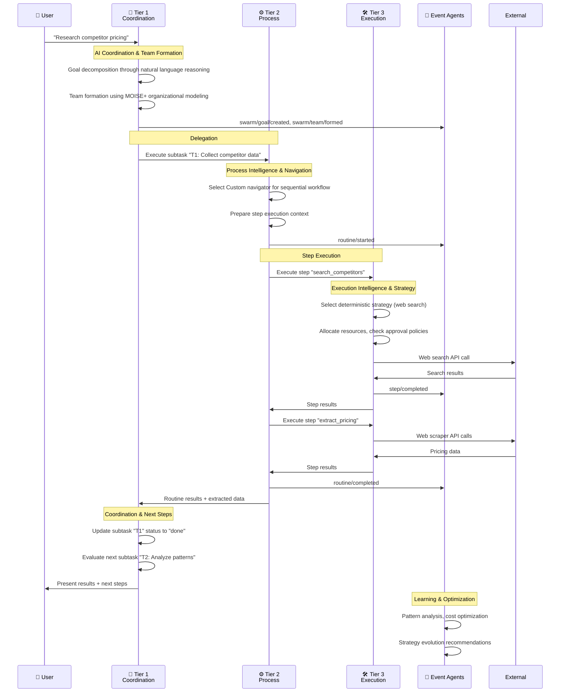

# 🚀 Execution Architecture Quick Start Guide

> **TL;DR**: Get hands-on with Vrooli's three-tier execution architecture in 15 minutes. This guide walks you through creating your first swarm, executing a simple routine, and understanding how the tiers work together.

> 📋 **Before You Start**: This guide assumes basic familiarity with Vrooli concepts. For background, see **[Core Technologies](core-technologies.md)** and **[Architecture Overview](_ARCHITECTURE_OVERVIEW.md)**.

---

## 🎯 What You'll Learn

In this quick start, you'll:
1. ✅ Create a simple swarm and see **Tier 1 coordination** in action
2. ✅ Execute a basic routine and observe **Tier 2 process intelligence**  
3. ✅ Watch individual steps run through **Tier 3 execution intelligence**
4. ✅ See event-driven coordination between tiers
5. ✅ Understand how strategy evolution works

**Time Required**: ~15 minutes  
**Complexity**: Beginner-friendly

---

## 🛠️ Setup: Your First Swarm

Let's start by creating a simple swarm that demonstrates all three tiers working together.

### **Step 1: Initialize a Swarm (Tier 1 in Action)**

```typescript
// This happens when you send a message to start a new conversation
const userMessage = "Help me research competitor pricing for our product";

// Tier 1 (SwarmStateMachine) immediately activates:
const swarmInitialization = {
    // 1. Sets default goal
    goal: "Follow the user's instructions.",
    
    // 2. Creates minimal configuration
    subtasks: [], // Will be populated through AI reasoning
    
    // 3. Assigns swarm leader
    swarmLeader: "general_coordination_bot_001",
    
    // 4. Sets up basic limits
    limits: {
        maxCredits: "10000",
        maxDurationMs: 1800000, // 30 minutes
        maxToolCallsPerBotResponse: 10
    }
};

console.log("✅ Tier 1: Swarm initialized with basic coordination structure");
```

### **Step 2: Goal Setting & Team Formation**

```typescript
// Tier 1 agent processes the user's request through natural language reasoning
const goalDecomposition = {
    // AI reasoning determines this needs specialized research capabilities
    updatedGoal: "Research competitor pricing strategies and provide analysis",
    
    // AI determines required team composition
    teamFormation: {
        requiredRoles: ["research_specialist", "data_analyst", "report_writer"],
        selectedAgents: [
            {
                botId: "research_bot_456",
                role: "research_specialist", 
                capabilities: ["web_search", "data_collection", "source_validation"]
            },
            {
                botId: "analyst_bot_789",
                role: "data_analyst",
                capabilities: ["data_processing", "trend_analysis", "visualization"]
            }
        ]
    },
    
    // AI creates initial task breakdown
    subtaskDecomposition: [
        {
            id: "T1",
            description: "Collect competitor pricing data from multiple sources",
            assignee_bot_id: "research_bot_456",
            status: "todo",
            priority: "high"
        },
        {
            id: "T2", 
            description: "Analyze pricing patterns and trends",
            assignee_bot_id: "analyst_bot_789",
            status: "todo",
            depends_on: ["T1"],
            priority: "medium"
        }
    ]
};

console.log("✅ Tier 1: Goal decomposed and team formed through AI coordination");
```

---

## ⚙️ Step 3: Routine Execution (Tier 2 in Action)

Now Tier 1 delegates the first subtask to Tier 2 for execution:

```typescript
// Tier 1 → Tier 2: Execute the research subtask
const routineRequest = {
    subtaskId: "T1",
    routineId: "competitor_research_v1", 
    
    // Tier 2 selects appropriate navigator based on routine complexity
    navigatorType: "custom", // Native Vrooli format for this simple workflow
    
    steps: [
        {
            stepId: "search_competitors",
            stepType: "process",
            name: "Find Competitor Websites",
            configuration: {
                tool: "web_search",
                query: "SaaS project management software pricing 2024"
            },
            inputMappings: { "query": "inputs.search_term" },
            outputMappings: { "competitor_list": "step_1_output" }
        },
        {
            stepId: "extract_pricing", 
            stepType: "process",
            name: "Extract Pricing Information",
            configuration: {
                tool: "web_scraper",
                extract_fields: ["pricing_tiers", "features", "pricing_model"]
            },
            inputMappings: { "websites": "step_1_output.competitor_list" },
            outputMappings: { "pricing_data": "final_output" }
        }
    ]
};

console.log("✅ Tier 2: Routine structure prepared using Native Vrooli navigator");
```

---

## 🛠️ Step 4: Step Execution (Tier 3 in Action)

Tier 2 sends each step to Tier 3 for execution:

```typescript
// Tier 2 → Tier 3: Execute the first step
const stepExecution = {
    stepId: "search_competitors",
    tool: "web_search",
    parameters: {
        query: "SaaS project management software pricing 2024",
        max_results: 10,
        include_snippets: true
    },
    
    // Tier 3 handles strategy selection
    strategySelection: {
        // For web search, Tier 3 chooses deterministic strategy (fastest, most reliable)
        selectedStrategy: "deterministic",
        reason: "Web search is well-defined with predictable API responses",
        
        // Alternative strategies considered
        alternatives: {
            conversational: "Not needed - search query is clear",
            reasoning: "Overkill for straightforward web search"
        }
    },
    
    // Tier 3 handles resource management
    resourceAllocation: {
        creditsRequired: 25,
        estimatedDuration: 15000, // 15 seconds
        requiresApproval: false, // Web search is pre-approved
    }
};

// Step execution result
const stepResult = {
    status: "completed",
    output: {
        competitor_list: [
            { name: "Asana", website: "asana.com", pricing_page: "asana.com/pricing" },
            { name: "Monday.com", website: "monday.com", pricing_page: "monday.com/pricing" },
            { name: "Notion", website: "notion.so", pricing_page: "notion.so/pricing" }
        ]
    },
    resourcesUsed: {
        credits: 22,
        durationMs: 12500
    }
};

console.log("✅ Tier 3: Step executed using deterministic strategy");
```

---

## 📡 Step 5: Event-Driven Coordination

Throughout this process, all tiers communicate through events:

```typescript
// Events flowing through the system during our example:

const eventFlow = [
    // User starts conversation → Tier 1 coordination
    {
        event: "swarm/goal/created",
        source: "Tier 1",
        payload: { goal: "Research competitor pricing", swarmId: "swarm_001" }
    },
    
    // Tier 1 forms team → Optimization agents learn
    {
        event: "swarm/team/formed", 
        source: "Tier 1",
        consumers: ["team_analytics_agent", "capability_tracking_agent"]
    },
    
    // Tier 2 starts routine → Performance monitoring begins
    {
        event: "routine/started",
        source: "Tier 2", 
        payload: { routineId: "competitor_research_v1", strategy: "reasoning" }
    },
    
    // Tier 3 executes step → Cost tracking, quality monitoring
    {
        event: "step/completed",
        source: "Tier 3",
        payload: { 
            stepId: "search_competitors", 
            creditsUsed: 22, 
            qualityScore: 0.89
        }
    },
    
    // Routine completes → Optimization agents analyze patterns
    {
        event: "routine/completed",
        source: "Tier 2",
        consumers: ["optimization_agent", "pattern_learning_agent"]
    }
];

console.log("✅ Event System: Cross-tier coordination through intelligent event processing");
```

---

## 🧠 Step 6: Understanding Strategy Evolution

Here's how your routine gets smarter over time:

```typescript
// First Execution: Conversational Strategy (Week 1)
const firstExecution = {
    strategy: "conversational",
    creditsUsed: 150,
    timeElapsed: 45000, // 45 seconds
    qualityScore: 0.82,
    variability: 0.25 // High variability
};

// Second Execution: Pattern Recognition (Week 2)  
const optimizationInsight = {
    pattern: "competitor_research_workflow",
    confidence: 0.65,
    recommendation: "Consider structured reasoning approach",
    potentialSavings: "40% cost reduction"
};

// Third Execution: Reasoning Strategy (Week 3)
const evolvedExecution = {
    strategy: "reasoning", 
    creditsUsed: 95,     // Reduced cost
    timeElapsed: 25000,  // Faster execution
    qualityScore: 0.87,  // Better quality
    variability: 0.12    // More consistent
};

// Later: Deterministic Strategy (Week 8)
const optimizedExecution = {
    strategy: "deterministic",
    creditsUsed: 35,     // Significant cost reduction
    timeElapsed: 12000,  // Much faster
    qualityScore: 0.92,  // Higher quality
    variability: 0.03    // Very consistent
};

console.log("✅ Strategy Evolution: Routine automatically optimized through usage patterns");
```

---

## 🎭 Step 7: See the Complete Flow

Here's what just happened across all three tiers:



---

## 🎯 Key Takeaways

After completing this quick start, you should understand:

### **🧠 Tier 1: Coordination Intelligence**
- ✅ Uses natural language reasoning for goal decomposition
- ✅ Forms teams dynamically based on required capabilities  
- ✅ Coordinates multiple routines to achieve complex goals
- ✅ Updates swarm state through intelligent event generation

### **⚙️ Tier 2: Process Intelligence**
- ✅ Selects appropriate navigator (Custom, BPMN, etc.) based on workflow complexity
- ✅ Manages routine execution context and step dependencies
- ✅ Handles data flow between steps and error recovery
- ✅ Coordinates with Tier 1 through event-driven state updates

### **🛠️ Tier 3: Execution Intelligence**
- ✅ Chooses optimal execution strategy (conversational → reasoning → deterministic)
- ✅ Manages resource allocation, approval workflows, and safety enforcement
- ✅ Handles tool integration and external API coordination
- ✅ Learns from execution patterns to improve future performance

### **📡 Event-Driven Coordination**
- ✅ Specialized agents provide capabilities through intelligent event processing
- ✅ Cross-tier coordination happens asynchronously through event flows
- ✅ Learning and optimization happen automatically through pattern analysis
- ✅ System becomes more intelligent through compound knowledge effects

---

## 🚀 Next Steps

Now that you understand the basics, explore these areas:

1. **📚 [Concrete Implementation Examples](implementation/concrete-examples.md)** - More complex scenarios
2. **🔄 [Strategy Evolution Agents](emergent-capabilities/agent-examples/strategy-evolution-agents.md)** - How routines improve over time
3. **📡 [Event Catalog](event-driven/event-catalog.md)** - Complete event specifications
4. **🛠️ [Implementation Guide](implementation/implementation-guide.md)** - Build your own three-tier system
5. **🐝 [Swarm Execution Integration](swarm-execution-integration.md)** - Deep dive into swarm configuration

**Ready to build?** The [Implementation Guide](implementation/implementation-guide.md) provides step-by-step instructions for creating your own three-tier execution system.

---

> 💡 **Pro Tip**: The three-tier architecture is designed to be intuitive - Tier 1 thinks strategically like a team leader, Tier 2 manages workflows like a project manager, and Tier 3 executes tasks like a skilled specialist. The magic happens when they work together through intelligent event coordination! 