# Resilience and Error Handling Architecture

## Overview

Vrooli's resilience architecture provides comprehensive fault tolerance and error handling specifically designed for AI-driven execution environments. The system handles both traditional system failures and AI-specific challenges like model unavailability, quality degradation, and context overflow.

## Fault Tolerance Framework

The resilience framework coordinates multiple layers of failure detection, recovery, and adaptation:

```mermaid
graph TB
    subgraph "Resilience Framework"
        ResilienceOrchestrator[Resilience Orchestrator<br/>🛡️ Central resilience coordination<br/>🔄 Recovery orchestration<br/>📊 Health monitoring]
        
        subgraph "Failure Detection"
            AnomalyDetector[Anomaly Detector<br/>📊 Pattern-based detection<br/>🚨 Real-time monitoring<br/>⚡ Early warning system]
            HealthProbe[Health Probe<br/>💓 Component health checks<br/>🔍 Dependency monitoring<br/>📊 Performance tracking]
            CircuitBreaker[Circuit Breaker<br/>⚡ Failure isolation<br/>🔄 Auto-recovery<br/>📊 Fallback strategies]
        end
        
        subgraph "AI-Specific Recovery"
            ModelFallback[Model Fallback<br/>🔄 Alternative models<br/>📊 Quality degradation<br/>⚡ Seamless switching]
            ContextRecovery[Context Recovery<br/>📋 State reconstruction<br/>🔄 Checkpoint restoration<br/>💾 Data consistency]
            StrategyAdaptation[Strategy Adaptation<br/>🧠 Dynamic strategy switching<br/>📊 Performance monitoring<br/>🎯 Optimization]
        end
        
        subgraph "System Recovery"
            StateRecovery[State Recovery<br/>🔄 Checkpoint restoration<br/>📊 Transaction rollback<br/>💾 Data consistency]
            ServiceRecovery[ServiceRecovery<br/>🔄 Service restart<br/>📊 Load redistribution<br/>⚖️ Capacity management]
            DataRecovery[DataRecovery<br/>💾 Backup restoration<br/>🔄 Replication sync<br/>📊 Integrity verification]
        end
        
        subgraph "Event-Driven Failure Detection/Adaptation"
            FailureEvents[Failure Events<br/>🚨 Error reports<br/>📉 Degradation signals<br/>💔 Anomaly detection]
            ResilienceAgents[Resilience Agents<br/>🤖 Subscribe to events<br/>🔍 Analyze failures<br/>💡 Adapt & recover]
        end
    end
    
    ResilienceOrchestrator --> AnomalyDetector
    ResilienceOrchestrator --> HealthProbe
    ResilienceOrchestrator --> CircuitBreaker
    ResilienceOrchestrator --> ModelFallback
    ResilienceOrchestrator --> ContextRecovery
    ResilienceOrchestrator --> StrategyAdaptation
    ResilienceOrchestrator --> StateRecovery
    ResilienceOrchestrator --> DataRecovery
    ResilienceOrchestrator --> FailureEvents
    ResilienceOrchestrator --> ResilienceAgents
    
    classDef orchestrator fill:#e3f2fd,stroke:#1565c0,stroke-width:3px
    classDef detection fill:#ffebee,stroke:#c62828,stroke-width:2px
    classDef aiRecovery fill:#f3e5f5,stroke:#7b1fa2,stroke-width:2px
    classDef systemRecovery fill:#e8f5e8,stroke:#2e7d32,stroke-width:2px
    classDef learning fill:#fff3e0,stroke:#f57c00,stroke-width:2px
    
    class ResilienceOrchestrator orchestrator
    class AnomalyDetector,HealthProbe,CircuitBreaker detection
    class ModelFallback,ContextRecovery,StrategyAdaptation aiRecovery
    class StateRecovery,ServiceRecovery,DataRecovery systemRecovery
    class FailureEvents,ResilienceAgents learning
```



## AI-Specific Error Classification

AI systems face unique challenges that traditional error handling doesn't address. Our classification system identifies and handles these specialized error types:

```mermaid
graph TB
    subgraph "AI Error Classification"
        subgraph "Model Errors"
            ModelUnavailable[Model Unavailable<br/>🚫 Service down<br/>⚡ Network issues<br/>💰 Rate limits]
            QualityDegradation[Quality Degradation<br/>📉 Poor outputs<br/>🎯 Accuracy loss<br/>🔍 Inconsistency]
            ContextOverflow[Context Overflow<br/>📋 Token limits<br/>💾 Memory constraints<br/>⚡ Processing limits]
        end
        
        subgraph "Execution Errors"
            RoutineFailure[Routine Failure<br/>🔧 Logic errors<br/>📊 Data issues<br/>🔄 State corruption]
            ResourceExhaustion[Resource Exhaustion<br/>💰 Credit depletion<br/>⏱️ Timeout<br/>📊 Capacity limits]
            DependencyFailure[Dependency Failure<br/>🔗 API failures<br/>🌐 Network issues<br/>🔧 Service outages]
        end
        
        subgraph "Coordination Errors"
            SwarmDisconnection[Swarm Disconnection<br/>📡 Communication loss<br/>👥 Agent unavailability<br/>🔄 Synchronization failure]
            ConsensusFailure[Consensus Failure<br/>🤝 Agreement issues<br/>⚖️ Conflict resolution<br/>🔄 Deadlock scenarios]
            StateInconsistency[State Inconsistency<br/>💾 Data corruption<br/>🔄 Sync failures<br/>📊 Version conflicts]
        end
    end
    
    classDef modelErrors fill:#ffebee,stroke:#c62828,stroke-width:2px
    classDef executionErrors fill:#fff3e0,stroke:#f57c00,stroke-width:2px
    classDef coordinationErrors fill:#e3f2fd,stroke:#1565c0,stroke-width:2px
    
    class ModelUnavailable,QualityDegradation,ContextOverflow modelErrors
    class RoutineFailure,ResourceExhaustion,DependencyFailure executionErrors
    class SwarmDisconnection,ConsensusFailure,StateInconsistency coordinationErrors
```



## Recovery Strategy Framework

The recovery system implements different strategies based on error type and system state:

```typescript
interface ErrorHandlingFramework {
    // Model Error Recovery
    handleModelUnavailable(context: RunContext): RecoveryStrategy;
    handleQualityDegradation(qualityMetrics: QualityMetrics): QualityRecovery;
    handleContextOverflow(context: RunContext): ContextStrategy;
    
    // Execution Error Recovery
    handleRoutineFailure(failure: RoutineFailure): RetryStrategy;
    handleResourceExhaustion(usage: ResourceUsage): ResourceStrategy;
    handleDependencyFailure(dependency: Dependency): FallbackStrategy;
    
    // Coordination Error Recovery
    handleSwarmDisconnection(swarmId: string): ReconnectionStrategy;
    handleConsensusFailure(participants: Agent[]): ConsensusStrategy;
    handleStateInconsistency(state: SystemState): ConsistencyStrategy;
}

// Recovery Strategy Implementations
interface RecoveryStrategy {
    readonly strategyType: RecoveryType;
    readonly maxRetries: number;
    readonly backoffStrategy: BackoffStrategy;
    readonly fallbackOptions: FallbackOption[];
    
    execute(context: RecoveryContext): Promise<RecoveryResult>;
    shouldRetry(attempt: number, error: Error): boolean;
    selectFallback(availableOptions: FallbackOption[]): FallbackOption;
}

// Specific Recovery Strategies
interface ModelFallbackStrategy extends RecoveryStrategy {
    readonly fallbackModels: ModelConfiguration[];
    readonly qualityThresholds: QualityThreshold[];
    readonly costConstraints: CostConstraint[];
    
    selectOptimalFallback(context: RunContext): ModelConfiguration;
    assessQualityTrade-offs(model: ModelConfiguration): QualityAssessment;
}

interface ContextCompressionStrategy extends RecoveryStrategy {
    readonly compressionTechniques: CompressionTechnique[];
    readonly summarizationMethods: SummarizationMethod[];
    readonly prioritizationRules: PrioritizationRule[];
    
    compressContext(context: RunContext): CompressedContext;
    maintainCriticalInformation(context: RunContext): CriticalContext;
    reconstructContext(compressed: CompressedContext): RunContext;
}
```

## Graceful Degradation Architecture

When full functionality cannot be maintained, the system degrades gracefully across defined quality levels:

```mermaid
graph TB
    subgraph "Degradation Framework"
        DegradationController[Degradation Controller<br/>📉 Quality management<br/>⚖️ Trade-off optimization<br/>🎯 Service continuity]
        
        subgraph "Quality Levels"
            HighQuality[High Quality<br/>🎯 Full capabilities<br/>💰 High cost<br/>⚡ Optimal performance]
            MediumQuality[Medium Quality<br/>⚖️ Balanced trade-offs<br/>💰 Moderate cost<br/>📊 Good performance]
            BasicQuality[Basic Quality<br/>⚡ Essential features<br/>💰 Low cost<br/>🔄 Fallback mode]
            EmergencyMode[Emergency Mode<br/>🚨 Critical only<br/>💰 Minimal cost<br/>🛡️ Safety first]
        end
        
        subgraph "Adaptation Mechanisms"
            QualityMonitor[Quality Monitor<br/>📊 Real-time assessment<br/>🎯 Threshold monitoring<br/>📈 Trend analysis]
            TradeoffOptimizer[Trade-off Optimizer<br/>⚖️ Cost-quality balance<br/>🎯 User preferences<br/>📊 Performance metrics]
            ServiceSelector[Service Selector<br/>🎯 Capability matching<br/>📊 Performance prediction<br/>⚡ Dynamic switching]
        end
    end
    
    DegradationController --> HighQuality
    DegradationController --> MediumQuality
    DegradationController --> BasicQuality
    DegradationController --> EmergencyMode
    
    DegradationController --> QualityMonitor
    DegradationController --> TradeoffOptimizer
    DegradationController --> ServiceSelector
    
    HighQuality -.->|"Degrades to"| MediumQuality
    MediumQuality -.->|"Degrades to"| BasicQuality
    BasicQuality -.->|"Degrades to"| EmergencyMode
    
    EmergencyMode -.->|"Recovers to"| BasicQuality
    BasicQuality -.->|"Recovers to"| MediumQuality
    MediumQuality -.->|"Recovers to"| HighQuality
    
    classDef controller fill:#e3f2fd,stroke:#1565c0,stroke-width:3px
    classDef highQuality fill:#c8e6c9,stroke:#388e3c,stroke-width:2px
    classDef mediumQuality fill:#fff3e0,stroke:#f57c00,stroke-width:2px
    classDef basicQuality fill:#ffccbc,stroke:#f4511e,stroke-width:2px
    classDef emergency fill:#ffebee,stroke:#c62828,stroke-width:2px
    classDef adaptation fill:#f3e5f5,stroke:#7b1fa2,stroke-width:2px
    
    class DegradationController controller
    class HighQuality highQuality
    class MediumQuality mediumQuality
    class BasicQuality basicQuality
    class EmergencyMode emergency
    class QualityMonitor,TradeoffOptimizer,ServiceSelector adaptation
```



### Quality Level Definitions

| Quality Level | Capabilities | Performance | Cost | Use Case |
|---------------|-------------|-------------|------|----------|
| **High Quality** | Full AI capabilities, complex reasoning, multi-modal | Optimal response time, highest accuracy | Premium pricing | Production workloads, critical tasks |
| **Medium Quality** | Core AI features, balanced performance | Good response time, high accuracy | Standard pricing | Regular operations, most workflows |
| **Basic Quality** | Essential features only, simplified responses | Acceptable latency, adequate accuracy | Reduced pricing | Non-critical tasks, backup mode |
| **Emergency Mode** | Safety-critical functions only | Variable performance, basic validation | Minimal cost | System failures, emergency situations |

### Degradation Triggers and Recovery

```typescript
interface DegradationController {
    // Monitor system health and trigger degradation
    monitorSystemHealth(): SystemHealthMetrics;
    
    // Determine appropriate quality level
    selectQualityLevel(
        metrics: SystemHealthMetrics,
        constraints: ResourceConstraints,
        userPreferences: QualityPreferences
    ): QualityLevel;
    
    // Execute quality level transition
    transitionToQualityLevel(
        currentLevel: QualityLevel,
        targetLevel: QualityLevel
    ): Promise<TransitionResult>;
    
    // Recovery coordination
    attemptRecovery(
        fromLevel: QualityLevel,
        targetLevel: QualityLevel
    ): Promise<RecoveryResult>;
}

// Degradation triggers
enum DegradationTrigger {
    MODEL_UNAVAILABLE = "model_unavailable",
    RATE_LIMIT_EXCEEDED = "rate_limit_exceeded",
    COST_BUDGET_EXCEEDED = "cost_budget_exceeded",
    PERFORMANCE_DEGRADED = "performance_degraded",
    DEPENDENCY_FAILURE = "dependency_failure",
    RESOURCE_EXHAUSTION = "resource_exhaustion"
}
```

## Failure Detection and Monitoring

### Health Monitoring System

```typescript
interface HealthMonitoringSystem {
    // Component health checks
    checkServiceHealth(serviceId: string): Promise<HealthStatus>;
    checkModelAvailability(modelId: string): Promise<AvailabilityStatus>;
    checkResourceUsage(): ResourceUsageMetrics;
    
    // Performance monitoring
    trackResponseTimes(serviceId: string): PerformanceMetrics;
    trackQualityMetrics(outputs: AIOutput[]): QualityMetrics;
    trackErrorRates(): ErrorRateMetrics;
    
    // Anomaly detection
    detectAnomalies(metrics: SystemMetrics): AnomalyReport[];
    predictFailures(historicalData: HistoricalMetrics): FailurePrediction[];
}

interface HealthStatus {
    serviceId: string;
    status: 'healthy' | 'degraded' | 'failed';
    lastChecked: Date;
    responseTime: number;
    errorRate: number;
    availabilityPercent: number;
}
```

### Circuit Breaker Implementation

Circuit breakers prevent cascading failures by isolating failed services:

```typescript
interface CircuitBreakerConfig {
    failureThreshold: number;        // Failures before opening
    recoveryTimeout: number;         // Time before attempting recovery
    monitoringWindow: number;        // Window for failure counting
    successThreshold: number;        // Successes needed to close
}

class AIServiceCircuitBreaker {
    private state: 'closed' | 'open' | 'half-open' = 'closed';
    private failureCount: number = 0;
    private lastFailureTime: Date | null = null;
    
    async execute<T>(operation: () => Promise<T>): Promise<T> {
        if (this.state === 'open') {
            if (this.shouldAttemptRecovery()) {
                this.state = 'half-open';
            } else {
                throw new CircuitBreakerOpenError();
            }
        }
        
        try {
            const result = await operation();
            this.onSuccess();
            return result;
        } catch (error) {
            this.onFailure();
            throw error;
        }
    }
    
    private onSuccess(): void {
        this.failureCount = 0;
        this.state = 'closed';
    }
    
    private onFailure(): void {
        this.failureCount++;
        this.lastFailureTime = new Date();
        
        if (this.failureCount >= this.config.failureThreshold) {
            this.state = 'open';
        }
    }
}
```

## Event-Driven Resilience

The system uses event-driven architecture to enable adaptive resilience through specialized agents:


### Resilience Event Types

```typescript
interface ResilienceEvent {
    eventType: ResilienceEventType;
    timestamp: Date;
    source: string;
    severity: 'low' | 'medium' | 'high' | 'critical';
    context: EventContext;
    metadata: Record<string, unknown>;
}

enum ResilienceEventType {
    // Failure events
    'failure/model_unavailable',
    'failure/context_overflow', 
    'failure/quality_degradation',
    'failure/resource_exhaustion',
    
    // Recovery events
    'recovery/strategy_applied',
    'recovery/fallback_activated',
    'recovery/service_restored',
    
    // Adaptation events
    'adaptation/strategy_updated',
    'adaptation/threshold_adjusted',
    'adaptation/pattern_learned'
}
```

## Recovery Coordination

### Multi-Tier Recovery

Recovery strategies coordinate across all three execution tiers:


## Performance and Reliability Metrics

### Key Resilience Metrics

| Metric Category | Specific Metrics | Target Values | Monitoring Frequency |
|-----------------|------------------|---------------|---------------------|
| **Availability** | Service uptime, Model availability | >99.9% | Real-time |
| **Recovery** | Mean time to recovery (MTTR) | <30 seconds | Per incident |
| **Quality** | Output quality scores, Consistency | >85% quality score | Per response |
| **Resilience** | Failure detection time, Recovery success rate | <5s detection, >95% success | Continuous |

### Resilience Dashboard

```typescript
interface ResilienceDashboard {
    // Real-time system health
    systemHealth: SystemHealthOverview;
    
    // Active incidents and recovery
    activeIncidents: IncidentStatus[];
    recoveryProgress: RecoveryProgress[];
    
    // Performance metrics
    performanceMetrics: {
        mttr: number;              // Mean Time To Recovery
        mtbf: number;              // Mean Time Between Failures
        errorRate: number;         // Overall error rate
        recoveryRate: number;      // Successful recovery percentage
    };
    
    // Quality trends
    qualityTrends: QualityTrendData[];
    degradationEvents: DegradationEvent[];
}
```

## Related Documentation

- **[Error Classification and Severity](error-classification-severity.md)** - Detailed error classification system
- **[Recovery Strategy Selection](recovery-strategy-selection.md)** - Strategy selection algorithms
- **[Circuit Breakers](circuit-breakers.md)** - Circuit breaker implementation details
- **[Error Propagation](error-propagation.md)** - Error handling across system boundaries
- **[Failure Scenarios](failure-scenarios/README.md)** - Common failure patterns and responses
- **[Main Execution Architecture](../README.md)** - Complete three-tier execution architecture
- **[AI Services](../ai-services/README.md)** - AI service availability and fallback
- **[Monitoring](../monitoring/README.md)** - System monitoring and observability
- **[Security](../security/README.md)** - Security-related failure handling 