# 🛡️ Resilience Architecture: Intelligent Fault Tolerance

> **TL;DR**: Vrooli's resilience architecture provides systematic error handling through classification, recovery strategy selection, and AI-driven adaptation. This creates self-improving fault tolerance that learns from failures and continuously improves recovery patterns.

---

## 🎯 Quick Navigation

### **🚨 Need Immediate Help?**
- **System is broken right now** → **[Troubleshooting Guide](troubleshooting-guide.md)** - Quick diagnostic checklist and immediate solutions

### **🏗️ Building Resilient Systems?**
- **Understanding the framework** → **[Error Classification](error-classification-severity.md)** + **[Recovery Strategy Selection](recovery-strategy-selection.md)**
- **Writing resilient code** → **[Implementation Guide](resilience-implementation-guide.md)** - Practical patterns and examples
- **Setting up protection** → **[Circuit Breakers](circuit-breakers.md)** - Preventing cascading failures

### **🔍 Deep Debugging & Analysis?**
- **Comprehensive error examples** → **[Error Scenarios & Patterns](error-scenarios-guide.md)** - Detailed code examples organized by tier
- **Infrastructure-specific failures** → **[Failure Scenarios](failure-scenarios/README.md)** - Communication failures, component outages, system-level issues
- **Understanding error flow** → **[Error Propagation](error-propagation.md)** - Cross-tier coordination patterns

---

## 🏗️ Architecture Philosophy

Vrooli's resilience differs from traditional approaches through **emergent intelligence**:

```mermaid
graph TB
    subgraph "🔍 Detection & Classification"
        ErrorDetection[Real-time Error Detection<br/>📊 Pattern recognition<br/>⚡ Early warning systems]
        Classification[Systematic Classification<br/>📋 Severity assessment<br/>🎯 Recovery guidance]
    end
    
    subgraph "🧠 Intelligent Recovery"
        ResilienceAgents[AI Resilience Agents<br/>🤖 Pattern learning<br/>💡 Strategy adaptation<br/>📈 Continuous improvement]
        RecoveryExecution[Strategy Execution<br/>🔄 Automated recovery<br/>⚡ Escalation handling<br/>📊 Success validation]
    end
    
    subgraph "🔄 Adaptive Learning"
        PatternAnalysis[Pattern Analysis<br/>📊 Success/failure tracking<br/>🎯 Strategy optimization<br/>🔄 Threshold adaptation]
        StrategyEvolution[Strategy Evolution<br/>🌱 New patterns discovered<br/>📈 Performance improvement<br/>🤖 Agent specialization]
    end
    
    ErrorDetection --> Classification
    Classification --> ResilienceAgents
    ResilienceAgents --> RecoveryExecution
    RecoveryExecution --> PatternAnalysis
    PatternAnalysis --> StrategyEvolution
    StrategyEvolution -.->|"Improves"| ResilienceAgents
    
    classDef detection fill:#ffebee,stroke:#c62828,stroke-width:2px
    classDef intelligence fill:#e3f2fd,stroke:#1565c0,stroke-width:2px
    classDef learning fill:#e8f5e8,stroke:#2e7d32,stroke-width:2px
    
    class ErrorDetection,Classification detection
    class ResilienceAgents,RecoveryExecution intelligence
    class PatternAnalysis,StrategyEvolution learning
```

**Key Insight**: Instead of hard-coded recovery logic, specialized AI agents learn from failure patterns and continuously improve recovery strategies based on your team's specific failure modes and success patterns.

---

## 🔄 The Resilience Process

Every error follows this systematic approach:

---

## 📚 Documentation Guide

### **Foundation Documents (Read These First)**
| Document | Purpose | When to Use |
|----------|---------|-------------|
| **[Error Classification](error-classification-severity.md)** | Learn systematic error severity assessment | Setting up error handling, troubleshooting unclear error severities |
| **[Recovery Strategy Selection](recovery-strategy-selection.md)** | Understand strategy selection algorithm | Implementing recovery logic, customizing recovery behavior |

### **Implementation & Protection**
| Document | Purpose | When to Use |
|----------|---------|-------------|
| **[Implementation Guide](resilience-implementation-guide.md)** | Build resilient components with practical code patterns | Writing new code, adding error handling to existing components |
| **[Circuit Breakers](circuit-breakers.md)** | Prevent cascading failures through service protection | Protecting external dependencies, handling service degradation |
| **[Error Propagation](error-propagation.md)** | Coordinate cross-tier error handling | Understanding system-wide error flows, debugging complex failures |

### **Troubleshooting & Diagnosis**
| Document | Purpose | When to Use |
|----------|---------|-------------|
| **[Troubleshooting Guide](troubleshooting-guide.md)** | **🚨 START HERE** - Quick diagnostic checklist and immediate solutions | **First response to any system issue** |
| **[Error Scenarios & Patterns](error-scenarios-guide.md)** | Comprehensive code examples organized by execution tier | Deep debugging, understanding complex error patterns and implementations |
| **[Failure Scenarios](failure-scenarios/README.md)** | Infrastructure-specific failure analysis and recovery procedures | Communication outages, service failures, infrastructure problems |

> 💡 **Quick Decision**: **System broken?** → Troubleshooting Guide. **Need code examples?** → Error Scenarios & Patterns. **Infrastructure issue?** → Failure Scenarios. **Building something?** → Implementation Guide.

---

## 🤖 AI-Driven Resilience

**What makes Vrooli unique**: Resilience capabilities emerge from intelligent agents rather than static rules:

### **Resilience Agents**
- **Pattern Learning**: Analyze failure histories to identify recurring issues
- **Strategy Adaptation**: Modify recovery strategies based on success rates
- **Proactive Improvement**: Suggest system improvements before failures occur
- **Domain Specialization**: Develop expertise in specific failure domains

### **Emergent Capabilities**
- **Self-Tuning Thresholds**: Circuit breaker thresholds adapt based on service behavior
- **Context-Aware Recovery**: Recovery strategies consider system state and load
- **Predictive Failure Prevention**: Early warning systems based on pattern recognition
- **Quality-Performance Tradeoffs**: Intelligent degradation strategies

> 📖 **Learn More**: See [Emergent Capabilities](../emergent-capabilities/README.md) for how resilience agents provide adaptive, learning-based error handling.

---

## 🎯 Common Scenarios

### **🚨 "Something is broken and I need to fix it RIGHT NOW"**
→ **[Troubleshooting Guide](troubleshooting-guide.md)** - Start here for immediate diagnostic checklist and quick fixes

### **🏗️ "I'm building a new component and want to make it resilient"**  
→ **[Implementation Guide](resilience-implementation-guide.md)** - Practical code patterns and examples for robust components

### **🔍 "I'm seeing a complex error pattern and need to understand what's happening"**  
→ **[Error Scenarios & Patterns](error-scenarios-guide.md)** - Comprehensive examples with detailed TypeScript implementations

### **📡 "External service/communication is unreliable or failing"**
→ **[Circuit Breakers](circuit-breakers.md)** for protection + **[Failure Scenarios](failure-scenarios/README.md)** for specific recovery procedures

### **🌊 "System-wide failure is cascading across tiers"**
→ **[Error Propagation](error-propagation.md)** for coordination patterns + **[Troubleshooting Guide](troubleshooting-guide.md)** for immediate action

### **🤖 "I want AI-driven resilience that learns and improves"**
→ Deploy **[Resilience Agents](../emergent-capabilities/README.md)** for adaptive, learning-based error handling

### **📋 "I need to understand the systematic approach to error handling"**
→ **[Error Classification](error-classification-severity.md)** + **[Recovery Strategy Selection](recovery-strategy-selection.md)** for the foundational framework

---

## 🔗 Integration Points

The resilience architecture integrates seamlessly with other system components:

| System | Integration | Benefits |
|--------|------------|----------|
| **[Communication](../communication/README.md)** | Error handling in all communication patterns | Robust inter-tier coordination |
| **[Resource Management](../resource-management/README.md)** | Resource-aware recovery strategies | Efficient resource utilization during failures |
| **[Security](../security/README.md)** | Security-aware error recovery | Secure failure handling without privilege escalation |
| **[Event-Driven](../event-driven/README.md)** | Event-based resilience coordination | Real-time failure detection and coordination |

---

## 🚀 Key Benefits

### **🧠 Intelligent Learning**
- Failure patterns are automatically analyzed and learned
- Recovery strategies evolve based on success rates
- Threshold tuning happens automatically based on service behavior

### **⚡ Rapid Recovery**  
- Systematic classification enables faster recovery decisions
- Circuit breakers prevent cascading failures
- Multi-tier coordination ensures appropriate escalation

### **🔄 Continuous Improvement**
- Recovery strategies improve over time
- New failure patterns are automatically detected
- Teams can deploy domain-specific resilience expertise

### **📊 Comprehensive Coverage**
- Handles traditional system failures and AI-specific challenges
- Covers all communication patterns and system components
- Scales from component-level to system-wide resilience

---

## 🌟 Why Vrooli's Resilience is Different

Traditional error handling uses static rules and manual updates. **Vrooli's resilience is living intelligence** that:

- **🧠 Learns** from every failure to improve future recovery
- **🔄 Adapts** strategies based on your team's specific patterns  
- **🤖 Evolves** through specialized AI agents, not hard-coded logic
- **🎯 Optimizes** for your domain's unique challenges and requirements

**Result**: A resilience system that becomes more intelligent and effective over time, turning failures into learning opportunities and competitive advantages.

---

## 🚀 Next Steps

### **👤 For New Users**
1. Start with **[Troubleshooting Guide](troubleshooting-guide.md)** for immediate needs
2. Read **[Error Classification](error-classification-severity.md)** to understand the framework
3. Follow **[Implementation Guide](resilience-implementation-guide.md)** for practical patterns

### **🔧 For Developers** 
1. Study **[Error Scenarios & Patterns](error-scenarios-guide.md)** for code examples
2. Implement **[Circuit Breakers](circuit-breakers.md)** for service protection  
3. Deploy **[Resilience Agents](../emergent-capabilities/README.md)** for adaptive behavior

### **⚙️ For Operators**
1. Use **[Failure Scenarios](failure-scenarios/README.md)** for infrastructure issues
2. Understand **[Error Propagation](error-propagation.md)** for system coordination
3. Set up monitoring based on **[Integration Points](#-integration-points)** below

---

> 💡 **Remember**: Resilience in Vrooli isn't just about handling errors—it's about building intelligence that learns from failures and continuously improves your system's reliability and performance.

---

## 📍 Document Navigation Flowchart

Use this flowchart to quickly find the right resilience documentation for your needs:

```mermaid
flowchart TD
    Start([🚨 I need resilience help]) --> Immediate{System broken<br/>RIGHT NOW?}
    
    Immediate -->|Yes| Troubleshoot[📋 Troubleshooting Guide<br/>Quick diagnostic checklist<br/>Immediate solutions]
    
    Immediate -->|No| Purpose{What do you need?}
    
    Purpose -->|Understanding concepts| Framework[📚 Framework Documents<br/>• Error Classification<br/>• Recovery Strategy Selection]
    
    Purpose -->|Building/coding| Implementation[🔨 Implementation Guide<br/>Practical code patterns<br/>Resilient component design]
    
    Purpose -->|Analyzing complex errors| Analysis{What type of analysis?}
    
    Purpose -->|Setting up protection| Protection[🛡️ Circuit Breakers<br/>Service protection<br/>Cascading failure prevention]
    
    Analysis -->|Code-level debugging| CodeExamples[💻 Error Scenarios & Patterns<br/>Tier-by-tier code examples<br/>TypeScript implementations]
    
    Analysis -->|Infrastructure issues| Infrastructure[🏗️ Failure Scenarios<br/>Communication failures<br/>Component outages<br/>System-level recovery]
    
    Analysis -->|Cross-tier coordination| Flow[🌊 Error Propagation<br/>Cross-tier error flow<br/>Coordination patterns]
    
    classDef urgent fill:#ffebee,stroke:#c62828,stroke-width:2px
    classDef framework fill:#e3f2fd,stroke:#1565c0,stroke-width:2px
    classDef practical fill:#e8f5e8,stroke:#2e7d32,stroke-width:2px
    classDef analysis fill:#fff3e0,stroke:#f57c00,stroke-width:2px
    
    class Troubleshoot urgent
    class Framework,Flow framework
    class Implementation,Protection,CodeExamples practical
    class Infrastructure analysis
```

--- 