# 🛡️ Resilience Architecture: Intelligent Fault Tolerance

> **TL;DR**: Vrooli's resilience architecture provides systematic error handling through classification, recovery strategy selection, and AI-driven adaptation. This creates self-improving fault tolerance that learns from failures and continuously improves recovery patterns.

---

## 🔄 Quick Navigation

> 📚 **Which document to use?** → **[Document Guide](document-guide.md)** - Complete navigation for all resilience documentation

### **🚨 Crisis Response (Immediate Issues)**
- **[Troubleshooting Guide](troubleshooting-guide.md)** - Step-by-step diagnostics with immediate fixes

### **⚡ Developer Tools**
- **[Quick Reference](quick-reference.md)** - Fast lookup patterns and code templates  
- **[Implementation Guide](resilience-implementation-guide.md)** - Complete implementation patterns

### **📚 Framework & Understanding**
- **[Error Classification](error-classification-severity.md)** - Systematic error categorization
- **[Recovery Strategy Selection](recovery-strategy-selection.md)** - Algorithm for choosing recovery approaches
- **[Error Scenarios Guide](error-scenarios-guide.md)** - Detailed debugging examples

---

## 🔄 The Systematic Resilience Process

Every error in Vrooli follows this four-step systematic approach:

```mermaid
graph LR
    subgraph "🔍 Step 1: Detection & Classification"
        S1[Error Occurs<br/>📊 Systematic detection<br/>📋 Apply classification tree<br/>🎯 Determine severity & type]
    end
    
    subgraph "🧠 Step 2: Strategy Selection"  
        S2[Choose Recovery<br/>⚙️ Apply selection algorithm<br/>📊 Consider context & resources<br/>🎯 Select optimal strategy]
    end
    
    subgraph "⚡ Step 3: Recovery Execution"
        S3[Execute Strategy<br/>🔄 Implement chosen approach<br/>📊 Monitor progress<br/>⚖️ Escalate if needed]
    end
    
    subgraph "🤖 Step 4: Learning & Adaptation"
        S4[Pattern Learning<br/>📈 AI agents analyze results<br/>💡 Improve strategies<br/>🔄 Update thresholds]
    end
    
    S1 --> S2 --> S3 --> S4
    S4 -.->|"Improves future"| S1
    
    classDef step fill:#e3f2fd,stroke:#1565c0,stroke-width:2px
    class S1,S2,S3,S4 step
```



**Key Insight**: This systematic approach ensures consistent, intelligent error handling that improves over time through AI-driven pattern learning.

---

## 🤖 AI-Driven Resilience Integration

**What makes Vrooli unique**: Resilience capabilities emerge from intelligent agents rather than static rules.

### **Deployment Pattern**
```typescript
// Deploy resilience agents like any specialized agent
const resilienceAgent = {
  name: "Performance Recovery Specialist",
  subscriptions: ["step/failed", "tool/timeout", "routine/completed"],
  onEvent: async (event) => {
    const pattern = await analyzePattern(event.payload);
    if (pattern.shouldOptimize) {
      await proposeOptimization(pattern);
    }
  }
};

await deployAgent(resilienceAgent, { 
  permissions: ["modify_timeouts", "suggest_alternatives"] 
});
```

### **Agent Types**
- **Performance Recovery**: Timeout tuning, tool substitution, caching strategies
- **Resource Optimization**: Credit reallocation, scope reduction, usage optimization  
- **Pattern Learning**: Failure prediction, proactive fixes, threshold adaptation
- **Domain-Specific**: Industry-specific resilience (finance, healthcare, etc.)

> 📖 **Complete agent examples**: See [Optimization Agents](../emergent-capabilities/routine-examples/optimization-agents.md)

---

## 🚀 Why Vrooli's Resilience is Different

Traditional error handling uses static rules and manual updates. **Vrooli's resilience is living intelligence** that:

- **🧠 Learns** from every failure to improve future recovery
- **🔄 Adapts** strategies based on your team's specific patterns  
- **🤖 Evolves** through specialized AI agents, not hard-coded logic
- **🎯 Optimizes** for your domain's unique challenges and requirements

**Result**: A resilience system that becomes more intelligent and effective over time, turning failures into learning opportunities and competitive advantages.

---

## 🚀 Getting Started

### **👤 New Users**
1. **[Document Guide](document-guide.md)** - Understand the documentation structure
2. **[Error Classification](error-classification-severity.md)** - Learn the framework

### **🔧 Developers** 
1. **[Quick Reference](quick-reference.md)** - Fast patterns and code lookup
2. **[Implementation Guide](resilience-implementation-guide.md)** - Build resilient components

### **⚙️ Operators**
1. **[Troubleshooting Guide](troubleshooting-guide.md)** - Emergency response procedures
2. **[Infrastructure Failures](failure-scenarios/README.md)** - System-level issues

---

> 💡 **Remember**: Resilience in Vrooli isn't just about handling errors—it's about building intelligence that learns from failures and continuously improves your system's reliability and performance.

> 📚 **Need navigation help?** → **[Document Guide](document-guide.md)** provides a complete map of all resilience documentation.

--- 